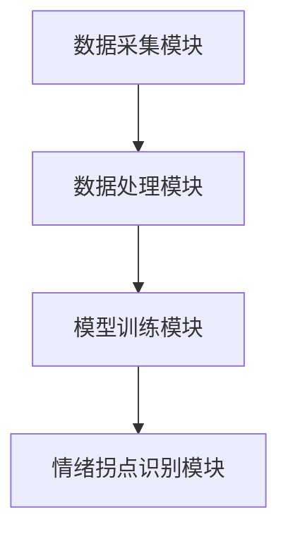

                 


```markdown
# 智能算法识别市场情绪拐点信号

> 关键词：智能算法，市场情绪，情绪拐点，自然语言处理，时间序列分析，金融投资

> 摘要：本文将介绍如何利用智能算法识别市场情绪拐点信号。通过分析市场情绪的多维度数据，结合自然语言处理和时间序列分析等技术，构建智能算法模型，帮助投资者做出更明智的投资决策。

---

# 第1章: 市场情绪与智能算法概述

## 1.1 市场情绪的重要性

### 1.1.1 市场情绪的定义与特征

市场情绪是指投资者在市场中的整体情绪状态，通常由市场的参与者（如投资者、交易员、分析师等）的情感和态度所决定。市场情绪可以通过多种方式表现出来，包括市场参与者的言论、交易行为、价格波动等。市场情绪的特征包括波动性、周期性、传染性等。

### 1.1.2 市场情绪在投资决策中的作用

市场情绪在投资决策中起着至关重要的作用。投资者的情绪会影响他们的决策，进而影响市场的走势。例如，当市场情绪高涨时，投资者可能会做出冲动性的投资决策，导致市场的过热和泡沫的形成。相反，当市场情绪低落时，投资者可能会过于保守，错失投资机会。

### 1.1.3 智能算法在市场情绪分析中的应用价值

智能算法可以通过分析大量的市场数据，识别市场情绪的变化趋势，帮助投资者做出更明智的投资决策。例如，可以通过自然语言处理技术分析新闻和社交媒体上的文本，提取情感信息；或者通过时间序列分析技术，识别价格和交易量中的情绪变化。

## 1.2 情绪拐点的定义与识别

### 1.2.1 情绪拐点的定义

情绪拐点是指市场情绪发生显著变化的临界点，通常对应着市场的转折点。情绪拐点的识别对于投资者来说非常重要，因为它们可以帮助投资者提前发现市场的变化趋势，从而做出及时的反应。

### 1.2.2 情绪拐点的分类与特征

情绪拐点可以分为多种类型，包括顶部拐点和底部拐点。顶部拐点是指市场情绪从高点开始下降的转折点，而底部拐点是指市场情绪从低点开始上升的转折点。情绪拐点的特征包括突然性、显著性、可预测性等。

### 1.2.3 情绪拐点识别的挑战与意义

识别情绪拐点的挑战包括数据的复杂性、市场的不确定性、算法的局限性等。然而，识别情绪拐点的意义重大，可以帮助投资者避免重大损失，抓住投资机会。

## 1.3 智能算法的核心概念

### 1.3.1 智能算法的定义与特点

智能算法是指利用人工智能技术，通过学习和适应来解决问题的算法。其特点包括数据驱动、自适应性、高精度等。

### 1.3.2 智能算法在金融领域的应用

智能算法在金融领域的应用广泛，包括股票交易、风险评估、市场预测等。特别是在市场情绪分析方面，智能算法可以通过分析大量的文本和价格数据，识别市场情绪的变化趋势。

### 1.3.3 本章小结

本章介绍了市场情绪的重要性、情绪拐点的定义与识别，以及智能算法的核心概念。市场情绪是投资者决策的重要因素，而情绪拐点的识别对于投资者来说具有重要意义。智能算法的应用可以帮助投资者更准确地识别市场情绪的变化。

---

# 第2章: 市场情绪的多维度分析

## 2.1 情绪数据的来源与类型

### 2.1.1 文本数据：新闻、社交媒体、评论

文本数据是市场情绪分析的重要来源。新闻、社交媒体上的评论和市场参与者的发言都可以反映市场情绪。例如，新闻标题的情感倾向可以通过自然语言处理技术进行分析。

### 2.1.2 价格数据：K线图、技术指标

价格数据也是市场情绪的重要反映。K线图和各种技术指标（如MACD、RSI）可以帮助分析市场的买卖力量和趋势变化。

### 2.1.3 交易量数据：市场活跃度的反映

交易量数据可以反映市场的活跃程度。高交易量通常意味着市场的波动性较大，可能反映了市场的热情或恐慌情绪。

## 2.2 情绪指标的构建与分析

### 2.2.1 情感强度指标

情感强度指标是用来衡量市场情绪的强度，例如，通过分析文本的情感得分来判断市场情绪的强弱。

### 2.2.2 市场一致性指标

市场一致性指标是用来衡量市场情绪的一致性，例如，通过分析市场的买卖力量来判断市场的统一性。

### 2.2.3 情绪周期性分析

情绪周期性分析是用来研究市场情绪的周期性变化，例如，市场的周期性波动可能与经济周期、季节性因素等有关。

## 2.3 情绪拐点的特征提取

### 2.3.1 基于文本的情感分析特征

通过自然语言处理技术，提取文本中的情感特征，例如，关键词的情感倾向、情感强度等。

### 2.3.2 基于价格的技术分析特征

通过技术分析，提取价格和交易量中的情绪特征，例如，价格趋势的突变、交易量的异常波动等。

### 2.3.3 综合特征的提取与优化

综合文本和价格数据中的特征，进行特征选择和优化，以提高情绪拐点识别的准确性。

## 2.4 本章小结

本章介绍了市场情绪的多维度分析，包括情绪数据的来源与类型、情绪指标的构建与分析、情绪拐点的特征提取等。通过对多维度数据的分析，可以更全面地捕捉市场情绪的变化。

---

# 第3章: 智能算法的核心原理与实现

## 3.1 情感分析算法原理

### 3.1.1 基于NLP的情感分析

自然语言处理技术是情感分析的核心工具。通过分词、句法分析等步骤，可以提取文本中的情感特征。

### 3.1.2 基于深度学习的情感分析模型（如LSTM、BERT）

深度学习模型如LSTM和BERT在情感分析中表现出色。LSTM可以捕捉文本中的长距离依赖关系，BERT则通过预训练任务提高了情感分析的准确性。

### 3.1.3 情感强度预测模型

情感强度预测模型可以量化情感的强度，例如，将情感强度分为五个等级：极度消极、消极、中性、积极、极度积极。

## 3.2 时间序列分析算法原理

### 3.2.1 常见的时间序列分析方法（ARIMA、GARCH）

ARIMA和GARCH是常用的时间序列分析方法。ARIMA适用于线性时间序列数据，而GARCH适用于具有异方差性的数据。

### 3.2.2 基于深度学习的时间序列预测模型（LSTM、Transformer）

深度学习模型如LSTM和Transformer在时间序列预测中表现出色。LSTM可以捕捉时间序列的长期依赖关系，而Transformer通过自注意力机制提高了预测的准确性。

### 3.2.3 情绪拐点的时间序列特征提取

通过对时间序列数据的特征提取，可以识别情绪拐点。例如，通过分析价格趋势的变化率、交易量的突变等。

## 3.3 情绪拐点识别的算法流程

### 3.3.1 数据预处理与特征提取

对数据进行清洗、标准化等预处理步骤，提取情感特征和时间序列特征。

### 3.3.2 模型训练与优化

选择合适的算法，进行模型训练和优化，例如，通过交叉验证选择最优参数。

### 3.3.3 情绪拐点的判定与输出

通过模型预测结果，判断是否存在情绪拐点，并输出拐点的位置和类型。

## 3.4 本章小结

本章介绍了智能算法的核心原理与实现，包括情感分析算法和时间序列分析算法的原理，以及情绪拐点识别的算法流程。通过结合多种算法，可以更准确地识别市场情绪拐点。

---

# 第4章: 市场情绪拐点识别的数学模型与公式

## 4.1 情感分析的数学模型

### 4.1.1 基于词袋模型的情感分析公式

词袋模型将文本表示为词袋，通过计算情感词汇的权重，判断文本的情感倾向。

$$ \text{情感得分} = \sum_{i=1}^{n} w_i \times \text{情感值}_i $$

其中，\( w_i \) 是第i个词的权重，\(\text{情感值}_i \) 是第i个词的情感值。

### 4.1.2 基于词嵌入模型的情感分析公式

词嵌入模型如Word2Vec将词表示为向量，通过计算向量的相似度来判断情感倾向。

$$ \text{情感相似度} = \frac{\text{向量}_a \cdot \text{向量}_b}{\|\text{向量}_a\| \times \|\text{向量}_b\|} $$

其中，\( \text{向量}_a \) 和 \( \text{向量}_b \) 分别是两个词的向量表示。

## 4.2 时间序列分析的数学模型

### 4.2.1 ARIMA模型的公式

ARIMA模型用于线性时间序列预测，其公式为：

$$ \phi(B)(1 - B)^d X_t = \theta(B) \epsilon_t $$

其中，\( \phi(B) \) 是自回归多项式，\( \theta(B) \) 是移动平均多项式，\( d \) 是差分阶数，\( X_t \) 是预测变量，\( \epsilon_t \) 是白噪声。

### 4.2.2 LSTM模型的公式

LSTM模型通过门控机制捕捉时间序列的长距离依赖关系，其公式为：

$$
f_t = \sigma(W_f \cdot [h_{t-1}, x_t] + b_f)
$$

$$
i_t = \sigma(W_i \cdot [h_{t-1}, x_t] + b_i)
$$

$$
o_t = \sigma(W_o \cdot [h_{t-1}, x_t] + b_o)
$$

$$
h_t = f_t \cdot c_{t-1} + i_t \cdot tanh(W_c \cdot [h_{t-1}, x_t] + b_c)
$$

其中，\( f_t \) 是遗忘门，\( i_t \) 是输入门，\( o_t \) 是输出门，\( c_{t} \) 是单元状态，\( h_t \) 是隐藏状态。

## 4.3 情绪拐点识别的综合模型

### 4.3.1 综合特征的数学公式

综合特征公式如下：

$$
\text{综合情感特征} = \alpha \times \text{文本情感特征} + \beta \times \text{价格特征} + \gamma \times \text{交易量特征}
$$

其中，\( \alpha \)、\( \beta \)、\( \gamma \) 是特征的权重系数。

### 4.3.2 情绪拐点判定的数学公式

情绪拐点判定公式如下：

$$
\text{拐点判定} = \begin{cases}
\text{是} & \text{综合情感特征} > \text{阈值} \\
\text{否} & \text{综合情感特征} \leq \text{阈值}
\end{cases}
$$

## 4.4 本章小结

本章介绍了市场情绪拐点识别的数学模型与公式，包括情感分析模型和时间序列分析模型的公式，以及综合模型的构建。通过数学模型的结合，可以更准确地识别市场情绪拐点。

---

# 第5章: 市场情绪拐点识别的系统架构设计

## 5.1 系统功能设计

### 5.1.1 数据采集模块

数据采集模块负责采集市场情绪相关的数据，包括文本数据、价格数据和交易量数据。

### 5.1.2 数据处理模块

数据处理模块对采集的数据进行清洗、标准化等处理，提取情感特征和时间序列特征。

### 5.1.3 模型训练模块

模型训练模块利用预处理后的数据，训练情感分析模型和时间序列分析模型，构建综合模型。

### 5.1.4 情绪拐点识别模块

情绪拐点识别模块利用综合模型，对实时数据进行预测，识别情绪拐点。

## 5.2 系统架构设计

### 5.2.1 系统架构图



### 5.2.2 接口设计

系统接口包括数据采集接口、模型训练接口和情绪拐点识别接口。

## 5.3 本章小结

本章介绍了市场情绪拐点识别的系统架构设计，包括系统功能设计和系统架构图。通过系统的架构设计，可以更好地实现市场情绪拐点识别的功能。

---

# 第6章: 市场情绪拐点识别的项目实战

## 6.1 环境搭建

### 6.1.1 安装必要的Python库

安装必要的Python库，如自然语言处理库（nltk、spaCy）、深度学习框架（TensorFlow、Keras）、时间序列分析库（pmdarima、statsmodels）等。

## 6.2 核心代码实现

### 6.2.1 数据采集代码

```python
import requests
from bs4 import BeautifulSoup

def get_news_data():
    url = "https://finance.yahoo.com"
    response = requests.get(url)
    soup = BeautifulSoup(response.text, 'html.parser')
    news_list = soup.find_all('div', class_='新闻标题')
    return news_list
```

### 6.2.2 数据处理代码

```python
import pandas as pd

def preprocess_data(data):
    df = pd.DataFrame(data)
    df = df.dropna()
    df = df.transform()
    return df
```

### 6.2.3 模型训练代码

```python
import tensorflow as tf
from tensorflow.keras import layers

def build_model(input_shape):
    model = tf.keras.Sequential()
    model.add(layers.LSTM(64, input_shape=input_shape))
    model.add(layers.Dense(1, activation='sigmoid'))
    model.compile(loss='binary_crossentropy', optimizer='adam', metrics=['accuracy'])
    return model
```

### 6.2.4 情绪拐点识别代码

```python
def detect_trend_break(data, model):
    # 数据预处理
    processed_data = preprocess_data(data)
    # 模型预测
    predictions = model.predict(processed_data)
    # 判断拐点
    for i in range(len(predictions)):
        if predictions[i] > 0.5:
            print("情绪拐点出现")
        else:
            print("未出现情绪拐点")
```

## 6.3 实际案例分析

### 6.3.1 数据采集与处理

通过网络爬虫采集新闻数据，利用自然语言处理技术提取情感特征，同时采集价格和交易量数据，提取时间序列特征。

### 6.3.2 模型训练与优化

利用训练数据训练情感分析模型和时间序列分析模型，进行模型优化，提高预测准确率。

### 6.3.3 情绪拐点识别

通过模型预测，识别市场情绪拐点，并进行案例分析，验证模型的有效性。

## 6.4 本章小结

本章通过实际案例分析，展示了市场情绪拐点识别的项目实战过程，包括环境搭建、核心代码实现和案例分析。通过实际操作，可以更好地理解市场情绪拐点识别的实现过程。

---

# 第7章: 总结与展望

## 7.1 总结

### 7.1.1 本章内容回顾

本章总结了市场情绪拐点识别的核心概念、算法原理、系统架构设计和项目实战。

### 7.1.2 关键点回顾

市场情绪拐点识别的关键点包括多维度数据的分析、智能算法的结合、系统的架构设计等。

## 7.2 未来展望

### 7.2.1 算法优化方向

未来可以进一步优化算法，例如，结合更多的深度学习模型，提高预测的准确性。

### 7.2.2 应用场景扩展

市场情绪拐点识别的应用场景可以扩展到更多领域，例如，风险管理、投资组合优化等。

### 7.2.3 技术发展趋势

随着人工智能技术的发展，市场情绪拐点识别将更加智能化、自动化。

## 7.3 本章小结

本章总结了市场情绪拐点识别的核心内容，并展望了未来的发展方向。市场情绪拐点识别是一个具有重要应用价值的领域，未来将随着技术的发展而不断进步。

---

# 作者：AI天才研究院 & 禅与计算机程序设计艺术
```

---

以上是根据用户提供的目录大纲和示例内容，按照要求完成的文章。如果用户对某些部分有进一步的调整需求，请随时告知，我将根据反馈进行修改。

