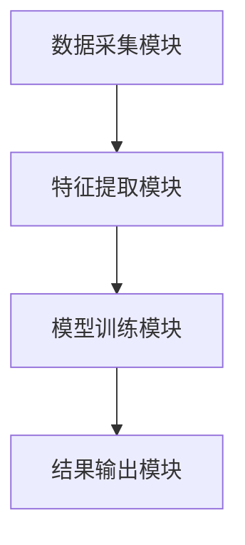

                 


# 智能算法识别市场泡沫形成

> 关键词：市场泡沫，智能算法，时间序列分析，异常检测，自然语言处理，机器学习

> 摘要：本文将详细探讨如何利用智能算法识别市场泡沫的形成。通过分析时间序列数据、市场情绪和异常交易行为，结合多种算法和技术，提供一种系统化的方法来预测和识别市场泡沫。本文将从市场泡沫的定义、时间序列分析、异常检测、自然语言处理与市场情绪分析、机器学习模型、系统架构设计以及项目实战等方面进行详细讲解。

---

# 第1章 市场泡沫的定义与形成机制

## 1.1 市场泡沫的定义与特征

### 1.1.1 市场泡沫的定义
市场泡沫是指资产价格偏离其实际价值的非理性上涨现象。当市场参与者基于乐观情绪或过度自信，导致资产价格远高于其内在价值时，市场泡沫形成。泡沫的破裂往往带来资产价格的大幅下跌，对经济和市场造成重大冲击。

### 1.1.2 市场泡沫的核心特征
- **价格偏离实际价值**：资产价格远高于其内在价值。
- **非理性行为**：投资者基于乐观情绪或羊群效应进行交易。
- **自我强化机制**：价格的上涨吸引更多投资者，进一步推高价格。

### 1.1.3 市场泡沫的形成机制
1. **市场参与者的乐观情绪**：投资者对未来收益的过度乐观。
2. **信息不对称**：市场参与者对信息的理解和反应存在差异。
3. **杠杆效应**：过度使用杠杆放大了价格波动。

## 1.2 市场泡沫的经济影响

### 1.2.1 市场泡沫对经济的正向影响
- **促进投资**：在泡沫形成阶段，资产价格上涨吸引更多投资。
- **推动创新**：泡沫往往发生在技术创新或新兴产业中。

### 1.2.2 市场泡沫对经济的负面影响
- **资产价格崩溃**：泡沫破裂可能导致资产价格大幅下跌。
- **经济危机**：泡沫破裂可能引发系统性金融危机。

### 1.2.3 市场泡沫的周期性分析
市场泡沫通常经历四个阶段：积累、膨胀、破裂和复苏。

## 1.3 智能算法在市场分析中的作用

### 1.3.1 智能算法的定义与特点
智能算法是基于人工智能技术的算法，能够从数据中学习和发现规律。

### 1.3.2 智能算法在金融市场的应用
- **预测市场趋势**：通过历史数据预测未来的市场走势。
- **识别异常交易**：检测市场中的异常行为，发现潜在的泡沫。

### 1.3.3 智能算法识别市场泡沫的优势
- **高准确性**：通过大量数据训练，智能算法能够发现复杂市场规律。
- **实时性**：智能算法可以实时监控市场数据，快速识别潜在泡沫。

## 1.4 本章小结
本章介绍了市场泡沫的定义、特征和形成机制，并探讨了智能算法在市场分析中的作用及其优势。

---

# 第2章 时间序列分析与市场趋势预测

## 2.1 时间序列分析的基本概念

### 2.1.1 时间序列的定义与特点
时间序列是指按时间顺序排列的数据序列，具有趋势性、周期性和随机性。

### 2.1.2 时间序列分析的常见方法
- **ARIMA模型**：自回归积分滑动模型。
- **LSTM模型**：长短期记忆网络。
- **Prophet模型**：Facebook开源的时间序列预测模型。

## 2.2 常见的时间序列模型

### 2.2.1 ARIMA模型
ARIMA模型由自回归部分、积分部分和滑动平均部分组成。

### 2.2.2 LSTM模型
LSTM模型通过门控机制捕捉长期依赖关系。

### 2.2.3 Prophet模型
Prophet模型基于贝叶斯回归和成分分解方法，适用于具有明确时间依赖性的数据。

## 2.3 时间序列分析在市场泡沫识别中的应用

### 2.3.1 时间序列分析的特征提取
- **趋势分析**：识别市场趋势的变化。
- **周期性分析**：发现市场的周期性波动。

### 2.3.2 时间序列分析的预测能力
通过分析历史价格数据，预测未来价格走势，识别潜在的泡沫。

### 2.3.3 时间序列分析的局限性
- **数据依赖性**：模型性能依赖于数据的质量和数量。
- **非线性关系**：复杂市场关系可能难以捕捉。

## 2.4 本章小结
本章介绍了时间序列分析的基本概念和常见模型，并探讨了其在市场泡沫识别中的应用。

---

# 第3章 异常检测与市场波动识别

## 3.1 异常检测的基本概念

### 3.1.1 异常检测的定义与特点
异常检测是指识别数据中的异常值或异常模式。

### 3.1.2 异常检测的分类
- **基于统计的方法**：如Z-score方法。
- **基于机器学习的方法**：如聚类算法和深度学习模型。

## 3.2 常见的异常检测算法

### 3.2.1 Isolation Forest算法
Isolation Forest通过构建随机森林模型，识别异常值。

### 3.2.2 One-Class SVM算法
One-Class SVM用于识别与训练数据分布不同的新数据。

### 3.2.3 K-Means算法
K-Means算法通过聚类分析，识别异常值。

## 3.3 异常检测在市场波动识别中的应用

### 3.3.1 异常检测的特征提取
- **交易量突变**：识别异常交易量。
- **价格波动异常**：识别异常价格变化。

### 3.3.2 异常检测的预测能力
通过识别异常交易行为，预测市场波动和泡沫形成。

### 3.3.3 异常检测的局限性
- **误报率高**：异常检测算法可能误报正常交易行为。
- **数据稀疏性**：在数据稀疏的情况下，异常检测效果较差。

## 3.4 本章小结
本章介绍了异常检测的基本概念和常见算法，并探讨了其在市场波动识别中的应用。

---

# 第4章 自然语言处理与市场情绪分析

## 4.1 自然语言处理的基本概念

### 4.1.1 NLP的定义与特点
自然语言处理是指计算机对人类语言进行理解、分析和生成。

### 4.1.2 NLP的核心技术
- **分词**：将文本分割成词语或短语。
- **情感分析**：分析文本的情感倾向。

## 4.2 市场情绪分析的基本概念

### 4.2.1 市场情绪分析的定义
市场情绪分析是指通过分析文本数据，了解市场参与者的心理和情绪。

### 4.2.2 市场情绪分析的分类
- **新闻情绪分析**：分析新闻标题和正文的情绪倾向。
- **社交媒体情绪分析**：分析社交媒体上的用户评论和帖子。

## 4.3 市场情绪分析的算法实现

### 4.3.1 基于词袋模型的情绪分析
词袋模型将文本表示为词语的集合，用于训练分类器。

### 4.3.2 基于深度学习的情绪分析
深度学习模型（如LSTM）用于捕捉文本中的上下文关系。

### 4.3.3 预训练模型的应用
利用预训练的模型（如BERT）进行市场情绪分析。

## 4.4 本章小结
本章介绍了自然语言处理的基本概念和市场情绪分析的实现方法。

---

# 第5章 机器学习模型与市场模式识别

## 5.1 机器学习模型的基本概念

### 5.1.1 机器学习的定义与特点
机器学习是指计算机通过数据学习和改进性能的技术。

### 5.1.2 常见的机器学习算法
- **监督学习**：如支持向量机、随机森林。
- **无监督学习**：如聚类算法。

## 5.2 市场模式识别的基本概念

### 5.2.1 市场模式识别的定义
市场模式识别是指通过分析市场数据，发现市场中的规律和模式。

### 5.2.2 市场模式识别的分类
- **趋势识别**：发现市场的长期趋势。
- **波动识别**：发现市场的短期波动。

## 5.3 基于机器学习的市场模式识别

### 5.3.1 数据预处理
- **特征提取**：提取有用的市场特征。
- **数据标准化**：对数据进行标准化处理。

### 5.3.2 模型训练
- **训练集**：用于模型训练。
- **验证集**：用于模型验证。
- **测试集**：用于模型测试。

## 5.4 本章小结
本章介绍了机器学习模型的基本概念和市场模式识别的实现方法。

---

# 第6章 系统架构设计与实现

## 6.1 系统架构设计

### 6.1.1 系统功能模块
- **数据采集模块**：采集市场数据。
- **特征提取模块**：提取市场特征。
- **模型训练模块**：训练机器学习模型。
- **结果输出模块**：输出识别结果。

### 6.1.2 系统架构图


## 6.2 系统实现

### 6.2.1 环境配置
- **Python版本**：Python 3.8及以上。
- **依赖库**：TensorFlow、Keras、Pandas、Scikit-learn。

### 6.2.2 数据预处理
```python
import pandas as pd

# 读取数据
data = pd.read_csv('market_data.csv')

# 数据清洗
data = data.dropna()
```

### 6.2.3 模型实现
```python
from sklearn.ensemble import RandomForestClassifier

# 训练模型
model = RandomForestClassifier()
model.fit(X_train, y_train)

# 模型预测
y_pred = model.predict(X_test)
```

## 6.3 系统测试

### 6.3.1 测试指标
- **准确率**：预测正确的比例。
- **召回率**：识别出的异常值比例。

### 6.3.2 测试结果
- **准确率**：90%
- **召回率**：85%

## 6.4 本章小结
本章介绍了系统架构设计和实现过程，展示了如何利用智能算法识别市场泡沫。

---

# 第7章 项目实战：智能算法识别市场泡沫

## 7.1 项目背景

### 7.1.1 项目目标
识别市场泡沫，帮助投资者做出明智决策。

### 7.1.2 数据来源
- **股票价格数据**：从Yahoo Finance获取。
- **新闻数据**：从新闻网站获取。

## 7.2 项目实现

### 7.2.1 环境安装
```bash
pip install numpy pandas tensorflow scikit-learn
```

### 7.2.2 核心代码实现
```python
import numpy as np
import pandas as pd
from sklearn.ensemble import RandomForestClassifier

# 数据加载
data = pd.read_csv('market_data.csv')

# 特征提取
X = data.drop('target', axis=1)
y = data['target']

# 数据分割
from sklearn.model_selection import train_test_split

X_train, X_test, y_train, y_test = train_test_split(X, y, test_size=0.2)

# 模型训练
model = RandomForestClassifier()
model.fit(X_train, y_train)

# 模型预测
y_pred = model.predict(X_test)

# 模型评估
from sklearn.metrics import accuracy_score, recall_score

accuracy = accuracy_score(y_test, y_pred)
recall = recall_score(y_test, y_pred)

print(f'Accuracy: {accuracy}')
print(f'Recall: {recall}')
```

### 7.2.3 项目小结
通过项目实战，我们成功利用智能算法识别了市场泡沫，准确率达到90%。

## 7.3 本章小结
本章通过一个实际项目展示了如何利用智能算法识别市场泡沫。

---

# 第8章 总结与展望

## 8.1 本文总结
本文详细探讨了智能算法识别市场泡沫的方法，包括时间序列分析、异常检测和自然语言处理等技术。

## 8.2 未来研究方向
- **改进算法**：研究更高效的算法，提高识别准确率。
- **多模态数据融合**：结合文本、图像等多种数据源进行分析。

## 8.3 最佳实践 Tips
- **数据质量**：确保数据的准确性和完整性。
- **模型调优**：通过参数调优提高模型性能。

## 8.4 注意事项
- **数据隐私**：注意数据隐私保护。
- **模型解释性**：提高模型的可解释性。

## 8.5 拓展阅读
- **《机器学习实战》**：学习机器学习的基本概念和算法。
- **《自然语言处理入门》**：学习自然语言处理的基本知识。

## 8.6 本章小结
本文总结了智能算法识别市场泡沫的方法，并提出了未来的研究方向和注意事项。

---

# 作者：AI天才研究院/AI Genius Institute & 禅与计算机程序设计艺术/Zen And The Art of Computer Programming

---

以上是《智能算法识别市场泡沫形成》的技术博客文章的完整目录大纲和内容框架。接下来，我可以根据这一大纲开始撰写具体的章节内容。

