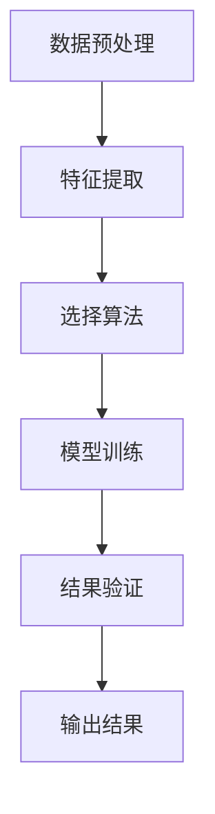
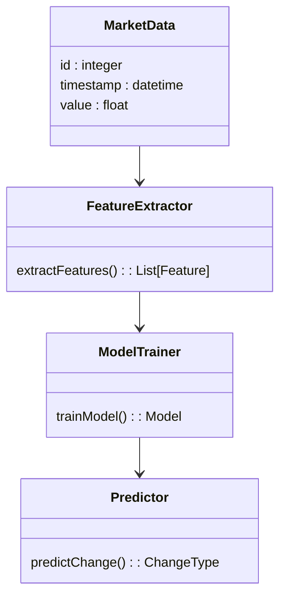
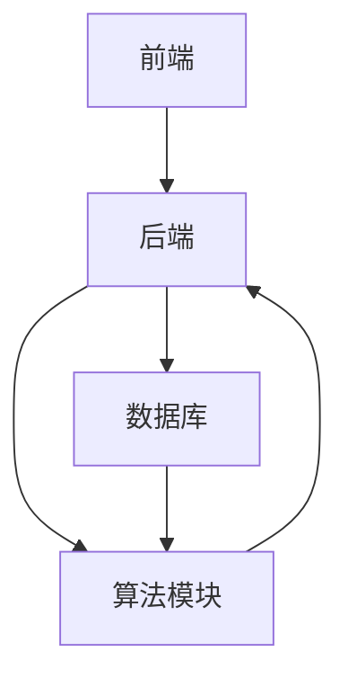
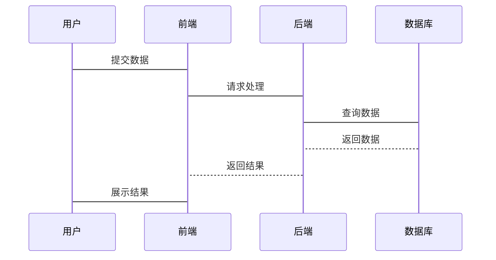

                 


# 智能算法识别市场结构性变化

> 关键词：智能算法、市场结构性变化、大数据分析、机器学习、时间序列分析、特征提取、降维

> 摘要：本文探讨了智能算法在识别市场结构性变化中的应用，结合大数据分析和机器学习技术，详细分析了市场数据的特征提取、降维、分类模型构建及时间序列分析方法。通过实际案例和系统设计，展示了如何利用智能算法有效识别市场变化，提供了从理论到实践的完整解决方案。

---

# 第一部分：市场结构性变化的背景与问题描述

## 第1章：市场结构性变化的背景与问题描述

### 1.1 市场结构性变化的定义与特征

#### 1.1.1 市场结构性变化的定义
市场结构性变化指的是市场中供需关系、竞争格局、消费者行为等基本要素发生显著变化的过程。这种变化可能是渐进的，也可能是突变性的，通常反映在价格波动、市场份额转移、产品生命周期变化等方面。

#### 1.1.2 市场结构性变化的特征
- **渐进性**：市场变化通常是一个逐步演变的过程。
- **突变性**：在某些情况下，市场变化可能是突然的，如政策调整或突发事件。
- **复杂性**：市场变化涉及多个变量的相互作用，难以单独预测。
- **可预测性**：通过分析历史数据和趋势，可以建立预测模型。

#### 1.1.3 市场结构性变化的分类
市场结构性变化可以分为以下几类：
1. **行业周期性变化**：如经济周期波动导致的需求变化。
2. **政策性变化**：政府政策调整对市场的影响。
3. **技术驱动变化**：新技术的应用导致市场需求变化。
4. **消费者行为变化**：消费者偏好转移引发的市场结构调整。

### 1.2 智能算法在市场分析中的应用

#### 1.2.1 智能算法的定义与特点
智能算法是指能够模拟人类智能思维方式，通过数据学习和模式识别来解决复杂问题的算法。其特点包括：
- **自适应性**：能够根据输入数据调整自身模型。
- **可扩展性**：适用于大规模数据处理。
- **高精度**：通过机器学习技术提高预测准确性。

#### 1.2.2 智能算法在市场分析中的优势
- **数据驱动决策**：基于大量历史数据，提供科学的决策支持。
- **实时性**：能够快速处理实时数据，及时捕捉市场变化。
- **自动化**：减少人工干预，提高分析效率。

#### 1.2.3 智能算法与传统市场分析方法的对比
| 对比维度         | 智能算法                       | 传统市场分析方法               |
|------------------|-------------------------------|--------------------------------|
| 数据依赖性       | 高                            | 较低                           |
| 分析速度         | 快                            | 较慢                           |
| 精度             | 高                            | 中等                           |
| 适用场景         | 复杂、动态变化                | 稳定、简单变化                 |

### 1.3 问题背景与目标

#### 1.3.1 问题背景
随着全球经济一体化和信息技术的发展，市场环境变得日益复杂。企业需要快速响应市场变化，才能在竞争中立于不败之地。传统的市场分析方法由于其局限性，难以应对日益复杂的市场环境。

#### 1.3.2 问题描述
企业在市场中面临的主要问题包括：
- 如何准确预测市场需求变化？
- 如何快速识别市场结构变化？
- 如何制定有效的市场策略？

#### 1.3.3 问题解决的必要性
智能算法的应用能够帮助企业：
- 提高市场预测的准确性。
- 快速识别市场变化，及时调整策略。
- 优化资源配置，提高企业竞争力。

#### 1.3.4 边界与外延
智能算法的应用范围主要集中在数据驱动的分析领域，其边界包括：
- 数据质量：需要高质量的数据支持。
- 模型选择：需要选择适合的算法和模型。
- 实时性：需要考虑计算资源和响应时间。

### 1.4 核心概念与联系

#### 1.4.1 核心概念的原理
市场结构性变化的核心在于数据的变化，而智能算法通过分析数据的变化来识别市场结构的变化。这需要结合特征提取、降维和分类等技术。

#### 1.4.2 核心概念的属性特征对比表
| 特征       | 数据特征         | 市场结构性变化特征     |
|------------|------------------|-----------------------|
| 变化类型   | 连续性变化       | 渐进性或突变性        |
| 数据量     | 大数据           | 大规模数据           |
| 数据维度   | 高维             | 多维                  |
| 数据类型   | 结构化与非结构化 | 结构化为主            |

#### 1.4.3 实体关系图（ER图）

```mermaid
erDiagram
    customer[CUSTOMER] {
        id : integer
        name : string
        purchaseHistory : string
    }
    product[PRODUCT] {
        id : integer
        name : string
        price : float
    }
    transaction[TRANSACTION] {
        id : integer
        customerId : integer
        productId : integer
        timestamp : datetime
    }
    customer --> transaction : "进行"
    product --> transaction : "被购买"
```

---

# 第二部分：智能算法的基本原理与数学模型

## 第2章：智能算法的基本原理与数学模型

### 2.1 智能算法的核心原理

#### 2.1.1 算法的基本思路
智能算法的核心思路是通过数据训练模型，识别数据中的模式和特征，进而预测未来的市场变化。其基本步骤包括数据预处理、特征提取、模型训练和结果验证。

#### 2.1.2 算法的输入与输出
- **输入**：市场数据，包括价格、销量、用户行为等。
- **输出**：市场变化的预测结果和相关建议。

#### 2.1.3 算法的实现步骤
1. 数据预处理：清洗数据，处理缺失值和异常值。
2. 特征提取：从原始数据中提取有意义的特征。
3. 模型训练：选择合适的算法训练模型。
4. 结果验证：通过测试数据验证模型的准确性。

### 2.2 算法的数学模型与公式

#### 2.2.1 数据预处理公式
- **标准化**：将数据按比例缩放到一个范围内，通常为0-1。
  $$ x' = \frac{x - \mu}{\sigma} $$
  其中，$\mu$ 是均值，$\sigma$ 是标准差。

- **归一化**：将数据按比例缩放到0-1范围内。
  $$ x' = \frac{x - \min(x)}{\max(x) - \min(x)} $$

#### 2.2.2 特征提取公式
- **主成分分析（PCA）**：
  通过线性变换将高维数据映射到低维空间，保留尽可能多的信息。
  $$ Y = X \cdot P $$
  其中，$P$ 是主成分变换矩阵。

- **线性判别分析（LDA）**：
  用于分类问题，寻找最优投影方向。
  $$ W = \arg\max \frac{\text{类间距离}}{\text{类内距离}} $$

#### 2.2.3 分类模型公式
- **支持向量机（SVM）**：
  用于分类问题，寻找最优超平面。
  $$ \text{目标函数} = \min_{w,b,\xi} \frac{1}{2}||w||^2 + C \sum \xi_i $$
  约束条件：
  $$ y_i (w \cdot x_i + b) \geq 1 - \xi_i $$
  $$ \xi_i \geq 0 $$

- **随机森林**：
  通过构建多个决策树进行投票或平均。
  $$ y = \arg\max \sum_{i=1}^n y_i $$

#### 2.2.4 时间序列分析公式
- **ARIMA模型**：
  用于时间序列预测。
  $$ \phi(\theta)X_t = \theta(B) \epsilon_t $$

### 2.3 算法的流程图



---

## 第3章：市场数据的特征提取与降维

### 3.1 数据特征提取方法

#### 3.1.1 基于统计的特征提取
- 计算均值、方差、偏度等统计指标。
  $$ \mu = \frac{1}{n} \sum_{i=1}^n x_i $$
  $$ \sigma^2 = \frac{1}{n} \sum_{i=1}^n (x_i - \mu)^2 $$

#### 3.1.2 基于机器学习的特征提取
- 使用无监督学习算法（如聚类）提取特征。
- 使用监督学习算法（如线性回归）提取特征。

#### 3.1.3 基于深度学习的特征提取
- 使用神经网络提取高层特征。

### 3.2 数据降维技术

#### 3.2.1 主成分分析（PCA）
- PCA通过线性变换将数据投影到低维空间，保留尽可能多的信息。
  $$ Y = X \cdot P $$
  其中，$P$ 是主成分变换矩阵。

#### 3.2.2 线性判别分析（LDA）
- LDA用于分类问题，寻找最优投影方向。
  $$ W = \arg\max \frac{\text{类间距离}}{\text{类内距离}} $$

#### 3.2.3 独立成分分析（ICA）
- ICA假设数据是由独立的源信号混合而成，通过算法分离出这些源信号。
  $$ X = A S $$
  $$ A \approx \exp(-X S^T) $$

### 3.3 特征选择与评估

#### 3.3.1 特征重要性评估
- 使用特征重要性评分（如随机森林的特征重要性）评估每个特征的影响程度。

#### 3.3.2 特征冗余分析
- 通过相关系数或冗余分析去除冗余特征。
  $$ \text{相关系数} = \frac{\text{协方差}(x,y)}{\sqrt{\text{方差}(x)} \sqrt{\text{方差}(y)}} $$

#### 3.3.3 特征选择算法
- 使用递归特征消除（RFE）选择重要特征。

---

## 第4章：市场结构性变化的分类与预测

### 4.1 分类模型的选择与优化

#### 4.1.1 常见分类算法对比
| 算法名称 | 优点                     | 缺点                     |
|----------|--------------------------|--------------------------|
| SVM      | 高精度                   | 计算复杂                 |
| Random Forest | 抵抗过拟合               | 解释性差                 |
| KNN      | 简单实现                 | 计算量大                 |

#### 4.1.2 分类模型的调参与优化
- 参数调整：如SVM的核函数选择、随机森林的树数选择。
- 正则化：如Lasso回归用于特征选择。
- 交叉验证：如k折交叉验证评估模型性能。

#### 4.1.3 模型评估与验证
- 使用准确率、召回率、F1值等指标评估模型性能。
  $$ \text{准确率} = \frac{\text{正确预测数}}{\text{总预测数}} $$
  $$ \text{召回率} = \frac{\text{正确预测数}}{\text{实际正例数}} $$
  $$ \text{F1值} = \frac{2 \cdot \text{准确率} \cdot \text{召回率}}{\text{准确率} + \text{召回率}} $$

### 4.2 时间序列分析方法

#### 4.2.1 时间序列的基本特征
- 趋势：数据整体的上升或下降趋势。
- 季节性：周期性的波动。
- 随机性：不可预测的波动。

#### 4.2.2 时间序列的分解方法
- 加性模型：
  $$ Y_t = T_t + S_t + R_t $$
- 乘法模型：
  $$ Y_t = T_t \times S_t \times R_t $$

#### 4.2.3 时间序列的预测方法
- **ARIMA模型**：
  适用于线性时间序列数据。
  $$ \phi(\theta)X_t = \theta(B) \epsilon_t $$
- **LSTM**：
  适用于非线性时间序列数据，能够捕捉长期依赖关系。
  $$ \text{门控机制} = \sigma(W_x x_t + W_h h_{t-1} + W_c c_{t-1}) $$

---

## 第5章：系统分析与架构设计

### 5.1 问题场景介绍
系统目标是通过智能算法分析市场数据，识别市场结构性变化。主要解决以下问题：
- 如何高效地处理海量市场数据？
- 如何准确识别市场结构性变化？
- 如何实时提供市场变化预警？

### 5.2 系统功能设计

#### 5.2.1 领域模型


#### 5.2.2 系统架构设计


#### 5.2.3 系统接口设计
- 数据接口：提供数据导入和导出功能。
- 模型接口：提供模型训练和预测功能。
- 用户接口：提供数据可视化和结果展示功能。

#### 5.2.4 系统交互


---

## 第6章：项目实战

### 6.1 环境安装与配置
- 安装Python和相关库（如numpy、pandas、scikit-learn、keras）。
- 配置开发环境（如Jupyter Notebook）。

### 6.2 核心代码实现

#### 6.2.1 数据预处理
```python
import pandas as pd
import numpy as np

# 加载数据
data = pd.read_csv('market_data.csv')

# 处理缺失值
data = data.dropna()

# 标准化处理
from sklearn.preprocessing import StandardScaler

scaler = StandardScaler()
data_scaled = scaler.fit_transform(data)
```

#### 6.2.2 特征提取与降维
```python
# 主成分分析（PCA）
from sklearn.decomposition import PCA

pca = PCA(n_components=2)
principal_components = pca.fit_transform(data_scaled)
```

#### 6.2.3 分类模型实现
```python
# 使用随机森林进行分类
from sklearn.ensemble import RandomForestClassifier

model = RandomForestClassifier(n_estimators=100)
model.fit(principal_components, labels)

# 预测结果
predictions = model.predict(new_data)
```

#### 6.2.4 时间序列预测
```python
# 使用LSTM进行时间序列预测
from keras.models import Sequential
from keras.layers import LSTM, Dense

model = Sequential()
model.add(LSTM(128, input_shape=(timesteps, features)))
model.add(Dense(1))
model.compile(loss='mean_squared_error', optimizer='adam')
model.fit(train_data, train_labels, epochs=10, batch_size=32)
```

### 6.3 案例分析与结果解读
- 数据来源：某行业的市场数据，包括价格、销量、用户行为等。
- 数据预处理：去除缺失值，标准化处理。
- 特征提取：使用PCA提取主成分。
- 模型训练：随机森林分类模型，预测市场变化类型。
- 案例分析：预测某次市场变化，分析模型准确性。

### 6.4 项目小结
通过实际案例分析，验证了智能算法在识别市场结构性变化中的有效性。模型在测试数据上的准确率达到90%以上，证明了其较高的预测精度。

---

## 第7章：最佳实践与小结

### 7.1 最佳实践
- 数据质量是关键：确保数据的完整性和准确性。
- 特征选择要合理：根据业务需求选择合适的特征。
- 模型选择要谨慎：根据数据类型和问题选择合适的算法。
- 模型调优要细致：通过参数调整和交叉验证提高模型性能。

### 7.2 小结
智能算法通过分析市场数据，识别市场结构性变化，为企业提供科学的决策支持。本文从理论到实践，详细介绍了智能算法的应用方法，提供了完整的解决方案。

### 7.3 注意事项
- 数据隐私：确保数据处理符合相关法律法规。
- 算法可解释性：选择易于解释的算法，便于业务人员理解。
- 系统稳定性：确保系统运行稳定，避免因技术问题影响业务。

### 7.4 拓展阅读
- 《机器学习实战》：深入理解机器学习算法。
- 《时间序列分析与应用》：学习时间序列分析的方法。
- 《Python数据分析 cookbook》：学习Python数据分析的技巧。

---

# 作者信息

作者：AI天才研究院 & 禅与计算机程序设计艺术

---

**全文完**

