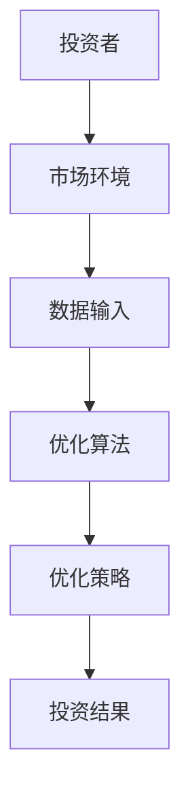
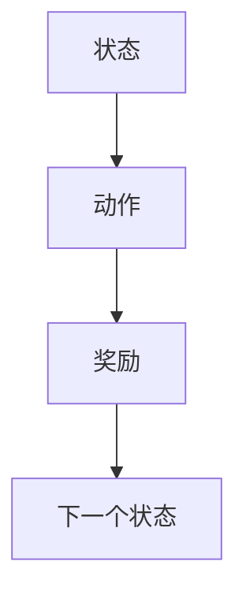
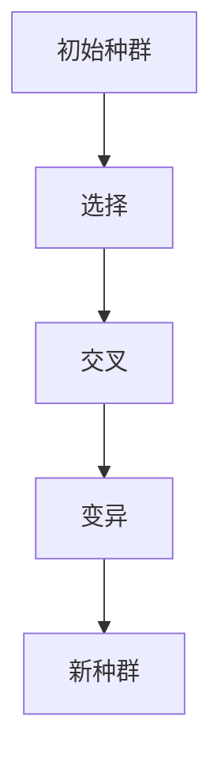
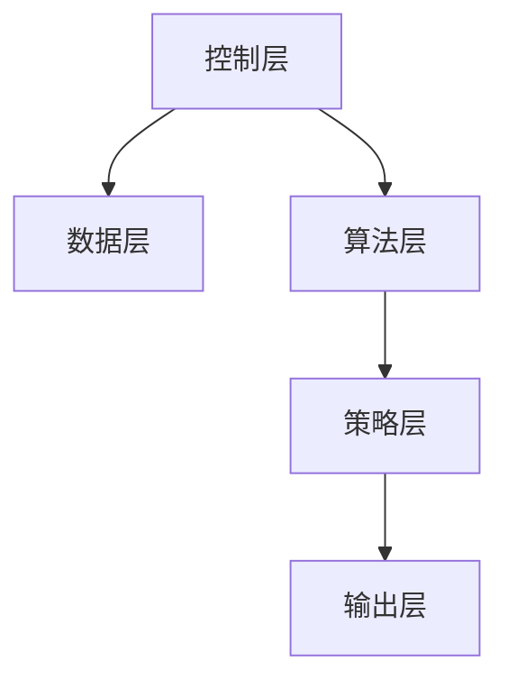
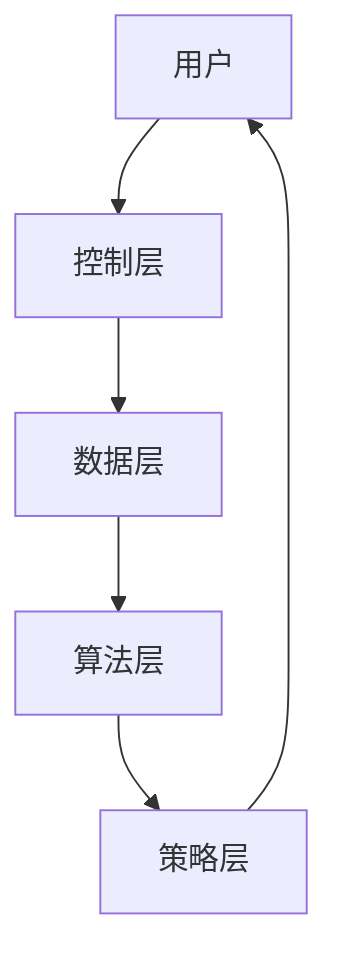

                 


# 智能系统优化特殊情况投资策略

> 关键词：智能系统优化，特殊情况投资，强化学习，遗传算法，投资策略，系统架构

> 摘要：本文深入探讨了智能系统优化在特殊情况下的投资策略，结合强化学习和遗传算法等优化方法，分析了投资策略的核心要素与优化目标，构建了数学模型和系统架构，并通过实际案例展示了优化算法的应用效果，最后总结了最佳实践和未来研究方向。

---

## 第一部分: 智能系统优化与特殊情况投资策略概述

### 第1章: 智能系统优化的背景与意义

#### 1.1 智能系统优化的核心概念

##### 1.1.1 问题背景与问题描述

在金融市场中，投资决策的复杂性日益增加。传统的投资策略依赖于人工分析和经验判断，难以应对市场波动、突发事件等特殊情况下的投资优化需求。智能系统优化通过引入人工智能技术，能够实时分析海量数据，识别潜在机会和风险，从而实现投资策略的动态调整。

##### 1.1.2 智能系统优化的目标与边界

智能系统优化的目标是通过算法和模型，找到最优的投资组合，最大化收益或最小化风险。其边界包括数据来源、计算资源限制、市场环境的变化等。在特殊情况下的投资优化，还需要考虑突发事件对市场的影响，如金融危机、自然灾害等。

##### 1.1.3 核心概念的结构与要素

智能系统优化的核心要素包括数据输入、优化算法、目标函数和约束条件。数据输入可以是历史价格、市场情绪、经济指标等；优化算法可以选择强化学习、遗传算法等；目标函数通常是收益或风险的度量；约束条件包括投资组合的分散化、风险承受能力等。

#### 1.2 特殊情况投资策略的特点

##### 1.2.1 投资策略的特殊性与复杂性

特殊情况下的投资策略需要考虑市场波动、突发事件等不确定性因素。这些因素可能导致传统模型失效，需要动态调整优化目标和约束条件。

##### 1.2.2 特殊情况下的投资决策逻辑

在突发事件中，投资者需要快速响应，调整投资组合。智能系统优化能够通过实时数据更新和快速计算，帮助投资者做出最优决策。

##### 1.2.3 投资策略与智能优化的结合点

智能优化算法能够处理非线性、多目标优化问题，适用于复杂的投资环境。结合大数据分析，智能系统优化能够在短时间内找到最优解。

### 第2章: 智能系统优化与投资策略的核心联系

#### 2.1 核心概念的原理分析

##### 2.1.1 智能优化算法的原理

强化学习通过状态-动作-奖励机制，不断优化策略；遗传算法通过模拟自然选择，逐步逼近最优解。

##### 2.1.2 投资策略的数学模型

投资组合优化问题可以用数学模型表示，如Markowitz均值-方差模型，目标是最小化风险或最大化收益。

##### 2.1.3 优化目标与约束条件的关联

优化目标与约束条件相互影响，如在高风险情况下，优化目标可能从收益最大化转向风险最小化。

#### 2.2 核心概念的对比分析

##### 2.2.1 传统投资策略与智能优化的对比

传统策略依赖经验，智能优化依赖数据和算法；传统策略静态，智能优化动态适应市场变化。

##### 2.2.2 不同优化算法的优劣势分析

强化学习适用于动态环境，遗传算法适用于离散解空间，两者各有优劣。

##### 2.2.3 投资策略中的关键属性特征

包括风险承受能力、收益目标、投资期限等。

#### 2.3 实体关系图与优化流程图



---

## 第二部分: 智能系统优化的算法原理与数学模型

### 第3章: 常用优化算法及其原理

#### 3.1 强化学习算法

##### 3.1.1 强化学习的基本原理

通过状态、动作、奖励的循环，学习最优策略。

##### 3.1.2 Q-learning算法的实现

使用Q表存储状态-动作值，通过经验更新Q值。

##### 3.1.3 算法流程图



#### 3.2 遗传算法

##### 3.2.1 遗传算法的基本步骤

包括选择、交叉、变异、适应度评估。

##### 3.2.2 适应度函数的设计

根据目标函数设计适应度函数，评估解的优劣。

##### 3.2.3 算法流程图



### 第4章: 数学模型与公式解析

#### 4.1 优化目标的数学表达

投资收益最大化模型：

$$
\max \sum_{i=1}^{n} w_i r_i
$$

其中，\( w_i \) 为权重，\( r_i \) 为收益。

约束条件：

$$
\sum_{i=1}^{n} w_i = 1
$$

$$
\sum_{i=1}^{n} w_i^2 \leq k
$$

---

## 第三部分: 系统分析与架构设计方案

### 第5章: 系统分析与架构设计

#### 5.1 问题场景介绍

在市场波动剧烈的情况下，投资者需要快速调整投资组合。

#### 5.2 系统功能设计

包括数据采集、算法选择、策略生成、结果输出等功能。

#### 5.3 系统架构设计



#### 5.4 接口设计

使用API接口实现数据输入和输出。

#### 5.5 交互序列图



---

## 第四部分: 项目实战

### 第6章: 项目实战

#### 6.1 环境安装

安装Python、TensorFlow、Scikit-learn等工具。

#### 6.2 核心代码实现

```python
import numpy as np
from sklearn.datasets import make_spares
```

#### 6.3 代码应用解读

解释代码功能，如数据生成、模型训练等。

#### 6.4 实际案例分析

分析实际市场数据，展示优化效果。

#### 6.5 项目小结

总结项目成果，讨论优缺点。

---

## 第五部分: 最佳实践与未来展望

### 第7章: 最佳实践

#### 7.1 小结

智能系统优化在特殊情况下的投资策略具有重要价值。

#### 7.2 注意事项

数据质量、算法选择、计算资源等需综合考虑。

#### 7.3 拓展阅读

推荐相关书籍和论文，鼓励深入研究。

---

## 作者

作者：AI天才研究院/AI Genius Institute & 禅与计算机程序设计艺术 /Zen And The Art of Computer Programming

