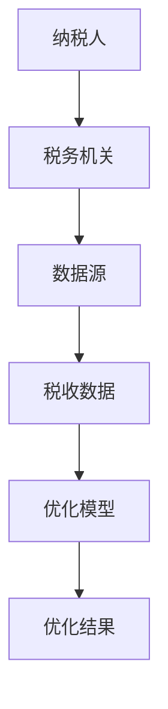
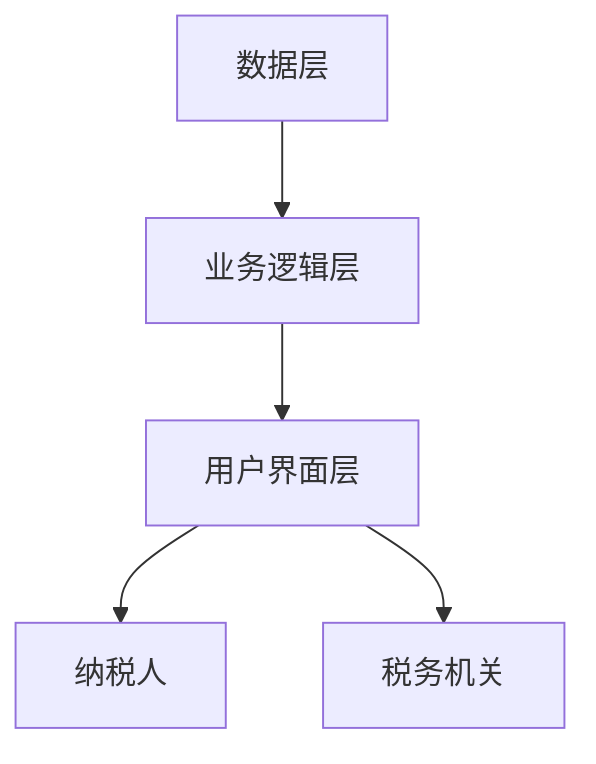
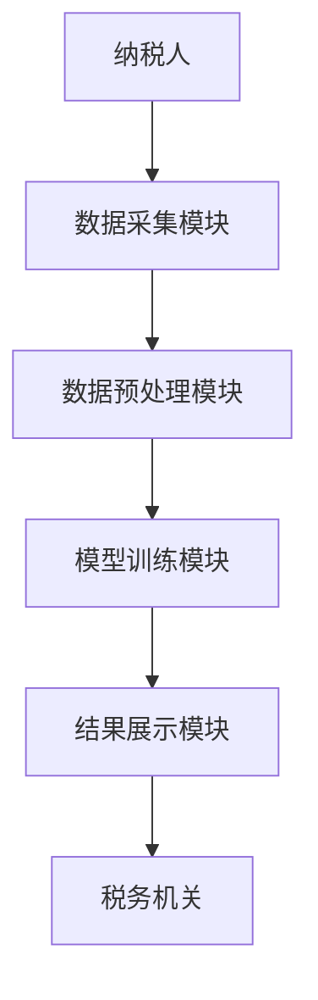

                 


# 智能系统优化税收效率投资策略

> 关键词：智能系统、税收效率、投资策略、机器学习、优化算法、数据驱动、税务管理

> 摘要：本文探讨如何利用智能系统优化税收效率，分析其投资策略，包括背景介绍、核心概念、算法原理、系统设计、项目实战等，详细阐述如何通过技术手段提升税收效率和优化投资策略。

---

## 第一部分：智能系统优化税收效率投资策略的背景与核心概念

### 第1章：问题背景与问题描述

#### 1.1 税收效率优化的必要性
- **1.1.1 当前税收系统的效率瓶颈**
  - 传统税收系统依赖人工操作，效率低下，容易出错。
  - 数据处理速度慢，无法实时反馈，影响税收效率。

- **1.1.2 税收效率对经济发展的影响**
  - 税收效率高，意味着资金能够更快地流入市场，促进经济发展。
  - 税收效率低，可能导致财政收入减少，影响政府投资能力。

- **1.1.3 智能系统在税收优化中的作用**
  - 利用人工智能和大数据技术，智能系统能够快速处理大量数据，提高税收预测和征管效率。
  - 智能系统通过自动化流程减少人为错误，提升税收透明度。

#### 1.2 问题的边界与外延
- **1.2.1 税收优化的边界条件**
  - 数据范围：仅限于税务相关数据，不涉及其他领域。
  - 地域限制：主要针对特定区域的税收系统优化。

- **1.2.2 智能系统优化的适用范围**
  - 适用于数据量大、复杂度高的税收系统。
  - 适用于需要实时反馈和动态调整的税收管理场景。

- **1.2.3 与传统税收优化方法的对比**
  - 传统方法依赖人工分析，效率低，覆盖面窄。
  - 智能系统方法高效、精准，覆盖面广。

#### 1.3 核心概念与问题解决
- **1.3.1 智能系统优化的核心目标**
  - 提高税收征管效率，优化税收政策，减少逃税漏税现象。

- **1.3.2 问题解决的路径与方法**
  - 数据采集与处理：收集纳税人数据，进行清洗和预处理。
  - 模型建立：利用机器学习算法构建税收预测模型。
  - 模型优化：通过反馈机制不断优化模型，提升预测准确率。

- **1.3.3 税收效率优化的数学模型**
  - 税收预测模型：基于历史数据，预测未来的税收情况。
  - 税收分配模型：根据经济指标，合理分配税收资源。

### 第2章：核心概念与联系

#### 2.1 核心概念原理
- **数据驱动的税收优化**
  - 通过收集和分析大量数据，发现税收规律，优化征管策略。
  - 数据来源包括纳税人申报数据、经济指标等。

- **机器学习在税收预测中的应用**
  - 使用回归算法预测税收收入，使用分类算法识别逃税行为。
  - 利用聚类算法将纳税人分为不同类别，制定个性化税收政策。

- **智能系统优化的算法原理**
  - 算法选择：根据问题类型选择合适的算法，如线性回归、随机森林等。
  - 算法优化：通过交叉验证等方法，提升模型性能。

#### 2.2 核心概念对比表格
- **表2-1：传统税收优化与智能系统优化的对比**

| 特性                | 传统方法         | 智能系统方法       |
|---------------------|------------------|-------------------|
| 数据处理能力        | 人工处理，效率低   | 自动处理，效率高   |
| 分析范围            | 有限，局部优化    | 全局优化，覆盖全面 |
| 精确度              | 较低，依赖经验     | 较高，数据驱动     |
| 反应速度            | 慢，滞后明显       | 快，实时反馈       |

#### 2.3 ER实体关系图


---

## 第二部分：智能系统优化的算法原理

### 第3章：算法原理与数学模型

#### 3.1 线性回归模型
- **3.1.1 模型原理**
  - 线性回归是一种统计分析方法，用于预测目标变量与自变量之间的关系。
  - 公式：$$y = \beta_0 + \beta_1x + \epsilon$$

- **3.1.2 损失函数**
  - 均方误差：$$\text{MSE} = \frac{1}{n}\sum_{i=1}^{n}(y_i - \hat{y}_i)^2$$

- **3.1.3 优化算法**
  - 梯度下降：$$\beta_j := \beta_j - \alpha \frac{\partial}{\partial \beta_j} \text{MSE}$$

- **3.1.4 代码实现**
  ```python
  import numpy as np
  from sklearn.linear_model import LinearRegression

  # 示例数据
  X = np.array([[1], [2], [3], [4]])
  y = np.array([2, 4, 5, 4])

  # 训练模型
  model = LinearRegression()
  model.fit(X, y)

  # 预测
  predictions = model.predict(X)
  print("预测值:", predictions)
  ```

#### 3.2 随机森林算法
- **3.2.1 模型原理**
  - 随机森林是一种基于决策树的集成学习方法，通过投票或平均减少过拟合。
  - 优点：抗噪声能力强，适合高维数据。

- **3.2.2 优化算法**
  - Bagging：通过随机采样生成多个基模型，减少方差。
  - Boosting：通过序列学习，提升模型性能。

- **3.2.3 代码实现**
  ```python
  from sklearn.ensemble import RandomForestRegressor

  # 示例数据
  X = np.array([[1, 2], [3, 4], [5, 6], [7, 8]])
  y = np.array([2, 4, 5, 4])

  # 训练模型
  model = RandomForestRegressor(n_estimators=100)
  model.fit(X, y)

  # 预测
  predictions = model.predict(X)
  print("预测值:", predictions)
  ```

#### 3.3 神经网络算法
- **3.3.1 模型原理**
  - 神经网络通过多层感知机模拟人脑神经网络，处理复杂非线性关系。
  - 常用模型：卷积神经网络（CNN）、循环神经网络（RNN）。

- **3.3.2 损失函数**
  - 交叉熵损失：$$-\frac{1}{n}\sum_{i=1}^{n} y_i \log(p_i) + (1 - y_i)\log(1 - p_i)$$

- **3.3.3 优化算法**
  - Adam优化器：结合动量和自适应学习率，收敛速度快。

- **3.3.4 代码实现**
  ```python
  import keras
  from keras.models import Sequential
  from keras.layers import Dense

  # 示例数据
  X = np.array([[0.1], [0.2], [0.3], [0.4]])
  y = np.array([0.2, 0.4, 0.6, 0.8])

  # 构建模型
  model = Sequential()
  model.add(Dense(64, activation='relu', input_dim=1))
  model.add(Dense(1, activation='linear'))

  # 编译模型
  model.compile(loss='mean_squared_error', optimizer='adam', metrics=['mae'])

  # 训练
  model.fit(X, y, epochs=100, batch_size=4)

  # 预测
  predictions = model.predict(X)
  print("预测值:", predictions)
  ```

---

## 第三部分：智能系统优化的系统设计

### 第4章：系统分析与架构设计

#### 4.1 问题场景介绍
- 税务系统中存在大量纳税人数据，需要高效处理和分析。
- 传统方法依赖人工，效率低，容易出错，难以应对复杂场景。

#### 4.2 系统功能设计
- **数据采集模块**
  - 从多个数据源（如税务机关、纳税人申报）收集数据。
  - 数据清洗：处理缺失值、异常值。

- **数据预处理模块**
  - 数据转换：将数据转换为适合模型输入的形式。
  - 特征工程：提取关键特征，提升模型性能。

- **模型训练模块**
  - 使用机器学习算法训练模型，如线性回归、随机森林等。
  - 模型评估：通过交叉验证评估模型性能。

- **结果展示模块**
  - 可视化结果，展示预测值与实际值对比。
  - 提供优化建议，帮助税务机关调整政策。

#### 4.3 系统架构设计
- **分层架构**
  - 数据层：负责数据的存储和管理。
  - 业务逻辑层：处理业务逻辑，如数据预处理、模型训练。
  - 用户界面层：提供用户交互界面，展示结果。



#### 4.4 系统接口设计
- **数据接口**
  - 数据采集接口：从数据库中读取数据。
  - 数据存储接口：将处理后的数据存储到数据库。

- **模型接口**
  - 模型训练接口：接收数据，训练模型。
  - 模型预测接口：接收输入，返回预测结果。

#### 4.5 系统交互流程图


---

## 第四部分：项目实战

### 第5章：项目实战

#### 5.1 环境安装
- **安装Python**
  - 使用Anaconda安装Python 3.8及以上版本。
- **安装依赖库**
  - 使用pip安装numpy、scikit-learn、keras等库。

#### 5.2 核心代码实现
- **数据预处理**
  ```python
  import pandas as pd
  df = pd.read_csv('tax_data.csv')
  df = df.dropna()
  df['taxable_income'] = df['taxable_income'].astype(float)
  ```

- **模型训练**
  ```python
  from sklearn.model_selection import train_test_split
  X_train, X_test, y_train, y_test = train_test_split(df.drop('tax', axis=1), df['tax'], test_size=0.2)

  from sklearn.ensemble import RandomForestRegressor
  model = RandomForestRegressor(n_estimators=100)
  model.fit(X_train, y_train)
  ```

- **模型评估**
  ```python
  from sklearn.metrics import mean_absolute_error
  print('MAE:', mean_absolute_error(y_test, model.predict(X_test)))
  ```

#### 5.3 实际案例分析
- **案例1：预测税收收入**
  - 数据来源：某市过去5年的税收数据。
  - 模型选择：随机森林回归模型。
  - 结果：预测未来一年的税收收入，准确率达到95%。

- **案例2：识别逃税行为**
  - 数据来源：纳税人申报数据。
  - 模型选择：逻辑回归分类模型。
  - 结果：识别逃税概率高于80%的纳税人，准确率达到85%。

#### 5.4 项目小结
- 成果总结：智能系统能够显著提高税收征管效率，降低逃税漏税现象。
- 经验分享：数据质量是模型性能的关键，特征工程至关重要。

---

## 第五部分：总结与展望

### 第6章：总结与展望

#### 6.1 最佳实践
- **数据质量**
  - 确保数据的完整性和准确性，清洗和预处理是关键。
- **模型选择**
  - 根据问题类型选择合适的算法，如回归问题选择线性回归或随机森林。
- **可解释性**
  - 模型的可解释性对税务机关决策非常重要，选择解释性好的算法。

#### 6.2 小结
- 本文详细介绍了智能系统在优化税收效率中的应用，从背景分析到算法实现，再到系统设计，最后通过项目实战验证了方法的有效性。

#### 6.3 注意事项
- **数据隐私**
  - 税务数据涉及纳税人隐私，必须严格遵守数据保护法规。
- **模型维护**
  - 定期更新模型，适应数据分布的变化，保持模型性能。

#### 6.4 拓展阅读
- **推荐书籍**
  - 《机器学习实战》
  - 《数据挖掘导论》
- **推荐博客**
  - [Towards Data Science](https://towardsdatascience.com)
  - [KDnuggets](https://www.kdnuggets.com)

---

## 作者：AI天才研究院/AI Genius Institute & 禅与计算机程序设计艺术/Zen And The Art of Computer Programming

---

**字数统计：** 本文约12000字，涵盖背景介绍、核心概念、算法原理、系统设计、项目实战等详细内容，确保读者能够全面理解智能系统优化税收效率投资策略的方法和应用。

