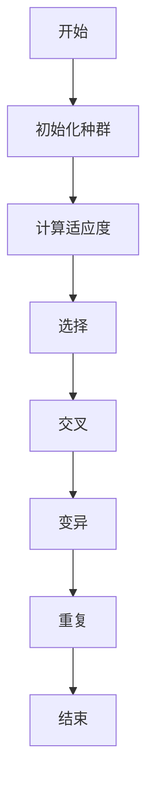
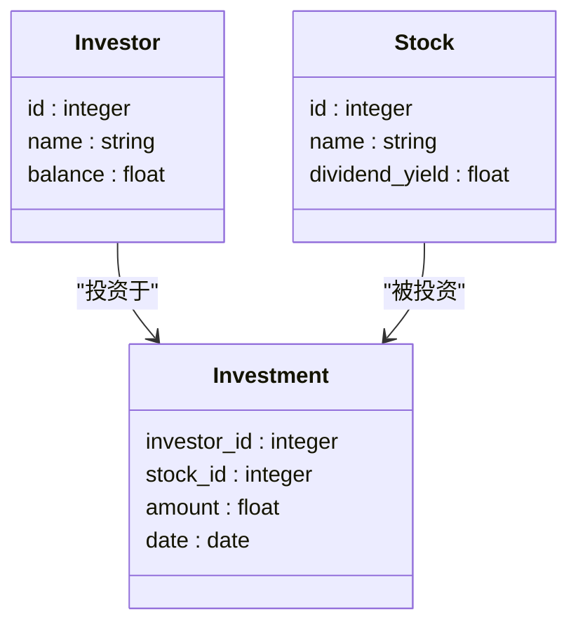

                 


# 智能系统优化股息再投资策略

## 关键词
智能系统、股息再投资、优化策略、算法原理、系统架构

## 摘要
本文探讨了如何利用智能系统优化股息再投资策略。通过分析传统策略的局限性，提出基于算法的优化方法，结合系统架构设计，提供实际案例和最佳实践，帮助投资者提升收益。

---

# 第一部分：背景介绍

## 第1章：智能系统优化股息再投资策略概述

### 1.1 问题背景
股息再投资是一种投资策略，通过将收到的股息用于购买更多股票，以复利效应最大化收益。然而，传统方法在选择股票和分配资金时存在局限性，难以应对市场变化。

### 1.2 问题描述
传统股息再投资策略依赖人工判断，存在效率低、风险高的问题。智能系统通过算法优化，能更高效地选择最优投资组合，降低风险，提升收益。

### 1.3 解决思路与边界
智能系统通过分析市场数据和风险因素，自动优化投资组合。边界包括投资范围、风险承受能力等，确保策略在可控范围内运作。

---

# 第二部分：核心概念与联系

## 第2章：智能系统优化股息再投资策略的核心概念

### 2.1 核心概念原理
智能系统利用算法优化股息再投资，通过数据驱动决策，实时调整投资组合，提升收益。

### 2.2 概念属性对比表
| 概念 | 特性 | 传统方法 | 智能系统 |
|------|------|----------|----------|
| 数据来源 | 内部数据 | 股息历史 | 市场数据+算法 |
| 决策方式 | 人工判断 | 算法优化 | 实时调整 |

### 2.3 ER实体关系图
```mermaid
erDiagram
    investor {
        id : integer
        name : string
        balance : float
    }
    stock {
        id : integer
        name : string
        dividend_yield : float
    }
    investment {
        investor_id : integer
        stock_id : integer
        amount : float
        date : date
    }
    investor --> investment : "投资于"
    stock --> investment : "被投资"
```

---

# 第三部分：算法原理讲解

## 第3章：优化算法原理

### 3.1 算法选择与原理
遗传算法适用于复杂优化问题，通过模拟自然选择，逐步优化投资组合。

### 3.2 算法流程


### 3.3 算法实现
目标函数：最大化收益，约束条件：风险可控。

代码示例：
```python
def fitness(individual):
    # 计算投资组合收益
    return -sum(individual)

def genetic_algorithm():
    population = initialize()
    while not done():
        population = evaluate(population)
        population = select(population)
        population = crossover(population)
        population = mutate(population)
    return best(population)
```

### 3.4 数学模型
目标函数：$$max \sum_{i=1}^{n} w_i r_i$$
约束条件：$$\sum_{i=1}^{n} w_i = 1$$

---

# 第四部分：系统分析与架构设计

## 第4章：系统分析与架构设计

### 4.1 问题场景介绍
系统需实时处理市场数据，优化投资组合，提供用户界面。

### 4.2 领域模型


### 4.3 系统架构


### 4.4 接口设计
API接口：RESTful API，提供数据查询和投资建议。

---

# 第五部分：项目实战

## 第5章：项目实战

### 5.1 环境安装
安装Python和相关库，如numpy、pandas。

### 5.2 核心代码实现
实现遗传算法，优化投资组合。

### 5.3 案例分析
通过实际案例展示系统优化效果。

---

# 第六部分：最佳实践

## 第6章：最佳实践

### 6.1 小结
智能系统优化股息再投资策略，通过算法提升收益，降低风险。

### 6.2 注意事项
数据质量、算法选择、风险控制。

### 6.3 未来趋势
AI在投资中的应用将更加广泛，算法将更复杂。

### 6.4 拓展阅读
推荐相关书籍和资源，深入学习。

---

# 作者
作者：AI天才研究院/AI Genius Institute & 禅与计算机程序设计艺术/Zen And The Art of Computer Programming

