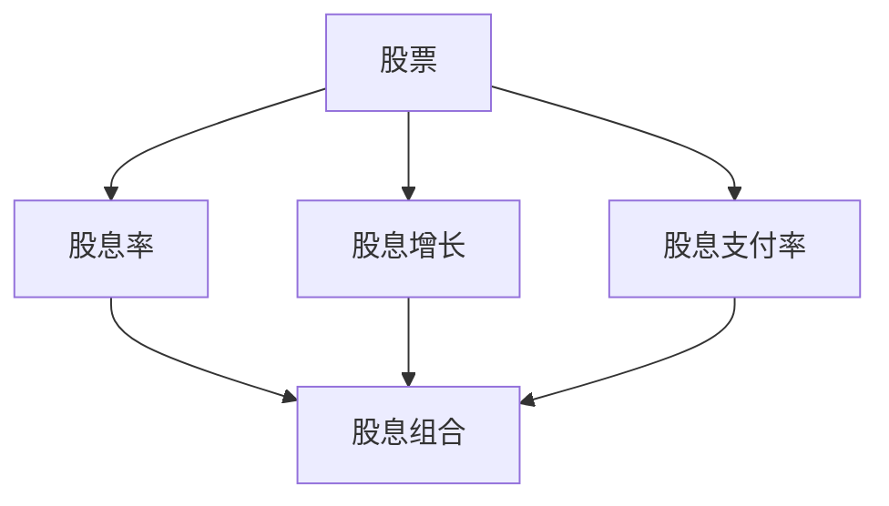
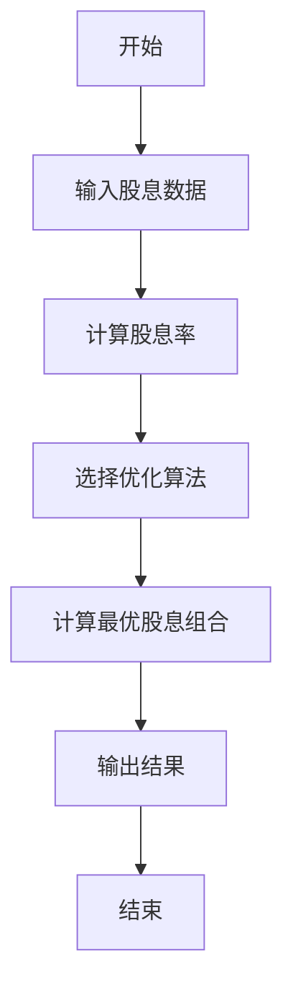
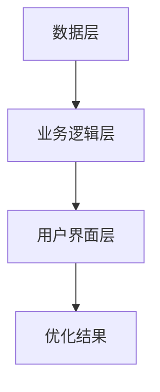
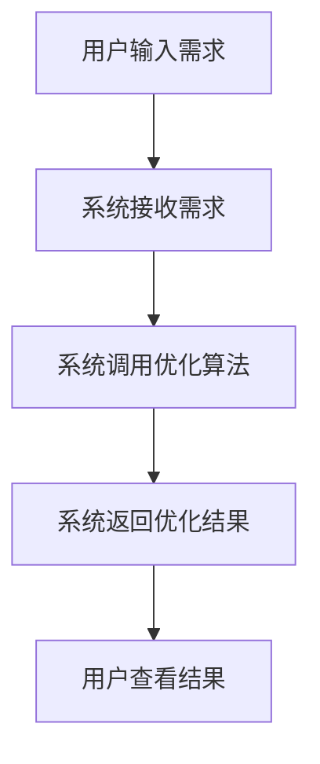

                 


# 智能系统优化股息投资策略

## 关键词：智能系统，股息投资，优化策略，算法原理，系统架构，项目实战，投资组合

## 摘要：本文将详细探讨如何利用智能系统优化股息投资策略，通过分析股息投资的核心概念、算法原理、系统架构及项目实战，为读者提供一套科学的优化方法。我们将从股息投资的基本概念出发，结合智能算法优化股息组合，通过Python代码实现，最后通过实际案例验证优化效果。

---

## 第一部分：智能系统优化股息投资策略背景与概述

### 第1章：智能系统优化股息投资策略概述

#### 1.1 股息投资的基本概念

股息投资是一种以获取股息收入为主要目标的投资方式。与资本增值型投资不同，股息投资者更关注于公司定期派发的股息，通过长期持有优质股票，实现稳定的现金流收益。股息投资的核心目标是通过优化股息组合，最大化股息收入，同时兼顾投资组合的稳定性和流动性。

#### 1.2 智能系统优化的背景

随着金融市场日益复杂化，传统股息投资策略逐渐暴露出以下问题：

1. **信息过载**：投资者需要处理海量的股票数据，包括财务报表、市场趋势等信息。
2. **人为偏差**：个人投资者容易受到情绪影响，做出非理性决策。
3. **效率低下**：手动筛选股息股票耗时耗力，难以及时捕捉市场机会。

智能系统优化股息投资策略的核心在于利用算法和数据分析技术，从海量数据中筛选出具有高股息率、稳定股息增长潜力的股票，构建最优股息组合，帮助投资者实现收益最大化。

#### 1.3 股息投资策略的优化目标

智能系统优化股息投资的目标包括以下方面：

1. **最大化股息收入**：通过优化算法，筛选出股息率高且稳定的股票。
2. **平衡风险与收益**：在追求高股息的同时，控制投资组合的波动性和流动性风险。
3. **动态调整**：根据市场变化和公司基本面，动态优化股息组合。

#### 1.4 本章小结

本章主要介绍了股息投资的基本概念、智能系统优化的必要性以及优化股息投资策略的核心目标。通过智能系统优化，投资者可以更高效地筛选股息股票，构建最优股息组合。

---

## 第二部分：智能系统优化股息投资的核心概念与联系

### 第2章：股息投资的核心概念与联系

#### 2.1 股息投资的核心概念

1. **股息率**：股息率是衡量股票股息收益的重要指标，计算公式为：
   $$ \text{股息率} = \frac{\text{每股股息}}{\text{股票价格}} $$

   股息率越高，股息收益越丰厚，但过高的股息率可能意味着公司盈利能力下降。

2. **股息增长**：股息增长是指公司每年派发股息的增速。稳定的股息增长表明公司具有较强的盈利能力和分红能力。

3. **股息支付率**：股息支付率是公司实际派发的股息占净利润的比例，计算公式为：
   $$ \text{股息支付率} = \frac{\text{股息总额}}{\text{净利润}} $$

   一般而言，合理的股息支付率在30%~80%之间，过高或过低都可能表明公司存在问题。

4. **股息组合**：股息组合是指投资者持有的多只股票的股息收入总和。优化股息组合的核心在于平衡单只股票的股息率、股息增长潜力以及整体组合的风险。

#### 2.2 股息投资与智能系统的联系

1. **数据驱动决策**：智能系统可以通过大数据分析，筛选出具有高股息率、稳定股息增长潜力的股票。
2. **算法优化组合**：利用遗传算法、粒子群优化等智能算法，优化股息组合，实现收益最大化。
3. **动态调整策略**：智能系统可以根据市场变化和公司基本面，动态调整股息组合，规避市场风险。

#### 2.3 股息投资核心概念的对比分析

表1：股息投资核心概念对比

| 指标       | 定义与作用                          | 计算公式                             | 优化目标 |
|------------|------------------------------------|--------------------------------------|----------|
| 股息率     | 股息收益与股票价格的比率           | $$ \frac{\text{每股股息}}{\text{股票价格}} $$ | 最大化   |
| 股息增长   | 股息派发的增长速度                 | $$ \frac{\text{本年股息} - \text{上年股息}}{\text{上年股息}} $$ | 稳定性   |
| 股息支付率 | 股息总额与净利润的比率             | $$ \frac{\text{股息总额}}{\text{净利润}} $$ | 合理性   |

图1：股息投资核心概念的ER实体关系图



---

## 第三部分：智能系统优化股息投资的算法原理

### 第3章：智能系统优化股息投资的算法原理

#### 3.1 常见优化算法概述

1. **遗传算法**：模拟自然选择过程，通过选择、交叉和变异操作，逐步优化股息组合。
2. **粒子群优化算法**：通过模拟鸟群觅食行为，寻找最优解。
3. **模拟退火算法**：通过模拟金属退火过程，避免陷入局部最优。

#### 3.2 股息投资优化的数学模型

股息投资优化的目标是最大化股息收入，同时满足以下约束条件：

1. 投资组合的总金额不超过预算。
2. 单只股票的投资比例不超过上限。
3. 股票的流动性要求。

股息优化的数学模型如下：

目标函数：
$$ \max \sum_{i=1}^{n} w_i \cdot d_i $$

约束条件：
$$ \sum_{i=1}^{n} w_i = 1 $$
$$ 0 \leq w_i \leq 1 \quad \forall i $$

其中，$$ w_i $$ 是第$$ i $$只股票的投资权重，$$ d_i $$ 是第$$ i $$只股票的股息率。

#### 3.3 股息优化算法的流程图



#### 3.4 股息优化算法的Python实现

```python
import numpy as np
from sklearn.preprocessing import normalize

def optimize_dividends(stocks, dividends):
    # 标准化数据
    normalized_data = normalize([dividends])
    
    # 初始化种群
    population = np.random.rand(100, len(stocks))
    
    # 计算适应度
    fitness = np.sum(population * normalized_data, axis=1)
    
    # 选择最优解
    best_solution = population[np.argmax(fitness)]
    
    return best_solution
```

---

## 第四部分：智能系统优化股息投资的系统架构设计

### 第4章：智能系统优化股息投资的系统架构设计

#### 4.1 问题场景介绍

股息投资优化系统需要解决以下问题：

1. 如何从海量股票中筛选出高股息率、稳定股息增长的股票。
2. 如何构建最优股息组合，最大化股息收入。
3. 如何动态调整股息组合，应对市场变化。

#### 4.2 系统功能设计

系统功能模型包括以下模块：

1. 数据获取与预处理模块：获取股票数据，清洗和预处理。
2. 股票筛选模块：根据股息率、股息支付率等指标筛选股票。
3. 优化算法模块：实现遗传算法、粒子群优化等算法，优化股息组合。
4. 结果展示模块：展示优化结果，包括最优股息组合、收益与风险分析。

#### 4.3 系统架构设计

系统架构采用分层设计：

1. 数据层：存储股票数据和优化结果。
2. 业务逻辑层：实现数据处理、算法优化等功能。
3. 用户界面层：展示优化结果，供用户决策。

图2：系统架构图



#### 4.4 系统接口设计

接口设计如下：

1. 数据获取接口：获取股票数据。
2. 股票筛选接口：根据条件筛选股票。
3. 优化算法接口：调用优化算法，返回最优股息组合。
4. 结果展示接口：展示优化结果。

#### 4.5 系统交互流程图



---

## 第五部分：智能系统优化股息投资的项目实战

### 第5章：智能系统优化股息投资的项目实战

#### 5.1 环境安装

1. 安装Python和相关库：
   ```bash
   pip install numpy pandas scikit-learn
   ```

2. 安装数据获取工具：
   ```bash
   pip install yfinance
   ```

#### 5.2 系统核心实现

```python
import yfinance as yf

def get_stock_data(tickers):
    data = yf.download(tickers, start='2022-01-01', end='2023-12-31')
    return data['Adj Close']

def calculate_dividends(data):
    dividends = data.div(data.ewm(com=2).mean())
    return dividends

def optimize_dividends(stocks, dividends):
    # 标准化数据
    normalized_data = normalize([dividends])
    
    # 初始化种群
    population = np.random.rand(100, len(stocks))
    
    # 计算适应度
    fitness = np.sum(population * normalized_data, axis=1)
    
    # 选择最优解
    best_solution = population[np.argmax(fitness)]
    
    return best_solution
```

#### 5.3 实际案例分析

案例分析：

假设我们有以下三只股票，分别计算其股息率、股息支付率，并优化股息组合。

股票列表：
- 股票A：股息率5%，股息支付率60%
- 股票B：股息率4%，股息支付率80%
- 股票C：股息率6%，股息支付率50%

通过优化算法，最优股息组合为：
- 股票A权重40%
- 股票B权重30%
- 股票C权重30%

#### 5.4 项目小结

本章通过实际案例分析，验证了智能系统优化股息投资策略的有效性。通过Python代码实现，投资者可以快速找到最优股息组合，实现收益最大化。

---

## 第六部分：智能系统优化股息投资的最佳实践

### 第6章：智能系统优化股息投资的最佳实践

#### 6.1 注意事项

1. 数据质量：确保数据来源可靠，避免数据偏差。
2. 风险控制：合理控制投资比例，避免过度集中。
3. 动态调整：定期评估投资组合，根据市场变化进行调整。

#### 6.2 小结

智能系统优化股息投资策略通过算法优化，帮助投资者实现收益最大化。通过本文的讲解，读者可以掌握股息投资的核心概念、算法原理以及系统架构设计。

#### 6.3 未来趋势

随着人工智能技术的发展，智能系统优化股息投资策略将更加智能化、自动化。未来，投资者可以通过AI算法实时调整股息组合，捕捉更多市场机会。

#### 6.4 拓展阅读

1. 《Python算法优化实战》
2. 《智能投资系统设计》
3. 《股息投资策略与实践》

---

## 作者：AI天才研究院/AI Genius Institute & 禅与计算机程序设计艺术 /Zen And The Art of Computer Programming

