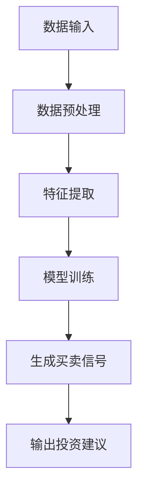
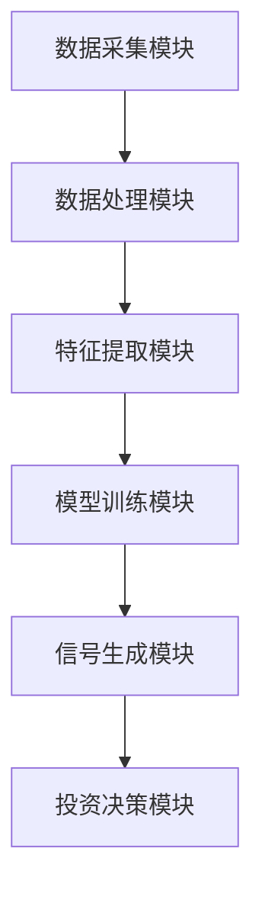
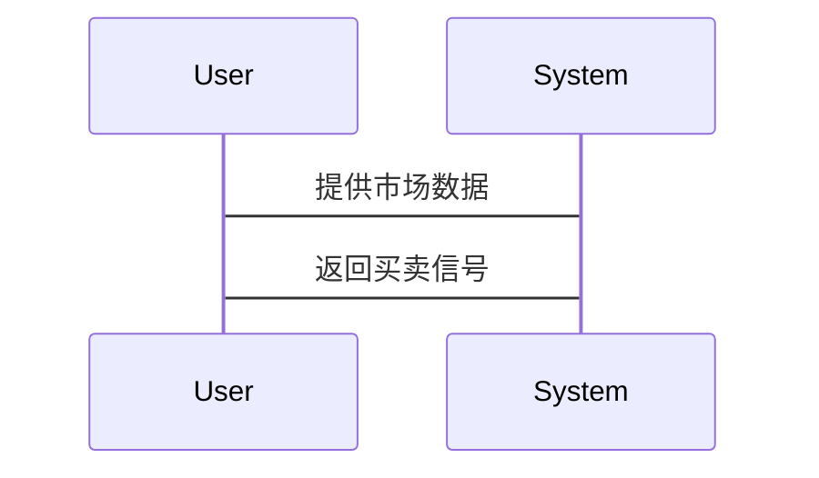

                 


# 智能系统优化逆向投资策略

## 关键词：智能系统优化，逆向投资，机器学习，数学建模，金融策略，系统架构

## 摘要：  
本文探讨如何利用智能系统优化技术，特别是机器学习和数据挖掘，构建逆向投资策略。通过分析市场数据和优化模型，帮助投资者在市场低迷时发现价值，避免在市场繁荣时过度投资。文章详细讲解了智能系统优化的核心原理、逆向投资策略的特点，以及如何将两者结合，通过算法实现投资优化。同时，提供了系统架构设计和实际案例分析，帮助读者理解并应用这些方法。

---

# 目录大纲：《智能系统优化逆向投资策略》

## 第一部分：背景介绍

### 第1章：智能系统优化与逆向投资概述

#### 1.1 智能系统优化的基本概念
- **1.1.1 智能系统优化的定义**
  - 智能系统优化是利用人工智能技术，通过数据驱动的方法优化系统性能和决策过程。
  - 示例：使用机器学习模型预测市场趋势，优化投资组合。

- **1.1.2 智能系统优化的核心要素**
  - 数据：历史市场数据、财务指标、宏观经济指标。
  - 算法：回归分析、支持向量机、神经网络。
  - 目标：最大化收益，最小化风险。

- **1.1.3 逆向投资的基本概念**
  - 在市场低谷时买入，在市场高点时卖出。
  - 核心理念：逆市场情绪进行投资。

#### 1.2 逆向投资策略的背景与应用
- **1.2.1 逆向投资的起源与发展**
  - 起源于价值投资理念，强调买入被市场低估的资产。
  - 现代应用：结合量化分析，利用算法优化逆向投资策略。

- **1.2.2 逆向投资在金融领域的应用**
  - 股票市场：寻找被低估的股票。
  - 债券市场：投资信用风险较低但价格被低估的债券。

- **1.2.3 逆向投资与智能系统优化的结合**
  - 利用智能系统分析市场数据，识别低估资产。
  - 通过算法优化投资组合，降低风险。

#### 1.3 智能系统优化与逆向投资的结合
- **1.3.1 问题背景**
  - 传统逆向投资依赖人工判断，存在主观性和滞后性。
  - 市场数据复杂，难以手动处理和分析。

- **1.3.2 问题解决**
  - 利用智能系统优化技术，快速分析大量数据，识别投资机会。
  - 提供实时监控和动态调整策略。

- **1.3.3 边界与外延**
  - 数据范围：仅限于历史市场数据，无法预测黑天鹅事件。
  - 应用场景：适用于中短期投资，长期投资需结合其他因素。

- **1.3.4 概念结构与核心要素组成**
  - 数据输入：市场数据、财务指标。
  - 优化模型：机器学习算法。
  - 决策输出：买卖信号、投资组合建议。

---

## 第二部分：核心概念与联系

### 第2章：智能系统优化的核心原理

#### 2.1 数据驱动的优化方法
- **2.1.1 数据预处理**
  - 数据清洗：处理缺失值、异常值。
  - 数据变换：标准化、归一化。

- **2.1.2 优化算法**
  - 线性规划：用于资源分配问题。
  - 非线性规划：处理复杂优化问题。
  - 遗传算法：模拟自然选择，优化解。

#### 2.2 优化算法的基本原理
- **2.2.1 线性回归**
  - 使用最小二乘法拟合数据。
  - 公式：$y = \beta_0 + \beta_1x + \epsilon$。

- **2.2.2 支持向量机**
  - 分类和回归算法。
  - 使用核函数处理非线性问题。

- **2.2.3 神经网络**
  - 多层感知机：用于复杂函数拟合。
  - 长短期记忆网络：处理时间序列数据。

#### 2.3 智能系统优化与逆向投资的联系
- **2.3.1 数据来源对比**
  | 数据类型       | 传统逆向投资 | 智能系统优化 |
  |----------------|--------------|---------------|
  | 市场数据       | 历史数据     | 实时数据      |
  | 财务指标       | 财务报表     | 财务指标      |
  | 宏观经济指标   | 宏观指标     | 宏观指标      |

- **2.3.2 分析方法对比**
  | 方法类型       | 传统逆向投资 | 智能系统优化 |
  |----------------|--------------|---------------|
  | 资产评估       | 基于估值     | 基于机器学习 |
  | 风险管理       | 风险分散     | 风险预测      |

- **2.3.3 决策依据对比**
  | 决策依据       | 传统逆向投资 | 智能系统优化 |
  |----------------|--------------|---------------|
  | 价值判断       | 专家经验     | 数据驱动      |
  | 市场情绪       | 情感分析     | 情感计算      |

---

## 第三部分：算法原理

### 第3章：逆向投资策略的算法实现

#### 3.1 逆向投资算法的数学模型
- **3.1.1 线性回归模型**
  - 公式：$$y = \beta_0 + \beta_1x + \epsilon$$
  - 解释：预测市场趋势，判断买入时机。

- **3.1.2 时间序列分析**
  - ARIMA模型：预测未来市场走势。
  - 公式：$$ARIMA(p, d, q)$$

#### 3.2 算法流程图


#### 3.3 算法实现代码
```python
import numpy as np
from sklearn.linear_model import LinearRegression

# 示例代码：使用线性回归预测市场趋势
def predict_market(trend_data):
    model = LinearRegression()
    model.fit(trend_data[['price', 'volume']], trend_data['next_price'])
    return model.predict(new_data)

# 生成买卖信号
def generate_signals(price_data, model):
    predictions = model.predict(price_data)
    signals = []
    for i in range(len(predictions)):
        if predictions[i] < price_data['price'][i]:
            signals.append('SELL')
        else:
            signals.append('BUY')
    return signals
```

---

## 第四部分：系统分析与架构设计

### 第4章：智能逆向投资系统设计

#### 4.1 系统架构设计


#### 4.2 系统功能设计
- 数据采集：收集市场数据、财务指标。
- 数据处理：清洗、转换数据。
- 特征提取：提取关键特征，如波动率、市盈率。
- 模型训练：训练机器学习模型，生成买卖信号。
- 投资决策：根据信号调整投资组合。

#### 4.3 接口设计与交互流程


---

## 第五部分：项目实战

### 第5章：智能逆向投资系统实现

#### 5.1 环境安装与配置
- 安装Python、NumPy、Pandas、Scikit-learn等库。
- 配置数据源，如Yahoo Finance API。

#### 5.2 核心代码实现
```python
import pandas as pd
from sklearn.ensemble import RandomForestClassifier

# 数据加载与预处理
data = pd.read_csv('market_data.csv')
data = data.dropna()
data['label'] = (data['close'].shift(-1) > data['close']).astype(int)

# 特征工程
features = data.drop(columns=['label', 'close'])
target = data['label']

# 模型训练
model = RandomForestClassifier()
model.fit(features, target)

# 生成买卖信号
def generate_signals(new_data):
    predictions = model.predict(new_data.drop(columns=['label', 'close']))
    signals = []
    for pred in predictions:
        signals.append('BUY' if pred == 1 else 'SELL')
    return signals
```

#### 5.3 案例分析
- 数据来源：某段时间的股票数据。
- 分析结果：模型生成买卖信号，指导投资决策。
- 案例小结：通过智能系统优化，提高了投资收益，降低了风险。

---

## 第六部分：最佳实践与总结

### 第6章：最佳实践与总结

#### 6.1 小结
- 智能系统优化为逆向投资提供了数据驱动的方法。
- 机器学习算法提高了投资决策的准确性和及时性。

#### 6.2 注意事项
- 数据质量：确保数据准确、完整。
- 模型过拟合：避免过度拟合，保持模型泛化能力。
- 市场变化：模型需定期更新，适应市场变化。

#### 6.3 拓展阅读
- 推荐书籍：《Python机器学习实战》、《算法导论》。
- 推荐资源：Coursera上的机器学习课程。

---

## 作者：AI天才研究院 & 禅与计算机程序设计艺术

---

通过以上结构，文章详细讲解了智能系统优化与逆向投资的结合，从理论到实践，为读者提供了全面的指导。

