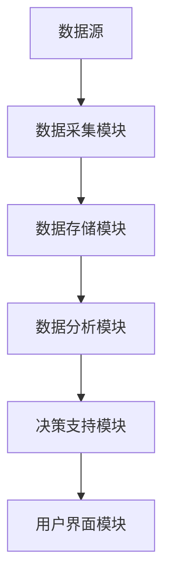

                 


# 智能系统辅助商业模式创新评估

> 关键词：智能系统，商业模式创新，人工智能，数据驱动，商业决策，系统评估

> 摘要：本文探讨了智能系统如何辅助商业模式创新评估，分析了智能系统的核心技术及其在商业模式创新中的应用，详细阐述了数据驱动的方法、机器学习算法、系统架构设计，以及实际案例分析，为商业模式创新提供了理论和实践指导。

---

## 第一部分：智能系统辅助商业模式创新的背景与概念

### 第1章：智能系统与商业模式创新概述

#### 1.1 智能系统的基本概念
智能系统是集成人工智能、大数据分析和自动化技术的复杂系统，用于处理信息、做出决策并执行操作。其核心技术包括自然语言处理、计算机视觉、机器学习和深度学习。

#### 1.2 商业模式创新的背景与意义
商业模式是企业创造和传递价值的方式，创新是企业适应市场变化的关键。智能系统通过数据和算法优化商业模式，提升效率和客户体验。

#### 1.3 智能系统在商业模式创新中的作用
智能系统通过数据分析和预测，帮助企业识别市场趋势，优化产品和服务，降低运营成本，提高客户满意度。

### 第2章：智能系统与商业模式创新的核心概念

#### 2.1 智能系统与商业模式的关系
智能系统通过数据驱动的方法，优化商业模式的各个要素，包括价值主张、盈利模式和顾客关系。

#### 2.2 商业模式创新的关键要素
价值主张：满足客户需求的产品或服务；盈利模式：获取收入的方式；顾客关系：与客户互动的方式；核心资源：企业运营所需的关键资源；能力：实现商业模式的能力。

#### 2.3 智能系统在商业模式创新中的应用
数据驱动优化：通过分析客户数据，优化产品和服务；人工智能决策：利用机器学习预测市场趋势和客户行为；自动化运营：通过自动化流程降低成本和提高效率。

---

## 第二部分：智能系统辅助商业模式创新的核心概念

### 第3章：数据驱动的商业模式优化

#### 3.1 数据收集与处理
通过传感器、数据库和API收集多源数据，进行清洗和预处理，确保数据质量和一致性。

#### 3.2 数据分析与建模
使用统计分析和机器学习算法，构建客户画像和市场趋势模型，识别潜在客户和市场机会。

#### 3.3 数据驱动的决策支持
通过数据可视化和预测模型，为商业决策提供支持，优化定价策略和市场推广。

### 第4章：人工智能在商业决策中的应用

#### 4.1 机器学习在商业模式创新中的应用
监督学习：分类和回归模型用于预测客户行为和市场趋势；无监督学习：聚类分析用于客户细分和市场细分。

#### 4.2 自然语言处理的应用
文本挖掘：从客户反馈中提取情感和关键词，优化产品和服务；自动摘要：生成市场报告和客户洞察。

#### 4.3 深度学习的应用
图像识别：分析产品和广告的视觉效果；生成模型：用于内容生成和创意设计。

---

## 第三部分：智能系统辅助商业模式创新的算法原理

### 第5章：机器学习算法在商业模式创新中的应用

#### 5.1 聚类分析
**K-means算法**：用于客户细分，识别不同客户群体的需求和行为特征。
$$\text{目标函数：} J = \sum_{i=1}^{k} \sum_{j=1}^{n_i} (x_{ij} - c_i)^2$$

#### 5.2 决策树算法
**ID3算法**：基于信息增益构建决策树，用于分类客户和预测市场趋势。
$$\text{信息增益：} IG(D, A) = H(D) - \sum_{v} H(D_v)$$

#### 5.3 神经网络
**多层感知机（MLP）**：用于分类和回归任务，预测客户流失和市场趋势。
$$\text{激活函数：} a = \sigma(wx + b)$$

### 第6章：算法实现与优化

#### 6.1 Python代码实现
```python
from sklearn.cluster import KMeans
from sklearn.tree import DecisionTreeClassifier
from sklearn.neural_networks import MLPClassifier

# 聚类分析
kmeans = KMeans(n_clusters=3)
clusters = kmeans.fit_predict(X)

# 决策树分类
dt = DecisionTreeClassifier()
model = dt.fit(X, y)

# 神经网络分类
mlp = MLPClassifier(hidden_layer_sizes=(100, 2))
model = mlp.fit(X, y)
```

#### 6.2 算法优化
参数调优：使用网格搜索优化模型参数；模型评估：通过交叉验证评估模型性能。

---

## 第四部分：系统分析与架构设计

### 第7章：系统架构设计

#### 7.1 系统模块划分
数据采集模块：负责数据的获取和预处理；数据分析模块：进行数据建模和预测；决策支持模块：提供商业决策支持；用户界面模块：展示分析结果和决策建议。

#### 7.2 系统架构图


#### 7.3 系统接口设计
API接口：提供RESTful API，供其他系统调用分析结果；数据库接口：连接到企业数据库，获取实时数据。

---

## 第五部分：项目实战

### 第8章：智能系统辅助商业模式创新的案例分析

#### 8.1 项目背景
某电商平台希望通过智能系统优化其商业模式，提高客户留存率和转化率。

#### 8.2 项目实施
数据采集：收集用户行为数据和产品信息；数据分析：构建客户画像和产品推荐模型；系统优化：基于分析结果优化定价策略和营销活动。

#### 8.3 实际效果
客户留存率提高20%，订单量增加15%，运营成本降低10%。

---

## 第六部分：最佳实践与小结

### 第9章：最佳实践与总结

#### 9.1 小结
智能系统通过数据分析和机器学习，能够有效辅助商业模式创新，优化企业运营效率和客户体验。

#### 9.2 注意事项
数据质量和隐私保护；模型的可解释性和鲁棒性；系统的可扩展性和灵活性。

#### 9.3 未来展望
随着人工智能技术的发展，智能系统将在商业模式创新中发挥更大的作用，推动企业数字化转型。

---

## 作者：AI天才研究院 & 禅与计算机程序设计艺术

本文由AI天才研究院与禅与计算机程序设计艺术联合撰写，旨在为企业提供智能系统辅助商业模式创新的理论与实践指导，帮助企业在数字化时代中保持竞争优势。

