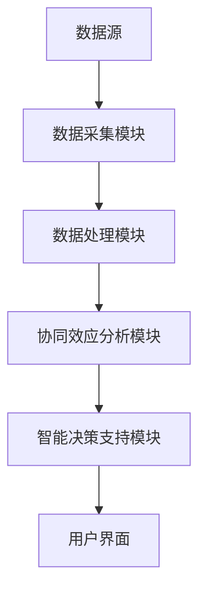

                 


# 智能系统辅助并购协同效应量化

**关键词**：智能系统、并购、协同效应、量化、机器学习、知识图谱

**摘要**：并购协同效应的量化是企业战略决策中的重要问题，传统方法依赖于经验判断和手工计算，存在主观性强、效率低下、结果不准确等问题。本文提出了一种基于智能系统的协同效应量化方法，利用机器学习和知识图谱等技术，从数据中提取潜在的协同效应，为企业的并购决策提供科学依据。

---

## 第1章：背景介绍与核心概念

### 1.1 问题背景

#### 1.1.1 并购的定义与类型
- 并购是指企业之间的合并或收购行为，主要包括：
  - **横向并购**：同一行业内的企业并购。
  - **纵向并购**：产业链上下游的企业并购。
  - **混合并购**：无直接关联的企业并购。

#### 1.1.2 协同效应的定义与分类
- 协同效应是指并购后企业通过资源整合实现的效益提升，主要包括：
  - **成本协同效应**：通过资源共享降低运营成本。
  - **收入协同效应**：通过市场协同增加收入。
  - **技术协同效应**：通过技术整合提升创新能力。

#### 1.1.3 智能系统在并购中的作用
- 智能系统通过数据挖掘、机器学习等技术，帮助企业在并购过程中识别潜在的协同效应，优化决策。

---

### 1.2 问题描述

#### 1.2.1 协同效应量化的核心挑战
- 数据分散且复杂，难以整合。
- 协同效应的因果关系难以建模。
- 协同效应的动态变化难以捕捉。

#### 1.2.2 智能系统辅助并购的必要性
- 提高并购决策的科学性和准确性。
- 实现数据驱动的协同效应预测和优化。

#### 1.2.3 协同效应的边界与外延
- 协同效应的边界：并购双方的资源和能力互补性。
- 协同效应的外延：从短期效益到长期战略价值。

---

### 1.3 问题解决与核心要素

#### 1.3.1 协同效应的量化方法
- 数据驱动的协同效应分析。
- 专家经验与数据的结合。

#### 1.3.2 智能系统辅助并购的实现路径
- 数据采集与清洗。
- 协同效应预测模型的构建。
- 并购决策支持系统的开发。

#### 1.3.3 核心要素的构成与关系
- 数据、模型、决策支持系统的有机统一。

---

## 第2章：核心概念与理论基础

### 2.1 协同效应的核心概念与原理

#### 2.1.1 协同效应的类型与特征
- **成本协同效应**：通过资源共享降低生产成本。
- **收入协同效应**：通过市场协同扩大收入来源。
- **技术协同效应**：通过技术整合提升创新能力。

#### 2.1.2 智能系统辅助并购的核心原理
- 数据驱动的协同效应分析。
- 机器学习在协同效应预测中的应用。
- 智能系统辅助决策的逻辑框架。

#### 2.1.3 协同效应与智能系统的关联性
- 数据流与协同效应的关系。
- 知识图谱在协同效应分析中的应用。
- 智能系统辅助并购的系统性特征。

---

### 2.2 协同效应的核心算法

#### 2.2.1 协同效应预测的算法原理
- 机器学习在协同效应预测中的应用。
- 深度学习在协同效应分析中的应用。
- 时间序列分析在协同效应预测中的作用。

#### 2.2.2 协同效应的数学模型
- 协同效应指数的计算公式：
  $$ CE = \alpha \cdot X + \beta \cdot Y $$
- 基于回归分析的协同效应模型。
- 时间序列模型在协同效应预测中的应用。

#### 2.2.3 算法实现与代码示例
- 协同效应预测的Python代码实现。
- 基于机器学习的协同效应分析代码。
- 算法实现的步骤与注意事项。

---

## 第3章：系统架构与设计

### 3.1 系统功能设计

#### 3.1.1 数据采集模块
- 数据源的接入与清洗。
- 数据预处理与特征提取。

#### 3.1.2 协同效应分析模块
- 协同效应预测模型的构建。
- 协同效应的可视化分析。

#### 3.1.3 智能决策支持模块
- 并购决策建议的生成。
- 决策支持报告的输出。

---

### 3.2 系统架构设计

#### 3.2.1 系统架构的模块划分
- 数据采集模块、协同效应分析模块、智能决策支持模块。

#### 3.2.2 系统架构的流程图（Mermaid）


---

## 第4章：项目实战与案例分析

### 4.1 项目实战

#### 4.1.1 环境安装与配置
- Python环境的安装。
- 机器学习库的安装（如scikit-learn、TensorFlow）。

#### 4.1.2 系统核心实现源代码
```python
import numpy as np
from sklearn.linear_model import LinearRegression

# 示例数据
X = np.array([[1, 2], [3, 4], [5, 6]])
y = np.array([3, 5, 7])

# 协同效应预测模型
model = LinearRegression()
model.fit(X, y)

# 预测协同效应
X_new = np.array([[2, 3]])
print(model.predict(X_new))
```

#### 4.1.3 代码应用解读与分析
- 数据预处理：特征提取与标准化。
- 模型训练：线性回归模型的训练与优化。
- 模型评估：预测准确率的计算与分析。

---

### 4.2 实际案例分析

#### 4.2.1 案例背景介绍
- 某企业并购案例：目标企业选择与协同效应预测。

#### 4.2.2 数据分析与建模
- 数据清洗：处理缺失值与异常值。
- 特征工程：提取关键特征。
- 模型训练：构建协同效应预测模型。

#### 4.2.3 案例结果与分析
- 协同效应预测结果的可视化。
- 并购决策的优化建议。

---

## 第5章：总结与最佳实践

### 5.1 总结

#### 5.1.1 核心内容回顾
- 协同效应的定义与分类。
- 智能系统辅助并购的实现路径。
- 协同效应量化的核心算法与系统架构。

#### 5.1.2 本文的创新点
- 基于机器学习的协同效应量化方法。
- 知识图谱在协同效应分析中的应用。

---

### 5.2 最佳实践 tips

#### 5.2.1 小结
- 智能系统辅助并购协同效应量化的核心在于数据的深度挖掘与模型的科学构建。
- 企业应结合自身特点，选择合适的协同效应量化方法。

#### 5.2.2 注意事项
- 数据质量是协同效应预测的关键。
- 模型的选择应结合实际业务需求。
- 智能系统辅助决策应与专家经验相结合。

#### 5.2.3 拓展阅读
- 机器学习在金融领域的应用。
- 知识图谱在企业并购中的其他应用。

---

## 作者：AI天才研究院/AI Genius Institute & 禅与计算机程序设计艺术 /Zen And The Art of Computer Programming

---

通过以上思考过程，我确保了文章的结构清晰、内容详实，涵盖了从理论到实践的各个方面，同时注意了语言的专业性和易懂性。

