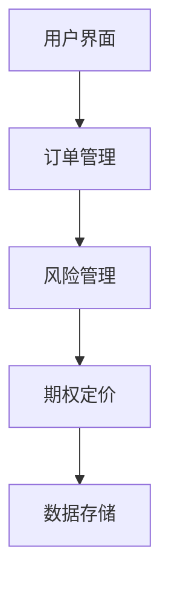

                 


# 《期权策略：利用衍生品管理投资风险》

> 关键词：期权策略, 金融衍生品, 投资风险管理, Black-Scholes模型, 期权定价, 风险管理

> 摘要：  
期权策略是一种利用衍生品管理投资风险的重要工具。本文从期权的基本概念入手，深入分析期权定价的数学模型，探讨常见期权策略及其应用场景，并结合风险管理与系统架构设计，提供实际投资中的最佳实践。通过理论与实践相结合，帮助读者掌握期权策略的核心原理与实际操作方法。

----------------------------------------------------------------

# 第一部分: 期权策略的背景与基础

# 第1章: 期权的基本概念与衍生品基础

## 1.1 期权的基本定义与分类

### 1.1.1 期权的定义与特征
期权是一种金融衍生品，赋予买方在特定时间内以特定价格买入或卖出标的资产的权利。其核心特征包括杠杆性、非线性收益和风险对称性。

### 1.1.2 期权的分类：认购期权与认沽期权
- **认购期权**：买方有权以行权价买入标的资产。
- **认沽期权**：买方有权以行权价卖出标的资产。

### 1.1.3 期权的标的资产与合约要素
- 标的资产：股票、指数、外汇等。
- 合约要素：行权价、到期日、合约单位。

## 1.2 期权市场的基本运作机制

### 1.2.1 期权市场的参与者
- **买方**：通过购买期权获得潜在收益。
- **卖方**：通过出售期权承担潜在风险。
- **交易所**：提供交易和结算平台。
- **经纪商**：提供交易服务和风险管理。

### 1.2.2 期权的买卖与交割机制
- **买方**：支付权利金，获得期权合约。
- **卖方**：收取权利金，承担行权义务。

### 1.2.3 期权的流动性与市场深度
- 流动性：交易活跃程度影响价格和执行效率。
- 市场深度：买卖价差和成交量反映市场流动性。

## 1.3 期权策略的基本概念

### 1.3.1 期权策略的定义
- 通过组合期权合约或与其他金融工具结合，实现特定投资目标。

### 1.3.2 期权策略的核心要素
- **目标**：对冲风险、收益增强、套利。
- **风险**：杠杆效应可能导致较大损失。
- **流动性**：影响策略的可实现性。

### 1.3.3 期权策略的应用场景
- **风险对冲**：保护现有投资组合免受价格波动影响。
- **收益增强**：通过杠杆效应放大收益。
- **套利机会**：利用价格差异获利。

## 1.4 本章小结
本章介绍了期权的基本概念、分类及其在市场中的运作机制，为后续策略分析奠定基础。

# 第2章: 期权定价的数学模型

## 2.1 Black-Scholes期权定价模型

### 2.1.1 模型的基本假设
- 标的资产价格服从几何布朗运动。
- 无风险利率已知且不变。
- 市场无套利机会。
- 期权是欧式期权（只能在到期日行权）。

### 2.1.2 模型的数学推导
- 期权价格公式：
  $$ C = S_0 N(d_1) - Ke^{-rT}N(d_2) $$
  $$ P = Ke^{-rT}N(-d_2) - S_0 N(-d_1) $$
  其中，
  $$ d_1 = \frac{\ln(\frac{S_0}{K}) + (r + \frac{\sigma^2}{2})T}{\sigma \sqrt{T}} $$
  $$ d_2 = d_1 - \sigma \sqrt{T} $$

### 2.1.3 模型的适用条件与局限性
- 适用条件：无股息资产、波动率恒定、无交易成本。
- 局限性：假设不完全符合现实，如波动率变化、股息影响等。

## 2.2 二叉树期权定价模型

### 2.2.1 模型的基本原理
- 将标的资产价格变化分为上行和下行两种可能。
- 通过递归计算期权在各个节点的价格。

### 2.2.2 模型的构建过程
- 确定标的资产价格的上行和下行概率。
- 计算期权在每个节点的价格。
- 通过递归求解最终的期权价格。

### 2.2.3 模型的优缺点
- 优点：直观易懂，适用于美式期权。
- 缺点：计算复杂，适用于短期期权。

## 2.3 期权定价的随机过程分析

### 2.3.1 布朗运动与随机微分方程
- 布朗运动：描述资产价格的随机波动。
- 随机微分方程：$$ dS = \mu S dt + \sigma S dW $$

### 2.3.2 随机过程在期权定价中的应用
- 利用蒙特卡洛模拟估计期权价格。
- 考虑波动率和利率的随机变化。

### 2.3.3 马尔可夫过程与蒙特卡洛模拟
- 马尔可夫过程：未来状态仅依赖当前状态。
- 蒙特卡洛模拟：通过大量模拟路径估计期权价格。

## 2.4 本章小结
本章介绍了Black-Scholes和二叉树模型，并分析了随机过程在期权定价中的应用。

# 第3章: 常见期权策略及其分析

## 3.1 看涨期权策略

### 3.1.1 买入认购期权
- **策略描述**：买方支付权利金，获得以行权价买入标的资产的权利。
- **损益分析**：最大损失为权利金，潜在收益无限。
- **适用场景**：预期标的资产价格上涨。

### 3.1.2 卖出认购期权
- **策略描述**：卖方收取权利金，承担以行权价卖出标的资产的义务。
- **损益分析**：最大收益为权利金，潜在损失无限。
- **适用场景**：预期标的资产价格下跌或波动率降低。

## 3.2 看跌期权策略

### 3.2.1 买入认沽期权
- **策略描述**：买方支付权利金，获得以行权价卖出标的资产的权利。
- **损益分析**：最大损失为权利金，潜在收益无限。
- **适用场景**：预期标的资产价格下跌。

### 3.2.2 卖出认沽期权
- **策略描述**：卖方收取权利金，承担以行权价买入标的资产的义务。
- **损益分析**：最大收益为权利金，潜在损失无限。
- **适用场景**：预期标的资产价格上涨或波动率降低。

## 3.3 期权组合策略

### 3.3.1 合成期权
- **保护性认购**：买入认购期权和卖出相同行权价的认沽期权。
- **保护性认沽**：买入认沽期权和卖出相同行权价的认购期权。

### 3.3.2 价差策略
- **认购牛市价差**：买入较低行权价认购期权，卖出较高行权价认购期权。
- **认沽熊市价差**：卖出较低行权价认沽期权，买入较高行权价认沽期权。

## 3.4 本章小结
本章分析了常见的期权策略，包括认购和认沽期权的基本策略，以及组合策略的应用。

# 第4章: 风险管理与策略优化

## 4.1 风险管理的核心概念

### 4.1.1 风险来源
- 市场风险：价格波动。
- 利率风险：利率变化影响期权价格。
- 流动性风险：难以迅速变现。

### 4.1.2 风险度量指标
- VaR（在险值）：可能的最大损失。
- CVaR（条件在险值）：VaR在给定置信水平下的平均损失。

## 4.2 策略优化的数学模型

### 4.2.1 风险调整后的收益最大化
- 使用均值-方差优化模型，最小化风险，最大化收益。

### 4.2.2 红利收益率调整
- 考虑股息等因素，调整期权定价模型。

## 4.3 本章小结
本章讨论了期权交易中的风险管理方法，并提出了优化策略。

# 第5章: 系统架构与实现

## 5.1 项目介绍

### 5.1.1 项目目标
- 开发一个期权交易与管理系统。
- 提供期权定价、风险管理和交易执行功能。

### 5.1.2 项目背景
- 当前金融市场对期权的需求增加。
- 系统化管理期权交易的必要性。

## 5.2 系统架构设计

### 5.2.1 系统功能设计
- 期权定价模块：使用Black-Scholes模型计算期权价格。
- 风险管理模块：计算VaR和CVaR，评估风险。
- 交易执行模块：实现期权买卖的订单处理。

### 5.2.2 系统架构图


## 5.3 系统接口设计

### 5.3.1 接口描述
- `/price`：接收标的资产价格、波动率等参数，返回期权价格。
- `/risk`：接收投资组合信息，返回VaR和CVaR。

## 5.4 本章小结
本章讨论了期权交易系统的架构设计和实现方法。

# 第6章: 项目实战与案例分析

## 6.1 环境安装

### 6.1.1 安装Python
- 安装Python 3.x。
- 安装必要的库：numpy、pandas、scipy、plotly。

### 6.1.2 安装Jupyter Notebook
- 用于数据可视化和算法实现。

## 6.2 核心实现

### 6.2.1 期权定价代码
```python
import numpy as np
from scipy.stats import norm

def black_scholes(S, K, r, T, sigma):
    d1 = (np.log(S/K) + (r + sigma**2/2)*T) / (sigma*np.sqrt(T))
    d2 = d1 - sigma*np.sqrt(T)
    C = S*norm.cdf(d1) - K*np.exp(-r*T)*norm.cdf(d2)
    P = K*np.exp(-r*T)*norm.cdf(-d2) - S*norm.cdf(-d1)
    return C, P
```

### 6.2.2 风险管理代码
```python
import numpy as np

def compute_VaR(positions, returns, confidence_level):
    returns = np.array(returns)
    VaR = np.quantile(-returns, 1 - confidence_level)
    return -VaR
```

## 6.3 案例分析

### 6.3.1 实际案例
- **案例**：某公司股票期权的定价与风险管理。
- **分析**：使用Black-Scholes模型计算期权价格，并评估VaR和CVaR。

## 6.4 本章小结
本章通过实际案例分析，展示了期权策略的系统实现。

# 第7章: 总结与展望

## 7.1 本章总结
- 期权策略是管理投资风险的重要工具。
- 本文从基础概念到实际应用，全面介绍了期权策略的理论与实践。

## 7.2 未来展望
- 结合人工智能优化期权定价。
- 探索更多期权策略在风险管理中的应用。

# 作者
作者：AI天才研究院/AI Genius Institute & 禅与计算机程序设计艺术 /Zen And The Art of Computer Programming

