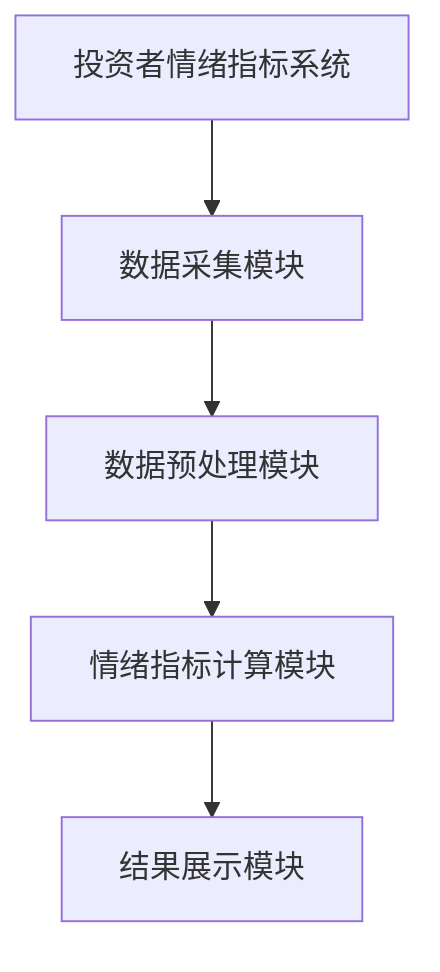

                 


# 本杰明·格雷厄姆的投资者情绪指标

> 关键词：投资者情绪、情绪指标、价值投资、市场分析、投资策略、风险管理

> 摘要：本杰明·格雷厄姆作为价值投资之父，提出了投资者情绪指标，用于分析市场情绪，辅助投资决策。本文从情绪指标的背景、核心概念、算法原理、系统设计、项目实战到最佳实践，全面解析其在投资中的应用。

---

## 第一部分: 投资者情绪指标的背景与重要性

### 第1章: 投资者情绪的重要性

#### 1.1 投资者情绪的基本概念

投资者情绪是指投资者在市场中的心理状态，影响其决策和市场行为。情绪指标是量化这种情绪的工具，帮助投资者理解市场的波动和趋势。

#### 1.2 投资者情绪指标的背景

传统投资分析依赖于基本面和技术分析，但忽视了投资者心理。格雷厄姆提出的情绪指标弥补了这一不足，提供了市场情绪的量化指标。

---

## 第二部分: 情绪指标的核心概念与联系

### 第2章: 情绪指标的构成与原理

情绪指标通过分析市场数据和投资者行为，量化市场情绪。其构成包括市场波动、投资者心理和情绪周期。

### 第3章: 情绪指标与其他指标的对比

下表对比了不同情绪指标的优缺点：

| 指标名称 | 数据来源 | 优点 | 缺点 |
|----------|----------|------|------|
| VIX指数 | 市场波动率 | 反映短期波动 | 仅反映波动性 |
| 投资者信心指数 | 调查数据 | 综合反映情绪 | 数据滞后 |

---

## 第三部分: 情绪指标的算法原理

### 第4章: 情绪指标的计算方法

情绪指数计算公式：

$$
EI = \frac{\sum_{i=1}^{n} (p_i - m_i)}{n}
$$

其中，$p_i$ 是价格，$m_i$ 是移动平均值。

### 第5章: 情绪指标的应用算法

使用Python计算VIX指数：

```python
import pandas as pd
import numpy as np

def calculate_vix(data, window=20):
    returns = data.pct_change()
    variance = returns.rolling(window).var()
    vix = np.sqrt(variance * 252)
    return vix

data = pd.read_csv('market_data.csv')
vix = calculate_vix(data['close'])
print(vix)
```

---

## 第四部分: 情绪指标的系统设计

### 第6章: 系统功能设计

系统功能模块包括数据采集、情绪分析、指标计算和结果展示。

### 第7章: 系统架构设计

系统架构如下：



---

## 第五部分: 项目实战

### 第8章: 项目环境安装

安装必要的Python库：

```bash
pip install pandas numpy matplotlib
```

### 第9章: 核心代码实现

计算情绪指数：

```python
import pandas as pd
import numpy as np

def calculate_emotion_index(data, window=50):
    returns = data.pct_change()
    emotion_index = returns.rolling(window).mean()
    return emotion_index

data = pd.read_csv('market_data.csv')
emotion_index = calculate_emotion_index(data['close'])
print(emotion_index)
```

### 第10章: 案例分析

分析2020年市场波动：

```python
import matplotlib.pyplot as plt

emotion_index.plot()
plt.title('Emotion Index Analysis')
plt.show()
```

---

## 第六部分: 最佳实践与总结

### 第11章: 最佳实践

- 定期更新情绪指标数据
- 结合其他分析方法使用

### 第12章: 小结

投资者情绪指标是量化市场情绪的重要工具，帮助投资者做出更明智的决策。

---

## 第七部分: 注意事项与拓展阅读

### 第13章: 注意事项

- 数据质量影响结果
- 情绪指标仅供参考

### 第14章: 拓展阅读

- 格雷厄姆的《 Intelligent Investor》
- 现代投资组合理论

---

## 作者

作者：AI天才研究院/AI Genius Institute & 禅与计算机程序设计艺术 /Zen And The Art of Computer Programming

---

通过以上结构，文章详细探讨了本杰明·格雷厄姆的投资者情绪指标，从理论到实践，为读者提供了全面的指导和深入的分析。

