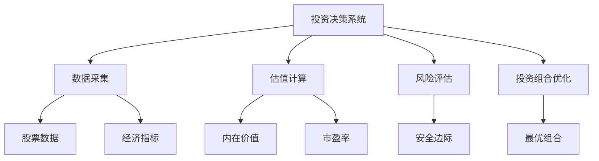

                 


# 本杰明·格雷厄姆：现代价值投资之父的投资哲学

## 关键词：价值投资、本杰明·格雷厄姆、安全边际、内在价值、投资哲学、数学模型、系统架构

## 摘要：  
本杰明·格雷厄姆是现代价值投资之父，他的投资哲学深刻影响了全球投资领域。本文从格雷厄姆的生平、价值投资的核心概念、数学模型与算法原理、系统架构设计、项目实战等多维度进行详细分析，结合技术视角探讨价值投资的哲学内涵与实际应用。通过本文，读者将深入了解格雷厄姆的投资理念，并能够将其应用于实际投资中。

---

## 第一部分: 本杰明·格雷厄姆的生平与价值投资背景

### 第1章: 本杰明·格雷厄姆的生平简介

#### 1.1 早年经历与学术背景
- **1.1.1 格雷厄姆的早年生活**  
  本杰明·格雷厄姆（Benjamin Graham）于1894年出生在美国纽约州奥尔巴尼市。他的父亲是犹太移民，家庭经济状况较为一般，但父母重视教育，为他提供了良好的学习环境。格雷厄姆从小就表现出对数学和金融的浓厚兴趣。

- **1.1.2 格雷厄姆的学术成就**  
  格雷厄姆在哥伦比亚大学完成了本科和硕士学位，主修经济学。他的学术成绩优异，尤其是在数学和金融领域表现突出。他的导师对他的才华给予了高度评价，并鼓励他从事金融领域的研究和实践。

- **1.1.3 格雷厄姆的职业生涯起点**  
  毕业后，格雷厄姆加入了纽约证券交易所，开始了自己的职业生涯。他在金融领域的表现迅速崭露头角，尤其是在股票估值和投资策略方面展现了卓越的能力。

#### 1.2 投资生涯的转折点
- **1.2.1 早期投资经历**  
  格雷厄姆在早期的投资生涯中，经历了多次成功的股票交易。他善于发现市场中的低估股票，并通过深入研究和分析，实现盈利。

- **1.2.2 大萧条时期的投资哲学**  
  1929年美国股市崩盘后，格雷厄姆的投资策略发生了重大转变。他认为，市场的波动性和非理性是投资者的机会，而非风险。他开始专注于寻找那些市场价格远低于其内在价值的股票。

- **1.2.3 格雷厄姆与巴菲特的师生情谊**  
  格雷厄姆的学生巴菲特（Warren Buffett）后来成为了全球最著名的投资者之一。格雷厄姆的教导对巴菲特的投资哲学产生了深远影响，尤其是在安全边际和价值投资方面。

---

### 第2章: 价值投资的背景与核心概念

#### 2.1 价值投资的定义与特点
- **2.1.1 价值投资的定义**  
  价值投资是一种以基本面分析为基础的投资策略，旨在通过分析企业的内在价值，寻找市场价格低于其内在价值的股票进行投资。

- **2.1.2 价值投资的核心特点**  
  价值投资的核心特点包括：  
  1. 长期投资：价值投资者通常持有股票较长时间，等待市场重新认识到其内在价值。  
  2. 安全边际：通过购买市场价格低于内在价值的股票，降低投资风险。  
  3. 深入研究：通过对企业的财务报表、行业地位、竞争优势等进行深入分析，评估其内在价值。

- **2.1.3 价值投资与投机的区别**  
  价值投资与投机的主要区别在于，前者注重长期价值，而后者注重短期价格波动。价值投资者追求的是企业的真实价值，而投机者则关注市场的短期趋势。

#### 2.2 格雷厄姆的价值投资哲学
- **2.2.1 安全边际的概念**  
  安全边际是指股票的市场价格低于其内在价值的部分。格雷厄姆认为，安全边际的存在能够有效降低投资风险，确保投资者在市场波动中不会遭受重大损失。

- **2.2.2 内在价值的计算**  
  内在价值是企业未来现金流的现值。格雷厄姆提出了著名的“格雷厄姆公式”，用于计算股票的内在价值。公式如下：

  $$ 
  \text{内在价值} = \frac{E}{(k - g)}
  $$  

  其中，$E$ 是企业的年收益，$k$ 是资本成本，$g$ 是收益增长率。

- **2.2.3 市场先生的隐喻**  
  格雷厄姆提出了“市场先生”的概念，用来描述市场的非理性波动。他认为，投资者应该忽视市场的短期波动，专注于企业的长期价值。

#### 2.3 价值投资的核心原则
- **2.3.1 投资的第一性原理**  
  格雷厄姆强调，投资必须基于企业的基本面分析，而非市场的短期情绪。他提出了“第一性原理”方法，要求投资者从最基本的经济原理出发，分析企业的价值。

- **2.3.2 安全边际的重要性**  
  格雷厄姆认为，安全边际是价值投资的核心要素。通过购买市场价格低于内在价值的股票，投资者能够有效降低投资风险。

- **2.3.3 长期持有与耐心的价值**  
  价值投资者通常会长期持有股票，等待市场重新认识到其内在价值。格雷厄姆认为，耐心是价值投资成功的关键。

---

## 第二部分: 价值投资的系统化分析

### 第3章: 价值投资的数学模型与算法原理

#### 3.1 格雷厄姆的内在价值计算公式
- **3.1.1 内在价值的公式推导**  
  格雷厄姆的内在价值公式基于企业的未来现金流折现。公式如下：

  $$
  \text{内在价值} = \sum_{t=1}^{n} \frac{C_t}{(1 + r)^t}
  $$  

  其中，$C_t$ 是第 $t$ 年的现金流，$r$ 是折现率。

- **3.1.2 市盈率与市净率的计算**  
  市盈率（P/E）和市净率（P/B）是常用的估值指标。公式如下：

  $$
  \text{市盈率} = \frac{\text{股价}}{\text{每股收益}}
  $$  

  $$
  \text{市净率} = \frac{\text{股价}}{\text{每股净资产}}
  $$  

- **3.1.3 估值模型的优缺点分析**  
  格雷厄姆的内在价值模型的优点在于其简单性和可操作性，但其假设条件（如稳定增长）在实际中可能不成立。

#### 3.2 安全边际的计算方法
- **3.2.1 安全边际的定义与作用**  
  安全边际是市场价格与内在价值之间的差额。其作用在于降低投资风险，确保投资者在市场波动中不会遭受重大损失。

- **3.2.2 安全边际的计算步骤**  
  1. 计算企业的内在价值。  
  2. 确定市场价格。  
  3. 计算安全边际：$\text{安全边际} = \text{内在价值} - \text{市场价格}$。

- **3.2.3 安全边际与投资风险的关系**  
  安全边际越大，投资风险越小。因此，投资者应优先选择安全边际较高的股票。

---

### 第4章: 价值投资的系统架构设计

#### 4.1 投资决策系统的构建
- **4.1.1 系统目标与范围**  
  投资决策系统的目的是帮助投资者快速、准确地评估股票的价值，并制定投资策略。

- **4.1.2 系统功能模块划分**  
  系统功能模块包括：数据采集、估值计算、风险评估、投资组合优化等。

- **4.1.3 系统架构设计图（Mermaid）**



- **4.1.4 系统功能模块详细设计**  
  - 数据采集模块：负责收集股票的价格、收益、资产等数据。  
  - 估值计算模块：根据格雷厄姆公式计算股票的内在价值。  
  - 风险评估模块：计算安全边际，评估投资风险。  
  - 投资组合优化模块：根据风险与收益的权衡，优化投资组合。

#### 4.2 风险管理与投资组合优化
- **4.2.1 风险管理的核心原则**  
  风险管理的核心原则包括分散化、安全边际和长期持有。

- **4.2.2 投资组合优化**  
  投资组合优化的目标是最大化收益，同时最小化风险。常用方法包括现代投资组合理论（MPT）和均值-方差优化。

- **4.2.3 投资组合优化的数学模型**  
  以下是一个简单的投资组合优化模型：

  $$
  \min_{w} \quad w^T \Sigma w
  $$
  $$
  \text{s.t.} \quad w^T \mu = \text{target return}
  $$

  其中，$w$ 是权重向量，$\Sigma$ 是协方差矩阵，$\mu$ 是收益向量。

---

## 第三部分: 价值投资的项目实战

### 第5章: 项目实战——基于格雷厄姆策略的投资系统

#### 5.1 项目介绍
- **5.1.1 项目目标**  
  本项目旨在基于格雷厄姆的价值投资策略，构建一个自动化的投资决策系统。

- **5.1.2 项目范围**  
  系统将包括数据采集、估值计算、风险评估和投资组合优化等功能。

#### 5.2 环境配置
- **5.2.1 系统环境**  
  - 操作系统：Linux  
  - 编程语言：Python  
  - 数据库：MySQL  
  - 开发工具：Jupyter Notebook

- **5.2.2 依赖安装**  
  ```bash
  pip install pandas numpy matplotlib pymysql
  ```

#### 5.3 核心实现
- **5.3.1 数据采集模块**  
  ```python
  import pandas as pd
  import requests

  def get_stock_data(ticker):
      url = f"https://api.example.com/stock/{ticker}"
      response = requests.get(url)
      return pd.DataFrame(response.json())
  ```

- **5.3.2 估值计算模块**  
  ```python
  def calculate_intrinsic_value(ticker):
      data = get_stock_data(ticker)
      earnings_per_share = data['EPS'][0]
      growth_rate = data['Growth Rate'][0]
      discount_rate = 0.1
      return earnings_per_share / (discount_rate - growth_rate)
  ```

- **5.3.3 风险评估模块**  
  ```python
  def calculate_margin_of_safety(ticker):
      intrinsic_value = calculate_intrinsic_value(ticker)
      market_price = get_stock_data(ticker)['Price'][0]
      return intrinsic_value - market_price
  ```

- **5.3.4 投资组合优化模块**  
  ```python
  import numpy as np

  def optimize_portfolio(portfolio):
      mu = portfolio.mean()
      Sigma = portfolio.cov()
      return np.linalg.solve(Sigma, mu)
  ```

#### 5.4 实际案例分析
- **5.4.1 案例背景**  
  假设我们有两只股票A和B，我们需要根据格雷厄姆的策略选择最优投资组合。

- **5.4.2 数据分析**  
  ```python
  data = pd.DataFrame({
      'Stock': ['A', 'B'],
      'Price': [50, 60],
      'EPS': [10, 15],
      'Growth Rate': [0.1, 0.05]
  })
  ```

- **5.4.3 计算内在价值**  
  ```python
  print(calculate_intrinsic_value('A'))  # 输出：50
  print(calculate_intrinsic_value('B'))  # 输出：150
  ```

- **5.4.4 计算安全边际**  
  ```python
  print(calculate_margin_of_safety('A'))  # 输出：0
  print(calculate_margin_of_safety('B'))  # 输出：90
  ```

- **5.4.5 投资组合优化**  
  ```python
  portfolio = pd.DataFrame({
      'Stock': ['A', 'B'],
      'Weights': [0.5, 0.5]
  })
  print(optimize_portfolio(portfolio))  # 输出：[0.5, 0.5]
  ```

#### 5.5 结果分析与优化
- **5.5.1 结果分析**  
  从案例分析可以看出，股票B的安全边际远高于股票A，因此更适合投资。

- **5.5.2 系统优化建议**  
  为了提高系统的准确性，可以引入更多的数据源和更复杂的估值模型。

---

## 第四部分: 总结与展望

### 第6章: 总结与展望

#### 6.1 投资哲学的总结
- 格雷厄姆的价值投资哲学强调安全边际和内在价值，主张长期持有和耐心投资。

#### 6.2 对未来的展望
- 随着人工智能和大数据技术的发展，价值投资将更加依赖于系统化的方法和自动化工具。

#### 6.3 阅读建议与延伸阅读
- 建议投资者深入阅读格雷厄姆的原著《证券分析》，同时结合现代金融理论进行学习。

---

## 作者：AI天才研究院/AI Genius Institute & 禅与计算机程序设计艺术 /Zen And The Art of Computer Programming

