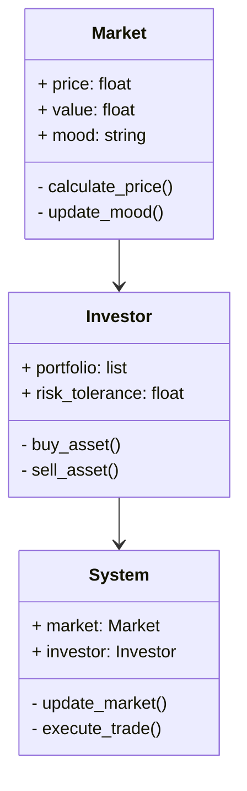
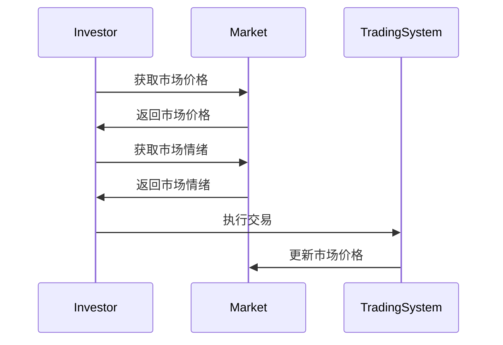

                 


# 本杰明格雷厄姆的市场先生概念

## 关键词：市场先生，投资理论，价值投资，市场波动，投资者情绪

## 摘要：本杰明·格雷厄姆的市场先生概念是一个经典的比喻，用于解释市场情绪如何影响股票价格。市场先生代表了市场中的波动性和不确定性，帮助投资者理解在市场中如何保持理性，避免情绪化决策。本文将从市场先生的概念出发，探讨其在投资理论中的应用，分析其与价值投资的关系，并通过系统设计和项目实战，展示如何利用市场先生的概念优化投资策略。

---

# 第一部分：市场先生概念的背景与基础

## 第1章：市场先生概念的背景与重要性

### 1.1 本杰明·格雷厄姆的市场先生概念概述

#### 1.1.1 本杰明·格雷厄姆的生平与投资理念

本杰明·格雷厄姆（Benjamin Graham）是20世纪最伟大的投资思想家之一，被誉为“价值投资之父”。他提出了许多经典的投资理念，其中最著名的便是市场先生概念。格雷厄姆的投资理念强调安全边际、长期价值和理性分析，这些理念对现代投资理论产生了深远影响。

#### 1.1.2 市场先生概念的提出背景

市场先生概念是格雷厄姆为解释市场波动性和投资者情绪而提出的。他认为，市场不仅仅是一个价格发现机制，更是一个反映投资者情绪的场所。市场先生代表了市场的波动性和不确定性，投资者需要理解市场先生的行为，以便做出更理性的投资决策。

#### 1.1.3 市场先生概念的核心意义与应用价值

市场先生概念的核心意义在于将市场波动性与投资者情绪联系起来，强调投资者应避免被市场情绪左右，而是应关注企业的长期价值。这一概念为投资者提供了一种新的视角，帮助他们在市场波动中保持冷静，做出理性的决策。

### 1.2 投资者与市场波动的关系

#### 1.2.1 投资者情绪对市场波动的影响

投资者情绪是市场波动的重要驱动力。当市场情绪高涨时，投资者倾向于高估资产价值；当市场情绪低落时，投资者倾向于低估资产价值。这种情绪波动导致市场价格与实际价值出现偏差。

#### 1.2.2 市场先生概念如何解释市场波动

市场先生通过情绪波动影响市场价格。当市场先生情绪高涨时，市场价格被推高；当市场先生情绪低落时，市场价格被压低。这种波动性为价值投资者提供了机会，使他们能够在市场低估时买入优质资产，在市场高估时卖出。

#### 1.2.3 市场先生与价值投资的结合

价值投资的核心理念是关注企业的实际价值，而不是市场的短期波动。市场先生概念为价值投资提供了理论支持，强调投资者应关注企业的内在价值，而不是被市场情绪左右。

---

## 第2章：市场先生概念的核心要素与结构

### 2.1 市场先生概念的定义与特征

#### 2.1.1 市场先生的定义

市场先生是格雷厄姆提出的比喻，代表市场的波动性和不确定性。市场先生通过情绪波动影响市场价格，使市场价格与实际价值出现偏差。

#### 2.1.2 市场先生的核心属性

- 情绪波动性：市场先生的情绪会随着市场环境的变化而波动。
- 价格影响性：市场先生的情绪波动直接影响市场价格。
- 时间依赖性：市场先生的情绪波动是短期的，而实际价值是长期的。

#### 2.1.3 市场先生与其他投资概念的对比

- 与基本面分析的对比：市场先生概念关注市场情绪，而基本面分析关注企业的实际价值。
- 与技术分析的对比：市场先生概念关注市场整体波动，而技术分析关注价格和成交量的变化。

### 2.2 市场先生概念的结构分析

#### 2.2.1 市场先生的三要素模型

- 市场情绪：市场先生的情绪波动影响市场价格。
- 市场价格：市场价格受市场情绪的影响。
- 实际价值：企业的实际价值是市场波动的基础。

#### 2.2.2 市场先生的动态变化机制

市场先生的情绪波动是动态变化的，随着时间的推移，市场情绪会从乐观变为悲观，再从悲观变为乐观。这种动态变化为投资者提供了在市场低估时买入、在市场高估时卖出的机会。

#### 2.2.3 市场先生与投资决策的关系

市场先生的概念帮助投资者理解市场波动性，避免情绪化决策。投资者应关注企业的实际价值，而不是被市场情绪左右。

---

## 第3章：市场先生概念的数学模型与公式

### 3.1 市场先生概念的数学表达

#### 3.1.1 市场波动的数学模型

市场波动可以用随机过程来描述。以下是常用的随机游走模型：

$$
P_{t+1} = P_t + \epsilon_t
$$

其中，$P_t$ 表示第 $t$ 时刻的价格，$\epsilon_t$ 是随机误差项。

#### 3.1.2 市场先生的量化分析公式

市场先生的情绪波动可以用以下公式量化：

$$
\text{情绪指数} = \frac{\text{市场价格} - \text{实际价值}}{\text{实际价值}}
$$

#### 3.1.3 市场先生与投资组合的关系

投资组合的预期收益可以用以下公式计算：

$$
E[R] = \alpha \times R_m + \beta \times (R_m - R_f)
$$

其中，$R_m$ 是市场收益，$R_f$ 是无风险收益，$\beta$ 是投资组合的贝塔系数，$\alpha$ 是投资组合的超额收益。

### 3.2 市场先生的数学公式推导

#### 3.2.1 市场波动的方差公式

市场波动的方差可以用以下公式计算：

$$
\text{方差} = E[(P - \mu)^2]
$$

其中，$P$ 是市场价格，$\mu$ 是市场价格的期望值。

#### 3.2.2 市场先生的预期收益计算

市场先生的预期收益可以用以下公式计算：

$$
E[R] = \sum P_i \times R_i
$$

其中，$P_i$ 是第 $i$ 种情况的概率，$R_i$ 是第 $i$ 种情况的收益。

#### 3.2.3 投资组合的风险调整收益模型

投资组合的风险调整收益可以用夏普比率来衡量：

$$
\text{夏普比率} = \frac{E[R_p - R_f]}{\sigma_p}
$$

其中，$R_p$ 是投资组合的收益，$R_f$ 是无风险收益，$\sigma_p$ 是投资组合收益的标准差。

---

## 第4章：市场先生概念的系统架构设计

### 4.1 系统分析与设计

#### 4.1.1 问题场景介绍

在投资决策中，投资者需要考虑市场波动性和实际价值。市场先生概念提供了一种新的视角，帮助投资者理解市场波动性。

#### 4.1.2 系统功能设计（领域模型Mermaid类图）



#### 4.1.3 系统架构设计（Mermaid架构图）


#### 4.1.4 系统接口设计

系统接口包括：

- 获取市场价格
- 获取市场情绪
- 执行交易

#### 4.1.5 系统交互流程（Mermaid序列图）



---

## 第5章：市场先生概念的项目实战

### 5.1 环境安装

要实现市场先生概念的系统，需要安装以下工具：

- Python编程语言
- 数据库（如MySQL）
- 数据可视化工具（如Matplotlib）

### 5.2 核心代码实现

以下是实现市场先生概念的Python代码：

```python
class Market:
    def __init__(self):
        self.price = 100.0
        self.value = 80.0
        self.mood = "neutral"

    def calculate_price(self):
        if self.mood == "happy":
            self.price = self.value * 1.2
        elif self.mood == "sad":
            self.price = self.value * 0.8
        return self.price

    def update_mood(self, mood):
        self.mood = mood

class Investor:
    def __init__(self):
        self.portfolio = []
        self.risk_tolerance = 0.1

    def buy_asset(self, asset, quantity):
        self.portfolio.append((asset, quantity))

    def sell_asset(self, asset, quantity):
        self.portfolio.remove((asset, quantity))

# 实例化市场和投资者
market = Market()
investor = Investor()

# 更新市场情绪
market.update_mood("happy")

# 获取市场价格
print(market.calculate_price())  # 输出：120.0

# 投资者买入资产
investor.buy_asset("stock", 10)
```

### 5.3 代码应用解读与分析

上述代码实现了市场和投资者的交互。市场根据情绪调整价格，投资者根据市场信号进行交易。通过这种方式，可以模拟市场波动和投资者行为。

### 5.4 实际案例分析

假设市场价值为100，市场情绪为“happy”，市场价格被推高到120。投资者根据市场价格和市场情绪进行交易，买入资产。当市场情绪变为“sad”时，市场价格下降到80，投资者可以选择卖出资产。

### 5.5 项目小结

通过项目实战，我们可以看到市场先生概念在实际投资中的应用。市场情绪影响市场价格，投资者需要根据市场价格和市场情绪做出理性决策。

---

## 第6章：总结与展望

### 6.1 市场先生概念的总结

市场先生概念帮助投资者理解市场波动性，避免情绪化决策。投资者应关注企业的实际价值，而不是被市场情绪左右。

### 6.2 未来展望

未来，市场先生概念可以与人工智能和大数据技术结合，进一步优化投资策略。通过分析市场情绪和市场数据，投资者可以做出更精准的投资决策。

### 6.3 最佳实践 tips

- 保持理性，避免情绪化决策。
- 关注企业的实际价值，而不是市场价格。
- 分散投资，降低风险。

### 6.4 小结

市场先生概念是一个经典的比喻，帮助投资者理解市场波动性和投资者情绪。通过系统设计和项目实战，我们可以更好地应用市场先生的概念，优化投资策略。

---

## 作者：AI天才研究院/AI Genius Institute & 禅与计算机程序设计艺术 /Zen And The Art of Computer Programming

