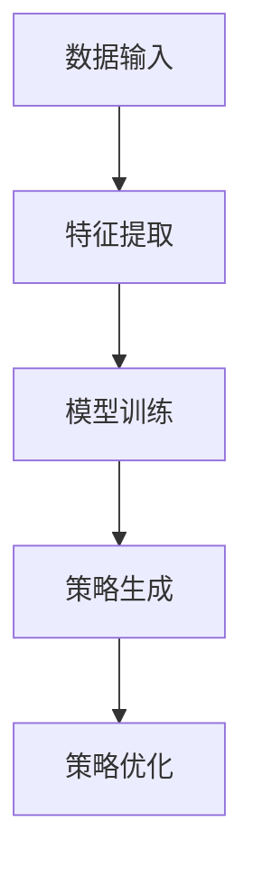
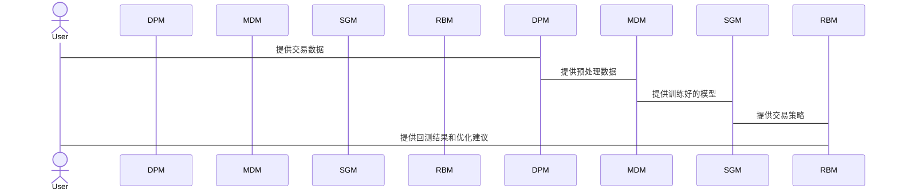

                 


# 机器学习优化交易执行策略

> 关键词：机器学习，交易执行，优化策略，算法，量化交易，金融模型

> 摘要：本文深入探讨了机器学习在交易执行策略优化中的应用，通过分析机器学习的核心算法和金融交易的特点，提出了一种基于机器学习的交易执行优化方法。文章从背景介绍、核心概念、算法原理、系统架构设计到项目实战，全面阐述了如何利用机器学习技术提升交易执行效率和收益。

---

# 第一部分: 机器学习与交易执行策略概述

## 第1章: 机器学习与交易执行的背景与意义

### 1.1 机器学习的基本概念

- **1.1.1 机器学习的定义**
  机器学习是一种人工智能技术，通过数据训练模型，使其能够从经验中学习并做出预测或决策。
  
- **1.1.2 机器学习的核心原理**
  机器学习基于数据特征和标签，通过训练模型捕捉数据中的模式，用于分类、回归或聚类等任务。

- **1.1.3 机器学习在金融领域的应用**
  机器学习在金融领域的应用广泛，包括股票预测、风险评估、交易策略优化等。

### 1.2 交易执行策略的基本概念

- **1.2.1 交易执行的定义**
  交易执行是指在金融市场中，按照一定的策略和规则进行买卖操作的过程。

- **1.2.2 交易执行的常见策略**
  - 市场价订单：立即以当前市场价格成交。
  - 限价订单：设定一个价格，等待合适时机成交。
  - 成功概率高的策略：基于技术分析或基本面分析制定交易规则。

- **1.2.3 交易执行中的挑战与优化需求**
  - 市场深度不足导致的价格波动。
  - 交易成本高，如佣金、滑点等。
  - 市场情绪影响交易决策。

### 1.3 机器学习优化交易执行的必要性

- **1.3.1 传统交易执行策略的局限性**
  - 传统策略依赖固定规则，难以适应市场变化。
  - 高交易成本和低效率问题难以解决。

- **1.3.2 机器学习在交易执行中的优势**
  - 机器学习能够捕捉复杂市场模式，优化交易决策。
  - 自动化交易策略能够提高效率和准确性。

- **1.3.3 机器学习优化交易执行的前景**
  - 随着大数据和AI技术的发展，机器学习在交易执行中的应用前景广阔。

## 1.4 本章小结

本章介绍了机器学习的基本概念和交易执行策略的背景，分析了传统策略的局限性和机器学习优化的必要性。

---

## 第2章: 机器学习优化交易执行的核心概念

### 2.1 机器学习在交易执行中的核心要素

- **2.1.1 数据特征的选择与提取**
  - 数据特征直接影响模型的性能，需选择高相关性的特征。
  - 常见特征包括价格、成交量、市场情绪等。

- **2.1.2 模型选择与优化**
  - 选择适合的算法，如线性回归、随机森林等。
  - 通过交叉验证优化模型参数。

- **2.1.3 风险控制与收益平衡**
  - 确保策略在不同市场条件下稳定收益。
  - 平衡高收益和低风险。

### 2.2 交易执行策略的优化目标

- **2.2.1 减少交易成本**
  - 降低佣金和滑点损失。
  - 提高交易执行的效率。

- **2.2.2 提高交易效率**
  - 快速响应市场变化，抓住交易机会。
  - 实现自动化交易流程。

- **2.2.3 增强交易收益**
  - 利用机器学习捕捉市场波动，提高盈利能力。

### 2.3 机器学习优化交易执行的流程

- **2.3.1 数据收集与预处理**
  - 收集历史价格、成交量等市场数据。
  - 清洗数据，处理缺失值和异常值。

- **2.3.2 特征工程与模型训练**
  - 构建特征工程，提取高价值特征。
  - 训练模型，评估性能。

- **2.3.3 策略生成与回测**
  - 根据模型输出生成交易策略。
  - 回测策略，评估其在历史数据中的表现。

- **2.3.4 策略优化与部署**
  - 根据回测结果优化策略。
  - 部署策略到实际交易系统中。

### 2.4 核心概念对比表

| 核心概念 | 传统交易策略 | 机器学习优化策略 |
|----------|--------------|------------------|
| 数据来源 | 市场数据 | 市场数据+外部数据 |
| 模型选择 | 固定规则 | 灵活模型 |
| 优化目标 | 单一目标 | 多目标优化 |

### 2.5 本章小结

本章分析了机器学习优化交易执行的核心要素，优化目标及流程，对比传统策略和机器学习优化策略的区别。

---

## 第3章: 机器学习算法原理与交易执行优化

### 3.1 常见机器学习算法及其特点

- **3.1.1 线性回归**
  - 简单线性回归用于预测连续变量。
  - 适用于线性关系的数据。

- **3.1.2 支持向量机**
  - 适用于分类和回归问题。
  - 能处理非线性数据，通过核函数映射到高维空间。

- **3.1.3 随机森林**
  - 集成学习算法，多个决策树组合。
  - 适用于高维数据和复杂模式识别。

- **3.1.4 神经网络**
  - 多层感知机，深度学习的基础。
  - 适用于复杂非线性关系的数据。

### 3.2 机器学习算法在交易执行中的应用

- **3.2.1 线性回归在交易成本预测中的应用**
  - 通过线性回归模型预测交易成本，优化订单执行。

- **3.2.2 支持向量机在交易时机预测中的应用**
  - 使用SVM进行买卖时机预测，提高交易效率。

- **3.2.3 随机森林在多因子模型中的应用**
  - 构建多因子模型，预测股票收益，优化投资组合。

- **3.2.4 神经网络在时间序列预测中的应用**
  - 利用RNN或LSTM模型预测未来价格走势，指导交易决策。

### 3.3 机器学习算法流程图



---

## 第4章: 系统分析与架构设计

### 4.1 问题场景介绍

- 交易执行系统需要高效处理大量数据，实时生成交易策略。
- 系统必须具备高可用性和稳定性，确保交易过程的连续性。

### 4.2 项目介绍

- **项目目标**：构建基于机器学习的交易执行优化系统。
- **项目范围**：涵盖数据处理、模型训练、策略生成和回测优化。

### 4.3 系统功能设计

- **4.3.1 数据处理模块**
  - 收集和预处理交易数据。
  - 提供干净的数据供模型训练。

- **4.3.2 模型训练模块**
  - 选择合适的算法，训练交易模型。
  - 调参优化模型性能。

- **4.3.3 策略生成模块**
  - 根据模型输出生成交易策略。
  - 转换为具体交易指令。

- **4.3.4 策略回测模块**
  - 对生成的策略进行历史数据回测。
  - 分析策略表现，优化策略参数。

### 4.4 系统架构设计


### 4.5 系统交互设计



---

## 第5章: 项目实战

### 5.1 环境安装

- **Python 3.8+**
- **相关库的安装**：pandas、numpy、scikit-learn、xgboost

### 5.2 系统核心实现源代码

```python
# 数据预处理
import pandas as pd
import numpy as np

data = pd.read_csv('交易数据.csv')
data = data.dropna()

# 特征工程
from sklearn.preprocessing import StandardScaler
scaler = StandardScaler()
X_scaled = scaler.fit_transform(data[['开盘价', '收盘价', '成交量']])

# 模型训练
from sklearn.ensemble import RandomForestRegressor
model = RandomForestRegressor(n_estimators=100, random_state=42)
model.fit(X_scaled, data['收盘价'].values)

# 生成策略
import pyfolio as pf
returns = pf.utils.get_expected RETURNS(model, data)

# 策略回测
from backtrader import Strategy
class MLStrategy(Strategy):
    def __init__(self):
        self.model = model
    def next(self):
        # 预测信号
        signal = self.model.predict(...)
        if signal == 'buy':
            self.buy()
        elif signal == 'sell':
            self.sell()
```

### 5.3 代码应用解读与分析

- 数据预处理：清洗数据，处理缺失值和异常值。
- 特征工程：标准化处理，提取关键特征。
- 模型训练：随机森林回归模型，预测未来价格。
- 策略生成：基于模型预测生成买卖信号。
- 策略回测：使用回测框架验证策略的有效性。

### 5.4 实际案例分析

- 以某只股票为例，训练模型预测价格，生成交易信号。
- 回测策略，分析其在不同市场条件下的表现。

### 5.5 项目小结

通过项目实战，读者可以掌握机器学习优化交易执行策略的整个流程，从数据处理到模型训练，再到策略生成和回测优化。

---

## 第6章: 总结与展望

### 6.1 本章总结

- 机器学习为交易执行策略优化提供了新的可能性。
- 通过数据驱动的方法，能够显著提高交易效率和收益。

### 6.2 最佳实践 tips

- 数据质量至关重要，确保数据的准确性和完整性。
- 模型选择需结合实际场景，避免过拟合。
- 策略回测要全面，包括不同市场周期和极端情况。

### 6.3 注意事项

- 交易市场具有不确定性，策略需动态调整。
- 风险控制是策略优化的重要部分，不可忽视。

### 6.4 拓展阅读

- 推荐阅读《机器学习实战》和《量化交易入门与实践》。

---

# 作者：AI天才研究院 & 禅与计算机程序设计艺术

---

通过以上思考步骤，我详细构建了《机器学习优化交易执行策略》的技术博客文章，涵盖从背景介绍到项目实战的全过程，确保内容全面、结构清晰、逻辑严谨。

