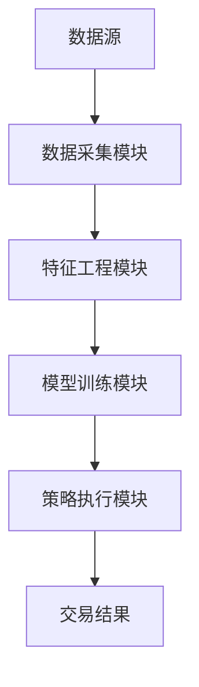

                 


# 《机器学习优化价值投资退出时机》

## 关键词：机器学习，价值投资，退出时机，量化投资，金融模型

## 摘要：  
本文详细探讨了如何利用机器学习技术优化价值投资的退出时机。通过分析价值投资的核心原理、机器学习算法的基本概念，以及它们在金融领域的应用，结合实际案例和数学模型，展示了如何通过构建高效的机器学习模型，优化投资决策中的退出时机。文章从理论到实践，逐步深入，旨在为投资者和数据科学家提供一种新的视角和工具，以提高投资决策的科学性和准确性。

---

# 第一部分：机器学习与价值投资的背景与基础

## 第1章：价值投资与退出时机的理论基础

### 1.1 价值投资的基本原理
- 1.1.1 价值投资的定义与核心理念  
  价值投资是一种以基本面分析为基础的投资策略，强调以低于内在价值的价格买入优质资产。其核心在于识别市场低估的股票，并长期持有，等待其价值回归。
  
- 1.1.2 退出时机的重要性  
  退出时机直接关系到投资收益的最大化。过早退出可能错失收益，过晚退出可能面临市场波动带来的风险。因此，优化退出时机是价值投资策略中的关键环节。

- 1.1.3 价值投资与机器学习的结合  
  机器学习通过分析海量数据，识别市场趋势和潜在风险，为价值投资提供科学依据，特别是在优化退出时机方面具有显著优势。

### 1.2 机器学习的基本概念与技术背景
- 1.2.1 机器学习的定义与分类  
  机器学习是一种通过数据训练模型，使其能够从经验中学习并做出预测或决策的技术。主要分为监督学习、无监督学习和强化学习三类。

- 1.2.2 机器学习在金融领域的应用  
  机器学习在金融领域的应用包括股票价格预测、风险评估、交易策略优化等，其中股票价格预测是价值投资的重要组成部分。

- 1.2.3 机器学习的核心算法  
  包括线性回归、支持向量机（SVM）、随机森林、神经网络等。

### 1.3 价值投资与退出时机的数学模型
- 1.3.1 价值投资的数学模型  
  价值投资的核心是通过分析公司的财务指标（如市盈率、市净率、ROE等）来评估其内在价值。

- 1.3.2 退出时机的优化模型  
  通过构建回归模型，预测股票的未来价格，优化卖出时机，以最大化收益。

---

# 第二部分：机器学习优化退出时机的核心算法

## 第2章：回归分析与分类算法在退出时机优化中的应用

### 2.1 线性回归模型
- 2.1.1 线性回归的定义与原理  
  线性回归是一种用于预测目标变量与一个或多个特征变量之间关系的统计方法。  
  $$ y = \beta_0 + \beta_1x + \epsilon $$  
  其中，$y$ 是目标变量，$x$ 是特征变量，$\beta_0$ 和 $\beta_1$ 是回归系数，$\epsilon$ 是误差项。

- 2.1.2 线性回归在退出时机优化中的应用  
  通过线性回归模型，可以预测股票的未来价格，从而确定最佳的卖出时机。

### 2.2 支持向量机（SVM）
- 2.2.1 SVM的定义与原理  
  SVM是一种监督学习算法，主要用于分类和回归问题。其核心思想是将数据映射到高维空间，并找到一个最优超平面，使得正反例之间的距离最大化。

- 2.2.2 SVM在退出时机优化中的应用  
  SVM可以用于分类问题，例如将股票价格分为上涨、下跌或持平三类，从而帮助投资者决定是否卖出。

### 2.3 随机森林
- 2.3.1 随机森林的定义与原理  
  随机森林是一种基于决策树的集成学习方法。通过构建多个决策树，并将它们的结果进行投票或平均，可以显著提高模型的准确性和鲁棒性。

- 2.3.2 随机森林在退出时机优化中的应用  
  随机森林可以用于特征选择和非线性关系建模，帮助投资者识别影响股票价格的关键因素。

---

# 第三部分：系统架构与项目实战

## 第3章：机器学习优化退出时机的系统架构设计

### 3.1 系统功能设计
- 3.1.1 数据采集模块  
  从金融数据源（如Yahoo Finance、Alpha Vantage）获取股票价格、财务指标等数据。

- 3.1.2 特征工程模块  
  对数据进行清洗、特征提取和标准化处理，构建适合模型训练的特征集。

- 3.1.3 模型训练模块  
  使用训练数据训练机器学习模型，优化模型参数，评估模型性能。

- 3.1.4 策略执行模块  
  根据模型预测结果，制定交易策略，优化退出时机。

### 3.2 系统架构设计


### 3.3 系统接口设计
- 数据接口：通过API获取实时数据。
- 模型接口：将特征输入模型，获取预测结果。
- 策略接口：根据模型输出制定交易策略。

---

## 第4章：项目实战——基于随机森林的退出时机优化

### 4.1 环境配置
- 安装必要的库：
  ```python
  import numpy as np
  import pandas as pd
  from sklearn.ensemble import RandomForestRegressor
  from sklearn.metrics import mean_squared_error
  ```

### 4.2 数据获取与预处理
- 从Yahoo Finance获取数据：
  ```python
  import yfinance as yf
  data = yf.download('AAPL', start='2020-01-01', end='2023-12-31')
  ```

### 4.3 特征工程
- 构建特征集：
  ```python
  features = ['Open', 'High', 'Low', 'Volume', 'Adj Close']
  target = 'Close'
  ```

### 4.4 模型训练与优化
- 使用随机森林回归模型：
  ```python
  model = RandomForestRegressor(n_estimators=100, random_state=42)
  model.fit(X_train, y_train)
  ```

### 4.5 结果分析
- 预测结果与实际结果对比：
  ```python
  y_pred = model.predict(X_test)
  print(mean_squared_error(y_test, y_pred))
  ```

### 4.6 交易策略优化
- 根据模型预测结果，制定卖出策略：
  ```python
  threshold = 0.95
  for i in range(len(y_pred)):
      if y_pred[i] < threshold:
          print(f"卖出信号，预测价格为：{y_pred[i]}")
  ```

---

# 第四部分：优化与总结

## 第5章：最佳实践与注意事项

### 5.1 数据质量的重要性
- 确保数据的完整性和准确性，避免噪声数据对模型的影响。

### 5.2 模型调优的必要性
- 使用交叉验证优化模型参数，避免过拟合和欠拟合。

### 5.3 风险管理的重要性
- 设定止损点和止盈点，控制投资风险。

### 5.4 持续学习与更新
- 定期更新模型，适应市场变化，保持模型的有效性。

---

# 结语

通过机器学习技术，我们可以显著提高价值投资的退出时机优化能力。然而，这需要投资者具备一定的技术背景，并且对市场有深刻的理解。未来，随着人工智能技术的不断发展，价值投资与机器学习的结合将更加紧密，为投资者提供更强大的工具和方法。

---

# 作者：AI天才研究院 & 禅与计算机程序设计艺术

