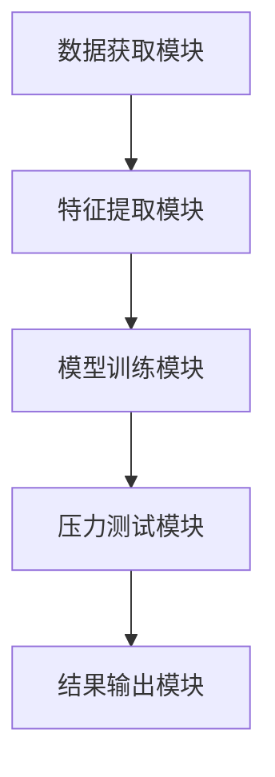

                 


# 机器学习优化投资组合压力测试

## 关键词：机器学习，投资组合优化，压力测试，金融风险管理，随机森林，支持向量机，数学建模

## 摘要：  
本文详细探讨了如何利用机器学习技术优化投资组合的压力测试过程。传统压力测试方法依赖于假设情景，而机器学习通过分析海量历史数据和市场动态，能够更准确地预测极端市场条件下的投资组合表现。本文从背景、核心概念、算法原理、系统架构到项目实战，全面解析机器学习在投资组合压力测试中的应用，并通过具体案例展示其优势和实际效果。文章还探讨了如何结合随机森林和支持向量机等算法，构建高效的压力测试模型，并提供了一套完整的系统架构设计方案和代码实现。

---

## 第1章：引言

### 1.1 背景介绍

#### 1.1.1 投资组合管理的基本概念
投资组合管理是金融领域的重要组成部分，旨在通过科学的资产配置和风险管理，实现投资目标的最大化。投资组合的价值受到市场波动、经济周期和政策变化等多种因素的影响。

#### 1.1.2 压力测试的定义与作用
压力测试是一种评估投资组合在极端市场条件下的表现的方法，帮助投资者了解潜在风险并制定应对策略。传统的压力测试通常基于假设情景，如市场崩盘、流动性危机等，但这种方法存在灵活性不足、难以捕捉非线性关系的缺点。

#### 1.1.3 机器学习在金融领域的应用
机器学习通过分析大量历史数据，能够发现传统统计方法难以捕捉的模式和关系。在投资组合优化和风险管理领域，机器学习展现出独特的优势，尤其是在处理复杂、非线性问题时表现突出。

---

### 1.2 机器学习优化压力测试的核心目标

#### 1.2.1 提高压力测试的准确性
通过机器学习模型，可以更准确地预测投资组合在极端条件下的表现。

#### 1.2.2 实现自动化与实时性
机器学习模型能够快速处理大量数据，实现实时压力测试和动态风险管理。

#### 1.2.3 提供更灵活的测试情景
与传统压力测试不同，机器学习可以根据市场动态自动生成多样化的测试情景。

---

## 第2章：核心概念与联系

### 2.1 机器学习在压力测试中的应用领域

#### 2.1.1 股票价格预测
通过机器学习模型预测股票价格的波动，帮助投资者评估投资组合的风险。

#### 2.1.2 风险评估与管理
利用机器学习算法识别市场风险因素，优化投资组合的配置。

#### 2.1.3 压力测试场景模拟
基于历史数据和市场动态，生成多种极端市场情景，模拟投资组合的表现。

---

### 2.2 投资组合优化的数学模型

#### 2.2.1 投资组合优化的基本数学模型
投资组合优化的目标是最大化收益或最小化风险。常见的优化模型包括均值-方差优化和风险中性优化。

$$
\text{目标函数：} \quad \min_w \sigma^2(w) \quad \text{或} \quad \max_w \mu(w)
$$

其中，\( w \) 是投资权重向量，\( \mu(w) \) 是收益，\( \sigma^2(w) \) 是风险。

#### 2.2.2 压力测试的数学表达
压力测试可以看作是一种特殊情景下的优化问题，目标是在极端市场条件下评估投资组合的表现。

$$
\text{压力测试目标：} \quad \min_w \text{损失}(w, s) \quad \text{或} \quad \max_w \text{收益}(w, s)
$$

其中，\( s \) 是压力情景。

---

## 第3章：常用机器学习算法及其在压力测试中的应用

### 3.1 随机森林

#### 3.1.1 随机森林的算法原理
随机森林是一种基于决策树的集成学习算法，通过构建多棵决策树并进行投票或平均来提高预测的准确性和稳定性。

$$
\text{随机森林的预测概率：} \quad P(y|x) = \frac{1}{n} \sum_{i=1}^{n} H_i(x)
$$

其中，\( H_i(x) \) 是第 \( i \) 棵决策树的预测结果。

#### 3.1.2 随机森林在压力测试中的应用
随机森林可以用于预测股票价格的波动性和评估投资组合的风险。

---

### 3.2 支持向量机（SVM）

#### 3.2.1 支持向量机的算法原理
SVM 是一种监督学习算法，通过构建超平面将数据点分到不同的类别中。在非线性问题中，SVM 可以通过核函数将数据映射到高维空间。

$$
\text{SVM的目标函数：} \quad \min_{w,b} \frac{1}{2}||w||^2 + C \sum_{i=1}^{n} \xi_i
$$

其中，\( \xi_i \) 是松弛变量，\( C \) 是惩罚系数。

#### 3.2.2 支持向量机在压力测试中的应用
SVM 可以用于分类市场状态（如牛市、熊市）和预测投资组合的风险。

---

## 第4章：系统分析与架构设计

### 4.1 系统架构设计

#### 4.1.1 系统功能模块
- 数据获取模块：从数据库中获取历史市场数据。
- 特征提取模块：提取有用的特征，如收益率、波动率等。
- 模型训练模块：训练随机森林和 SVM 模型。
- 压力测试模块：模拟极端市场情景并评估投资组合的表现。

#### 4.1.2 系统架构图


---

## 第5章：项目实战

### 5.1 环境安装

#### 5.1.1 安装必要的 Python 库
```bash
pip install numpy pandas scikit-learn
```

---

### 5.2 核心代码实现

#### 5.2.1 数据预处理代码
```python
import pandas as pd
import numpy as np

# 加载数据
data = pd.read_csv('market_data.csv')

# 数据清洗
data = data.dropna()

# 特征提取
features = data[['return', 'volatility', 'market_cap', 'beta']]
labels = data['class']
```

---

### 5.3 案例分析与结果解读

#### 5.3.1 随机森林模型训练
```python
from sklearn.ensemble import RandomForestClassifier

# 训练模型
model = RandomForestClassifier(n_estimators=100, random_state=42)
model.fit(features, labels)

# 预测结果
predictions = model.predict(features)
```

---

## 第6章：总结与展望

### 6.1 总结

#### 6.1.1 核心收获
机器学习能够显著提高投资组合压力测试的准确性和效率，尤其是在处理复杂和非线性问题时表现突出。

#### 6.1.2 最佳实践 tips
- 数据预处理是关键，确保数据质量和相关性。
- 选择合适的算法和参数调优可以显著提高模型性能。
- 结合多种模型进行集成学习可以进一步提高预测的稳定性。

---

### 6.2 展望

随着机器学习技术的不断发展，投资组合压力测试将更加智能化和自动化。未来的研究方向包括：
1. 开发更高效的算法和模型。
2. 结合实时数据流进行动态压力测试。
3. 探索深度学习在投资组合优化中的应用。

---

## 作者：AI天才研究院/AI Genius Institute & 禅与计算机程序设计艺术 /Zen And The Art of Computer Programming

---

**本文版权归作者所有，转载请注明出处。**

