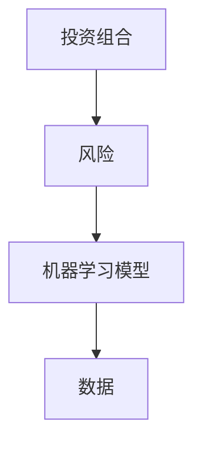
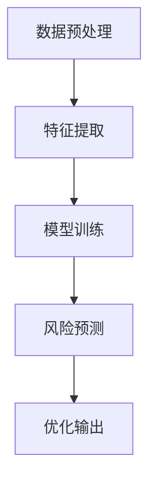
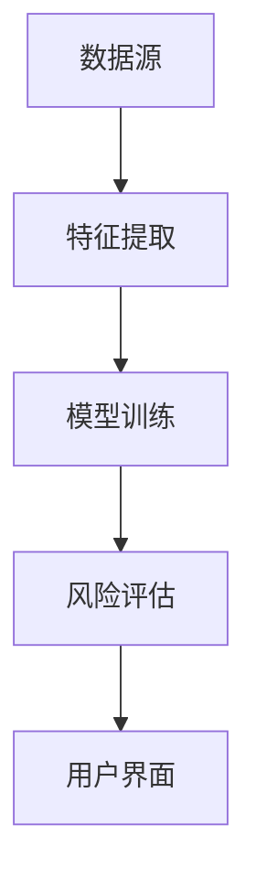
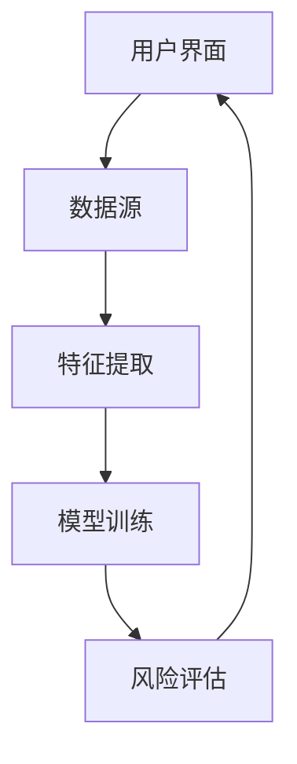

                 

# 机器学习优化投资组合尾部风险

> 关键词：机器学习，投资组合，尾部风险，风险管理，金融建模

> 摘要：本文探讨了如何利用机器学习技术优化投资组合的尾部风险，从问题背景、核心概念、算法原理、系统架构到项目实战，全面解析机器学习在金融风险管理中的应用。

---

## 第一章：投资组合尾部风险与机器学习的结合

### 1.1 问题背景与定义
- **1.1.1 投资组合尾部风险的定义**：尾部风险是指在投资组合中出现极端事件时，导致重大损失的风险。传统方法在捕捉这些事件时往往力不从心。
- **1.1.2 机器学习在金融风险管理中的作用**：机器学习能够通过历史数据识别模式，预测潜在风险，优化投资组合。
- **1.1.3 优化目标与意义**：通过机器学习，优化投资组合的尾部风险，提高整体风险管理能力。

### 1.2 问题描述与解决思路
- **1.2.1 尾部风险的传统管理方法**：如VaR模型，但其在极端情况下的准确性有限。
- **1.2.2 传统方法的局限性**：假设数据分布，忽视极端事件的复杂性。
- **1.2.3 机器学习优化的思路与优势**：利用非线性模型捕捉复杂模式，提高预测准确性。

### 1.3 问题的边界与外延
- **1.3.1 尾部风险的边界**：明确极端事件的范围和影响。
- **1.3.2 应用范围**：涵盖股票、债券等多种资产。
- **1.3.3 相关概念对比**：比较VaR、CVaR等风险指标，明确机器学习的优势。

### 1.4 投资组合风险结构
- **1.4.1 风险构成**：包括市场风险、信用风险等。
- **1.4.2 尾部风险与整体风险的关系**：尾部风险是整体风险的一部分，但影响更大。
- **1.4.3 尾部风险的影响**：可能导致投资组合的重大损失，影响整体收益。

---

## 第二章：核心概念与联系

### 2.1 风险建模的核心概念
- **2.1.1 风险的定义与分类**：风险可以是市场波动、信用违约等。
- **2.1.2 尾部风险的数学表达**：通过概率分布描述极端事件的发生概率。
- **2.1.3 机器学习模型的作用**：用于预测和识别潜在风险。

### 2.2 核心概念的原理与联系
- **2.2.1 风险建模的原理**：基于数据的统计分析，识别潜在风险因素。
- **2.2.2 机器学习在风险建模中的应用**：使用聚类、回归等算法分析数据。
- **2.2.3 建模流程**：数据收集、特征提取、模型训练、风险预测。

### 2.3 核心概念的ER实体关系图

---

## 第三章：机器学习算法原理

### 3.1 机器学习算法概述
- **3.1.1 监督学习、无监督学习与深度学习**：介绍常见算法及其适用场景。
- **3.1.2 常用金融风险建模算法**：如随机森林、神经网络。
- **3.1.3 算法选择的依据**：数据类型、问题性质等。

### 3.2 算法原理与流程图

### 3.3 算法实现
- **3.3.1 聚类算法**：用于识别风险因子。
- **3.3.2 回归算法**：用于预测风险值。
- **3.3.3 深度学习模型**：用于捕捉复杂模式。

---

## 第四章：数学模型

### 4.1 基于概率分布的模型
- **4.1.1 正态分布与尾部风险**：解释极端事件的低概率。
- **4.1.2 厚尾分布的应用**：如帕累托分布，更适合捕捉极端事件。

### 4.2 常见的风险度量模型
- **4.2.1 VaR模型**：介绍其计算方法和局限性。
- **4.2.2 CVaR模型**：更注重极端事件的损失。

### 4.3 基于机器学习的模型
- **4.3.1 神经网络模型**：用于非线性风险预测。
- **4.3.2 随机森林模型**：用于特征重要性分析。

---

## 第五章：系统架构设计

### 5.1 系统功能设计
- **5.1.1 数据采集模块**：获取市场数据。
- **5.1.2 特征提取模块**：提取相关特征。
- **5.1.3 模型训练模块**：训练机器学习模型。
- **5.1.4 风险评估模块**：输出风险评估结果。

### 5.2 系统架构图

### 5.3 接口设计
- **API接口**：定义输入输出格式。
- **数据接口**：数据存储与检索。

### 5.4 交互流程

---

## 第六章：项目实战

### 6.1 环境安装
- **Python环境**：安装Python、Pandas、Scikit-learn等库。

### 6.2 数据准备
- **数据清洗**：处理缺失值、异常值。
- **特征工程**：提取市场数据、技术指标。

### 6.3 模型实现
- **代码示例**：使用随机森林模型预测尾部风险。
- **代码解读**：详细解释每一步代码的作用。

### 6.4 案例分析
- **实际案例**：分析某投资组合的尾部风险优化过程。
- **结果展示**：对比优化前后的风险指标。

### 6.5 项目小结
- **总结经验**：机器学习的有效性。
- **问题反思**：模型的局限性和改进方向。

---

## 第七章：高级主题与注意事项

### 7.1 模型鲁棒性
- **鲁棒性的重要性**：确保模型在不同市场环境下的表现。
- **增强鲁棒性的方法**：数据增强、模型集成。

### 7.2 可解释性
- **可解释性的重要性**：便于理解和调整模型。
- **提升可解释性的方法**：使用可解释性模型如线性回归。

### 7.3 实时性
- **实时性要求**：及时捕捉市场变化。
- **优化方法**：使用流数据处理技术。

### 7.4 伦理与监管
- **合规性要求**：确保模型符合金融监管规定。
- **伦理问题**：避免算法歧视等伦理风险。

### 7.5 拓展阅读
- **推荐书籍**：《机器学习实战》、《风险管理与金融机构》。
- **推荐论文**：相关领域的最新研究成果。

---

## 第八章：总结与展望

### 8.1 全文总结
- **总结核心内容**：机器学习在尾部风险优化中的应用。
- **主要结论**：机器学习能够有效优化投资组合的尾部风险。

### 8.2 项目经验
- **经验分享**：在项目中遇到的问题及解决方案。
- **教训总结**：需要注意的事项和改进方向。

### 8.3 未来展望
- **研究方向**：结合AI和大数据技术，探索更高效的优化方法。
- **技术趋势**：关注强化学习、自适应模型的应用。

---

## 作者信息

作者：AI天才研究院/AI Genius Institute  
联系邮箱：contact@aicourse.com  
GitHub：https://github.com/aigenius

---

# END

