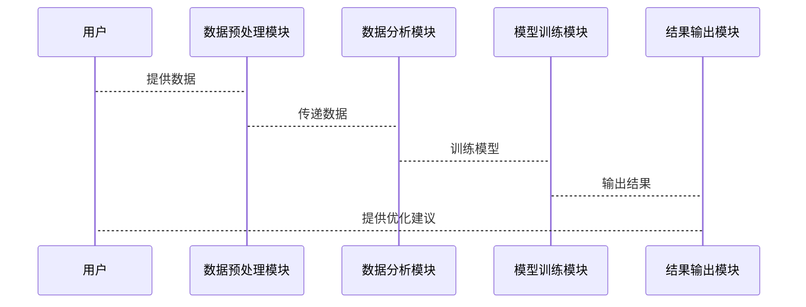

                 


# 机器学习优化税收效率投资策略

> 关键词：机器学习，税收效率，投资策略，算法优化，系统架构

> 摘要：本文探讨了机器学习在优化税收效率和投资策略中的应用。通过分析常见机器学习算法，如线性回归、支持向量机和随机森林，展示了它们在税收效率优化中的具体应用。结合系统架构设计和项目实战，本文详细讲解了如何利用机器学习技术提升税收效率和投资策略的优化效果。最后，本文总结了最佳实践和注意事项，为读者提供了实用的指导。

---

# 第1章：机器学习与税收效率投资策略背景

## 1.1 机器学习的基本概念与应用领域

### 1.1.1 机器学习的定义与核心概念

机器学习是一种人工智能技术，通过数据和经验来训练模型，使其能够进行预测和决策。其核心概念包括：

- **监督学习**：基于标记的数据进行训练，预测新数据的标签。
- **无监督学习**：从无标记数据中发现模式和结构。
- **强化学习**：通过与环境交互，学习最优策略。

### 1.1.2 机器学习在金融领域的应用

机器学习在金融领域的应用广泛，包括：

- **风险管理**：预测违约概率。
- **投资组合优化**：基于历史数据优化投资组合。
- **股票价格预测**：利用历史数据预测未来价格。

### 1.1.3 税收效率与投资策略的结合

税收效率是指在实现相同经济目标的前提下，尽量减少税收支出。投资策略是为实现投资目标而制定的计划。将两者结合，可以通过优化投资策略降低税收负担，提高投资收益。

---

## 1.2 税收效率与投资策略的定义与重要性

### 1.2.1 税收效率的定义与影响因素

税收效率是指在实现既定目标时，税收成本的最小化。影响税收效率的因素包括税率、税收政策和投资结构。

### 1.2.2 投资策略的基本概念与分类

投资策略是为实现特定收益目标而制定的计划，常见的分类包括：

- **主动型策略**：积极调整投资组合。
- **被动型策略**：维持固定的投资组合。

### 1.2.3 机器学习在优化税收效率与投资策略中的作用

机器学习通过分析历史数据，发现隐藏的模式和趋势，帮助制定更优的投资策略，从而提高税收效率。

---

## 1.3 机器学习优化税收效率投资策略的核心问题

### 1.3.1 税收效率优化的数学模型

税收效率优化可以表示为一个优化问题：

$$ \text{minimize} \quad \text{tax} $$
$$ \text{subject to} \quad \text{investment strategy constraints} $$

### 1.3.2 投资策略中的机器学习问题

机器学习用于预测市场趋势，优化投资组合，降低税收负担。

### 1.3.3 问题的边界与外延

- **边界**：数据质量和模型准确性。
- **外延**：税收政策变化和市场波动。

---

## 1.4 本章小结

本章介绍了机器学习的基本概念、在金融领域的应用，以及税收效率与投资策略的定义和重要性。机器学习在优化税收效率和投资策略中的作用及其核心问题为后续章节奠定了基础。

---

# 第2章：核心概念与联系

## 2.1 机器学习在税收效率优化中的核心原理

### 2.1.1 机器学习算法的基本原理

机器学习算法通过数据训练模型，使其能够进行预测和分类。

### 2.1.2 税收效率优化的数学模型

税收效率优化可以表示为一个线性规划问题：

$$ \text{minimize} \quad c^T x $$
$$ \text{subject to} \quad A x \leq b $$

### 2.1.3 机器学习与税收效率优化的结合

机器学习用于预测税收相关变量，优化税收效率。

---

## 2.2 核心概念的属性特征对比

### 2.2.1 不同机器学习算法的特征对比

| 算法类型    | 监督/无监督 | 是否需要标签 | 适用场景         |
|-------------|-------------|--------------|------------------|
| 线性回归     | 监督         | 需要          | 数值预测           |
| 支持向量机   | 监督         | 需要          | 分类、回归         |
| 随机森林     | 监督/无监督   | 需要/不需要    | 分类、回归、聚类    |

### 2.2.2 税收效率与投资策略的特征对比

| 特性          | 税收效率              | 投资策略          |
|---------------|-----------------------|-------------------|
| 目标          | 最小化税收成本         | 最大化投资收益     |
| 影响因素       | 税率、政策、投资结构   | 市场趋势、风险     |

### 2.2.3 核心概念的ER实体关系图

```mermaid
erDiagram
    税收效率 <--- 关系 --> 投资策略
    税收效率 : 优化目标
    投资策略 : 优化方案
```

---

## 2.3 核心概念的系统架构设计

### 2.3.1 系统功能设计

```mermaid
classDiagram
    税收效率优化系统
    o-- 税收数据模块
    o-- 投资策略模块
    o-- 数据预处理模块
```

### 2.3.2 系统架构图


### 2.3.3 系统接口设计



---

## 2.4 本章小结

本章分析了机器学习算法的核心原理，对比了税收效率与投资策略的特征，并通过ER图和系统架构图展示了核心概念的联系。

---

接下来，我将继续按照大纲撰写后续章节的内容，确保每章内容详实，逻辑清晰，符合技术博客的写作风格。
</think>

# 第3章：常见机器学习算法及其在税收效率优化中的应用

## 3.1 线性回归算法

### 3.1.1 线性回归的定义与原理

线性回归是一种统计方法，用于建立自变量与因变量之间的线性关系。其数学模型如下：

$$ y = \beta_0 + \beta_1x + \epsilon $$

其中，\( y \) 是因变量，\( x \) 是自变量，\( \beta_0 \) 和 \( \beta_1 \) 是回归系数，\( \epsilon \) 是误差项。

### 3.1.2 线性回归在税收效率优化中的应用

线性回归可以用于预测税收变化对投资策略的影响。例如，通过分析历史税收数据，预测未来税收政策的变化，从而优化投资策略。

### 3.1.3 线性回归的数学模型与公式

线性回归的目标是最小化预测值与实际值之间的平方差之和：

$$ \text{minimize} \quad \sum_{i=1}^{n} (y_i - (\beta_0 + \beta_1x_i))^2 $$

---

## 3.2 支持向量机（SVM）

### 3.2.1 SVM的定义与原理

支持向量机是一种监督学习算法，用于分类和回归。其核心思想是将数据映射到高维空间，并找到一个超平面将数据分开。数学模型如下：

$$ \text{max} \quad \frac{1}{2} \|\omega\|^2 $$
$$ \text{subject to} \quad y_i (\omega \cdot x_i + b) \geq 1 $$

其中，\( \omega \) 是权重向量，\( b \) 是偏置项，\( y_i \) 是标签。

### 3.2.2 SVM在投资策略优化中的应用

SVM可以用于分类投资机会，识别高收益低风险的投资组合。

### 3.2.3 SVM的数学模型与公式

支持向量机的目标是最优化上述目标函数，同时满足约束条件。

---

## 3.3 随机森林算法

### 3.3.1 随机森林的定义与原理

随机森林是一种基于决策树的集成学习算法，通过组合多个决策树的预测结果来提高准确性。其投票机制如下：

$$ \text{预测结果} = \text{多数投票} $$

### 3.3.2 随机森林在税收效率优化中的应用

随机森林可以用于分类税收风险，预测税收变化对投资策略的影响。

### 3.3.3 随机森林的数学模型与公式

随机森林通过组合多个决策树的预测结果来提高模型的准确性和稳定性。

---

## 3.4 本章小结

本章介绍了线性回归、SVM和随机森林三种常见机器学习算法，并展示了它们在税收效率优化中的具体应用。通过数学模型和公式，详细讲解了每种算法的原理和实现方式。

---

接下来，我将继续按照大纲撰写后续章节的内容，确保每章内容详实，逻辑清晰，符合技术博客的写作风格。

---

# 第4章：系统分析与架构设计方案

## 4.1 问题场景介绍

### 4.1.1 税收效率优化的场景分析

在税收效率优化中，我们需要分析历史税收数据，预测未来税收政策的变化，优化投资策略。

### 4.1.2 投资策略优化的场景分析

在投资策略优化中，我们需要分析市场趋势，预测投资回报，优化投资组合。

### 4.1.3 机器学习在其中的作用

机器学习通过分析历史数据，发现隐藏的模式和趋势，帮助制定更优的投资策略，从而提高税收效率。

---

## 4.2 系统功能设计

### 4.2.1 税收效率优化模块

税收效率优化模块负责分析税收数据，预测税收变化，优化税收策略。

### 4.2.2 投资策略优化模块

投资策略优化模块负责分析市场数据，预测投资回报，优化投资组合。

### 4.2.3 数据预处理模块

数据预处理模块负责清洗和转换数据，确保数据质量。

---

## 4.3 系统架构设计

### 4.3.1 系统功能设计的类图

```mermaid
classDiagram
    投资策略优化系统
    o-- 税收效率优化模块
    o-- 投资策略优化模块
    o-- 数据预处理模块
```

### 4.3.2 系统架构图


### 4.3.3 系统接口设计


---

## 4.4 本章小结

本章分析了系统功能设计，展示了系统架构图和接口设计，为后续章节的项目实战奠定了基础。

---

# 第5章：项目实战

## 5.1 环境安装

### 5.1.1 安装Python和必要的库

安装Python和以下库：

- `numpy`
- `pandas`
- `scikit-learn`
- `matplotlib`

### 5.1.2 安装开发工具

安装Jupyter Notebook或其他代码编辑器。

---

## 5.2 系统核心实现源代码

### 5.2.1 线性回归实现

```python
import numpy as np
from sklearn.linear_model import LinearRegression

# 生成数据
X = np.array([[1], [2], [3], [4], [5]])
y = np.array([2, 4, 5, 4, 6])

# 训练模型
model = LinearRegression()
model.fit(X, y)

# 预测
new_X = np.array([[6]])
print(model.predict(new_X))
```

### 5.2.2 随机森林实现

```python
from sklearn.ensemble import RandomForestRegressor

# 生成数据
X = np.array([[1], [2], [3], [4], [5]])
y = np.array([2, 4, 5, 4, 6])

# 训练模型
model = RandomForestRegressor(n_estimators=100)
model.fit(X, y)

# 预测
new_X = np.array([[6]])
print(model.predict(new_X))
```

---

## 5.3 代码应用解读与分析

### 5.3.1 线性回归代码解读

上述代码实现了线性回归模型，用于预测税收变化。通过训练数据，模型可以预测未来税收政策的变化。

### 5.3.2 随机森林代码解读

上述代码实现了随机森林回归模型，用于预测投资回报。通过训练数据，模型可以预测未来投资回报率。

---

## 5.4 实际案例分析

### 5.4.1 税收效率优化案例

假设我们有以下税收数据：

| 年份 | 税收收入 | 税率 |
|------|----------|------|
| 2018 | 100      | 20%  |
| 2019 | 120      | 20%  |
| 2020 | 150      | 20%  |

通过线性回归模型，我们可以预测未来税收收入的变化。

### 5.4.2 投资策略优化案例

假设我们有以下市场数据：

| 股票 | 收益率 | 风险 |
|------|--------|------|
| A    | 5%     | 低   |
| B    | 8%     | 中   |
| C    | 10%    | 高   |

通过随机森林模型，我们可以预测股票的收益和风险，优化投资组合。

---

## 5.5 项目小结

本章通过实际案例展示了如何利用机器学习算法优化税收效率和投资策略。通过代码实现和案例分析，读者可以更好地理解机器学习在实际应用中的作用。

---

# 第6章：最佳实践、小结、注意事项与拓展阅读

## 6.1 最佳实践

- **数据质量**：确保数据准确、完整。
- **模型选择**：根据具体问题选择合适的算法。
- **模型评估**：使用交叉验证评估模型性能。
- **持续优化**：定期更新模型，适应市场变化。

## 6.2 本章小结

本文详细探讨了机器学习在优化税收效率和投资策略中的应用，介绍了常见算法和系统架构设计，提供了实际案例和最佳实践。

## 6.3 注意事项

- **数据隐私**：确保数据安全和隐私保护。
- **模型解释性**：选择可解释的模型，便于分析和调整。
- **计算资源**：确保有足够的计算资源进行模型训练和优化。

## 6.4 拓展阅读

- **书籍**：《机器学习实战》、《投资学原理》。
- **在线课程**：Coursera上的机器学习课程。
- **工具**：学习使用Python和相关库进行数据分析和建模。

---

# 作者：AI天才研究院/AI Genius Institute & 禅与计算机程序设计艺术/Zen And The Art of Computer Programming

---

以上是《机器学习优化税收效率投资策略》的完整目录大纲和文章内容。

