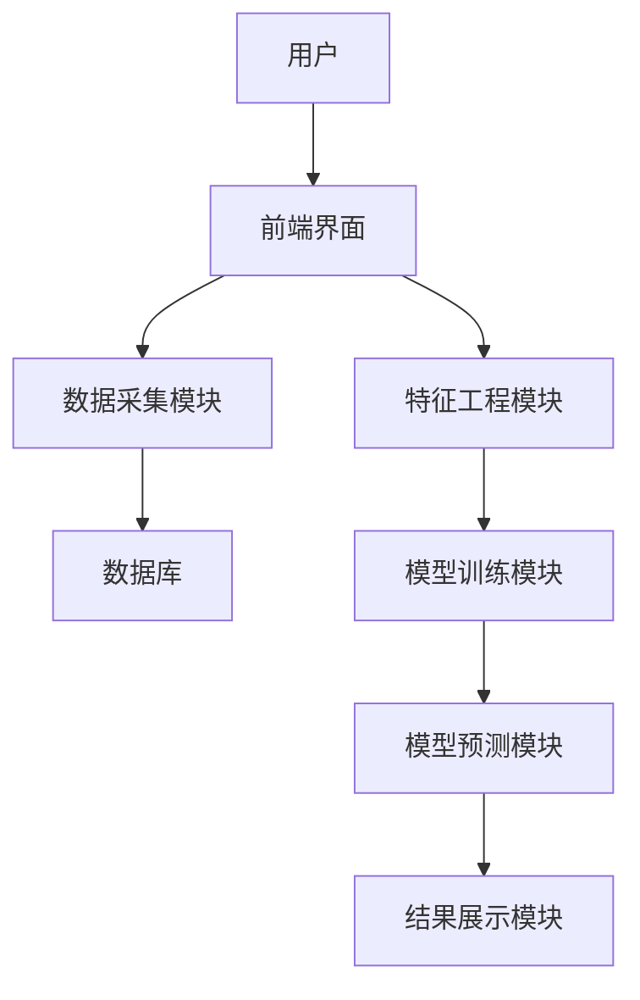

                 


# 《机器学习优化费雪成长股选择过程》

---

## 关键词：
机器学习、费雪成长股、投资策略、特征工程、金融模型

---

## 摘要：
本文通过结合费雪成长股投资理论与机器学习技术，提出了一种优化的选股方法。首先，介绍了费雪成长股的核心概念和机器学习在金融领域的应用潜力；其次，详细分析了机器学习算法在选股中的优势，并结合特征工程的方法，构建了一个基于机器学习的费雪成长股选择模型；最后，通过实际案例验证了该模型的有效性，并探讨了其在投资策略中的应用前景。

---

# 第1章: 费雪成长股投资理论与机器学习的结合

## 1.1 费雪成长股投资理论概述

### 1.1.1 费雪成长股的核心观点
费雪成长股是指那些具有持续增长潜力的公司股票，其核心在于寻找那些能够不断提升每股收益（EPS）的公司。费雪提出了“三阶段选股法”，即：

1. **第一阶段**：寻找那些具有稳定收益能力的公司。
2. **第二阶段**：寻找那些能够持续提高收益能力的公司。
3. **第三阶段**：寻找那些能够维持高收益能力的公司。

### 1.1.2 费雪成长股的投资策略
费雪的投资策略强调长期持有和持续关注公司的成长性。他主张通过研究公司的财务报表、行业地位和竞争优势来选择股票。

### 1.1.3 费雪成长股的选股标准
费雪提出了一些选股标准，包括：
- 公司具有较高的利润率。
- 公司具有较强的市场地位。
- 公司具有良好的管理团队。
- 公司具有可持续的增长潜力。

### 1.1.4 费雪成长股的局限性
尽管费雪成长股策略在历史上取得了显著的业绩，但也存在一些局限性，例如：
- 高成长性的公司可能伴随着高风险。
- 市场波动可能会影响成长股的表现。
- 需要长期关注和持续分析。

---

## 1.2 机器学习在金融投资中的应用

### 1.2.1 机器学习在金融投资中的优势
机器学习在金融投资中的优势主要体现在以下几个方面：
- 数据处理能力：机器学习可以处理大量的金融数据，发现隐藏在数据中的模式。
- 预测能力：机器学习可以基于历史数据预测未来的市场趋势。
- 自适应能力：机器学习模型可以根据市场变化自动调整参数。

### 1.2.2 机器学习在选股中的应用现状
目前，机器学习在选股中的应用主要集中在以下几个方面：
- **情绪分析**：利用自然语言处理技术分析市场情绪。
- **模式识别**：通过算法识别市场的周期性规律。
- **风险控制**：通过机器学习模型评估投资组合的风险。

### 1.2.3 费雪成长股选择与机器学习的结合点
机器学习可以为费雪成长股选择提供以下支持：
- **数据驱动**：通过机器学习分析大量历史数据，发现符合费雪选股标准的公司。
- **动态调整**：根据市场变化动态调整选股模型。
- **风险控制**：通过机器学习模型评估投资组合的风险。

---

## 1.3 本章小结
本章介绍了费雪成长股投资理论的核心观点和选股标准，分析了机器学习在金融投资中的优势及其在选股中的应用现状，并探讨了机器学习与费雪成长股选择的结合点。

---

# 第2章: 机器学习基础与特征工程

## 2.1 机器学习基础

### 2.1.1 机器学习的核心概念
机器学习的核心概念包括：
- **监督学习**：给定标注数据，学习模型预测新数据的标签。
- **无监督学习**：在无标注数据的情况下，发现数据中的结构。
- **特征工程**：通过对数据进行处理，提取有用的特征。

### 2.1.2 常见的机器学习算法
常用的机器学习算法包括：
- **线性回归**：用于预测连续型变量。
- **逻辑回归**：用于分类问题。
- **支持向量机（SVM）**：用于分类和回归。
- **随机森林**：一种基于树的集成学习方法。
- **神经网络**：用于复杂的非线性问题。

### 2.1.3 监督学习与非监督学习的区别
- **监督学习**：需要标注数据，目标是学习输入到输出的映射。
- **非监督学习**：不需要标注数据，目标是发现数据中的结构。

---

## 2.2 特征工程在机器学习中的作用

### 2.2.1 特征选择的重要性
特征选择是机器学习中非常重要的一步，好的特征选择可以显著提高模型的性能。

### 2.2.2 特征提取与特征变换
- **特征提取**：从原始数据中提取有用的特征。
- **特征变换**：将原始特征转换为更适合模型的形式。

### 2.2.3 费雪成长股相关特征的提取
在费雪成长股选择中，常见的特征包括：
- 财务指标：如净利润增长率、营业收入增长率、ROE（净资产收益率）等。
- 市场指标：如市盈率、市净率、股价走势等。

---

## 2.3 数据预处理与特征工程实践

### 2.3.1 数据清洗与标准化
- **数据清洗**：处理缺失值、异常值等。
- **标准化**：将数据标准化到同一尺度。

### 2.3.2 特征降维方法
- **主成分分析（PCA）**：一种常用的降维方法。

### 2.3.3 费雪成长股特征的工程化处理
在实际应用中，可以通过特征工程进一步优化模型，例如：
- 将一些离散特征转换为连续特征。
- 处理时间序列数据。

---

## 2.4 本章小结
本章介绍了机器学习的核心概念和常见算法，分析了特征工程在机器学习中的重要性，并结合费雪成长股选择的特点，讨论了特征工程的具体实践。

---

# 第3章: 基于机器学习的费雪成长股选择模型构建

## 3.1 数据集的构建与划分

### 3.1.1 数据来源与数据收集
数据来源包括：
- **历史股价数据**：包括开盘价、收盘价、最高价、最低价等。
- **财务报表数据**：包括净利润、营业收入、ROE等。
- **市场指标数据**：包括市盈率、市净率等。

### 3.1.2 数据集的划分与交叉验证
通常将数据划分为训练集、验证集和测试集。

---

## 3.2 机器学习模型的选择与训练

### 3.2.1 常见分类算法的比较
- **逻辑回归**：适合用于分类问题。
- **随机森林**：适合用于特征较多的场景。
- **神经网络**：适合用于复杂的非线性问题。

### 3.2.2 模型训练与调参
- **网格搜索**：通过遍历所有可能的参数组合，找到最优参数。

### 3.2.3 模型评估指标的定义
常用的评估指标包括：
- **准确率**：正确预测的样本数占总样本数的比例。
- **召回率**：正确预测的正样本数占所有正样本的比例。
- **F1分数**：准确率和召回率的调和平均数。

---

## 3.3 模型优化与改进

### 3.3.1 网格搜索与随机搜索调参
通过网格搜索或随机搜索找到最优参数组合。

### 3.3.2 堆叠模型与集成学习
- **堆叠模型**：将多个模型的输出作为新的特征，再通过一个模型进行预测。
- **集成学习**：通过组合多个模型的结果来提高性能。

### 3.3.3 模型的过拟合与欠拟合问题
- **过拟合**：模型在训练数据上表现很好，但在测试数据上表现不佳。
- **欠拟合**：模型在训练数据上表现不佳，无法捕获数据中的模式。

---

## 3.4 本章小结
本章介绍了数据集的构建与划分方法，讨论了机器学习模型的选择与训练过程，并分析了模型优化与改进的策略。

---

# 第4章: 机器学习模型在费雪成长股选择中的应用

## 4.1 费雪成长股选择的机器学习模型实现

### 4.1.1 模型输入特征的定义
在实际应用中，可以将费雪成长股的特征输入到模型中，例如：
- 净利润增长率（Net Profit Growth Rate）
- 营业收入增长率（Revenue Growth Rate）
- ROE（净资产收益率）

### 4.1.2 模型训练与预测流程
- **数据预处理**：清洗和标准化数据。
- **特征选择**：选择对目标变量影响较大的特征。
- **模型训练**：使用训练数据训练模型。
- **模型预测**：使用测试数据进行预测。

### 4.1.3 模型的评估与验证
通过混淆矩阵、准确率、召回率等指标评估模型的性能。

---

## 4.2 模型在实际投资中的表现分析

### 4.2.1 模型的回测与绩效评估
- **回测**：在历史数据上测试模型的表现。
- **绩效评估**：通过夏普比率、最大回撤等指标评估模型的绩效。

### 4.2.2 模型的稳定性与鲁棒性分析
- **稳定性**：模型在不同数据集上的表现是否一致。
- **鲁棒性**：模型对数据分布变化的适应能力。

### 4.2.3 模型的实际投资效果
通过实际投资回测，验证模型在实际市场中的表现。

---

## 4.3 本章小结
本章介绍了机器学习模型在费雪成长股选择中的具体实现，分析了模型在实际投资中的表现，并讨论了模型的稳定性与鲁棒性。

---

# 第5章: 系统架构与实现方案

## 5.1 系统功能设计

### 5.1.1 系统目标与功能模块划分
系统目标是实现一个基于机器学习的费雪成长股选择系统，功能模块包括：
- 数据采集模块：采集历史股价、财务数据等。
- 特征工程模块：对数据进行预处理和特征提取。
- 模型训练模块：训练机器学习模型。
- 模型预测模块：基于模型进行股票预测。

### 5.1.2 数据处理模块的设计
- 数据采集：通过API接口获取数据。
- 数据清洗：处理缺失值、异常值等。
- 数据存储：将数据存储到数据库中。

### 5.1.3 模型训练与预测模块的设计
- 模型训练：使用训练数据训练模型。
- 模型预测：基于测试数据进行预测。

---

## 5.2 系统架构设计

### 5.2.1 系统架构图
以下是一个可能的系统架构图：



---

## 5.3 系统接口设计

### 5.3.1 API接口设计
- **数据接口**：提供获取历史数据的API。
- **模型接口**：提供预测结果的API。

### 5.3.2 接口调用流程
- 用户通过前端界面提交请求。
- 前端界面调用数据接口获取数据。
- 数据经过特征工程模块处理后，调用模型接口进行预测。
- 最终结果展示在前端界面。

---

## 5.4 本章小结
本章设计了一个基于机器学习的费雪成长股选择系统的架构，详细描述了系统功能模块、接口设计和系统架构图。

---

# 第6章: 项目实战

## 6.1 环境安装与配置

### 6.1.1 安装Python环境
安装Python和相关的库，例如：
- `pandas`：数据处理库。
- `numpy`：数值计算库。
- `scikit-learn`：机器学习库。
- `matplotlib`：数据可视化库。

### 6.1.2 安装其他工具
- `jupyter`：交互式编程环境。
- `requests`：网络请求库。

---

## 6.2 系统核心实现源代码

### 6.2.1 数据预处理代码
```python
import pandas as pd
import numpy as np

# 读取数据
data = pd.read_csv("data.csv")

# 数据清洗
data.dropna(inplace=True)
data = data[~data.duplicated()]

# 标准化处理
from sklearn.preprocessing import StandardScaler
scaler = StandardScaler()
scaled_data = scaler.fit_transform(data[['净利润增长率', '营业收入增长率', 'ROE']])
```

### 6.2.2 模型训练代码
```python
from sklearn.ensemble import RandomForestClassifier
from sklearn.model_selection import train_test_split
from sklearn.metrics import accuracy_score, recall_score, f1_score

# 划分数据集
X = scaled_data
y = data['是否成长股'].values

X_train, X_test, y_train, y_test = train_test_split(X, y, test_size=0.2, random_state=42)

# 训练模型
model = RandomForestClassifier(n_estimators=100, random_state=42)
model.fit(X_train, y_train)

# 预测
y_pred = model.predict(X_test)

# 评估指标
print("准确率:", accuracy_score(y_test, y_pred))
print("召回率:", recall_score(y_test, y_pred))
print("F1分数:", f1_score(y_test, y_pred))
```

---

## 6.3 代码应用解读与分析

### 6.3.1 数据预处理解读
- 使用`pandas`读取数据。
- 使用`dropna`处理缺失值。
- 使用`StandardScaler`进行标准化处理。

### 6.3.2 模型训练解读
- 使用`RandomForestClassifier`进行分类。
- 使用`train_test_split`划分数据集。
- 使用`accuracy_score`、`recall_score`和`f1_score`评估模型性能。

---

## 6.4 实际案例分析

### 6.4.1 案例分析
假设我们有一个包含历史数据的CSV文件`data.csv`，其中包含以下字段：
- `日期`：日期。
- `收盘价`：收盘价。
- `净利润增长率`：净利润增长率。
- `营业收入增长率`：营业收入增长率。
- `ROE`：净资产收益率。
- `是否成长股`：标签，1表示是成长股，0表示不是。

通过上述代码，我们可以训练一个随机森林模型，并对测试数据进行预测。

---

## 6.5 项目小结
本章通过实际案例展示了如何使用机器学习优化费雪成长股的选择过程，详细介绍了环境配置、代码实现和案例分析。

---

# 第7章: 总结与展望

## 7.1 总结
本文通过结合费雪成长股投资理论与机器学习技术，提出了一种优化的选股方法。通过特征工程和机器学习模型的训练，提高了选股的准确性和效率。

## 7.2 展望
未来的研究方向包括：
- **模型优化**：进一步优化机器学习模型，提高预测精度。
- **多模态数据融合**：结合文本数据、图像数据等多种数据源。
- **实时预测**：实现实时股票预测系统。

---

# 作者：AI天才研究院 & 禅与计算机程序设计艺术

--- 

这篇文章详细介绍了机器学习如何优化费雪成长股的选择过程，从理论到实践，从算法到系统设计，都进行了深入的探讨。希望对读者有所帮助！

