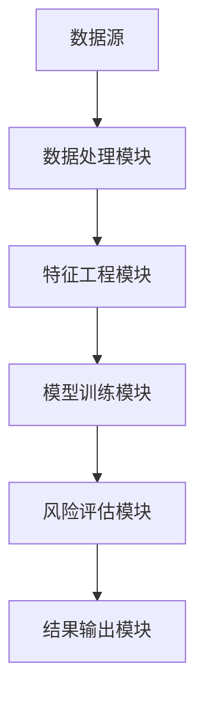

                 


# 《机器学习在信用风险评估中的应用》

---

## 关键词：  
信用风险评估、机器学习、违约概率、特征工程、监督学习、随机森林、XGBoost

---

## 摘要：  
信用风险评估是金融领域的重要组成部分，传统方法依赖于统计模型和专家经验，但存在维度高、复杂度高、难以处理非线性关系等问题。机器学习凭借其强大的特征学习能力和非线性建模能力，为信用风险评估提供了新的解决方案。本文将从信用风险评估的背景与挑战出发，深入探讨机器学习算法的原理与实现，结合实际案例分析其在信用风险评估中的应用，并讨论其优势与局限性，最后总结机器学习在信用风险评估中的未来发展方向。

---

# 第1章：信用风险评估的背景与挑战

## 1.1 信用风险评估的定义与重要性  
信用风险评估是指对借款人或债务人违约可能性进行量化的过程，是金融风险管理的核心内容之一。其重要性体现在以下几个方面：  
1. **降低金融损失**：通过准确评估信用风险，金融机构可以提前识别高风险客户，减少不良贷款的发生。  
2. **优化资源配置**：信用评估结果直接影响贷款利率、授信额度等决策，有助于资源的合理分配。  
3. **提升客户信任**：通过科学的信用评估，金融机构可以为客户提供更精准的金融服务，增强客户信任。  

## 1.2 信用风险评估的传统方法  
传统的信用风险评估方法主要包括以下几种：  
1. **5C法**：基于信用、能力、资本、担保和环境五大维度进行评估。  
2. **评分卡模型**：通过打分卡对客户的信用状况进行评分，进而判断其违约概率。  
3. **经济周期分析**：结合宏观经济指标（如GDP增长率、失业率等）进行风险评估。  

## 1.3 机器学习在信用风险评估中的优势  
与传统方法相比，机器学习在信用风险评估中的优势主要体现在：  
1. **非线性关系建模**：机器学习算法能够捕捉复杂的非线性关系，提高模型的准确性。  
2. **高维数据处理**：机器学习擅长处理高维数据，能够充分利用客户的历史交易数据和行为数据。  
3. **实时性**：机器学习模型可以实时更新，适应市场变化和客户行为的动态调整。  

---

# 第2章：信用风险评估的核心概念与联系

## 2.1 信用风险评估的关键指标  
在信用风险评估中，以下指标尤为重要：  
1. **违约概率（PD）**：客户在未来一定时间内违约的概率。  
2. **违约损失率（LGD）**：违约发生时，机构可能遭受的损失比例。  
3. **风险敞口**：机构在客户违约时可能面临的最大损失。  

## 2.2 机器学习模型的核心原理  
机器学习模型的核心在于通过数据训练，学习输入特征与目标输出之间的关系。常见的监督学习算法包括逻辑回归、随机森林、支持向量机（SVM）和神经网络等。  

### 2.2.1 逻辑回归（Logistic Regression）  
逻辑回归是一种用于分类任务的经典算法，适用于二分类问题。其核心思想是通过 sigmoid 函数将线性回归的结果映射到概率空间。  

#### 2.2.1.1 算法流程  
1. 初始化模型参数。  
2. 计算当前预测概率。  
3. 更新参数，最小化损失函数（交叉熵损失）。  
4. 重复迭代，直到参数收敛。  

#### 2.2.1.2 优缺点  
- **优点**：简单易懂，适合线性可分问题。  
- **缺点**：无法处理非线性关系，对特征工程依赖较高。  

### 2.2.2 随机森林（Random Forest）  
随机森林是一种基于决策树的集成学习算法，通过随机采样和特征选择，降低过拟合风险，提高模型的泛化能力。  

#### 2.2.2.1 算法流程  
1. 对训练数据进行有放回采样，生成多个训练集。  
2. 对每个训练集训练一棵决策树。  
3. 对测试样本，采用投票法（分类任务）或平均法（回归任务）进行预测。  

#### 2.2.2.2 优缺点  
- **优点**：抗过拟合，适合高维数据，易于解释。  
- **缺点**：计算复杂度较高，特征重要性解释可能不够直观。  

---

# 第3章：机器学习算法原理与数学模型

## 3.1 常见机器学习算法在信用风险评估中的应用  

### 3.1.1 逻辑回归的数学模型  
逻辑回归的目标是通过训练数据，学习参数 $\theta$，使得模型预测值与真实值之间的差距最小。其损失函数为：  

$$ L(\theta) = -\frac{1}{m}\sum_{i=1}^{m} [y^{(i)}\log(h_\theta(x^{(i)})) + (1 - y^{(i)}\log(1 - h_\theta(x^{(i)})))] $$  

其中，$h_\theta(x) = \frac{1}{1 + e^{-\theta^T x}}$ 是 sigmoid 函数。  

### 3.1.2 随机森林的特征重要性分析  
随机森林通过特征选择（如 Gini 增益）来评估特征的重要性。特征重要性得分越高，说明该特征对模型预测的贡献越大。  

---

# 第4章：系统分析与架构设计方案

## 4.1 信用风险评估系统的功能设计  
一个典型的信用风险评估系统包括以下功能模块：  
1. **数据采集**：收集客户信息、交易记录、市场数据等。  
2. **特征工程**：对原始数据进行清洗、转换和特征提取。  
3. **模型训练**：基于特征数据，训练机器学习模型。  
4. **风险评估**：根据模型预测结果，生成信用评分和违约概率。  
5. **结果输出**：将评估结果输出为报告或直接用于业务决策。  

## 4.2 系统架构设计  
以下是信用风险评估系统的架构图：  



---

# 第5章：项目实战——基于随机森林的信用风险评估模型

## 5.1 环境安装  
1. 安装 Python 环境（推荐使用 Anaconda）。  
2. 安装相关库：`pandas`, `numpy`, `scikit-learn`, `xgboost`。  

## 5.2 核心功能实现  

### 5.2.1 数据加载与预处理  
```python
import pandas as pd
from sklearn.impute import SimpleImputer
from sklearn.preprocessing import StandardScaler

# 加载数据
data = pd.read_csv('credit_data.csv')

# 处理缺失值
imputer = SimpleImputer(strategy='mean')
imputed_data = imputer.fit_transform(data)

# 标准化处理
scaler = StandardScaler()
scaled_data = scaler.fit_transform(imputed_data)
```

### 5.2.2 模型训练与评估  
```python
from sklearn.ensemble import RandomForestClassifier
from sklearn.metrics import accuracy_score, confusion_matrix

# 划分训练集和测试集
X_train, X_test, y_train, y_test = train_test_split(scaled_data, data['target'], test_size=0.2)

# 初始化模型
model = RandomForestClassifier(n_estimators=100, max_depth=4, random_state=42)
model.fit(X_train, y_train)

# 预测与评估
y_pred = model.predict(X_test)
print("Accuracy:", accuracy_score(y_test, y_pred))
print("Confusion Matrix:\n", confusion_matrix(y_test, y_pred))
```

---

# 第6章：实际案例分析与优化

## 6.1 案例分析  
假设我们有一个银行客户数据集，包含以下特征：收入、信用历史、债务情况、消费行为等。通过随机森林模型，我们可以预测客户的违约概率，并根据特征重要性分析，找出影响信用风险的关键因素。  

## 6.2 模型优化  
1. **超参数调优**：通过网格搜索（Grid Search）优化模型参数，如 `n_estimators` 和 `max_depth`。  
2. **特征选择**：去除冗余特征，提高模型性能和解释性。  
3. **集成学习**：结合多种算法（如逻辑回归和随机森林）进行投票预测，提升模型的准确性和稳定性。  

---

# 第7章：挑战与未来发展方向

## 7.1 当前技术的局限性  
1. **过拟合问题**：部分模型在训练数据上表现优异，但在测试数据上可能效果不佳。  
2. **数据偏差**：数据集中可能存在样本不平衡问题，导致模型预测不准确。  
3. **解释性问题**：复杂的模型（如深度学习）难以解释其预测结果，影响业务决策。  

## 7.2 未来发展方向  
1. **联邦学习**：通过数据隐私保护技术，实现跨机构的数据共享与模型训练。  
2. **AI 监管与合规**：制定更严格的监管政策，确保机器学习模型的透明性和可解释性。  
3. **实时风险监控**：利用流数据处理技术，实时监控客户行为变化，动态调整信用评估结果。  

---

# 第8章：总结与展望

## 8.1 本章总结  
机器学习凭借其强大的特征学习能力和非线性建模能力，为信用风险评估提供了新的解决方案。通过本文的探讨，我们了解了信用风险评估的核心概念、机器学习算法的原理与实现，以及实际案例中的应用。  

## 8.2 未来展望  
随着人工智能技术的不断发展，信用风险评估将更加智能化和个性化。未来，通过结合区块链、联邦学习等新技术，信用风险评估将实现更高效、更安全的金融风险管理。  

---

# 作者：AI天才研究院 & 禅与计算机程序设计艺术  
本文作者：AI天才研究院（AI Genius Institute） & 禅与计算机程序设计艺术（Zen And The Art of Computer Programming）

