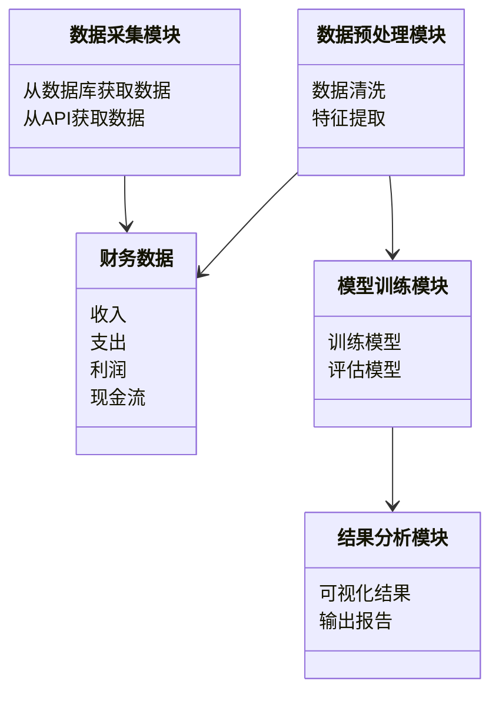
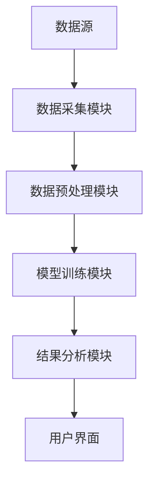

                 


# 机器学习在公司财务异常检测中的应用

## 关键词：
- 机器学习
- 财务异常检测
- 异常检测
- 监督学习
- 无监督学习
- 数据分析
- 企业风险管理

## 摘要：
机器学习在公司财务异常检测中的应用是一门结合了人工智能与财务分析的前沿技术。通过分析企业的财务数据，机器学习能够帮助发现潜在的财务异常情况，如欺诈、财务造假、资金链断裂等，从而为企业管理者提供及时的风险预警和决策支持。本文将从机器学习的基本概念、常见算法、系统架构设计、项目实战等方面，详细探讨机器学习在财务异常检测中的应用，并结合实际案例进行深入分析，最后总结最佳实践和未来发展方向。

---

# 第1章: 财务异常检测的背景与问题

## 1.1 财务异常检测的背景

### 1.1.1 财务异常检测的定义与意义
财务异常检测是指通过分析企业的财务数据，识别出与正常情况不符的异常行为或趋势。这些异常可能是欺诈行为、财务造假、资金链断裂或其他潜在风险的早期信号。财务异常检测的意义在于帮助企业管理者及时发现问题，避免重大经济损失。

### 1.1.2 财务异常检测的应用场景
财务异常检测广泛应用于企业内部审计、风险管理、投资者保护等领域。例如：
- **企业内部审计**：识别财务报表中的异常数据，发现潜在的欺诈行为。
- **风险管理**：通过实时监控财务数据，及时发现企业运营中的潜在风险。
- **投资者保护**：帮助投资者识别企业财务造假行为，维护投资利益。

### 1.1.3 财务异常检测的挑战与机遇
财务异常检测的挑战主要在于数据的复杂性和模型的可解释性。财务数据通常包含大量噪声和缺失值，且异常行为往往具有隐蔽性。此外，模型的可解释性要求较高，因为财务决策需要透明和合理的依据。然而，机器学习技术的引入为财务异常检测带来了新的机遇，尤其是在处理非结构化数据和复杂模式识别方面。

---

## 1.2 机器学习在财务异常检测中的作用

### 1.2.1 机器学习的基本概念
机器学习是一种人工智能技术，通过数据训练模型，使其能够从数据中学习规律并进行预测或分类。机器学习可以分为监督学习、无监督学习和半监督学习三类。

### 1.2.2 机器学习在财务领域的优势
相比传统的财务分析方法，机器学习具有以下优势：
- **高效性**：能够快速处理海量数据，发现隐藏的模式。
- **准确性**：通过复杂的算法，提高异常检测的准确率。
- **实时性**：支持实时数据处理，提供及时的预警信息。

### 1.2.3 机器学习与传统财务分析的结合
机器学习可以与传统财务分析方法（如比率分析、趋势分析）结合，形成更加完善的财务异常检测系统。例如，利用逻辑回归模型预测企业财务危机，或者使用聚类算法识别财务数据中的异常群体。

---

## 1.3 本章小结
本章介绍了财务异常检测的背景、应用场景及其在现代企业中的重要性。同时，阐述了机器学习在财务异常检测中的作用及其优势，为后续章节的深入分析奠定了基础。

---

# 第2章: 机器学习的核心概念

## 2.1 机器学习的基本原理

### 2.1.1 数据、模型与算法的关系
数据是机器学习的基础，模型是数据与算法的结合体，算法是模型学习数据规律的核心工具。三者共同构成了机器学习系统的基本框架。

### 2.1.2 监督学习、无监督学习与半监督学习的对比
- **监督学习**：基于有标签的数据进行训练，适用于分类和回归任务。
- **无监督学习**：基于无标签的数据进行训练，适用于聚类和异常检测任务。
- **半监督学习**：结合有标签和无标签数据进行训练，适用于数据量较小的场景。

### 2.1.3 机器学习的核心要素
- **特征工程**：提取和选择有助于模型性能的特征。
- **模型选择**：选择适合任务的算法。
- **模型调优**：通过交叉验证等方法优化模型性能。

---

## 2.2 财务异常检测中的关键概念

### 2.2.1 异常检测的定义与分类
异常检测是指通过分析数据，识别出与正常数据显著不同的异常点。异常检测可以分为：
- **点异常**：单个数据点的异常。
- **上下文异常**：在特定上下文中异常。
- **群体异常**：数据群体的异常。

### 2.2.2 财务数据的特征与属性
财务数据通常包括收入、支出、利润、现金流等指标。这些数据具有以下特征：
- **时间序列性**：数据具有时间维度。
- **多维性**：数据包含多个特征。
- **连续性**：数据通常为连续型变量。

### 2.2.3 异常检测的评价指标
常用的评价指标包括准确率、召回率、F1分数等。由于异常检测通常是类别不均衡问题，因此需要特别关注精确召回率曲线（Precision-Recall Curve）。

---

## 2.3 本章小结
本章详细介绍了机器学习的基本原理以及财务异常检测中的关键概念，包括数据特征、异常类型和评价指标。这些内容为后续章节的算法选择和系统设计提供了理论基础。

---

# 第3章: 机器学习算法在财务异常检测中的应用

## 3.1 监督学习算法

### 3.1.1 线性回归与逻辑回归
- **线性回归**：适用于回归任务，用于预测连续型变量。
- **逻辑回归**：适用于分类任务，用于预测二分类或多元分类问题。

### 3.1.2 支持向量机（SVM）
SVM适用于分类任务，通过构建超平面实现数据的线性或非线性分离。

### 3.1.3 随机森林与梯度提升树
随机森林和梯度提升树是基于树的集成学习方法，适用于分类和回归任务，具有较强的抗过拟合能力。

---

## 3.2 无监督学习算法

### 3.2.1 K-means聚类
K-means是一种典型的无监督聚类算法，适用于将数据分成若干簇。

### 3.2.2 DBSCAN密度聚类
DBSCAN基于密度的概念，能够发现任意形状的簇。

### 3.2.3 Isolation Forest异常检测算法
Isolation Forest是一种基于树结构的异常检测算法，适用于高维数据。

---

## 3.3 半监督学习算法

### 3.3.1 One-Class SVM
One-Class SVM适用于单类分类问题，能够学习正常数据的分布，从而识别异常点。

### 3.3.2 程度约束聚类（Constrained Clustering）
程度约束聚类是一种基于图结构的聚类方法，能够处理数据中的约束条件。

---

## 3.4 本章小结
本章介绍了几种常见的机器学习算法及其在财务异常检测中的应用。监督学习适用于有标签的数据，无监督学习适用于无标签的数据，半监督学习则适用于数据标签部分缺失的场景。

---

# 第4章: 常见算法的数学模型

## 4.1 线性回归

### 4.1.1 线性回归的数学公式
$$ y = \beta_0 + \beta_1x + \epsilon $$

### 4.1.2 最小二乘法的推导
通过最小化残差平方和，求解回归系数的最优解：
$$ \hat{\beta} = (X^T X)^{-1} X^T y $$

---

## 4.2 逻辑回归

### 4.2.1 逻辑回归的sigmoid函数
$$ P(y=1|x) = \frac{1}{1 + e^{-\beta x}} $$

### 4.2.2 对数损失函数的推导
对数损失函数用于衡量分类结果与真实标签的差异：
$$ \mathcal{L}(\beta) = -\sum_{i=1}^{n} [y_i \ln p_i + (1 - y_i) \ln (1 - p_i)] $$

---

## 4.3 支持向量机（SVM）

### 4.3.1 SVM的几何解释
SVM通过构建最大边距的超平面，实现数据的线性或非线性分离。

### 4.3.2 超平面方程
$$ g(x) = \beta_0 + \beta_1x_1 + \beta_2x_2 + \dots + \beta_nx_n $$

---

## 4.4 本章小结
本章详细推导了几种常见算法的数学公式，帮助读者理解其工作原理。

---

# 第5章: 系统分析与架构设计方案

## 5.1 问题场景介绍
财务异常检测系统需要实时处理大量财务数据，对数据进行清洗、特征提取、模型训练和结果分析。

---

## 5.2 系统功能设计

### 5.2.1 数据采集模块
负责从数据库或其他数据源获取财务数据。

### 5.2.2 数据预处理模块
对数据进行清洗、特征提取和标准化处理。

### 5.2.3 模型训练与部署模块
训练机器学习模型，并将模型部署到生产环境。

### 5.2.4 结果分析与可视化模块
对模型输出的结果进行分析，并以可视化形式呈现。

---

## 5.3 领域模型设计

### 5.3.1 领域模型类图


---

## 5.4 系统架构设计

### 5.4.1 系统架构图


---

## 5.5 接口与交互设计

### 5.5.1 数据接口
- **输入接口**：接收财务数据。
- **输出接口**：返回处理后的数据。

### 5.5.2 模型接口
- **输入接口**：接收预处理后的数据。
- **输出接口**：返回预测结果。

### 5.5.3 用户接口
- **输入接口**：接收用户的查询请求。
- **输出接口**：显示分析结果。

---

## 5.6 本章小结
本章从系统设计的角度，详细介绍了财务异常检测系统的功能模块、领域模型和系统架构。这些设计为后续的项目实现提供了清晰的指导。

---

# 第6章: 项目实战

## 6.1 环境安装
安装Python、Scikit-learn、XGBoost等机器学习库。

---

## 6.2 核心代码实现

### 6.2.1 数据加载与预处理代码
```python
import pandas as pd
from sklearn.preprocessing import StandardScaler

# 加载数据
data = pd.read_csv('financial_data.csv')

# 数据清洗
data = data.dropna()

# 特征提取
features = data[['revenue', 'expenses', 'profit']]

# 标准化处理
scaler = StandardScaler()
features_scaled = scaler.fit_transform(features)
```

### 6.2.2 模型训练代码
```python
from sklearn.ensemble import IsolationForest

# 训练模型
model = IsolationForest(n_estimators=100, random_state=42)
model.fit(features_scaled)

# 预测结果
y_pred = model.predict(features_scaled)
```

### 6.2.3 结果分析与可视化代码
```python
import matplotlib.pyplot as plt

# 可视化结果
plt.scatter(data['revenue'], data['profit'], c=y_pred, cmap='viridis')
plt.xlabel('Revenue')
plt.ylabel('Profit')
plt.show()
```

---

## 6.3 实际案例分析
以某公司财务数据为例，详细分析模型的训练过程和结果，并解释异常点的含义。

---

## 6.4 项目总结
总结项目成果，分析存在的问题，并提出改进建议。

---

# 第7章: 最佳实践与小结

## 7.1 总结与回顾
总结机器学习在财务异常检测中的应用价值，并回顾各种算法的优缺点。

## 7.2 注意事项
- 数据质量的重要性
- 模型选择与调优的关键点
- 结果解释与验证的必要性

## 7.3 拓展阅读
推荐相关书籍和论文，如《机器学习实战》、《深入理解机器学习》等。

---

## 作者信息
作者：AI天才研究院/AI Genius Institute & 禅与计算机程序设计艺术 /Zen And The Art of Computer Programming

---

通过以上内容，我们可以系统地了解机器学习在公司财务异常检测中的应用，从理论到实践，从算法到系统设计，为读者提供全面的知识和指导。

