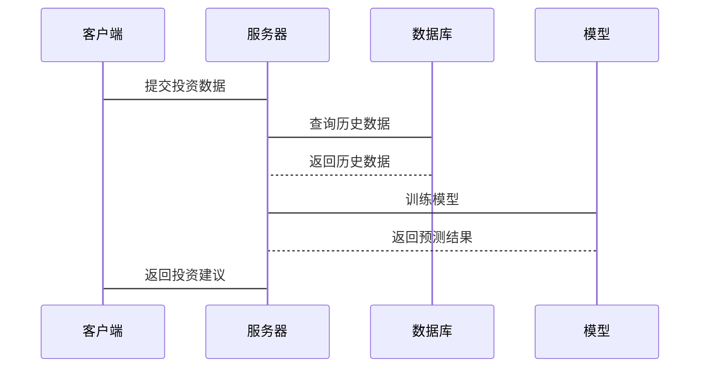

                 


```markdown
# 机器学习在另类投资标的选择中的应用

> 关键词：机器学习，另类投资，特征工程，数据预处理，投资决策

> 摘要：本文探讨了机器学习在另类投资标的选择中的应用，分析了机器学习的基本概念和算法原理，详细讲解了如何将机器学习应用于另类投资中的特征工程、数据预处理和投资决策。通过实际案例分析，展示了机器学习在另类投资中的优势和潜力。

---

# 第一部分: 背景介绍

## 第1章: 机器学习的基本概念

### 1.1 机器学习的定义

机器学习是一种人工智能技术，通过数据和经验来训练模型，使其能够进行预测或决策。它主要分为监督学习、无监督学习和强化学习三种类型。

### 1.2 机器学习的核心概念

- **特征工程**：通过提取和选择特征，提高模型的性能。
- **数据预处理**：对数据进行清洗和转换，确保数据质量。
- **模型训练**：使用训练数据训练模型，使其能够准确预测。

### 1.3 机器学习与传统投资的区别

- **传统投资**：依赖于人工分析和经验判断。
- **机器学习**：利用数据和算法自动进行分析和决策。

## 第2章: 另类投资标的定义与特点

### 2.1 另类投资的定义

另类投资是指投资于传统证券之外的资产，如私募股权、对冲基金、房地产等。

### 2.2 另类投资标的类型

- **私募股权**：投资于未上市公司。
- **对冲基金**：通过多种策略进行投资。
- **房地产**：投资于房地产资产。

### 2.3 另类投资的独特优势

- **分散风险**：投资于不同类型的资产，降低风险。
- **高回报潜力**：某些另类资产可能带来更高的回报。

## 第3章: 机器学习在另类投资中的应用背景

### 3.1 投资领域中的数据驱动决策

随着数据量的增加，投资决策越来越多地依赖于数据和算法。

### 3.2 传统投资方法的局限性

传统投资方法依赖于经验和主观判断，存在一定的局限性。

### 3.3 机器学习在投资中的独特优势

机器学习能够处理大量数据，发现复杂模式，提高投资决策的准确性。

---

# 第二部分: 核心概念与联系

## 第4章: 机器学习的核心原理

### 4.1 监督学习、无监督学习和强化学习的定义与区别

- **监督学习**：使用标记的数据进行训练，预测新的数据。
- **无监督学习**：在无标记数据中发现模式。
- **强化学习**：通过试错学习，优化决策策略。

### 4.2 机器学习模型的训练过程

1. **数据收集**：获取训练数据。
2. **特征工程**：提取和选择特征。
3. **模型训练**：使用算法训练模型。
4. **模型评估**：验证模型的性能。

### 4.3 特征工程在机器学习中的作用

- **特征选择**：选择重要的特征。
- **特征变换**：对特征进行转换，提高模型性能。

## 第5章: 另类投资标的选择的核心要素

### 5.1 投资标的特征分析

- **财务指标**：如市盈率、市净率等。
- **市场趋势**：如宏观经济指标、行业趋势等。

### 5.2 数据预处理与特征提取

- **数据清洗**：处理缺失值、异常值。
- **特征提取**：从数据中提取有用的特征。

### 5.3 投资决策的逻辑模型

- **回归模型**：预测目标变量。
- **分类模型**：分类投资标的类型。

## 第6章: 机器学习与另类投资的结合

### 6.1 机器学习在另类投资中的核心流程

1. **数据收集**：获取另类投资的相关数据。
2. **特征工程**：提取和处理特征。
3. **模型训练**：训练机器学习模型。
4. **模型部署**：将模型应用于实际投资决策。

### 6.2 机器学习与另类投资的相互作用

- **数据驱动决策**：利用机器学习处理大量数据，提高决策的准确性。
- **自动化投资**：通过机器学习自动进行投资决策。

### 6.3 机器学习在另类投资中的应用案例

- **私募股权筛选**：使用机器学习模型筛选潜在的投资目标。
- **对冲基金评价**：通过机器学习模型评价对冲基金的表现。

---

# 第三部分: 算法原理讲解

## 第7章: 常见机器学习算法及其在投资中的应用

### 7.1 线性回归

- **定义**：通过拟合直线预测目标变量。
- **应用**：预测股票价格走势。

### 7.2 支持向量机（SVM）

- **定义**：通过划分数据点进行分类。
- **应用**：分类投资标的类型。

### 7.3 随机森林

- **定义**：通过集成多个决策树进行分类或回归。
- **应用**：预测市场趋势。

### 7.4 神经网络

- **定义**：模拟人脑神经网络，进行复杂模式识别。
- **应用**：识别市场中的复杂模式。

## 第8章: 机器学习算法的数学模型与公式

### 8.1 线性回归的数学模型

$$ y = \beta_0 + \beta_1 x + \epsilon $$

### 8.2 支持向量机的数学模型

$$ \text{目标函数}：\min \frac{1}{2}||\beta||^2 $$
$$ \text{约束条件}：y_i(\beta_0 + \beta_1 x_i) \geq 1 $$

### 8.3 随机森林的数学模型

随机森林通过集成多个决策树，提高模型的准确性和稳定性。

### 8.4 神经网络的数学模型

$$ \text{输入层} \rightarrow \text{隐藏层} \rightarrow \text{输出层} $$

## 第9章: 算法流程图与代码示例

### 9.1 线性回归的流程图

```mermaid
graph LR
    A[数据输入] -> B[特征工程]
    B -> C[模型训练]
    C -> D[模型预测]
```

### 9.2 线性回归的Python代码

```python
import numpy as np
from sklearn.linear_model import LinearRegression

# 数据准备
X = np.array([1, 2, 3, 4, 5]).reshape(-1, 1)
y = np.array([2, 4, 5, 4, 5])

# 模型训练
model = LinearRegression()
model.fit(X, y)

# 预测
print(model.predict([[6]]))
```

---

# 第四部分: 系统分析与架构设计方案

## 第10章: 问题场景介绍

### 10.1 投资决策系统的需求分析

- **目标**：提高投资决策的准确性和效率。
- **用户需求**：投资者需要快速、准确的投资建议。

### 10.2 项目介绍

开发一个基于机器学习的另类投资决策系统。

## 第11章: 系统功能设计

### 11.1 领域模型（Mermaid 类图）


### 11.2 系统架构设计（Mermaid 架构图）

```mermaid
client
    server
        database
        model
            predictor
```

### 11.3 系统接口设计

- **输入接口**：接收投资数据。
- **输出接口**：输出投资建议。

### 11.4 系统交互（Mermaid 序列图）



---

# 第五部分: 项目实战

## 第12章: 环境安装与系统核心实现

### 12.1 环境安装

- **Python**：安装Python 3.x
- **库安装**：安装numpy、pandas、scikit-learn等库。

### 12.2 核心代码实现

```python
import numpy as np
import pandas as pd
from sklearn.model_selection import train_test_split
from sklearn.linear_model import LinearRegression
from sklearn.metrics import mean_squared_error

# 数据加载
data = pd.read_csv('investment_data.csv')
X = data[['feature1', 'feature2']]
y = data['target']

# 数据分割
X_train, X_test, y_train, y_test = train_test_split(X, y, test_size=0.2)

# 模型训练
model = LinearRegression()
model.fit(X_train, y_train)

# 预测与评估
y_pred = model.predict(X_test)
print(mean_squared_error(y_test, y_pred))
```

### 12.3 代码解读与分析

- **数据加载**：读取投资数据。
- **数据分割**：将数据分为训练集和测试集。
- **模型训练**：训练线性回归模型。
- **预测与评估**：预测结果并评估模型性能。

## 第13章: 实际案例分析

### 13.1 案例背景

分析某私募股权的投资潜力。

### 13.2 数据分析

- **特征分析**：分析各特征对投资回报的影响。
- **模型预测**：使用机器学习模型预测投资回报。

### 13.3 案例结论

通过机器学习模型，准确预测了私募股权的投资回报。

---

# 第六部分: 最佳实践与总结

## 第14章: 小结

### 14.1 机器学习在另类投资中的优势

- **数据驱动决策**：提高投资决策的准确性。
- **自动化投资**：提高投资效率。

### 14.2 注意事项

- **数据质量**：确保数据的准确性和完整性。
- **模型解释性**：确保模型的可解释性。

## 第15章: 注意事项与拓展阅读

### 15.1 注意事项

- **模型过拟合**：避免模型过拟合训练数据。
- **数据泄露**：避免数据泄露影响模型的泛化能力。

### 15.2 拓展阅读

- **《机器学习实战》**：深入理解机器学习算法。
- **《投资学》**：了解投资学的基本理论。

## 第16章: 作者信息

作者：AI天才研究院/AI Genius Institute & 禅与计算机程序设计艺术 /Zen And The Art of Computer Programming

---

以上是《机器学习在另类投资标的选择中的应用》的完整目录和内容概述。通过系统地讲解机器学习的基本概念、算法原理以及在另类投资中的具体应用，本文为读者提供了全面的视角，帮助他们在实际投资中更好地应用机器学习技术。
```

