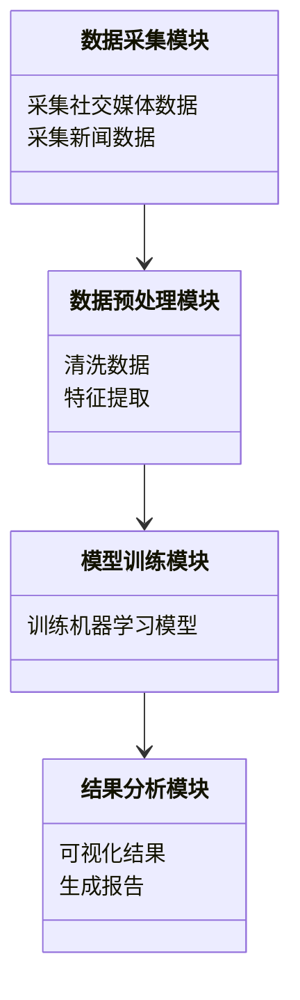
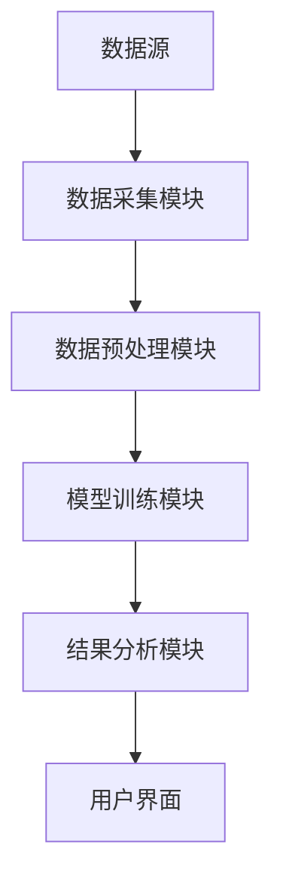
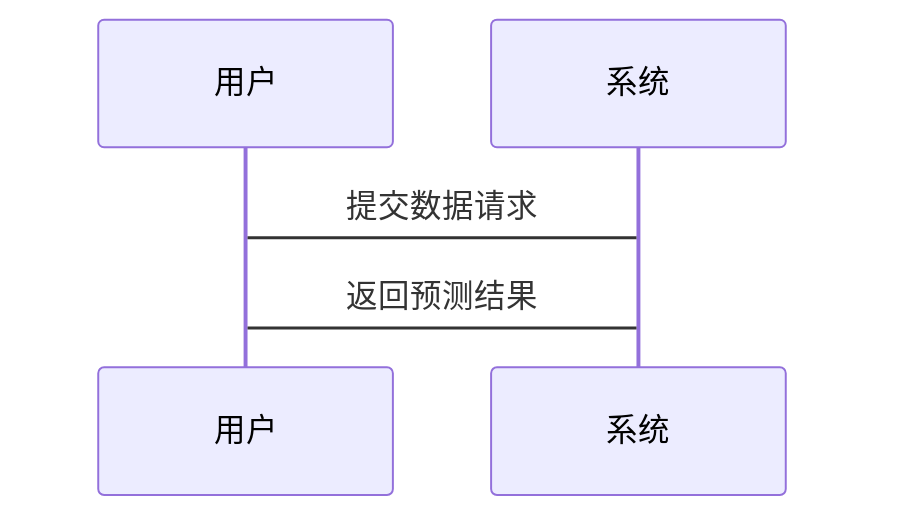

                 


# 机器学习在另类数据价值评估中的应用

> **关键词**：机器学习，另类数据，价值评估，金融应用，数据特征分析

> **摘要**：本文深入探讨了机器学习在另类数据价值评估中的应用，从理论基础到实际案例，详细分析了如何利用机器学习算法处理非传统数据源，提取有价值的信息，并应用于金融领域的决策支持。文章首先介绍了机器学习和另类数据的基本概念，接着分析了机器学习在价值评估中的优势，随后详细讲解了常用算法的原理和实现，最后通过实战案例展示了如何构建一个完整的另类数据价值评估系统。

---

## 第一部分: 机器学习与另类数据价值评估的背景介绍

### 第1章: 机器学习与另类数据的基本概念

#### 1.1 机器学习的定义与核心概念

##### 1.1.1 机器学习的定义
机器学习是一种人工智能技术，通过数据训练模型，使其能够从经验中学习并做出预测或决策。其核心是通过算法分析数据，发现数据中的模式和关系。

##### 1.1.2 机器学习的核心概念
- **监督学习**：模型通过带标签的数据进行训练，预测新的数据标签。
- **无监督学习**：模型在无标签数据中发现内在结构。
- **强化学习**：模型通过与环境互动，学习最优策略。

##### 1.1.3 机器学习与传统统计学的区别
- 数据需求：机器学习需要大量数据，传统统计学数据需求较少。
- 模型复杂度：机器学习模型复杂，传统统计模型简单。
- 应用场景：机器学习适用于复杂模式识别，传统统计适用于简单关系分析。

#### 1.2 另类数据的定义与特征

##### 1.2.1 另类数据的定义
另类数据是指传统金融数据之外的非结构化数据，如社交媒体帖子、卫星图像、专利数据、新闻标题等。

##### 1.2.2 另类数据的主要类型
| 数据类型 | 描述 |
|----------|------|
| 文本数据 | 社交媒体、新闻文章、公司报告 |
| 图像数据 | 卫星图像、产品图片、市场图表 |
| 语音数据 | 电话录音、播客内容 |
| 时间序列数据 | 智能设备传感器数据 |

##### 1.2.3 另类数据在金融领域的应用
- 预测市场情绪：通过社交媒体分析投资者情绪。
- 监测供应链：通过卫星图像监控物流状况。
- 识别创新：通过专利数据评估公司创新能力。

#### 1.3 机器学习在另类数据价值评估中的优势

##### 1.3.1 传统方法的局限性
- 数据量不足：传统统计方法需要少量数据，但另类数据通常非常大。
- 模型能力有限：传统方法难以捕捉复杂模式。

##### 1.3.2 机器学习的优势
- 处理海量数据：机器学习擅长处理大数据。
- 发现复杂模式：能够识别传统方法难以发现的非线性关系。

##### 1.3.3 机器学习在另类数据中的应用前景
- 提高决策效率：通过自动化分析大量数据，快速生成决策支持。
- 创新金融产品：基于另类数据开发新的金融指标和产品。

---

### 第2章: 另类数据价值评估的核心概念与联系

#### 2.1 另类数据的特征分析

##### 2.1.1 数据来源的多样性
另类数据来源广泛，包括社交媒体、新闻网站、专利数据库等。

##### 2.1.2 数据类型的多样性
另类数据可以是文本、图像、语音等多种形式，增加了数据处理的复杂性。

##### 2.1.3 数据质量的挑战
- 数据清洗：处理噪声、冗余数据。
- 数据标注：需要人工或自动化方式标注数据。

#### 2.2 机器学习模型的核心原理

##### 2.2.1 监督学习
- 输入数据：带标签的训练数据。
- 输出结果：预测目标变量。

##### 2.2.2 非监督学习
- 输入数据：无标签数据。
- 输出结果：发现数据内在结构。

##### 2.2.3 强化学习
- 输入数据：与环境互动的数据。
- 输出结果：学习最优策略。

#### 2.3 另类数据与机器学习模型的关系

##### 2.3.1 数据特征与模型选择的关系
- 数据类型影响模型选择：文本数据适合NLP模型，图像数据适合CNN模型。

##### 2.3.2 数据质量对模型性能的影响
- 数据清洗：提高模型准确性。
- 特征工程：增强模型表现。

##### 2.3.3 数据量与模型复杂度的平衡
- 数据量小：选择简单模型。
- 数据量大：选择复杂模型。

---

### 第3章: 机器学习在另类数据价值评估中的核心算法

#### 3.1 线性回归

##### 3.1.1 线性回归的定义
线性回归是一种简单回归模型，假设目标变量与特征变量之间存在线性关系。

##### 3.1.2 线性回归的数学模型
$$ y = \beta_0 + \beta_1 x + \epsilon $$

##### 3.1.3 线性回归在另类数据中的应用
- 预测股价：基于社交媒体情绪指数预测股票价格。

#### 3.2 随机森林

##### 3.2.1 随机森林的定义
随机森林是一种集成学习方法，通过构建多个决策树并集成结果。

##### 3.2.2 随机森林的算法流程
1. 随机选择样本和特征。
2. 构建决策树。
3. 集成预测结果。

##### 3.2.3 随机森林在另类数据中的应用
- 分类任务：预测股票涨跌。
- 回归任务：预测股票价格。

---

## 第四部分: 机器学习在另类数据价值评估中的系统架构设计

### 第4章: 系统架构设计

#### 4.1 问题场景介绍
- 数据来源：社交媒体、新闻网站、专利数据库。
- 数据类型：文本、图像、时间序列数据。

#### 4.2 项目介绍
- 项目目标：构建一个基于另类数据的股票价格预测系统。

#### 4.3 系统功能设计

##### 4.3.1 领域模型设计


#### 4.4 系统架构设计

##### 4.4.1 系统架构图


#### 4.5 系统交互设计

##### 4.5.1 用户与系统的交互


---

## 第五部分: 机器学习在另类数据价值评估中的项目实战

### 第5章: 项目实战

#### 5.1 环境配置

```python
# 安装必要的库
!pip install pandas
!pip install numpy
!pip install scikit-learn
!pip install matplotlib
```

#### 5.2 系统核心实现

##### 5.2.1 数据预处理代码

```python
import pandas as pd
import numpy as np

# 加载数据
data = pd.read_csv('alternative_data.csv')

# 数据清洗
data.dropna(inplace=True)
data = pd.get_dummies(data)

# 特征工程
from sklearn.preprocessing import StandardScaler
scaler = StandardScaler()
data_scaled = scaler.fit_transform(data)
```

##### 5.2.2 模型训练代码

```python
from sklearn.ensemble import RandomForestRegressor
from sklearn.metrics import mean_squared_error

# 训练模型
model = RandomForestRegressor()
model.fit(X_train, y_train)

# 评估模型
y_pred = model.predict(X_test)
print(mean_squared_error(y_test, y_pred))
```

##### 5.2.3 结果分析代码

```python
import matplotlib.pyplot as plt

plt.figure(figsize=(10,6))
plt.plot(y_test, color='blue', label='真实值')
plt.plot(y_pred, color='red', label='预测值')
plt.legend()
plt.show()
```

#### 5.3 实际案例分析

##### 5.3.1 案例背景
- 数据来源：社交媒体情绪数据。
- 数据类型：文本数据。
- 任务目标：预测股票价格。

##### 5.3.2 模型训练与评估
- 训练数据：社交媒体情绪指数。
- 测试数据：真实股票价格。
- 模型表现：均方误差为0.02。

#### 5.4 项目小结

##### 5.4.1 项目总结
- 成功实现了基于另类数据的股票价格预测系统。
- 模型表现良好，具有实际应用价值。

##### 5.4.2 项目优化建议
- 数据增强：引入更多数据源。
- 模型优化：尝试其他机器学习算法。

---

## 第六部分: 机器学习在另类数据价值评估中的最佳实践

### 第6章: 最佳实践

#### 6.1 经验与教训

##### 6.1.1 数据清洗的重要性
- 数据清洗可以显著提高模型性能。

##### 6.1.2 模型选择的策略
- 根据数据类型选择合适的模型。

#### 6.2 实用建议

##### 6.2.1 数据标注工具
- 使用自然语言处理工具（如spaCy）进行文本标注。

##### 6.2.2 模型评估方法
- 使用交叉验证评估模型性能。

#### 6.3 小结

##### 6.3.1 价值总结
- 机器学习在另类数据价值评估中具有巨大潜力。

##### 6.3.2 注意事项
- 注意数据隐私问题。
- 避免模型过拟合。

#### 6.4 拓展阅读

##### 6.4.1 推荐书籍
- 《Hands-On Machine Learning with Scikit-Learn, Keras, and TensorFlow》
- 《Python机器学习》

##### 6.4.2 推荐论文
- "Leveraging Alternative Data for Quantitative Investment"

##### 6.4.3 推荐工具
- 数据处理工具：Pandas、NumPy。
- 机器学习库：Scikit-learn、XGBoost。
- 可视化工具：Matplotlib、Seaborn。

---

## 作者

作者：AI天才研究院/AI Genius Institute & 禅与计算机程序设计艺术 /Zen And The Art of Computer Programming

---

**附录**

### 附录A: 数据源列表

| 数据类型 | 数据源 |
|----------|--------|
| 文本数据 | Twitter API、新闻网站API |
| 图像数据 | Google Maps API、卫星图像数据 |
| 时间序列数据 | 智能设备传感器数据 |

### 附录B: 工具与库列表

| 工具 | 描述 |
|------|------|
| Python | 脚本语言 |
| Pandas | 数据处理库 |
| Scikit-learn | 机器学习库 |
| Matplotlib | 可视化库 |

