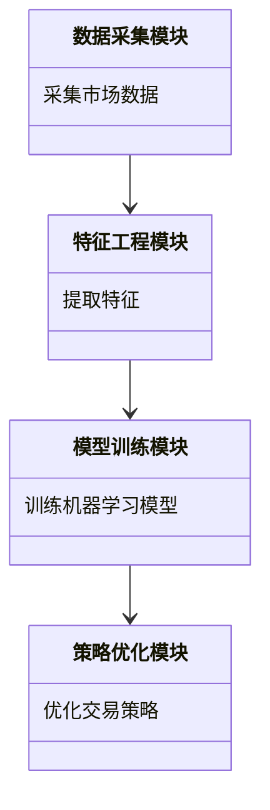
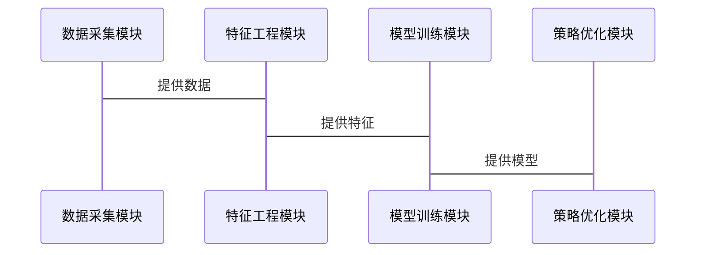

                 


# 机器学习在市场微观结构分析中的应用

> 关键词：机器学习，市场微观结构，时间序列分析，强化学习，交易策略优化，金融数据分析，订单簿分析

> 摘要：本文系统地探讨了机器学习在市场微观结构分析中的应用，从基础概念到具体算法，从理论分析到实际案例，全面解析了如何利用机器学习技术来理解和优化市场微观结构。文章首先介绍了机器学习和市场微观结构的基本概念，然后深入分析了特征工程、模型选择、算法原理等内容，最后通过实际案例展示了机器学习在交易策略优化中的应用，并展望了未来的研究方向。

---

# 第一部分: 机器学习与市场微观结构分析基础

## 第1章: 机器学习基础

### 1.1 机器学习的基本概念

#### 1.1.1 机器学习的定义与分类
机器学习是一种人工智能技术，通过数据驱动的方式，让计算机能够从经验中学习并改进性能。机器学习主要分为以下三类：
- **监督学习**：基于标签数据，学习输入到输出的映射关系。
- **无监督学习**：基于无标签数据，发现数据中的内在结构。
- **强化学习**：通过与环境交互，学习最优决策策略。

#### 1.1.2 监督学习、无监督学习与强化学习
- **监督学习**：常见于回归和分类任务，例如预测股票价格或识别市场状态。
- **无监督学习**：用于聚类分析，例如将交易行为分为不同类型。
- **强化学习**：用于动态决策，例如优化交易策略。

#### 1.1.3 机器学习的核心要素与流程
- **数据**：输入数据的质量直接影响模型的性能。
- **特征**：特征的选择和工程化是模型性能的关键。
- **模型**：选择合适的算法并进行调优。
- **评估**：通过指标（如准确率、召回率）评估模型性能。
- **部署**：将模型应用于实际场景中。

### 1.2 市场微观结构分析基础

#### 1.2.1 市场微观结构的定义
市场微观结构是指市场中交易活动的细节，包括订单簿、交易量、价格变化等。它反映了市场参与者的交易行为和市场流动性。

#### 1.2.2 市场参与者与订单簿
- **订单簿**：记录了市场参与者当前挂单的详细信息，包括买入价、卖出价、数量等。
- **市场参与者**：包括机构投资者、高频交易者、零售投资者等。

#### 1.2.3 市场微观结构的特征与挑战
- **动态性**：市场状态会随着时间变化。
- **噪声**：数据中存在大量随机噪声，影响模型的准确性。
- **复杂性**：不同参与者的行为交织在一起，增加了分析的难度。

### 1.3 机器学习在金融领域的应用

#### 1.3.1 机器学习在金融中的典型应用
- **股票价格预测**：使用时间序列模型预测股票价格。
- **风险管理**：通过无监督学习发现市场风险。
- **交易策略优化**：利用强化学习优化交易决策。

#### 1.3.2 市场微观结构分析中的机器学习
- **订单簿分析**：通过机器学习提取订单簿中的隐含信息。
- **交易行为分析**：识别高频交易者的行为模式。
- **市场流动性预测**：预测市场的流动性变化。

#### 1.3.3 当前研究的热点与难点
- **热点**：高频交易、市场情绪分析、订单簿预测。
- **难点**：数据稀疏性、模型解释性、实时性要求高。

---

## 第2章: 市场微观结构分析的核心概念

### 2.1 市场微观结构的核心要素

#### 2.1.1 订单簿数据
订单簿数据是市场微观结构的核心，记录了当前市场上所有买入和卖出订单的信息。订单簿数据通常包括以下字段：
- **买价（Bids）**：当前市场上的买入价格和数量。
- **卖价（Asks）**：当前市场上的卖出价格和数量。
- **深度（Depth）**：订单簿的深度，表示有多少个订单排队。

#### 2.1.2 市场深度与流动性
- **市场深度**：订单簿中所有未成交的订单的总数量，反映了市场的交易潜力。
- **流动性**：市场买卖订单的深度和交易活跃程度，影响价格的波动性。

#### 2.1.3 市场微观结构的动态特征
- **价格变化**：短时间内价格的快速波动。
- **交易量**：交易的活跃程度。
- **订单取消**：订单被取消的频率和原因。

### 2.2 机器学习与市场微观结构的结合

#### 2.2.1 数据特征的提取
- **时间序列特征**：如均值、标准差、自相关系数等。
- **市场状态特征**：如买方主导、卖方主导等。

#### 2.2.2 模型选择与优化
- **特征选择**：选择对模型性能影响最大的特征。
- **模型优化**：通过交叉验证调优模型参数。

#### 2.2.3 市场风险的预测与控制
- **风险预测**：通过机器学习模型预测市场的波动性。
- **风险控制**：制定风险控制策略，如止损、止盈。

---

## 第3章: 机器学习算法原理与市场微观结构分析

### 3.1 时间序列分析

#### 3.1.1 时间序列的基本特征
时间序列数据具有以下特点：
- **趋势性**：数据随时间呈现上升或下降趋势。
- **周期性**：数据呈现一定的周期性波动。
- **随机性**：数据中包含随机噪声。

#### 3.1.2 常见的时间序列模型
- **ARIMA模型**：自回归积分滑动模型，用于预测时间序列数据。
- **LSTM模型**：长短期记忆网络，适合处理长序列数据。

#### 3.1.3 机器学习在时间序列预测中的应用
- **股票价格预测**：使用LSTM模型预测股票价格。
- **订单簿预测**：预测订单簿的变化趋势。

### 3.2 强化学习在交易策略中的应用

#### 3.2.1 强化学习的基本原理
- **状态（State）**：市场当前的状态，如价格、订单簿等。
- **动作（Action）**：交易者可以执行的动作，如买入、卖出或持有。
- **奖励（Reward）**：交易者根据动作获得的收益或惩罚。

#### 3.2.2 交易策略的强化学习框架
- **策略函数**：定义交易策略，如$\pi(s) = \arg\max_a Q(s,a)$。
- **价值函数**：评估状态-动作对的期望收益，如$Q(s,a) = r + \gamma \max_a Q(s',a)$。

#### 3.2.3 实例分析：基于强化学习的交易策略优化
- **环境设计**：模拟真实的交易环境。
- **策略优化**：通过强化学习算法优化交易策略。

### 3.3 监督学习与非监督学习在市场分析中的应用

#### 3.3.1 监督学习在价格预测中的应用
- **回归分析**：预测连续型变量，如股票价格。
- **分类分析**：预测离散型变量，如市场状态。

#### 3.3.2 非监督学习在市场风险中的应用
- **聚类分析**：将交易行为分为不同类型。
- **异常检测**：识别异常交易行为。

---

## 第4章: 系统分析与架构设计方案

### 4.1 问题场景介绍
- **目标**：优化交易策略，提高盈利能力。
- **数据来源**：订单簿数据、交易数据、市场数据。

### 4.2 项目介绍
- **项目名称**：基于机器学习的交易策略优化系统。
- **项目目标**：利用机器学习技术优化交易策略。

### 4.3 系统功能设计
- **功能模块**：
  - 数据采集模块：采集市场数据。
  - 特征工程模块：提取特征。
  - 模型训练模块：训练机器学习模型。
  - 策略优化模块：优化交易策略。

#### 4.3.1 领域模型（Mermaid类图）



### 4.4 系统架构设计（Mermaid架构图）

```mermaid
container 数据源 {
    数据采集模块
}
container 数据处理 {
    特征工程模块
}
container 模型训练 {
    模型训练模块
}
container 策略优化 {
    策略优化模块
}
数据源 --> 数据处理
数据处理 --> 模型训练
模型训练 --> 策略优化
```

### 4.5 系统接口设计
- **数据接口**：数据采集模块与数据源的接口。
- **模型接口**：模型训练模块与策略优化模块的接口。

### 4.6 系统交互设计（Mermaid序列图）



---

## 第5章: 项目实战

### 5.1 环境配置
- **Python环境**：安装Python 3.8以上版本。
- **依赖库**：安装numpy、pandas、scikit-learn、tensorflow等。

### 5.2 核心实现

#### 5.2.1 数据获取
```python
import pandas as pd
data = pd.read_csv('market_data.csv')
```

#### 5.2.2 特征工程
```python
from sklearn.preprocessing import StandardScaler
scaler = StandardScaler()
features = scaler.fit_transform(data[['bid_price', 'ask_price', 'volume']])
```

#### 5.2.3 模型训练
```python
from sklearn.linear_model import LinearRegression
model = LinearRegression()
model.fit(features, labels)
```

#### 5.2.4 交易策略优化
```python
def strategy(price, model):
    if model.predict(price) > 0.5:
        return 'buy'
    else:
        return 'hold'
```

### 5.3 案例分析
- **环境**：高频交易市场。
- **数据**：某股票的订单簿数据。
- **模型**：LSTM模型。
- **策略**：基于LSTM模型的交易策略。

### 5.4 实施步骤
1. 数据预处理。
2. 特征工程。
3. 模型训练。
4. 策略优化。
5. 回测与优化。

---

## 第6章: 总结与展望

### 6.1 总结
本文系统地探讨了机器学习在市场微观结构分析中的应用，从理论到实践，全面解析了如何利用机器学习技术优化交易策略。

### 6.2 未来研究方向
- **算法优化**：探索更高效的算法。
- **数据源扩展**：利用更多数据源进行分析。
- **实时性提升**：优化模型的实时性。

### 6.3 最佳实践 tips
- 数据质量是关键。
- 模型调优是关键。
- 实时性是挑战。

---

# 作者：AI天才研究院/AI Genius Institute & 禅与计算机程序设计艺术 /Zen And The Art of Computer Programming

