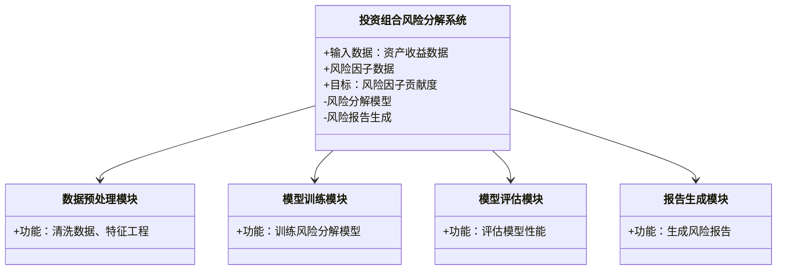
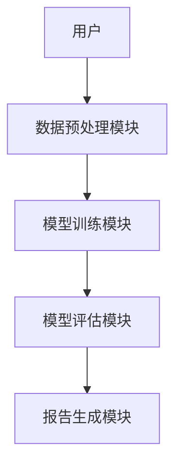

                 

# 机器学习在投资组合风险分解中的应用

> 关键词：机器学习、投资组合、风险分解、金融分析、算法、数学建模

> 摘要：本文探讨了机器学习在投资组合风险分解中的应用，通过逐步分析和实例，详细介绍了投资组合风险分解的核心概念、机器学习算法的原理、系统架构设计以及实际项目实现。文章从背景介绍、核心概念、算法原理、系统分析、项目实战到总结与展望，全面阐述了机器学习如何在投资组合风险分解中发挥重要作用。

---

# 第一部分: 投资组合风险分解的背景与基础

## 第1章: 投资组合风险分解概述

### 1.1 投资组合风险的基本概念

#### 1.1.1 什么是投资组合
投资组合是指将一定资金按照一定比例投资于多种金融资产（如股票、债券、基金等）的集合。通过合理配置资产，投资组合可以在追求收益的同时降低风险。

#### 1.1.2 投资组合风险的定义
投资组合的风险是指投资组合的收益可能偏离预期值的程度。常见的风险指标包括波动率、VaR（Value at Risk）和CVaR（Conditional Value at Risk）。

#### 1.1.3 风险分解的意义
风险分解是指将投资组合的整体风险分解为各个资产或风险因子的贡献。通过风险分解，投资者可以更好地理解风险来源，并采取相应的风险管理策略。

### 1.2 投资组合风险分解的背景

#### 1.2.1 传统投资组合管理的局限性
传统的投资组合管理方法主要依赖于历史数据和统计模型，难以捕捉复杂的市场动态和非线性关系。

#### 1.2.2 机器学习在金融领域的应用现状
机器学习在金融领域的应用日益广泛，尤其是在风险评估、资产定价和交易策略制定方面。

#### 1.2.3 机器学习在风险分解中的优势
机器学习能够处理高维数据，捕捉非线性关系，并实时更新模型，从而在风险分解中具有显著优势。

### 1.3 本书的核心问题与目标

#### 1.3.1 问题背景
投资组合风险分解的传统方法存在数据依赖性强、解释性差等问题，难以满足复杂金融市场的分析需求。

#### 1.3.2 问题描述
如何利用机器学习技术将投资组合的整体风险分解为各资产或风险因子的贡献，并量化其对整体风险的贡献程度。

#### 1.3.3 问题解决的思路
通过机器学习算法，构建风险分解模型，量化各资产或风险因子对整体风险的贡献。

#### 1.3.4 边界与外延
本研究仅关注投资组合层面的风险分解，不涉及单资产的风险分析。

#### 1.3.5 核心概念与组成要素
- 投资组合：一组金融资产的集合。
- 风险因子：影响资产收益的主要因素（如市场风险、利率风险等）。
- 机器学习模型：用于分解风险的算法。

### 1.4 本章小结
本章介绍了投资组合风险分解的核心概念，分析了传统方法的局限性，提出了利用机器学习技术解决风险分解问题的思路。

---

## 第2章: 机器学习基础

### 2.1 机器学习的基本概念

#### 2.1.1 机器学习的定义
机器学习是一种人工智能技术，通过数据训练模型，使其能够从数据中学习并做出预测或决策。

#### 2.1.2 机器学习的核心要素
- 数据：输入特征和目标变量。
- 模型：算法或规则，用于数据到预测的映射。
- 训练：通过优化目标函数使模型适应数据。

#### 2.1.3 机器学习的主要流派
- 监督学习：基于标注数据的训练。
- 无监督学习：基于无标注数据的学习。
- 强化学习：通过与环境交互学习策略。

### 2.2 监督学习与无监督学习

#### 2.2.1 监督学习的定义与特点
监督学习基于标注数据训练模型，输入特征和目标变量已知。

#### 2.2.2 无监督学习的定义与特点
无监督学习在无标注数据上发现数据中的潜在结构。

#### 2.2.3 监督与无监督学习的区别与联系
- 监督学习适用于预测任务，无监督学习适用于发现模式。
- 两者都依赖于数据和模型优化。

### 2.3 特征工程的重要性

#### 2.3.1 特征工程的定义
特征工程是指从原始数据中提取对模型有用的特征，提升模型性能。

#### 2.3.2 特征工程的核心步骤
1. 特征选择：筛选重要特征。
2. 特征变换：将特征转换为更适合模型的形式。
3. 特征构造：根据业务需求构造新特征。

#### 2.3.3 特征选择与特征提取
- 特征选择：基于统计或模型的重要性选择特征。
- 特征提取：通过降维技术（如PCA）提取特征。

### 2.4 本章小结
本章介绍了机器学习的基本概念和主要流派，重点讲解了监督学习和无监督学习的特点，以及特征工程的重要性。

---

## 第3章: 机器学习在投资组合风险分解中的应用

### 3.1 投资组合风险分解的核心问题

#### 3.1.1 风险因子的识别
识别影响投资组合收益的主要风险因子，如市场风险、流动性风险等。

#### 3.1.2 风险因子的量化
量化各风险因子对投资组合收益的贡献程度。

#### 3.1.3 风险分解的目标
通过机器学习模型，量化各风险因子对整体风险的贡献。

### 3.2 机器学习在风险分解中的优势

#### 3.2.1 数据驱动的优势
机器学习能够利用大数据和复杂模型，捕捉传统方法难以发现的模式。

#### 3.2.2 非线性关系的捕捉
机器学习模型能够处理复杂的非线性关系，提升风险分解的准确性。

#### 3.2.3 高维数据的处理能力
机器学习擅长处理高维数据，适用于多资产投资组合的风险分解。

### 3.3 机器学习在风险分解中的挑战

#### 3.3.1 数据质量的问题
数据噪声和缺失值可能影响模型的准确性。

#### 3.3.2 模型过拟合的风险
复杂的模型可能过拟合训练数据，降低泛化能力。

#### 3.3.3 解释性的要求
风险分解需要模型具有较高的解释性，以便投资者理解和决策。

### 3.4 本章小结
本章分析了机器学习在投资组合风险分解中的优势和挑战，强调了数据质量和模型解释性的重要性。

---

## 第4章: 机器学习算法原理

### 4.1 监督学习算法

#### 4.1.1 线性回归
线性回归用于预测目标变量与特征变量之间的线性关系。数学表达式为：
$$ y = \beta_0 + \beta_1x_1 + \beta_2x_2 + \dots + \beta_nx_n + \epsilon $$
其中，$\beta$为回归系数，$\epsilon$为误差项。

#### 4.1.2 支持向量机
支持向量机（SVM）通过构建超平面将数据分为不同类别，适用于分类和回归任务。

#### 4.1.3 随机森林
随机森林是一种基于决策树的集成学习方法，通过随机采样和特征选择提高模型鲁棒性。

### 4.2 无监督学习算法

#### 4.2.1 K-means聚类
K-means算法通过最小化聚类中心与样本点的距离，将数据划分为K个簇。

#### 4.2.2 主成分分析
主成分分析（PCA）通过降维技术提取数据的主要特征，减少数据维度。

#### 4.2.3 层次聚类
层次聚类通过构建树状结构，逐步合并相似的样本点，形成聚类。

### 4.3 神经网络与深度学习

#### 4.3.1 多层感知机
多层感知机（MLP）是一种前馈神经网络，通过多层非线性变换捕捉数据的复杂模式。

#### 4.3.2 卷积神经网络
卷积神经网络（CNN）主要用于图像识别，但在金融时间序列分析中也有应用。

#### 4.3.3 循环神经网络
循环神经网络（RNN）适用于时间序列数据，能够捕捉序列的依赖关系。

### 4.4 本章小结
本章介绍了常用的监督学习和无监督学习算法，重点讲解了线性回归、随机森林和神经网络的原理及其在风险分解中的应用。

---

## 第5章: 投资组合的构建与优化

### 5.1 现代投资组合理论

#### 5.1.1 马科维茨均值-方差模型
马科维茨模型通过优化目标函数，找到最优投资组合，使风险最小化或收益最大化。

数学表达式为：
$$ \min_w \frac{1}{2}w^T \Sigma w $$
$$ \text{subject to } w^T \mu = \mu_{target}, \quad 1^T w = 1 $$
其中，$w$为投资权重向量，$\Sigma$为协方差矩阵，$\mu$为收益向量。

#### 5.1.2 风险平价
风险平价是指将投资组合的风险在不同资产之间平均分配，以降低整体风险。

### 5.2 机器学习在投资组合优化中的应用

#### 5.2.1 基于机器学习的风险预测
通过机器学习模型预测资产收益，优化投资组合的风险和收益。

#### 5.2.2 基于聚类的资产配置
利用聚类算法将资产分为不同类型，优化资产配置比例。

### 5.3 风险中性化

#### 5.3.1 风险中性化的基本思想
风险中性化是指通过调整投资组合的权重，使各资产的风险贡献相等。

#### 5.3.2 风险中性化的实现步骤
1. 计算各资产的风险贡献。
2. 调整权重，使各资产的风险贡献相等。

### 5.4 本章小结
本章介绍了现代投资组合理论和机器学习在投资组合优化中的应用，重点讲解了风险平价和风险中性化的实现方法。

---

## 第6章: 系统分析与架构设计

### 6.1 项目背景

#### 6.1.1 问题场景
投资组合风险分解的场景包括资产配置、风险管理和绩效评估。

#### 6.1.2 项目目标
构建一个基于机器学习的投资组合风险分解系统，实现风险因子识别和风险贡献量化。

### 6.2 系统功能设计

#### 6.2.1 领域模型
领域模型是系统功能的抽象表示，用于描述系统的核心业务逻辑。

### 6.3 系统架构设计

### 6.4 本章小结
本章介绍了投资组合风险分解系统的背景、功能设计和架构设计，为后续的实现提供了理论基础。

---

## 第7章: 项目实战

### 7.1 环境安装

#### 7.1.1 安装Python
安装Python 3.8或更高版本，建议使用Anaconda环境管理。

#### 7.1.2 安装依赖库
安装必要的Python库，如NumPy、Pandas、Scikit-learn和XGBoost。

### 7.2 数据预处理

#### 7.2.1 数据清洗
处理缺失值、异常值和重复数据。

#### 7.2.2 特征工程
选择相关特征，进行标准化或归一化处理。

### 7.3 模型实现

#### 7.3.1 线性回归模型
使用Scikit-learn实现线性回归，量化各资产对整体风险的线性贡献。

#### 7.3.2 随机森林模型
使用Scikit-learn实现随机森林，捕捉非线性风险贡献。

### 7.4 模型调优

#### 7.4.1 参数优化
使用网格搜索或随机搜索优化模型参数。

#### 7.4.2 模型评估
通过交叉验证评估模型性能，确保模型的泛化能力。

### 7.5 结果分析

#### 7.5.1 风险贡献可视化
将各资产的风险贡献可视化，便于投资者理解和决策。

#### 7.5.2 模型解释
解释模型的输出，分析各资产对整体风险的具体贡献。

### 7.6 本章小结
本章通过具体案例展示了投资组合风险分解的实现过程，从环境安装到结果分析，详细讲解了项目的每一步。

---

## 第8章: 总结与展望

### 8.1 核心内容回顾
- 投资组合风险分解的核心概念
- 机器学习算法的原理与应用
- 系统架构设计与实现
- 项目实战的经验与教训

### 8.2 应用现状与未来趋势

#### 8.2.1 当前应用现状
机器学习在投资组合风险分解中的应用逐渐普及，但仍面临数据质量和模型解释性的挑战。

#### 8.2.2 未来发展趋势
- 更加复杂的模型（如深度学习）的应用。
- 多模态数据的整合与分析。
- 实时风险监控与动态调整。

### 8.3 最佳实践 tips

#### 8.3.1 数据质量的重要性
确保数据的完整性和准确性，避免噪声对模型的干扰。

#### 8.3.2 模型选择与调优
根据具体问题选择合适的算法，并通过交叉验证优化模型参数。

#### 8.3.3 模型解释性
在实际应用中，模型的解释性尤为重要，尤其是在金融领域。

### 8.4 本章小结
本章总结了机器学习在投资组合风险分解中的应用，展望了未来的发展方向，并给出了实际应用中的最佳实践建议。

---

# 作者：AI天才研究院/AI Genius Institute & 禅与计算机程序设计艺术 /Zen And The Art of Computer Programming

