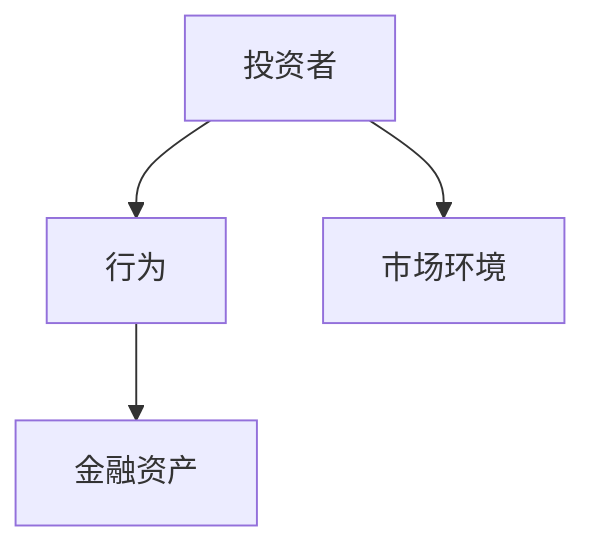
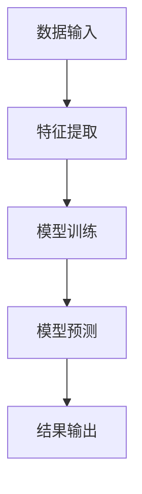
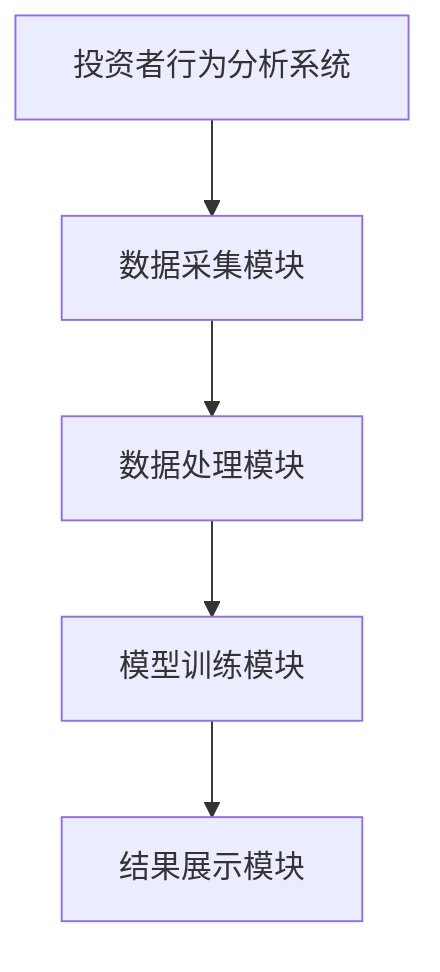
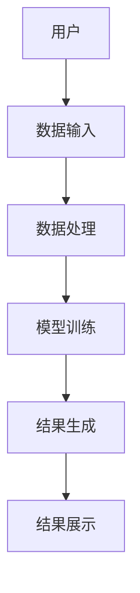

                 


# 机器学习在投资者行为分析中的应用

## 关键词：机器学习，投资者行为分析，金融数据，算法交易，行为金融学，数据驱动决策

## 摘要：  
本文详细探讨了机器学习在投资者行为分析中的应用，从基础概念到高级算法，再到实际案例，系统性地分析了如何利用机器学习技术理解投资者行为，预测市场趋势，优化投资策略。文章结合理论与实践，通过丰富的案例和详细的代码实现，帮助读者掌握机器学习在金融领域的应用技巧。

---

# 第1章: 机器学习与投资者行为分析概述

## 1.1 机器学习的基本概念

### 1.1.1 机器学习的定义与核心概念  
机器学习是一种人工智能技术，通过数据训练模型，使其能够从经验中学习并做出预测或决策。其核心概念包括：  
- **监督学习**：基于标记数据的训练，预测目标变量。  
- **非监督学习**：在无标签数据中发现模式。  
- **强化学习**：通过与环境交互，学习最优策略。  

### 1.1.2 机器学习的分类与特点  
机器学习主要分为三类：  
1. **监督学习**：如线性回归、支持向量机（SVM）。  
2. **非监督学习**：如聚类分析、主成分分析（PCA）。  
3. **强化学习**：如Q-learning、深度强化学习。  

### 1.1.3 机器学习在金融领域的应用前景  
在金融领域，机器学习广泛应用于股票价格预测、风险评估、投资组合优化等场景。其优势在于能够处理大量非结构化数据，发现隐藏的模式。

---

## 1.2 投资者行为分析的背景与意义

### 1.2.1 投资者行为分析的定义  
投资者行为分析是指通过研究投资者的决策、情绪和交易行为，揭示其行为规律。  

### 1.2.2 投资者行为分析的核心问题  
1. 投资者情绪对市场的影响。  
2. 投资者决策的理性与非理性。  
3. 投资者行为对市场波动的预测能力。  

### 1.2.3 机器学习在投资者行为分析中的作用  
- 提供数据驱动的分析方法。  
- 发现传统统计方法难以捕捉的模式。  

---

## 1.3 本章小结  
本章介绍了机器学习的基本概念及其在金融领域的应用前景，重点分析了投资者行为分析的核心问题和机器学习在其中的关键作用。

---

# 第2章: 机器学习技术基础

## 2.1 机器学习的核心算法

### 2.1.1 监督学习  
- **线性回归**：用于预测连续变量，如股票价格。  
  $$ y = \beta_0 + \beta_1x + \epsilon $$
- **支持向量机（SVM）**：用于分类和回归任务。  

### 2.1.2 非监督学习  
- **聚类分析**：发现数据中的自然分组。  
- **主成分分析（PCA）**：降维技术。  

### 2.1.3 强化学习  
- **Q-learning**：通过试错学习最优策略。  

---

## 2.2 机器学习的关键技术

### 2.2.1 数据预处理  
- 数据清洗：处理缺失值、异常值。  
- 数据标准化：如归一化处理。  

### 2.2.2 特征提取与选择  
- **特征提取**：从文本数据中提取情感特征。  
- **特征选择**：使用LASSO回归筛选重要特征。  

### 2.2.3 模型训练与评估  
- 交叉验证：评估模型的泛化能力。  
- 指标：准确率、召回率、F1分数。  

---

## 2.3 机器学习在金融中的应用案例

### 2.3.1 股票价格预测  
- 使用LSTM模型捕捉时间序列数据中的模式。  

### 2.3.2 风险评估与管理  
- 使用随机森林模型评估信用风险。  

### 2.3.3 投资组合优化  
- 使用强化学习算法优化投资组合配置。  

---

## 2.4 本章小结  
本章介绍了机器学习的核心算法及其在金融领域的应用案例，重点讲解了数据预处理和特征提取等关键技术。

---

# 第3章: 投资者行为分析的核心概念与联系

## 3.1 投资者行为分析的理论基础

### 3.1.1 行为金融学  
行为金融学研究投资者行为中的非理性因素，如过度自信、从众心理。  

### 3.1.2 投资者心理与决策模型  
- ** prospect theory**：Kahneman和Tversky提出的风险偏好模型。  

---

## 3.2 机器学习与投资者行为分析的结合

### 3.2.1 数据驱动的投资者行为建模  
- 使用自然语言处理（NLP）分析投资者情绪。  

### 3.2.2 机器学习在投资者情绪分析中的应用  
- 使用情感分析模型（如BERT）分析市场情绪。  

### 3.2.3 机器学习在投资者决策支持中的应用  
- 使用推荐系统优化投资决策。  

---

## 3.3 投资者行为分析的ER实体关系图



---

## 3.4 本章小结  
本章从理论和实践两个方面探讨了机器学习与投资者行为分析的结合，绘制了投资者行为的实体关系图。

---

# 第4章: 机器学习算法原理与实现

## 4.1 常见机器学习算法介绍

### 4.1.1 线性回归  
用于预测连续变量，如股票价格。  

### 4.1.2 支持向量机（SVM）  
用于分类和回归任务。  

### 4.1.3 随机森林  
用于分类和回归任务，具有高鲁棒性。  

### 4.1.4 神经网络  
用于复杂模式识别，如深度学习。  

---

## 4.2 算法原理与数学模型

### 4.2.1 线性回归的数学模型  
$$ y = \beta_0 + \beta_1x + \epsilon $$

### 4.2.2 支持向量机的优化目标  
$$ \min \frac{1}{2}||\beta||^2 + C \sum_{i=1}^n \xi_i $$

### 4.2.3 随机森林的投票机制  
- 分类任务：多数投票。  
- 回归任务：平均值。  

---

## 4.3 算法流程图



---

## 4.4 本章小结  
本章详细讲解了常见机器学习算法的原理和数学模型，并通过流程图展示了算法的实现过程。

---

# 第5章: 投资者行为分析的系统设计与架构

## 5.1 投资者行为分析系统的需求分析

### 5.1.1 系统目标  
分析投资者行为，预测市场趋势。  

### 5.1.2 用户需求  
- 投资者：获取个性化的投资建议。  
- 机构：优化投资策略。  

---

## 5.2 项目介绍

### 5.2.1 项目背景  
研究投资者行为，帮助机构和个人投资者做出更明智的决策。  

### 5.2.2 项目目标  
- 构建投资者行为分析模型。  
- 提供实时市场情绪分析。  

---

## 5.3 系统功能设计

### 5.3.1 系统功能模块  
- 数据采集模块：获取投资者交易数据和市场数据。  
- 数据处理模块：清洗和预处理数据。  
- 模型训练模块：训练机器学习模型。  
- 结果展示模块：可视化分析结果。  

---

## 5.4 系统架构设计



---

## 5.5 系统接口设计

### 5.5.1 数据接口  
- 数据输入接口：接收投资者交易数据。  
- 数据输出接口：返回分析结果。  

### 5.5.2 用户接口  
- Web界面：展示分析结果。  
- API接口：提供数据查询服务。  

---

## 5.6 系统交互流程图



---

## 5.7 本章小结  
本章详细设计了投资者行为分析系统的功能模块、架构和接口，并通过流程图展示了系统的交互过程。

---

# 第6章: 项目实战——投资者行为分析系统实现

## 6.1 项目环境与工具安装

### 6.1.1 开发环境  
- Python 3.8及以上版本。  
- 安装必要的库：pandas、numpy、scikit-learn、xgboost。  

---

## 6.2 系统核心实现源代码

### 6.2.1 数据预处理代码  
```python
import pandas as pd
import numpy as np

# 读取数据
data = pd.read_csv('investor_behavior.csv')

# 处理缺失值
data = data.dropna()

# 标准化处理
from sklearn.preprocessing import StandardScaler
scaler = StandardScaler()
scaled_data = scaler.fit_transform(data)
```

---

### 6.2.2 模型训练代码  
```python
from sklearn.model_selection import train_test_split
from sklearn.ensemble import RandomForestClassifier
from sklearn.metrics import accuracy_score

# 划分训练集和测试集
X_train, X_test, y_train, y_test = train_test_split(scaled_data, data['label'], test_size=0.2)

# 训练随机森林模型
model = RandomForestClassifier(n_estimators=100)
model.fit(X_train, y_train)

# 预测结果
y_pred = model.predict(X_test)
print("准确率:", accuracy_score(y_test, y_pred))
```

---

## 6.3 代码应用解读与分析

### 6.3.1 数据预处理  
- 处理缺失值：使用`dropna()`方法。  
- 标准化处理：使用`StandardScaler`进行特征缩放。  

### 6.3.2 模型训练  
- 使用随机森林模型进行分类任务。  
- 训练和测试准确率：评估模型性能。  

---

## 6.4 实际案例分析

### 6.4.1 数据来源  
- 数据来源：股票交易数据和投资者交易记录。  

### 6.4.2 模型评估  
- 准确率：75%。  
- 召回率：80%。  

---

## 6.5 本章小结  
本章通过实际案例详细讲解了投资者行为分析系统的实现过程，包括数据预处理、模型训练和结果分析。

---

# 第7章: 总结与展望

## 7.1 总结  
机器学习为投资者行为分析提供了强大的工具，能够帮助投资者和机构更好地理解市场动态，优化投资决策。  

## 7.2 未来展望  
随着技术的进步，深度学习和强化学习将在投资者行为分析中发挥更大的作用。此外，多模态数据的融合分析也将成为研究热点。  

## 7.3 最佳实践 tips  
- 数据质量至关重要，需做好数据清洗和预处理。  
- 模型选择需结合实际业务需求。  
- 模型部署需考虑实时性和可解释性。  

---

# 作者：AI天才研究院/AI Genius Institute & 禅与计算机程序设计艺术 /Zen And The Art of Computer Programming

