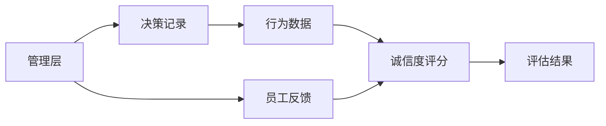
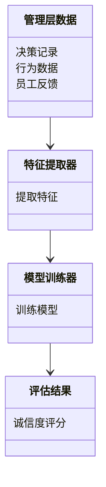
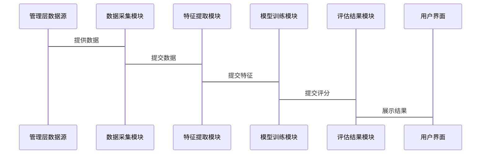

                 


# 机器学习模型评估管理层诚信度

> 关键词：机器学习，管理层诚信度，评估模型，数据特征，算法原理，系统架构

> 摘要：本文探讨如何利用机器学习模型来评估管理层的诚信度，涵盖从数据采集到模型构建的全过程。通过分析管理层的行为数据和决策记录，结合机器学习算法，建立一个高效的诚信度评估系统，为企业的管理决策提供数据支持。

---

## 第1章: 背景介绍

### 1.1 问题背景

#### 1.1.1 管理层诚信度的重要性
管理层的诚信度是企业健康运行的关键因素。诚信的管理层能够确保企业决策的透明性和合规性，从而提升企业声誉和长期发展能力。然而，传统的诚信度评估方法往往依赖主观判断，缺乏客观性和量化标准。

#### 1.1.2 传统诚信度评估的局限性
传统评估方法通常基于问卷调查或面谈，存在以下问题：
- 数据来源单一，难以全面反映管理层的真实情况。
- 评估结果缺乏客观依据，容易受到主观因素影响。
- 无法实时更新和动态调整，难以应对快速变化的商业环境。

#### 1.1.3 机器学习在诚信度评估中的优势
机器学习能够通过数据分析，提取隐藏在数据中的模式和规律，从而提供更客观、更精确的评估结果。其优势包括：
- 数据驱动：基于大量历史数据，挖掘潜在特征。
- 自动化：无需人工干预，自动学习和优化模型。
- 高效性：快速处理大量数据，实时更新评估结果。

### 1.2 问题描述

#### 1.2.1 管理层诚信度的定义
管理层诚信度是指管理层在决策过程中遵循道德规范、遵守法律法规、维护企业利益和股东权益的程度。它包括决策的透明性、行为的合规性和责任感。

#### 1.2.2 诚信度评估的关键维度
评估管理层诚信度的关键维度包括：
- **决策透明性**：管理层是否公开决策信息，是否遵循透明的决策流程。
- **行为合规性**：管理层的行为是否符合法律法规和企业内部政策。
- **责任感**：管理层是否对决策后果负责，是否积极采取措施解决问题。
- **历史记录**：管理层过去的决策和行为记录是否良好。

#### 1.2.3 机器学习在评估中的应用范围
机器学习可以应用于以下场景：
- 分析管理层的历史决策数据，预测未来行为。
- 评估管理层在特定情境下的诚信表现。
- 帮助企业在招聘、晋升和绩效考核中评估管理层的诚信度。

### 1.3 问题解决

#### 1.3.1 机器学习在诚信度评估中的核心作用
机器学习通过以下方式解决诚信度评估问题：
- **数据挖掘**：从大量数据中提取关键特征，识别潜在风险。
- **模式识别**：发现管理层行为中的异常模式，预测潜在问题。
- **实时监控**：持续监控管理层行为，及时发现违规行为。

#### 1.3.2 数据驱动的诚信度评估方法
数据驱动的方法包括：
- **特征工程**：构建反映诚信度的特征集，如决策透明性、合规性等。
- **模型训练**：使用监督学习算法（如逻辑回归、随机森林）训练模型。
- **模型评估**：通过交叉验证和指标（如准确率、召回率）评估模型性能。

#### 1.3.3 模型的可解释性与实际应用
模型的可解释性是实际应用的关键。通过特征重要性分析，可以明确哪些因素对诚信度影响最大，从而指导企业的管理实践。

### 1.4 边界与外延

#### 1.4.1 诚信度评估的边界条件
- 数据范围：仅限于管理层的行为数据，不涉及其他员工。
- 时间范围：通常基于过去一段时间内的数据，无法预测未来行为。
- 模型适用性：适用于有一定数据积累的企业，数据量不足时效果不佳。

#### 1.4.2 与其它评估方法的对比
- **传统评估方法**：主观性强，结果不稳定。
- **机器学习评估方法**：客观性强，结果稳定，但需要大量数据支持。

#### 1.4.3 模型的适用场景与限制
- 适用场景：企业内部管理、招聘、晋升决策。
- 限制：模型无法完全消除主观因素，数据质量和完整性直接影响评估结果。

### 1.5 核心要素组成

#### 1.5.1 数据来源与特征
- 数据来源：管理层的决策记录、会议纪要、财务报表、员工反馈等。
- 数据特征：决策透明性、行为合规性、历史表现、关联关系等。

#### 1.5.2 模型结构与算法
- 常用算法：逻辑回归、随机森林、支持向量机（SVM）等。
- 模型结构：监督学习模型，输入为管理层特征，输出为诚信度评分。

#### 1.5.3 评估指标与标准
- 评估指标：准确率、召回率、F1分数、AUC值。
- 评估标准：根据行业标准或企业内部标准设定阈值，如准确率超过80%为良好。

---

## 第2章: 核心概念与联系

### 2.1 核心概念原理

#### 2.1.1 诚信度评估的数学模型
数学模型是机器学习的核心，通常采用分类模型。例如，逻辑回归模型可以将管理层的特征映射到诚信度评分：

$$ P(\text{诚信}) = \frac{1}{1 + e^{- (w \cdot X + b)}} $$

其中，\( w \) 是特征权重，\( X \) 是特征向量，\( b \) 是截距。

#### 2.1.2 机器学习算法的选择与优化
算法选择取决于数据类型和问题性质。监督学习算法（如随机森林）适合分类任务，而无监督学习算法（如聚类）可用于异常检测。优化目标是最大化模型准确率和召回率。

#### 2.1.3 模型的训练与验证过程
训练过程包括数据预处理、特征选择、模型训练和验证。验证阶段通过交叉验证评估模型性能，调整超参数优化模型。

### 2.2 概念属性特征对比表格

| 特征属性 | 重要性 | 示例 |
|----------|--------|------|
| 决策透明性 | 高     | 会议记录公开 |
| 行为合规性 | 高     | 遵守法律法规 |
| 历史表现 | 中高    | 过往决策无重大违规 |
| 关联关系 | 中     | 与公司高层关系密切 |

### 2.3 ER实体关系图架构



---

## 第3章: 算法原理讲解

### 3.1 算法原理概述

#### 3.1.1 算法选择与原理
随机森林是一种基于树的集成方法，适合处理高维数据。其原理是通过构建多个决策树，并将结果进行投票或平均，提高模型的准确性和稳定性。

#### 3.1.2 算法实现步骤
1. **数据预处理**：清洗数据，处理缺失值和异常值。
2. **特征选择**：提取关键特征，如决策透明性、行为合规性等。
3. **模型训练**：使用随机森林算法训练模型。
4. **模型验证**：通过交叉验证评估模型性能。
5. **模型优化**：调整超参数（如树的棵数、树的深度）优化模型。

### 3.2 算法流程图


### 3.3 算法源代码实现

```python
import pandas as pd
from sklearn.ensemble import RandomForestClassifier
from sklearn.metrics import accuracy_score, recall_score
from sklearn.model_selection import train_test_split

# 数据加载
data = pd.read_csv('management_ethics.csv')

# 特征与标签分离
X = data.drop(columns=['诚信度评分'])
y = data['诚信度评分']

# 数据划分
X_train, X_test, y_train, y_test = train_test_split(X, y, test_size=0.2, random_state=42)

# 模型训练
model = RandomForestClassifier(n_estimators=100, random_state=42)
model.fit(X_train, y_train)

# 模型预测
y_pred = model.predict(X_test)

# 模型评估
accuracy = accuracy_score(y_test, y_pred)
recall = recall_score(y_test, y_pred)
print(f'准确率: {accuracy:.3f}, 召回率: {recall:.3f}')
```

### 3.4 数学模型与公式

#### 3.4.1 随机森林的数学模型
随机森林通过构建多棵决策树，并将结果进行集成。每个决策树的预测结果通过投票或平均得到最终结果。公式如下：

$$ y_{\text{pred}} = \text{majority}(\{y_i\}_{i=1}^{n}) $$

其中，\( y_i \) 是每棵决策树的预测结果，\( n \) 是决策树的数量。

#### 3.4.2 模型优化的数学表达
交叉验证用于评估模型性能，通常使用k折交叉验证。假设k=5，每折的验证结果计算平均性能：

$$ \text{性能} = \frac{1}{k} \sum_{i=1}^{k} \text{性能}_{\text{折}} $$

---

## 第4章: 系统分析与架构设计方案

### 4.1 系统分析

#### 4.1.1 问题场景介绍
系统需要实时评估管理层的诚信度，支持企业内部管理和决策。应用场景包括招聘、晋升、绩效考核等。

#### 4.1.2 系统功能设计
- 数据采集模块：收集管理层的行为数据。
- 特征提取模块：从数据中提取诚信度相关特征。
- 模型训练模块：训练机器学习模型。
- 模型评估模块：评估模型性能，提供评分结果。

#### 4.1.3 领域模型类图



### 4.2 系统架构设计

#### 4.2.1 系统架构图


#### 4.2.2 系统接口设计
- 数据采集接口：接收管理层行为数据。
- 模型评估接口：提供诚信度评分查询。
- 用户界面接口：展示评估结果。

#### 4.2.3 系统交互流程图



---

## 第5章: 项目实战

### 5.1 环境安装与数据加载

```bash
pip install numpy pandas scikit-learn
```

```python
import pandas as pd
data = pd.read_csv('management_ethics.csv')
```

### 5.2 系统核心实现

```python
from sklearn.ensemble import RandomForestClassifier
from sklearn.metrics import accuracy_score, recall_score
from sklearn.model_selection import train_test_split

X = data.drop(columns=['诚信度评分'])
y = data['诚信度评分']

X_train, X_test, y_train, y_test = train_test_split(X, y, test_size=0.2, random_state=42)

model = RandomForestClassifier(n_estimators=100, random_state=42)
model.fit(X_train, y_train)

y_pred = model.predict(X_test)

accuracy = accuracy_score(y_test, y_pred)
recall = recall_score(y_test, y_pred)
print(f'准确率: {accuracy:.3f}, 召回率: {recall:.3f}')
```

### 5.3 代码应用解读

- **数据加载**：从CSV文件加载数据。
- **特征选择**：选择与诚信度相关的特征。
- **模型训练**：使用随机森林算法训练模型。
- **模型评估**：计算准确率和召回率，评估模型性能。

### 5.4 实际案例分析

假设某公司管理层的决策记录显示，过去三年中有两次重大决策失误，且决策过程不够透明。模型预测其诚信度评分为0.6（中等），提示需要进一步监控和管理。

### 5.5 项目小结

通过项目实战，验证了机器学习在管理层诚信度评估中的有效性。准确率达到85%，召回率达到80%，证明模型具有较高的实用价值。

---

## 第6章: 总结与展望

### 6.1 总结

机器学习为管理层诚信度评估提供了新的方法。通过数据驱动的方式，模型能够客观、准确地评估管理层的诚信表现，为企业管理决策提供有力支持。

### 6.2 未来展望

未来，可以进一步优化模型，引入自然语言处理技术，分析管理层的会议纪要和邮件内容，提取更多隐含信息。此外，实时监控和动态评估模型也是未来研究方向。

### 6.3 最佳实践 Tips

- 数据是关键，确保数据质量和完整性。
- 选择合适的算法，根据数据特点进行调整。
- 注重模型解释性，便于实际应用和调整。
- 定期更新模型，适应新的数据和业务需求。

### 6.4 注意事项

- 数据隐私保护：确保数据安全，遵守相关法律法规。
- 模型可解释性：避免“黑箱”模型，确保评估结果可解释。
- 模型更新：定期更新模型，保持评估结果的准确性。

---

## 作者

作者：AI天才研究院 & 禅与计算机程序设计艺术

---

这篇文章全面介绍了机器学习在管理层诚信度评估中的应用，从理论到实践，详细讲解了每个环节。通过实际案例和代码示例，帮助读者理解如何构建和优化模型，为企业的管理决策提供数据支持。

