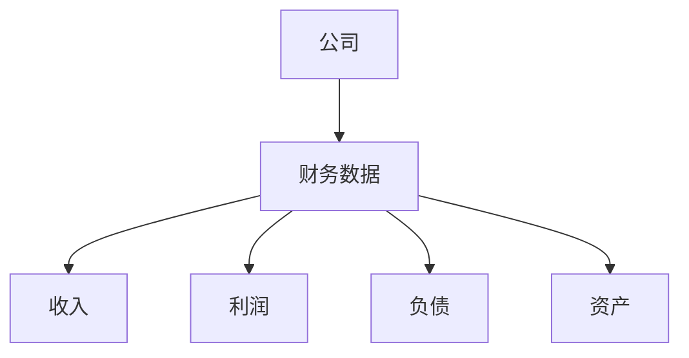
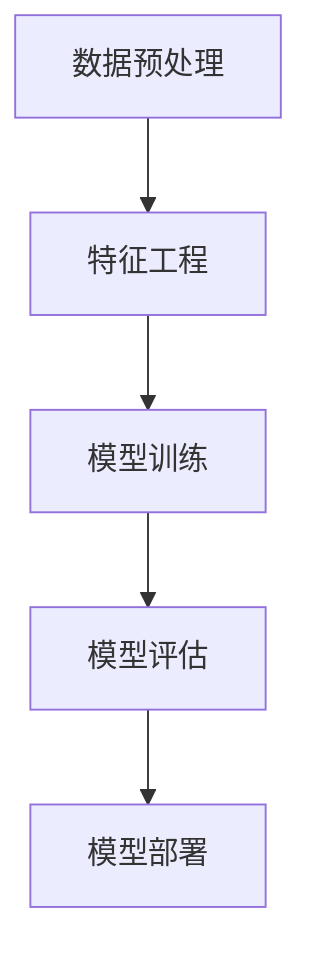
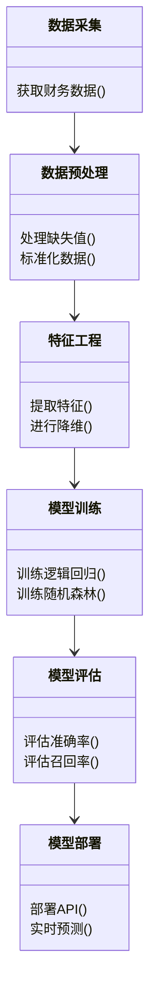
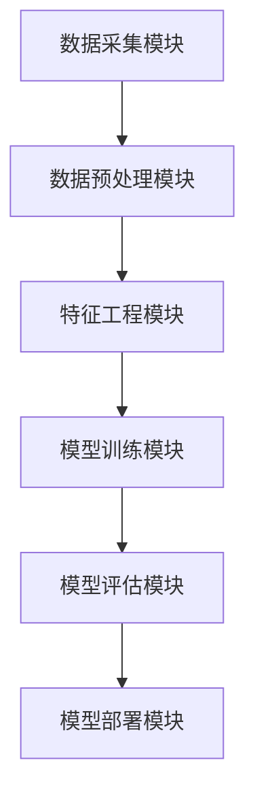
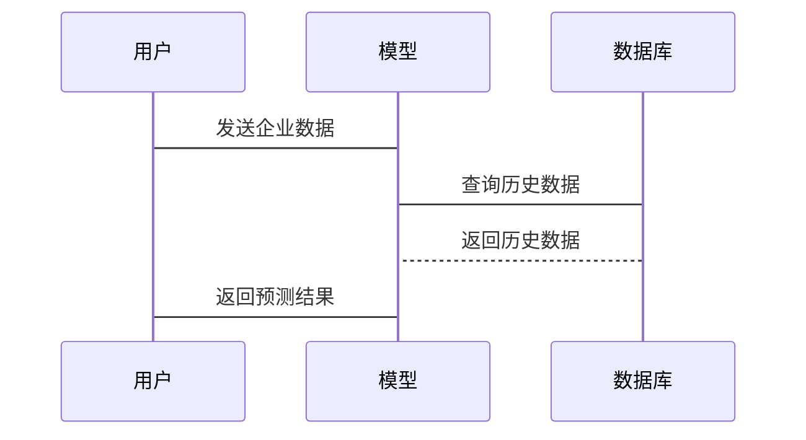

                 


# 机器学习模型预测公司财务健康

> **关键词**：机器学习，财务健康预测，数据分析，模型训练，风险管理  
> **摘要**：本文详细探讨了机器学习在公司财务健康预测中的应用，从背景介绍、核心概念到算法选择、系统设计，再到项目实战和总结，全面解析了如何利用机器学习模型预测公司财务健康，帮助企业在风险管理和投资决策中获得竞争优势。

---

# 第一部分: 机器学习模型预测公司财务健康概述

## 第1章: 背景介绍

### 1.1 问题背景
#### 1.1.1 企业财务健康的重要性
公司财务健康是企业生存和发展的基础，直接关系到企业的偿债能力、盈利能力和发展潜力。传统的财务分析方法虽然有效，但在面对复杂多变的市场环境时，往往难以捕捉到潜在的风险信号。

#### 1.1.2 传统财务分析的局限性
- **数据复杂性**：传统财务分析依赖于财务报表，但报表数据可能存在滞后性，且难以捕捉非财务因素的影响。
- **人工判断的局限性**：财务分析师的经验和主观判断可能会影响分析结果，存在一定的误差。
- **动态变化的市场**：企业的财务状况会受到宏观经济、行业变化和内部管理等多种因素的影响，传统静态分析难以适应动态变化。

#### 1.1.3 机器学习在财务预测中的优势
- **数据处理能力**：机器学习能够处理海量数据，包括财务数据和非财务数据，提供更全面的分析。
- **自动学习能力**：通过机器学习算法，模型可以自动从数据中提取特征，发现潜在的规律。
- **实时性**：机器学习模型可以实时更新，适应市场变化，提供实时的财务健康评估。

### 1.2 问题描述
#### 1.2.1 财务健康预测的核心目标
财务健康预测的核心目标是通过分析企业的财务数据，预测企业未来一段时间内的财务状况，包括盈利能力、偿债能力、运营效率等方面。

#### 1.2.2 数据特征与预测目标的关系
- **数据特征**：包括收入、利润、负债、资产、现金流等财务指标，以及行业趋势、市场环境等非财务因素。
- **预测目标**：通常包括企业破产风险、财务危机预警、信用评级等。

#### 1.2.3 预测模型的输入输出关系
- **输入**：企业的财务数据、行业数据、市场数据等。
- **输出**：模型预测的结果，例如企业破产概率、财务健康评分等。

### 1.3 问题解决
#### 1.3.1 机器学习在财务预测中的应用
- **分类任务**：将企业分为健康和不健康两类，预测企业破产风险。
- **回归任务**：预测企业的信用评分、违约概率等连续性指标。
- **聚类任务**：将企业分为不同的财务健康类别，帮助投资者更好地进行分类决策。

#### 1.3.2 数据预处理与特征工程
- **数据清洗**：处理缺失值、异常值，确保数据质量。
- **特征提取**：从原始数据中提取有用的特征，例如将收入增长率、净利率等指标作为特征。
- **特征转换**：对特征进行标准化或归一化处理，适应不同算法的需求。

#### 1.3.3 模型训练与评估
- **训练过程**：选择合适的算法，训练模型，调整模型参数。
- **评估指标**：使用准确率、召回率、F1值、ROC-AUC曲线等指标评估模型性能。

### 1.4 边界与外延
#### 1.4.1 财务健康预测的边界条件
- **数据质量**：模型依赖于高质量的数据，数据不足或不准确会影响预测结果。
- **模型适用性**：不同企业、不同行业可能需要不同的模型，模型需要根据具体情况调整。
- **市场环境**：宏观经济波动、政策变化等外部因素可能影响模型的预测结果。

#### 1.4.2 相关领域的外延
- **风险管理**：财务健康预测是企业风险管理的重要组成部分。
- **投资决策**：投资者可以根据财务健康预测结果，做出更明智的投资决策。
- **供应链管理**：供应商可以根据企业的财务健康状况，调整供应链策略。

#### 1.4.3 模型的适用范围与限制
- **适用范围**：适用于有足够数据支持的企业，尤其是中大型企业。
- **限制**：模型无法预测未知的市场风险，且模型性能依赖于数据质量和算法选择。

### 1.5 概念结构与核心要素
#### 1.5.1 数据来源与特征
- **数据来源**：企业财务报表、行业数据、市场数据等。
- **特征类型**：财务指标（如收入、利润、负债）、行业趋势、市场环境等。

#### 1.5.2 模型选择与优化
- **算法选择**：根据数据特征和预测目标选择合适的算法，例如逻辑回归、随机森林等。
- **模型优化**：通过交叉验证、网格搜索等方法调整模型参数，提高模型性能。

#### 1.5.3 评估指标与结果解释
- **评估指标**：准确率、召回率、F1值、ROC-AUC曲线等。
- **结果解释**：根据模型预测结果，帮助企业识别潜在风险，制定应对策略。

---

## 第2章: 核心概念与联系

### 2.1 机器学习与财务健康预测的关系
#### 2.1.1 机器学习的基本原理
- **监督学习**：通过训练数据，学习输入与输出之间的映射关系。
- **无监督学习**：通过发现数据中的模式，进行聚类分析。
- **特征学习**：自动提取数据中的特征，减少人工特征工程的工作量。

#### 2.1.2 财务健康预测的核心要素
- **数据特征**：财务指标、行业趋势、市场环境等。
- **模型选择**：选择合适的算法，训练模型。
- **结果解释**：将模型预测结果应用于实际业务决策。

#### 2.1.3 机器学习在财务预测中的应用
- **分类任务**：预测企业是否破产。
- **回归任务**：预测企业的信用评分。
- **聚类任务**：将企业分为不同的财务健康类别。

### 2.2 核心概念原理
#### 2.2.1 数据特征与模型选择
- **数据特征**：数据特征的选择直接影响模型的性能。
- **模型选择**：不同的算法适用于不同的数据特征和预测目标。

#### 2.2.2 模型训练与优化
- **训练过程**：通过训练数据，调整模型参数，使模型能够准确预测。
- **优化策略**：使用交叉验证、网格搜索等方法，优化模型性能。

#### 2.2.3 模型评估与部署
- **评估指标**：准确率、召回率、F1值等。
- **部署策略**：将模型部署到实际业务中，实时监控模型性能。

### 2.3 核心概念属性特征对比表
| 特征 | 描述 | 示例 |
|------|------|------|
| 财务指标 | 如收入、利润、负债等 | 收入增长率 |
| 机器学习算法 | 如逻辑回归、随机森林等 | 线性回归 |
| 评估指标 | 如准确率、召回率、F1值等 | AUC-ROC曲线 |

### 2.4 ER实体关系图


---

## 第3章: 算法原理讲解

### 3.1 算法选择与流程
#### 3.1.1 逻辑回归算法
- **逻辑回归**：用于分类任务，通过对数几率回归函数，将线性回归的结果映射到概率空间。
- **对数几率回归公式**：
  $$ P(y=1|x) = \frac{e^{\beta_0 + \beta_1x_1 + \beta_2x_2 + \dots + \beta_nx_n}}{1 + e^{\beta_0 + \beta_1x_1 + \beta_2x_2 + \dots + \beta_nx_n}} $$
- **应用示例**：预测企业是否破产。

#### 3.1.2 随机森林算法
- **随机森林**：基于决策树的集成算法，通过投票机制进行预测。
- **优点**：对噪声数据不敏感，能够处理高维数据。
- **应用示例**：预测企业的信用评分。

#### 3.1.3 支持向量机算法
- **支持向量机**：通过找到一个超平面，将数据分为两类。
- **应用示例**：对企业的财务健康进行分类。

### 3.2 算法流程图


### 3.3 逻辑回归算法原理
- **对数几率回归**：
  $$ P(y=1|x) = \frac{e^{\beta_0 + \beta_1x_1}}{1 + e^{\beta_0 + \beta_1x_1}} $$
- **损失函数**：交叉熵损失函数。
- **优化过程**：使用梯度下降法优化参数。

---

## 第4章: 系统分析与架构设计

### 4.1 问题场景介绍
- **目标**：预测企业财务健康状况。
- **数据来源**：企业财务报表、行业数据、市场数据等。

### 4.2 项目介绍
- **项目目标**：构建一个机器学习模型，预测企业财务健康状况。
- **项目范围**：包括数据采集、预处理、特征工程、模型训练、评估和部署。

### 4.3 系统功能设计
#### 4.3.1 领域模型类图


#### 4.3.2 系统架构图


#### 4.3.3 系统交互序列图


---

## 第5章: 项目实战

### 5.1 环境安装
- **Python**：安装Anaconda或Miniconda。
- **依赖库**：安装NumPy、Pandas、Scikit-learn、XGBoost、Plotly。

### 5.2 数据获取与预处理
#### 5.2.1 数据获取
```python
import pandas as pd
data = pd.read_csv('financial_data.csv')
```

#### 5.2.2 数据清洗
```python
# 处理缺失值
data = data.dropna()
# 标准化数据
from sklearn.preprocessing import StandardScaler
scaler = StandardScaler()
scaled_data = scaler.fit_transform(data)
```

### 5.3 特征工程
#### 5.3.1 特征提取
```python
features = data[['收入', '利润', '负债', '资产']]
```

#### 5.3.2 特征降维
```python
from sklearn.decomposition import PCA
pca = PCA(n_components=2)
pca_features = pca.fit_transform(features)
```

### 5.4 模型训练
#### 5.4.1 逻辑回归模型
```python
from sklearn.linear_model import LogisticRegression
model = LogisticRegression()
model.fit(pca_features, labels)
```

#### 5.4.2 随机森林模型
```python
from sklearn.ensemble import RandomForestClassifier
model = RandomForestClassifier(n_estimators=100)
model.fit(pca_features, labels)
```

### 5.5 模型评估
#### 5.5.1 混淆矩阵
```python
from sklearn.metrics import confusion_matrix
y_pred = model.predict(pca_features)
cm = confusion_matrix(labels, y_pred)
print(cm)
```

#### 5.5.2 分类报告
```python
from sklearn.metrics import classification_report
print(classification_report(labels, y_pred))
```

### 5.6 模型部署
#### 5.6.1 部署API
```python
from flask import Flask, request, jsonify
import joblib
model = joblib.load('financial_health_model.pkl')

app = Flask(__name__)

@app.route('/predict', methods=['POST'])
def predict():
    data = request.json
    features = data['features']
    prediction = model.predict(features)
    return jsonify({'prediction': prediction.tolist()})

if __name__ == '__main__':
    app.run(debug=True)
```

---

## 第6章: 总结与展望

### 6.1 总结
- **核心内容回顾**：机器学习在公司财务健康预测中的应用，包括算法选择、数据预处理、模型训练与部署。
- **最佳实践**：选择合适的算法，进行充分的数据预处理，实时监控模型性能。

### 6.2 展望
- **未来方向**：引入时间序列数据，结合NLP技术，提高模型的预测精度。
- **注意事项**：模型性能依赖于数据质量和算法选择，需要根据实际情况进行调整。

---

## 附录

### 附录A: 数据集
- **数据格式**：CSV格式，包含收入、利润、负债、资产等字段。
- **数据字段**：收入（收入）、利润（利润）、负债（负债）、资产（资产）、标签（财务健康状态）。

### 附录B: 参考文献
- 书籍：《机器学习实战》
- 论文：《基于机器学习的企业财务健康预测研究》

---

## 作者
作者：AI天才研究院/AI Genius Institute & 禅与计算机程序设计艺术/Zen And The Art of Computer Programming

---

这篇文章详细介绍了机器学习在公司财务健康预测中的应用，从背景介绍到算法选择，再到系统设计和项目实战，为读者提供了全面的视角。希望对您有所帮助！

