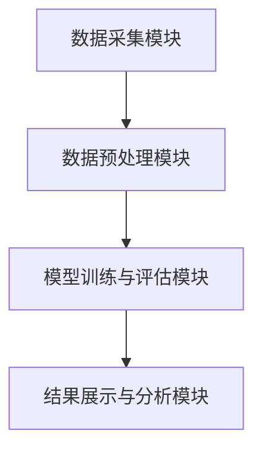
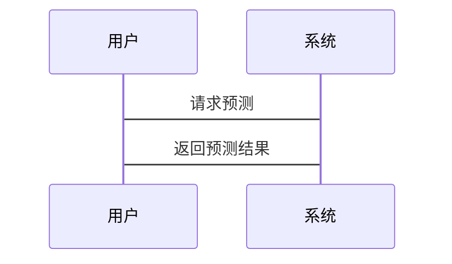

                 


# 机器学习算法在市场预测中的效果评估

> **关键词**: 机器学习算法, 市场预测, 效果评估, 监督学习, 无监督学习, 评估指标

> **摘要**:  
本文系统地探讨了机器学习算法在市场预测中的应用及其效果评估方法。从背景介绍到核心概念，从算法原理到数学模型，从系统设计到项目实战，本文详细分析了机器学习在市场预测中的关键问题，并提出了有效的解决方案。通过对比不同算法的优缺点，结合实际案例分析，本文为读者提供了一套完整的市场预测系统设计与实现的思路，同时总结了最佳实践和注意事项，帮助读者更好地理解和应用机器学习算法。

---

## 正文

### 第1章: 背景介绍与核心概念

#### 1.1 机器学习与市场预测的背景

##### 1.1.1 机器学习的基本概念
机器学习是一种人工智能技术，通过数据训练模型，使其能够从数据中学习并做出预测或决策。它主要分为**监督学习**、**无监督学习**、**半监督学习**和**强化学习**四大类。

##### 1.1.2 市场预测的核心问题
市场预测的核心问题在于通过历史数据，预测未来的市场趋势。这包括股票价格预测、销售预测、经济指标预测等。市场预测的关键在于数据的特征提取、模型的选择以及模型的评估。

##### 1.1.3 机器学习在市场预测中的应用价值
机器学习能够处理大量的非结构化数据，发现数据中的隐含规律，并通过模型进行预测。相比于传统的统计方法，机器学习具有更高的预测精度和更强的适应性。

#### 1.2 机器学习算法的基本原理

##### 1.2.1 监督学习与无监督学习的区别
- **监督学习**: 基于标记数据（带标签的数据）进行训练，目标是学习输入与输出之间的映射关系。
- **无监督学习**: 基于无标记数据进行训练，目标是发现数据中的内在结构或模式。

##### 1.2.2 常见机器学习算法简介
- **线性回归**: 用于回归问题，假设特征与目标之间存在线性关系。
- **支持向量机（SVM）**: 用于分类和回归问题，通过寻找最优超平面实现数据的线性或非线性分离。
- **决策树**: 通过构建树状结构进行分类或回归，常用于处理非线性问题。
- **随机森林**: 通过集成多个决策树模型，提高模型的泛化能力和鲁棒性。
- **神经网络**: 通过多层神经元网络模拟人脑的思维方式，适用于复杂非线性问题。

##### 1.2.3 机器学习算法的核心要素
- **特征**: 数据的输入部分，特征的选择和提取是影响模型性能的关键。
- **标签**: 数据的输出部分，监督学习中需要标记数据。
- **模型**: 通过训练数据学习到的函数或规则。
- **损失函数**: 评估模型预测值与真实值之间差异的函数。
- **优化算法**: 通过最小化损失函数来更新模型参数的算法，如梯度下降。

#### 1.3 市场预测中的效果评估指标

##### 1.3.1 常见评估指标
- **准确率（Accuracy）**: 正确预测的比例。
- **召回率（Recall）**: 正确预测的正例比例。
- **F1值（F1-Score）**: 准确率和召回率的调和平均值。
- **均方误差（MSE）**: 预测值与真实值之间平方差的平均值。
- **R²值**: 衡量模型预测值与真实值之间的拟合程度。

##### 1.3.2 不同模型的评估指标对比
| 指标       | 监督学习（分类） | 监督学习（回归） |
|------------|-------------------|-------------------|
| 准确率     | ✔                 | ❌               |
| 召回率     | ✔                 | ❌               |
| F1值       | ✔                 | ❌               |
| 均方误差   | ❌               | ✔                 |
| R²值       | ❌               | ✔                 |

##### 1.3.3 评估指标的选择与应用
评估指标的选择取决于问题类型和业务需求。例如，对于分类问题，准确率和召回率是关键指标；而对于回归问题，MSE和R²值更为重要。

#### 1.4 本章小结
本章从背景介绍到核心概念，详细解释了机器学习的基本原理及其在市场预测中的应用价值。同时，对比了不同算法的优缺点，并介绍了常见的效果评估指标。

---

### 第2章: 机器学习算法的核心原理

#### 2.1 监督学习算法原理

##### 2.1.1 线性回归算法原理

###### 线性回归的数学公式
$$ y = \beta_0 + \beta_1x + \epsilon $$

其中，$y$ 是目标变量，$x$ 是特征变量，$\beta_0$ 和 $\beta_1$ 是模型的参数，$\epsilon$ 是误差项。

###### 损失函数与优化目标
线性回归的目标是最小化预测值与真实值之间的平方差之和：
$$ \text{损失函数} = \sum (y_i - (\beta_0 + \beta_1x_i))^2 $$

###### 算法实现步骤
1. 初始化参数 $\beta_0$ 和 $\beta_1$。
2. 计算预测值 $\hat{y} = \beta_0 + \beta_1x$。
3. 计算损失函数。
4. 更新参数，最小化损失函数。
5. 重复步骤2-4，直到收敛。

##### 2.1.2 支持向量机（SVM）算法原理

###### SVM的核心思想
SVM通过寻找一个超平面，使得正负样本之间的距离最大化，从而实现分类。

###### SVM的数学公式
$$ \text{最大化} \sum \alpha_i y_i (y_j - y_i (\cdot \cdot)) $$

其中，$\alpha_i$ 是拉格朗日乘子，$y_i$ 是标签。

###### 核函数的作用与选择
核函数用于将数据映射到高维空间，常见的核函数有线性核、多项式核、高斯核等。

##### 2.1.3 决策树算法原理

###### 决策树的构建过程
1. 选择特征，计算信息增益。
2. 建立决策节点。
3. 递归地对子数据集进行分割，直到叶子节点满足停止条件。

###### ID3算法的熵公式
$$ \text{熵} = -\sum p_i \log p_i $$

其中，$p_i$ 是各个特征的概率。

#### 2.2 无监督学习算法原理

##### 2.2.1 K-means聚类算法

###### K-means的核心思想
K-means通过最小化样本点到聚类中心的距离，实现数据的无监督聚类。

###### K-means的数学公式
$$ \text{目标函数} = \sum_{i=1}^k \sum_{j=1}^n (x_j - c_i)^2 $$

其中，$k$ 是聚类数，$c_i$ 是第$i$个聚类中心，$x_j$ 是样本点。

##### 2.2.2 高斯混合模型（GMM）

###### GMM的核心思想
GMM通过混合高斯分布，实现数据的无监督建模。

###### GMM的数学公式
$$ p(x) = \sum_{i=1}^k \pi_i \mathcal{N}(x|\mu_i, \Sigma_i) $$

其中，$\pi_i$ 是混合系数，$\mathcal{N}(\cdot)$ 是高斯分布，$\mu_i$ 和 $\Sigma_i$ 是均值和协方差矩阵。

##### 2.2.3 层次聚类算法

###### 层次聚类的核心思想
层次聚类通过构建树状结构，逐步合并或分割数据点，实现数据的层次化聚类。

###### 层次聚类的实现步骤
1. 初始化每个样本为一个聚类。
2. 计算聚类之间的距离。
3. 合并距离最近的两个聚类。
4. 重复步骤2-3，直到所有样本合并成一个聚类。

#### 2.3 算法原理对比与选择

##### 2.3.1 不同算法的优缺点对比
| 算法类型       | 优点                               | 缺点                               |
|----------------|------------------------------------|------------------------------------|
| 线性回归       | 简单，易于解释                     | 仅适用于线性关系                   |
| SVM           | 鲁棒性好，适合高维数据             | 参数敏感，计算复杂                 |
| 决策树         | 易于解释，适用于非线性问题         | � prone to过拟合                   |
| K-means       | 简单，适用于球形簇                 | 不适合复杂形状的簇                 |
| GMM           | 能捕捉数据的分布特性               | 参数估计复杂                     |

##### 2.3.2 算法选择的依据与策略
- 数据类型与分布
- 问题类型（分类、回归、聚类）
- 数据规模与计算能力
- 模型的可解释性要求

##### 2.3.3 算法原理与实际应用的联系
在实际应用中，选择合适的算法需要考虑数据特征、业务需求和计算资源。例如，对于非线性问题，决策树和神经网络可能更合适；对于聚类问题，K-means和层次聚类是常用选择。

#### 2.4 本章小结
本章详细讲解了监督学习和无监督学习的核心算法，包括线性回归、SVM、决策树、K-means和GMM。通过对比不同算法的优缺点，帮助读者选择合适的算法。

---

### 第3章: 机器学习算法的数学模型

#### 3.1 线性回归模型

##### 3.1.1 线性回归的数学公式
$$ y = \beta_0 + \beta_1x + \epsilon $$

##### 3.1.2 损失函数与优化目标
$$ \text{损失函数} = \sum (y_i - (\beta_0 + \beta_1x_i))^2 $$

##### 3.1.3 算法实现步骤
1. 初始化参数 $\beta_0$ 和 $\beta_1$。
2. 计算预测值 $\hat{y} = \beta_0 + \beta_1x$。
3. 计算损失函数。
4. 更新参数，最小化损失函数。
5. 重复步骤2-4，直到收敛。

#### 3.2 支持向量机（SVM）模型

##### 3.2.1 SVM的核心思想
SVM通过寻找一个超平面，使得正负样本之间的距离最大化，从而实现分类。

##### 3.2.2 SVM的数学公式
$$ \text{最大化} \sum \alpha_i y_i (y_j - y_i (\cdot \cdot)) $$

##### 3.2.3 核函数的作用与选择
核函数用于将数据映射到高维空间，常见的核函数有线性核、多项式核、高斯核等。

#### 3.3 决策树模型

##### 3.3.1 ID3算法的熵公式
$$ \text{熵} = -\sum p_i \log p_i $$

##### 3.3.2 C4.5与CART算法的区别
C4.5使用信息增益率，CART使用信息增益。

##### 3.3.3 决策树的剪枝策略
剪枝用于防止过拟合，主要包括预剪枝和后剪枝两种策略。

#### 3.4 本章小结
本章通过数学公式和算法流程图，详细讲解了线性回归、SVM和决策树的核心原理。通过对模型的数学推导，帮助读者深入理解算法的工作机制。

---

### 第4章: 系统分析与架构设计

#### 4.1 系统功能需求分析

##### 4.1.1 数据采集模块
- 数据来源：API接口、数据库、文件等。
- 数据类型：时间序列数据、文本数据、数值数据等。

##### 4.1.2 数据预处理模块
- 数据清洗：处理缺失值、异常值。
- 数据转换：标准化、归一化、特征工程。

##### 4.1.3 模型训练与评估模块
- 模型选择：根据问题类型选择合适的算法。
- 模型训练：使用训练数据训练模型。
- 模型评估：使用测试数据评估模型性能。

##### 4.1.4 结果展示与分析模块
- 可视化：绘制预测结果与真实值的对比图。
- 分析报告：生成预测报告，包括误差分析、趋势分析等。

#### 4.2 系统架构设计

##### 4.2.1 系统功能模块
1. 数据采集模块
2. 数据预处理模块
3. 模型训练与评估模块
4. 结果展示与分析模块

##### 4.2.2 系统架构图


##### 4.2.3 系统接口设计
- 数据接口：提供API接口，供其他系统调用。
- 模型接口：提供预测接口，供外部系统调用。

##### 4.2.4 系统交互图


#### 4.3 本章小结
本章从系统功能需求分析到架构设计，详细描述了市场预测系统的整体架构。通过对系统的模块划分和接口设计，帮助读者理解如何构建一个完整的市场预测系统。

---

### 第5章: 项目实战

#### 5.1 环境安装

##### 5.1.1 安装Python环境
```bash
python --version
pip install --upgrade pip
```

##### 5.1.2 安装机器学习库
```bash
pip install numpy pandas scikit-learn matplotlib
```

#### 5.2 系统核心实现源代码

##### 5.2.1 数据预处理代码
```python
import pandas as pd
import numpy as np

# 读取数据
data = pd.read_csv('market_data.csv')

# 处理缺失值
data.dropna(inplace=True)

# 标准化处理
from sklearn.preprocessing import StandardScaler
scaler = StandardScaler()
scaled_data = scaler.fit_transform(data)
```

##### 5.2.2 模型训练代码
```python
from sklearn.model_selection import train_test_split
from sklearn.linear_model import LinearRegression
from sklearn.metrics import mean_squared_error

# 划分训练集和测试集
X_train, X_test, y_train, y_test = train_test_split(scaled_data, data['target'], test_size=0.2, random_state=42)

# 训练模型
model = LinearRegression()
model.fit(X_train, y_train)

# 预测与评估
y_pred = model.predict(X_test)
mse = mean_squared_error(y_test, y_pred)
print(f"均方误差: {mse}")
```

##### 5.2.3 结果可视化代码
```python
import matplotlib.pyplot as plt

plt.figure(figsize=(10, 6))
plt.plot(y_test, label='真实值')
plt.plot(y_pred, label='预测值')
plt.xlabel('样本编号')
plt.ylabel('目标值')
plt.legend()
plt.show()
```

#### 5.3 项目小结
本章通过实际案例，详细讲解了市场预测系统的环境安装、数据预处理、模型训练和结果可视化的实现过程。通过对代码的解读，帮助读者理解如何将理论应用于实践。

---

### 第6章: 最佳实践与总结

#### 6.1 最佳实践

##### 6.1.1 数据预处理的重要性
数据预处理是影响模型性能的关键步骤，包括数据清洗、特征工程等。

##### 6.1.2 模型选择的策略
根据问题类型和数据特征选择合适的算法，避免盲目选择复杂模型。

##### 6.1.3 模型调优的技巧
通过交叉验证、网格搜索等方法，优化模型的超参数。

#### 6.2 小结
机器学习算法在市场预测中的应用具有广阔的前景，但同时也面临数据质量、模型选择和计算能力等挑战。通过合理的数据处理和算法选择，可以显著提高模型的预测精度。

#### 6.3 注意事项
- 数据泄露问题：避免在训练集中使用测试集的数据。
- 过拟合问题：通过正则化、交叉验证等方法防止过拟合。
- 计算资源问题：大规模数据需要分布式计算框架。

#### 6.4 拓展阅读
- 《Hands-On Machine Learning with Scikit-Learn, Keras, and TensorFlow》
- 《Pattern Recognition and Machine Learning》

---

### 作者

**作者：AI天才研究院/AI Genius Institute & 禅与计算机程序设计艺术 /Zen And The Art of Computer Programming**

---

**附录**

#### 附录A: 机器学习算法的优缺点对比表
| 算法类型       | 优点                               | 缺点                               |
|----------------|------------------------------------|------------------------------------|
| 线性回归       | 简单，易于解释                     | 仅适用于线性关系                   |
| SVM           | 鲁棒性好，适合高维数据             | 参数敏感，计算复杂                 |
| 决策树         | 易于解释，适用于非线性问题         | � prone to过拟合                   |
| K-means       | 简单，适用于球形簇                 | 不适合复杂形状的簇                 |
| GMM           | 能捕捉数据的分布特性               | 参数估计复杂                     |

#### 附录B: 机器学习算法的数学公式汇总
- 线性回归：$$ y = \beta_0 + \beta_1x + \epsilon $$
- SVM：$$ \text{最大化} \sum \alpha_i y_i (y_j - y_i (\cdot \cdot)) $$
- 决策树：$$ \text{熵} = -\sum p_i \log p_i $$

--- 

**全文完**

