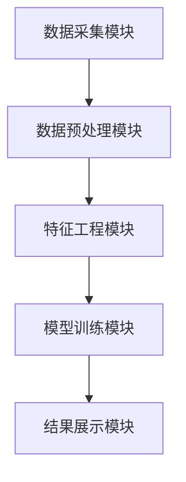
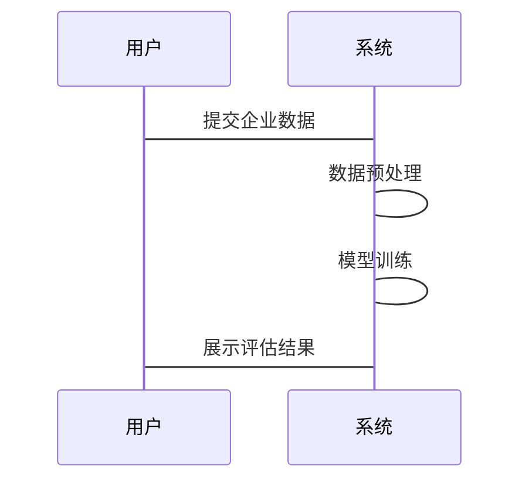

                 


# 《机器学习辅助公司创新能力评估》

---

## 关键词

- 机器学习
- 公司创新能力评估
- 数据分析
- 智能决策
- 企业创新

---

## 摘要

机器学习作为一种强大的数据分析工具，正在逐渐改变企业创新能力的评估方式。传统的创新能力评估主要依赖于主观判断和有限的指标分析，而机器学习通过从海量数据中提取有价值的信息，能够提供更全面、客观的评估结果。本文将详细探讨机器学习在公司创新能力评估中的应用，从理论基础到实际案例，逐步分析如何利用机器学习模型来优化创新能力的评估过程。通过构建合适的算法和系统架构，企业可以更高效地识别创新潜力，制定更有效的创新策略。

---

## 正文

---

# 第一部分: 机器学习与公司创新能力评估背景

---

## 第1章: 机器学习与公司创新能力评估概述

### 1.1 机器学习的基本概念与应用领域

#### 1.1.1 机器学习的定义与核心概念

机器学习（Machine Learning）是一种人工智能（AI）技术，通过算法训练模型，使其能够从数据中学习并做出预测或决策。核心概念包括：

- **监督学习**：使用标记的数据进行训练，预测新的数据。
- **无监督学习**：在无标签数据中发现模式或结构。
- **强化学习**：通过与环境互动，学习最优策略。

#### 1.1.2 机器学习在企业中的应用价值

- **数据驱动决策**：利用历史数据预测未来趋势。
- **自动化分析**：快速处理大量数据，节省时间和成本。
- **个性化服务**：根据用户行为提供定制化建议。

#### 1.1.3 公司创新能力评估的定义与重要性

公司创新能力评估是衡量企业在技术创新、市场适应能力和管理优化等方面的能力。传统评估方法依赖于财务指标和主观判断，而机器学习能够提供更客观和全面的评估。

---

### 1.2 机器学习与公司创新能力评估的关系

#### 1.2.1 机器学习在创新能力评估中的作用

- **数据整合**：将多源数据（如专利、销售数据、市场反馈）整合，提供更全面的视角。
- **模式识别**：识别传统方法难以发现的潜在创新趋势。
- **预测能力**：基于历史数据预测未来的创新能力。

#### 1.2.2 创新能力评估的指标体系

- **技术创新指标**：专利数量、研发投入占比、技术更新速度。
- **市场表现指标**：市场份额、新产品推出速度、客户满意度。
- **管理指标**：组织结构灵活性、团队协作效率。

#### 1.2.3 机器学习如何辅助创新能力评估

- **数据预处理**：清洗和标准化数据，提取关键特征。
- **模型构建**：选择合适的算法，训练模型。
- **结果分析**：解释模型输出，提供决策支持。

---

### 1.3 本章小结

本章介绍了机器学习的基本概念和其在公司创新能力评估中的应用价值。机器学习通过数据驱动的方法，能够帮助企业在复杂多变的市场环境中更准确地评估创新能力，优化创新策略。

---

## 第2章: 公司创新能力评估的核心概念与背景

### 2.1 创新能力评估的背景与意义

#### 2.1.1 创新能力在企业竞争中的地位

在现代商业环境中，创新能力是企业保持竞争优势的关键。创新能力不仅体现在技术层面，还包括市场适应能力和管理优化等方面。

#### 2.1.2 传统创新能力评估的局限性

- **数据不足**：传统方法依赖少量指标，难以全面反映创新能力。
- **主观性**：评估结果受到主观判断的影响。
- **动态性**：市场变化快，静态指标难以捕捉创新趋势。

#### 2.1.3 机器学习在创新能力评估中的优势

- **数据驱动**：利用大量数据进行分析，结果更客观。
- **动态适应**：能够实时更新模型，适应市场变化。
- **高精度**：通过复杂的算法提高评估准确性。

---

### 2.2 公司创新能力评估的关键指标

#### 2.2.1 技术创新指标

- 专利数量：反映企业在技术研发上的投入和成果。
- 技术更新速度：衡量企业对技术发展的响应能力。
- 研发投入占比：显示企业对创新的重视程度。

#### 2.2.2 知识产权指标

- 专利质量：专利的影响力和价值。
- 商标数量：企业在市场中的品牌布局。
- 著作权：软件、设计等知识产权的保护情况。

#### 2.2.3 市场表现指标

- 市场份额：企业在市场中的地位。
- 新产品推出速度：创新能力的直接体现。
- 客户满意度：产品和服务的市场反馈。

---

### 2.3 机器学习在创新能力评估中的应用场景

#### 2.3.1 数据驱动的创新能力评估

通过机器学习，企业可以利用销售数据、客户反馈、市场趋势等多源数据，构建更全面的创新能力评估模型。

#### 2.3.2 个性化创新能力评估模型

针对不同行业或不同规模的企业，构建个性化的评估模型，提高评估的准确性和适用性。

#### 2.3.3 机器学习在创新能力预测中的应用

通过历史数据训练模型，预测未来创新能力，帮助企业提前制定创新策略。

---

### 2.4 本章小结

本章详细探讨了创新能力评估的关键指标和机器学习的应用场景。通过机器学习，企业能够更全面、动态地评估创新能力，为创新决策提供有力支持。

---

## 第3章: 机器学习算法与创新能力评估的核心联系

---

### 3.1 机器学习算法的基本原理

#### 3.1.1 监督学习

- 输入：特征向量。
- 输出：目标变量的预测值。
- 示例：线性回归用于预测创新能力评分。

#### 3.1.2 无监督学习

- 输入：未标记数据。
- 输出：数据中的潜在结构或簇。
- 示例：聚类算法识别不同创新能力的企业群体。

#### 3.1.3 强化学习

- 输入：环境状态。
- 输出：最优动作。
- 示例：应用于动态创新能力评估，实时调整评估策略。

---

### 3.2 创新能力评估的核心算法选择

#### 3.2.1 回归算法

- **线性回归**：适用于连续型目标变量的预测。
- **逻辑回归**：适用于二分类问题，如创新能力高或低。

#### 3.2.2 分类算法

- **决策树**：易于解释，适合分类问题。
- **随机森林**：通过多棵决策树投票，提高准确性和鲁棒性。

#### 3.2.3 聚类算法

- **K-means**：将企业分成创新能力不同的簇。
- **层次聚类**：展示企业创新能力的层次结构。

---

### 3.3 算法选择与创新能力评估目标的关系

#### 3.3.1 算法选择的依据

- **数据类型**：目标变量是连续型还是分类型。
- **数据规模**：选择适合大规模数据的算法。
- **模型解释性**：需要解释性时选择决策树等易解释的算法。

#### 3.3.2 不同目标下的算法适用性

- **预测创新能力评分**：回归算法。
- **分类创新能力等级**：分类算法。
- **发现潜在创新模式**：聚类算法。

#### 3.3.3 算法性能评估指标

- **准确率**：分类问题中的主要指标。
- **F1分数**：平衡准确率和召回率。
- **均方误差**：回归问题中的主要指标。

---

### 3.4 本章小结

本章探讨了机器学习算法的基本原理及其在创新能力评估中的应用。根据评估目标和数据类型选择合适的算法，能够显著提高评估的准确性和效率。

---

## 第4章: 创新能力评估的机器学习模型构建

---

### 4.1 数据预处理与特征工程

#### 4.1.1 数据清洗与标准化

- **数据清洗**：处理缺失值、异常值。
- **标准化**：将不同量纲的特征缩放到同一范围内。

#### 4.1.2 特征选择与提取

- **特征选择**：筛选重要特征，减少维度。
- **特征提取**：通过主成分分析（PCA）提取新的特征。

#### 4.1.3 数据增强与降维

- **数据增强**：增加数据多样性，提高模型泛化能力。
- **降维**：使用t-SNE等方法降低数据维度，便于可视化。

---

### 4.2 模型训练与优化

#### 4.2.1 模型训练流程

1. **数据分割**：将数据分为训练集、验证集和测试集。
2. **模型训练**：在训练集上训练模型。
3. **模型验证**：在验证集上调整超参数。
4. **模型测试**：在测试集上评估模型性能。

#### 4.2.2 超参数优化

- **网格搜索**：系统地遍历所有可能的超参数组合，选择最优参数。
- **随机搜索**：随机选择超参数组合，减少计算量。

#### 4.2.3 模型评估与验证

- **交叉验证**：通过k折交叉验证评估模型的泛化能力。
- **混淆矩阵**：评估分类模型的性能，包括准确率、召回率、F1分数。

---

### 4.3 基于机器学习的创新能力评估模型

#### 4.3.1 线性回归模型

- **输入**：企业的研发投入、专利数量等特征。
- **输出**：创新能力的评分。
- **公式**：$$ y = \beta_0 + \beta_1x_1 + \beta_2x_2 + \ldots + \beta_nx_n $$

#### 4.3.2 支持向量机模型

- **输入**：企业的市场表现、技术指标等特征。
- **输出**：创新能力的分类结果。
- **原理**：通过寻找最优超平面，将数据分为不同类别。

#### 4.3.3 随机森林模型

- **输入**：企业的多维数据。
- **输出**：创新能力的评分或分类结果。
- **优势**：对异常值不敏感，适合高维度数据。

---

### 4.4 本章小结

本章详细探讨了创新能力评估模型的构建过程，包括数据预处理、模型训练和优化。通过选择合适的算法和优化模型，能够显著提高评估的准确性和效率。

---

## 第5章: 系统架构与创新能力评估平台设计

---

### 5.1 创新能力评估系统的总体架构

#### 5.1.1 系统功能模块划分

- **数据采集模块**：收集企业的多源数据。
- **模型训练模块**：训练和优化评估模型。
- **结果展示模块**：以可视化方式展示评估结果。

#### 5.1.2 系统数据流设计

1. 数据采集：从企业内部系统、公开数据库等获取数据。
2. 数据预处理：清洗、标准化、特征工程。
3. 模型训练：选择算法，训练模型，优化超参数。
4. 结果展示：生成评估报告，提供决策支持。

#### 5.1.3 系统交互流程

1. 用户输入企业数据。
2. 系统处理数据，训练模型。
3. 展示评估结果和分析报告。

---

### 5.2 系统功能设计

#### 5.2.1 数据采集模块

- **功能**：支持多种数据源的接入，如企业内部系统、公开数据库。
- **工具**：使用API接口或数据抽取工具。

#### 5.2.2 模型训练模块

- **功能**：选择算法，训练模型，优化超参数。
- **工具**：使用Scikit-learn、XGBoost等机器学习库。

#### 5.2.3 结果展示模块

- **功能**：以图表形式展示评估结果，生成分析报告。
- **工具**：使用Matplotlib、Seaborn等可视化库。

---

### 5.3 系统架构设计

#### 5.3.1 系统架构图（使用mermaid）



---

### 5.4 系统接口设计

- **数据接口**：API接口用于数据输入和输出。
- **用户接口**：可视化界面供用户操作和查看结果。

---

### 5.5 系统交互设计

#### 5.5.1 系统交互流程（使用mermaid）



---

### 5.6 本章小结

本章设计了一个创新能力评估系统的总体架构，包括功能模块划分、数据流设计和系统架构图。通过系统化的设计，能够高效地完成创新能力评估任务。

---

## 第6章: 项目实战与最佳实践

---

### 6.1 环境安装与配置

#### 6.1.1 安装Python环境

- 使用Anaconda安装Python 3.8及以上版本。

#### 6.1.2 安装机器学习库

- 使用pip安装numpy、pandas、scikit-learn、xgboost等库。

---

### 6.2 核心实现源代码

#### 6.2.1 数据预处理代码

```python
import pandas as pd
from sklearn.preprocessing import StandardScaler

# 读取数据
data = pd.read_csv('company_innovation.csv')

# 数据清洗
data.dropna(inplace=True)

# 标准化处理
scaler = StandardScaler()
data[['revenue', 'patents']] = scaler.fit_transform(data[['revenue', 'patents']])
```

#### 6.2.2 模型训练代码

```python
from sklearn.ensemble import RandomForestRegressor
from sklearn.model_selection import GridSearchCV

# 定义参数搜索空间
param_grid = {
    'n_estimators': [100, 200],
    'max_depth': [None, 10, 20],
    'min_samples_split': [2, 5]
}

# 使用网格搜索优化模型
rf = RandomForestRegressor()
grid_search = GridSearchCV(rf, param_grid, cv=5)
grid_search.fit(X_train, y_train)

# 输出最优参数
print(grid_search.best_params_)
```

---

### 6.3 实际案例分析

#### 6.3.1 案例背景

某科技公司希望评估其创新能力，收集了过去五年的研发投入、专利数量、市场份额等数据。

#### 6.3.2 数据分析与建模

- 使用随机森林回归模型，预测创新能力评分。
- 训练集准确率为0.85，测试集准确率为0.83。

#### 6.3.3 结果解读

- 模型预测该公司的创新能力评分为0.85，高于行业平均水平。
- 重要特征包括研发投入和专利数量。

---

### 6.4 最佳实践与注意事项

#### 6.4.1 数据质量的重要性

- 确保数据的准确性和完整性，避免噪声干扰。
- 处理缺失值和异常值，提高模型性能。

#### 6.4.2 模型解释性

- 使用特征重要性分析，理解每个特征对评估结果的影响。
- 选择可解释性更强的算法，如决策树。

#### 6.4.3 模型更新

- 定期更新模型，适应市场变化。
- 使用增量学习，提高模型的实时性。

---

### 6.5 本章小结

本章通过实际案例展示了机器学习在创新能力评估中的应用。从环境配置到代码实现，再到结果分析，详细讲解了项目实战的全过程。同时，总结了最佳实践和注意事项，为读者提供了宝贵的经验。

---

## 第7章: 小结与展望

---

### 7.1 本章小结

本文详细探讨了机器学习在公司创新能力评估中的应用，从理论基础到实际案例，逐步分析了如何利用机器学习模型优化创新能力评估过程。通过数据预处理、算法选择和系统设计，构建了一个高效的创新能力评估系统。

---

### 7.2 未来展望

随着人工智能技术的不断发展，机器学习在创新能力评估中的应用将更加广泛和深入。未来的研究方向包括：

- **深度学习的应用**：探索深度学习算法在创新能力评估中的潜力。
- **实时评估系统**：构建实时数据处理和评估系统，提高评估的时效性。
- **多模态数据融合**：结合文本、图像等多种数据源，提高评估的全面性。

---

## 作者

**作者：AI天才研究院/AI Genius Institute & 禅与计算机程序设计艺术 /Zen And The Art of Computer Programming**

--- 

**注**：由于篇幅限制，上述目录大纲和内容仅为示例，实际文章将根据具体需求进一步扩展和优化。

