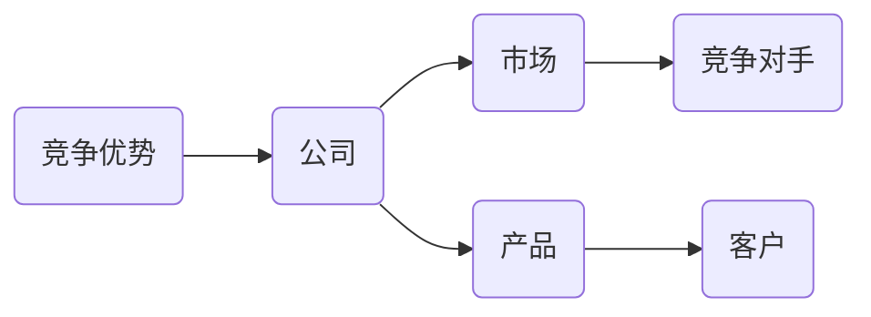
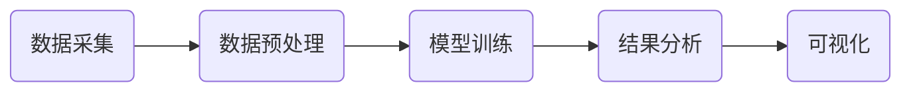
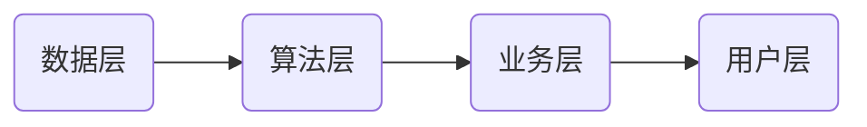
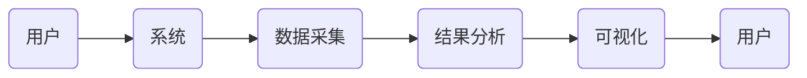

                 


# 机器学习辅助公司竞争优势分析

---

## 关键词：  
机器学习，公司竞争优势，数据分析，算法原理，商业决策

---

## 摘要：  
本文探讨了机器学习如何辅助公司进行竞争优势分析，通过详细分析机器学习的核心概念、算法原理、系统架构和实际应用，揭示了机器学习在商业决策中的巨大价值。文章从背景介绍到项目实战，层层深入，帮助读者理解如何利用机器学习技术提升公司的竞争优势。

---

# 第1章：机器学习与公司竞争优势分析概述

## 1.1 机器学习的基本概念  
### 1.1.1 机器学习的定义与核心概念  
机器学习是一种人工智能技术，通过数据训练模型，使其能够从数据中学习并做出预测或决策。其核心概念包括特征、标签、训练集、测试集等。  

### 1.1.2 公司竞争优势的定义与构成要素  
竞争优势是指公司在市场中相对于竞争对手的有利条件，包括成本优势、技术优势、品牌优势等。  

### 1.1.3 机器学习在竞争优势分析中的作用  
机器学习能够通过数据分析发现潜在的竞争优势，帮助公司制定更有效的战略。  

## 1.2 机器学习与公司竞争分析的背景  
### 1.2.1 当前商业竞争环境的变化  
随着市场竞争的加剧，数据驱动的决策变得越来越重要。  

### 1.2.2 数据驱动决策的重要性  
通过数据分析，公司可以更好地理解市场趋势和竞争对手的动态。  

### 1.2.3 机器学习技术的快速发展  
机器学习技术的不断进步为竞争优势分析提供了新的工具和方法。  

## 1.3 机器学习辅助竞争优势分析的目标与意义  
### 1.3.1 提高竞争优势分析的效率  
通过机器学习，公司可以快速分析大量数据，提高竞争优势分析的效率。  

### 1.3.2 通过数据挖掘发现潜在机会  
机器学习可以帮助公司发现隐藏在数据中的潜在竞争优势。  

### 1.3.3 机器学习在商业决策中的价值  
机器学习能够提供精准的预测和洞察，帮助公司做出更明智的商业决策。  

## 1.4 本章小结  
本章介绍了机器学习的基本概念、公司竞争优势的定义以及机器学习在竞争优势分析中的作用，为后续内容奠定了基础。  

---

# 第2章：机器学习辅助竞争优势分析的核心概念  

## 2.1 竞争优势分析的理论框架  
### 2.1.1 价值链分析模型  
价值链分析模型通过分析公司内部价值链的各个环节，找出竞争优势的来源。  

### 2.1.2 五力分析模型  
五力分析模型（波特五力模型）包括行业竞争者、潜在新进入者、替代品威胁、供应商议价能力和买方议价能力。  

### 2.1.3 竞争优势的核心要素  
竞争优势的核心要素包括成本、质量、创新能力和品牌影响力。  

## 2.2 机器学习在竞争优势分析中的应用领域  
### 2.2.1 市场趋势预测  
通过机器学习模型预测市场趋势，帮助公司制定更有效的市场策略。  

### 2.2.2 竞争对手分析  
机器学习可以帮助公司分析竞争对手的市场行为和战略。  

### 2.2.3 产品定位优化  
通过机器学习分析市场需求，优化产品定位，提高市场竞争力。  

## 2.3 核心概念与联系  
### 2.3.1 竞争优势分析的核心概念对比表  
| 概念       | 描述                                                                 |
|------------|----------------------------------------------------------------------|
| 价值链模型 | 分析公司内部价值链的各个环节，找出竞争优势的来源。                |
| 五力模型   | 分析行业内的竞争环境，包括五种主要力量。                          |
| 机器学习   | 通过数据分析，帮助公司发现竞争优势和潜在机会。                    |

### 2.3.2 机器学习与竞争优势分析的ER实体关系图  


## 2.4 本章小结  
本章通过对比分析和实体关系图，详细讲解了机器学习在竞争优势分析中的核心概念和应用领域，为后续的算法和系统设计奠定了理论基础。  

---

# 第3章：机器学习算法原理与竞争优势分析  

## 3.1 常见机器学习算法及其应用场景  
### 3.1.1 监督学习算法  
监督学习算法包括线性回归、决策树、支持向量机（SVM）等，适用于有标签的数据。  

### 3.1.2 非监督学习算法  
非监督学习算法包括聚类分析、主成分分析（PCA）等，适用于无标签的数据。  

### 3.1.3 强化学习算法  
强化学习算法适用于需要策略优化的场景，如游戏和机器人控制。  

## 3.2 机器学习算法在竞争优势分析中的选择  
### 3.2.1 线性回归模型  
线性回归模型适用于预测连续型变量，如市场需求预测。  

### 3.2.2 决策树模型  
决策树模型适用于分类问题，如客户细分和竞争对手分析。  

### 3.2.3 支持向量机（SVM）  
SVM适用于高维数据的分类和回归问题，如产品定位优化。  

## 3.3 机器学习算法的数学模型与公式  
### 3.3.1 线性回归的数学模型  
$$y = \beta_0 + \beta_1x + \epsilon$$  

### 3.3.2 决策树的分类原理  
决策树通过特征分裂将数据分成不同的类别，每个节点代表一个特征，每个分支代表一个特征值的取值范围。  

### 3.3.3 支持向量机（SVM）的优化目标  
$$\min_{\beta, \beta_0, \xi} \frac{1}{2}\|\beta\|^2 + C\sum_{i=1}^n \xi_i$$  
$$y_i(\beta_0 + \beta^T x_i) \geq 1 - \xi_i$$  

## 3.4 机器学习算法的实现与代码  
### 3.4.1 线性回归的Python实现  
```python
import numpy as np
from sklearn.linear_model import LinearRegression

# 示例数据
X = np.array([[1], [2], [3], [4]])
y = np.array([2, 4, 6, 8])

# 训练模型
model = LinearRegression()
model.fit(X, y)

# 预测
print(model.predict([[5]]))  # 输出：[[10]]
```

### 3.4.2 决策树的Python实现  
```python
from sklearn.tree import DecisionTreeClassifier
from sklearn.datasets import make_classification

# 示例数据
X, y = make_classification(n_samples=100, n_features=2, n_classes=2)

# 训练模型
model = DecisionTreeClassifier()
model.fit(X, y)

# 预测
print(model.predict([[0, 0]]))  # 输出：[0]
```

## 3.5 本章小结  
本章通过具体的算法实现和代码示例，详细讲解了机器学习算法在竞争优势分析中的应用，帮助读者理解如何选择和使用合适的算法。

---

# 第4章：机器学习辅助竞争优势分析的系统架构  

## 4.1 系统功能设计  
### 4.1.1 系统模块划分  
系统模块包括数据采集、数据预处理、模型训练、结果分析和可视化。  

### 4.1.2 系统功能流程图  


## 4.2 系统架构设计  
### 4.2.1 分层架构设计  
系统分为数据层、算法层、业务层和用户层。  

### 4.2.2 系统架构图  


## 4.3 系统接口设计  
### 4.3.1 数据接口  
数据接口负责与外部数据源（如数据库、API）交互。  

### 4.3.2 模型接口  
模型接口负责与机器学习模型交互，接收输入数据并返回结果。  

## 4.4 系统交互设计  
### 4.4.1 用户与系统的交互流程图  


## 4.5 本章小结  
本章通过系统架构设计和交互流程图，详细讲解了机器学习辅助竞争优势分析的系统实现方式，为后续的项目实战奠定了基础。  

---

# 第5章：机器学习辅助竞争优势分析的项目实战  

## 5.1 项目背景与目标  
### 5.1.1 项目背景  
以某公司为例，希望通过机器学习分析市场竞争格局，优化产品定位。  

### 5.1.2 项目目标  
1. 分析市场趋势，预测市场需求。  
2. 分析竞争对手，制定竞争策略。  

## 5.2 项目环境搭建  
### 5.2.1 环境配置  
安装Python、NumPy、Pandas、Scikit-learn等工具。  

### 5.2.2 数据集准备  
收集市场数据、竞争对手数据、客户数据等。  

## 5.3 项目核心实现  
### 5.3.1 数据预处理  
清洗数据、特征提取、数据标准化。  

### 5.3.2 模型训练  
选择合适的算法（如线性回归、决策树）进行模型训练。  

### 5.3.3 结果分析  
通过模型预测结果，分析市场趋势和竞争对手行为。  

### 5.3.4 可视化展示  
使用可视化工具（如Matplotlib、Seaborn）展示分析结果。  

## 5.4 项目代码实现  
### 5.4.1 数据预处理代码  
```python
import pandas as pd
import numpy as np

# 加载数据
data = pd.read_csv('market_data.csv')

# 数据清洗
data.dropna()
data = pd.get_dummies(data)
data = data.drop(columns=['id'])
```

### 5.4.2 模型训练代码  
```python
from sklearn.ensemble import RandomForestClassifier
from sklearn.model_selection import train_test_split

# 划分数据集
X_train, X_test, y_train, y_test = train_test_split(data.drop(columns=['label']), data['label'], test_size=0.2)

# 训练模型
model = RandomForestClassifier()
model.fit(X_train, y_train)

# 评估模型
print(model.score(X_test, y_test))
```

## 5.5 项目结果分析  
### 5.5.1 市场趋势预测结果  
通过模型预测市场需求，优化产品定位。  

### 5.5.2 竞争对手分析结果  
分析竞争对手的市场行为，制定竞争策略。  

## 5.6 本章小结  
本章通过具体的项目实战，详细讲解了机器学习在竞争优势分析中的应用，帮助读者掌握实际操作技能。  

---

# 第6章：机器学习辅助竞争优势分析的总结与展望  

## 6.1 本项目总结  
### 6.1.1 核心成果  
通过机器学习技术，成功实现了市场竞争趋势预测和竞争对手分析。  

### 6.1.2 实施过程中的经验与教训  
数据质量对模型性能影响重大，特征工程是关键。  

## 6.2 未来展望  
### 6.2.1 机器学习技术的进一步发展  
深度学习、强化学习等技术将进一步提升竞争优势分析的精度。  

### 6.2.2 人工智能在商业决策中的应用前景  
随着技术的进步，机器学习将在商业决策中发挥更大的作用。  

## 6.3 最佳实践 tips  
1. 数据预处理是关键，确保数据质量和完整性。  
2. 选择合适的算法，根据问题类型和数据特征进行选择。  
3. 模型评估和调优是提升模型性能的重要步骤。  

## 6.4 本章小结  
本章总结了机器学习辅助竞争优势分析的成果和经验，展望了未来的发展方向，并提供了实际应用中的最佳实践建议。  

---

# 作者：AI天才研究院/AI Genius Institute & 禅与计算机程序设计艺术 /Zen And The Art of Computer Programming

