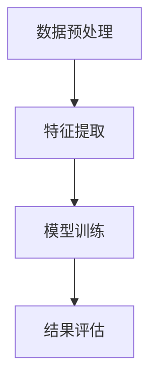

                 


```markdown
# 机器学习辅助公司管理层能力评估

## 关键词：机器学习，管理层能力评估，数据挖掘，特征工程，数学模型，系统架构

## 摘要：本文探讨了机器学习在公司管理层能力评估中的应用，详细介绍了核心概念、算法原理、系统架构和项目实战，提供了丰富的技术细节和案例分析，帮助读者理解如何利用机器学习提升管理层评估的效率和准确性。

---

## 第一部分: 机器学习与公司管理层能力评估的背景介绍

### 第1章: 问题背景与描述

#### 1.1 问题背景
- **传统公司管理层能力评估的挑战**： 
  - 评估过程主观性强，缺乏数据支持。
  - 数据来源分散，处理复杂。
  - 评估结果难以量化和追踪。
- **机器学习在管理评估中的潜力**： 
  - 利用历史数据和模式识别，提高评估的客观性和准确性。
  - 自动化处理大量数据，节省时间和资源。
- **当前企业对管理层能力评估的需求**： 
  - 高效、准确地评估管理层能力，优化公司决策和战略。

#### 1.2 问题描述
- **管理层能力评估的核心要素**： 
  - 包括领导力、决策能力、团队协作、创新能力等。
- **传统评估方法的局限性**： 
  - 主观性高，结果不稳定。
  - 数据收集困难，难以全面评估。
- **机器学习在评估中的优势**： 
  - 数据驱动，结果客观。
  - 可以处理大量非结构化数据，如文本、语音等。

#### 1.3 解决方案概述
- **机器学习的应用场景**： 
  - 数据收集与清洗。
  - 特征提取与模型训练。
  - 结果分析与反馈优化。
- **边界与外延**： 
  - 仅限于数据分析，不涉及实际管理决策。
  - 可扩展到其他领域，如员工绩效评估。

#### 1.4 核心要素组成
- **数据来源**： 
  - 公司内部数据、外部评估报告、员工反馈等。
- **模型选择**： 
  - 根据数据类型和评估目标选择合适的算法。
- **评估指标**： 
  - 精度、召回率、F1分数等。

---

### 第2章: 核心概念与联系

#### 2.1 核心概念原理
- **机器学习的基本原理**： 
  - 通过数据训练模型，使其能够自动学习和预测。
- **管理层能力评估的关键指标**： 
  - 领导力、决策能力、团队协作、创新能力等。
- **数据挖掘与特征工程**： 
  - 从数据中提取有用的信息，用于模型训练。

#### 2.2 核心概念对比分析
| 模型名称       | 优点                           | 缺点                             |
|----------------|--------------------------------|----------------------------------|
| 线性回归       | 简单易懂，计算速度快            | 仅适合线性关系                   |
| 支持向量机     | 分离能力强，适合高维数据        | 对数据预处理要求较高             |
| 随机森林       | 抗过拟合能力强，适合复杂数据    | 计算复杂，解释性差               |

#### 2.3 实体关系图
```mermaid
erd
    管理层能力评估
        绩效指标
        领导力
        决策能力
        团队协作
        创新能力
    数据来源
        公司内部数据
        外部评估报告
        员工反馈
```

---

## 第二部分: 机器学习算法原理与数学模型

### 第3章: 算法原理讲解

#### 3.1 算法原理
- **线性回归模型**： 
  - 用于预测连续型变量，如评分。
- **支持向量机模型**： 
  - 适用于分类和回归，适合高维数据。
- **随机森林模型**： 
  - 通过集成学习提高模型的稳定性和准确性。

#### 3.2 算法流程图


### 第4章: 数学模型与公式

#### 4.1 线性回归模型
- **损失函数**： 
  $$ \text{损失函数} = \sum_{i=1}^{n} (y_i - (\beta_0 + \beta_1x_i))^2 $$
- **优化方法**： 
  $$ \text{梯度下降} = \alpha \frac{\partial L}{\partial \beta} $$

#### 4.2 支持向量机模型
- **核函数**： 
  $$ K(x, y) = x^T y + \text{偏置项} $$
- **软间隔**： 
  $$ \text{软间隔} = C \sum_{i=1}^{n} \xi_i $$

#### 4.3 随机森林模型
- **决策树算法**： 
  - 使用ID3、C4.5或CART算法构建决策树。
- **随机性引入**： 
  - 随机选择特征和样本进行训练。

### 第5章: 算法流程图


---

## 第三部分: 系统分析与架构设计

### 第6章: 系统分析

#### 6.1 问题场景
- **问题场景描述**： 
  - 公司需要评估管理层的能力，但数据分散且复杂。
- **系统功能设计**： 
  - 数据收集与清洗、特征提取、模型训练、结果分析。

#### 6.2 领域模型
```mermaid
classDiagram
    管理层能力评估
    +绩效指标
    +领导力
    +决策能力
    +团队协作
    +创新能力
    管理层能力评估 --> 绩效指标
    管理层能力评估 --> 领导力
    管理层能力评估 --> 决策能力
    管理层能力评估 --> 团队协作
    管理层能力评估 --> 创新能力
```

#### 6.3 系统架构图


---

## 第四部分: 项目实战

### 第7章: 项目实战

#### 7.1 环境安装
- **安装Python和相关库**： 
  - `pip install numpy pandas scikit-learn`

#### 7.2 核心实现
```python
import pandas as pd
from sklearn.model_selection import train_test_split
from sklearn.linear_model import LinearRegression
from sklearn.metrics import mean_squared_error

# 数据加载与预处理
data = pd.read_csv('manager_data.csv')
X = data.drop('performance_score', axis=1)
y = data['performance_score']

# 划分训练集和测试集
X_train, X_test, y_train, y_test = train_test_split(X, y, test_size=0.2, random_state=42)

# 模型训练
model = LinearRegression()
model.fit(X_train, y_train)

# 模型预测
y_pred = model.predict(X_test)

# 模型评估
 mse = mean_squared_error(y_test, y_pred)
 print(f"均方误差: {mse}")
```

#### 7.3 案例分析
- **案例背景**： 
  - 某公司希望通过机器学习评估管理层的创新能力。
- **数据收集**： 
  - 收集了过去5年的创新项目数据、员工反馈等。
- **模型选择**： 
  - 使用随机森林模型进行分类预测。

#### 7.4 项目小结
- **经验总结**： 
  - 数据预处理是关键，缺失值和异常值处理不可忽视。
  - 模型选择应根据数据类型和评估目标进行调整。
  - 模型调优可以显著提升评估结果的准确性。

---

## 第五部分: 最佳实践

### 第8章: 最佳实践

#### 8.1 小结
- **核心要点总结**： 
  - 数据预处理是基础，特征工程是关键。
  - 选择合适的模型，避免过拟合。
  - 模型评估和调优是提升准确性的关键。

#### 8.2 注意事项
- **数据隐私问题**： 
  - 确保数据的安全性和隐私性。
- **模型解释性**： 
  - 避免选择过于复杂的模型，确保结果的可解释性。

#### 8.3 拓展阅读
- **推荐书籍**： 
  - 《机器学习实战》
  - 《数据分析的艺术》

---

## 作者：AI天才研究院/AI Genius Institute & 禅与计算机程序设计艺术 /Zen And The Art of Computer Programming
```

