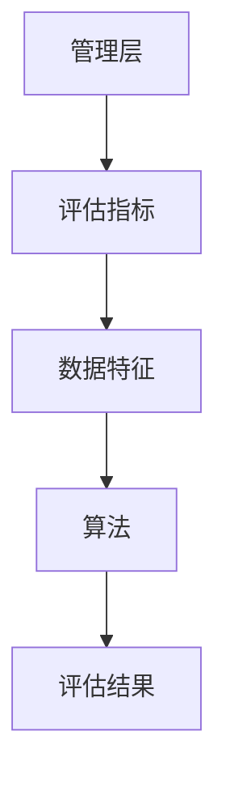
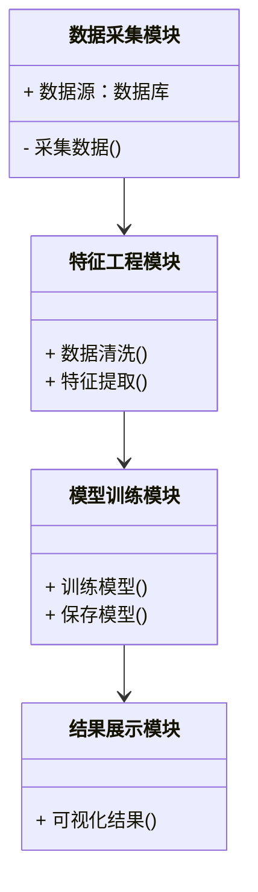
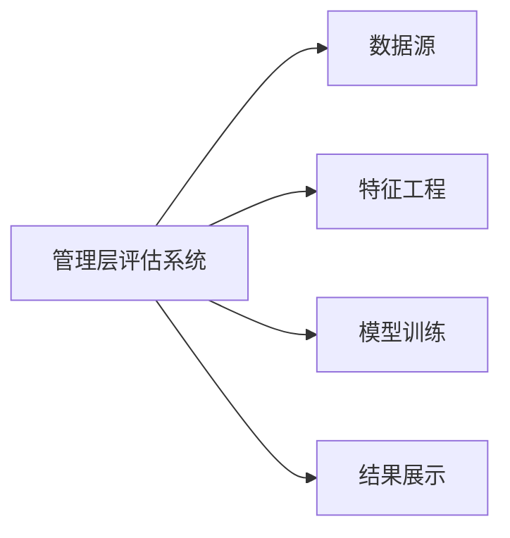

                 


# 机器学习辅助公司管理层评估

**关键词：** 机器学习、管理层评估、数据驱动决策、人工智能、评估系统、管理优化、技术应用

**摘要：**  
本文探讨了如何利用机器学习技术辅助公司管理层的评估过程。通过对机器学习算法、数据处理方法和系统架构的详细分析，展示了如何从海量数据中提取有价值的信息，为管理层评估提供科学依据。文章从背景、核心概念、算法原理到系统设计和项目实战，全面解析了机器学习在管理层评估中的应用，为企业管理优化提供了新的思路。

---

# 第一部分: 机器学习辅助公司管理层评估概述

## 第1章: 机器学习与公司管理层评估的背景

### 1.1 机器学习的基本概念  
机器学习是一种人工智能技术，通过数据训练模型，使其能够自动学习和改进。与传统编程不同，机器学习的核心在于从数据中提取模式和规律，而非依赖于明确的规则编写。  

**关键术语：**  
- **监督学习（Supervised Learning）**：基于标记数据训练模型，预测新数据的标签。  
- **无监督学习（Unsupervised Learning）**：从无标签数据中发现隐藏结构。  
- **特征（Feature）**：数据中的独立变量，用于预测目标变量。  

---

### 1.2 公司管理层评估的传统方法  
传统管理层评估方法依赖于主观判断和经验分析，存在以下问题：  
1. **数据维度有限**：传统评估指标通常局限于财务数据和少量KPI，难以全面反映管理层能力。  
2. **主观性**：人为判断容易受到偏见影响，评估结果缺乏客观性。  
3. **效率低下**：手工评估耗时且难以规模化。  

**对比表格：**  
| 评估方法 | 优缺点 |  
|----------|--------|  
| 传统方法 | 优点：简单易懂；缺点：主观性强，维度有限 |  
| 机器学习 | 优点：数据驱动，客观性强；缺点：需要大量数据和技术支持 |  

---

### 1.3 机器学习在管理层评估中的应用背景  
随着企业数据的爆炸式增长，机器学习为管理层评估提供了新的可能性。通过整合销售数据、市场反馈、员工绩效等多种数据，机器学习能够更全面地分析管理层的决策能力和领导力。  

**发展趋势：**  
1. 数据驱动决策逐渐成为企业管理的核心。  
2. 人工智能技术在企业管理中的应用越来越广泛。  
3. 管理层评估的数字化和智能化需求日益增长。  

---

## 第2章: 核心概念与联系  

### 2.1 核心概念原理  
在管理层评估中，机器学习的核心在于将管理问题转化为数据问题。通过定义合适的特征和目标变量，模型可以自动学习管理层的绩效表现。  

**关键概念：**  
- **特征工程（Feature Engineering）**：通过数据预处理提取有意义的特征，例如将销售额转化为增长率。  
- **目标变量（Target Variable）**：评估的核心指标，例如管理层的绩效评分。  

---

### 2.2 ER实体关系图架构  
以下是管理层评估系统的实体关系图：  



---

### 2.3 核心概念属性特征对比表格  
| 概念 | 特征 | 描述 |  
|------|------|------|  
| 数据特征 | 数量 | 评估指标的数量 |  
| 数据特征 | 类型 | 评估指标的类型（定量/定性） |  
| 模型特征 | 算法 | 使用的机器学习算法 |  
| 模型特征 | 性能 | 模型的准确率、召回率等 |  

---

## 第3章: 机器学习算法原理  

### 3.1 监督学习算法  

#### 3.1.1 线性回归  
线性回归是一种简单但强大的回归算法，适用于预测连续型目标变量。  

**数学公式：**  
$$ y = \theta_0 + \theta_1 x $$  

**损失函数：**  
$$ \text{损失函数} = \sum (y_{\text{真实}} - y_{\text{预测}})^2 $$  

**应用场景：**  
- 预测管理层的绩效评分（连续型目标变量）。  

---

#### 3.1.2 支持向量机（SVM）  
SVM是一种常用的分类算法，适用于二分类问题。  

**数学公式：**  
$$ y = \text{sign}(w \cdot x + b) $$  

**应用场景：**  
- 判断管理层的决策是否优秀（二分类问题）。  

---

### 3.2 无监督学习算法  

#### 3.2.1 K-means聚类  
K-means是一种常用的聚类算法，适用于将管理层分为不同绩效类别。  

**数学公式：**  
$$ \text{目标} = \min \sum_{i=1}^{k} \sum_{j=1}^{n} (x_{i,j} - c_i)^2 $$  

**应用场景：**  
- 将管理层分为高、中、低绩效三类。  

---

## 第4章: 系统分析与架构设计  

### 4.1 问题场景介绍  
本系统的目标是通过机器学习模型，评估公司管理层的绩效。系统需要处理以下数据：  
1. **销售数据**：销售额、增长率等。  
2. **市场反馈**：客户满意度、市场占有率。  
3. **员工绩效**：员工离职率、员工满意度。  

---

### 4.2 系统功能设计  

#### 4.2.1 功能模块  
1. **数据采集模块**：从数据库中提取相关数据。  
2. **特征工程模块**：对数据进行清洗和特征提取。  
3. **模型训练模块**：训练机器学习模型。  
4. **结果展示模块**：可视化评估结果。  

**领域模型类图：**  


---

### 4.3 系统架构设计  

#### 4.3.1 系统架构图  


---

### 4.4 接口设计与交互流程  

#### 4.4.1 接口设计  
1. 数据接口：提供数据采集API。  
2. 模型接口：提供预测API。  

#### 4.4.2 交互流程图  
```mermaid
sequenceDiagram
    participant 用户
    participant 系统
    participant 数据库
    用户 -> 系统：请求评估
    系统 -> 数据库：获取数据
    系统 -> 系统：训练模型
    系统 -> 用户：返回结果
```

---

## 第5章: 项目实战  

### 5.1 环境安装  
1. 安装Python和相关库：`pip install numpy pandas scikit-learn`。  

### 5.2 核心代码实现  

#### 5.2.1 数据预处理  
```python
import pandas as pd

# 读取数据
data = pd.read_csv('management_data.csv')

# 数据清洗
data.dropna(inplace=True)
data = pd.get_dummies(data)  # 特征编码
```

#### 5.2.2 模型训练  
```python
from sklearn.model import LinearRegression

# 训练线性回归模型
model = LinearRegression()
model.fit(X_train, y_train)

# 预测结果
y_pred = model.predict(X_test)
```

---

### 5.3 案例分析  
假设我们有一个公司管理层的数据集，包含以下特征：  
- 销售额（Sales）  
- 市场占有率（Market Share）  
- 员工满意度（Employee Satisfaction）  

通过训练一个线性回归模型，我们可以预测管理层的绩效评分。  

---

## 第6章: 结论  

### 6.1 最佳实践 tips  
1. 数据质量至关重要，确保数据清洗和特征工程。  
2. 模型解释性是关键，选择合适的可视化工具。  
3. 定期更新模型，避免过时。  

---

## 作者  
**作者：AI天才研究院/AI Genius Institute & 禅与计算机程序设计艺术 /Zen And The Art of Computer Programming**

