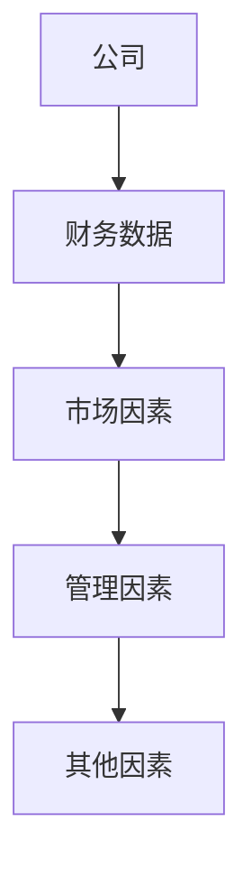
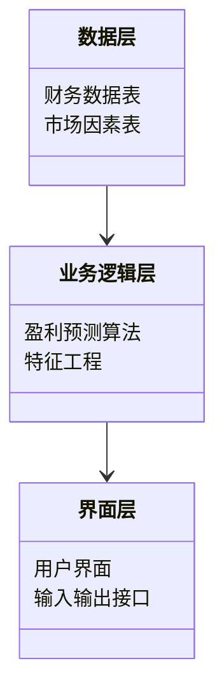
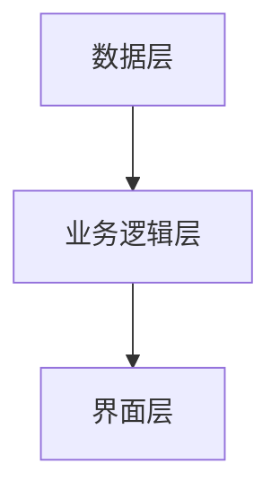
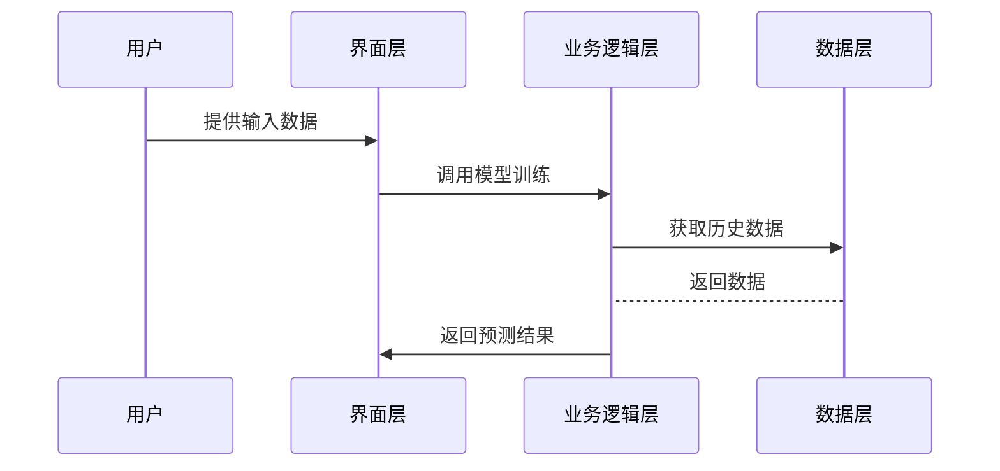

                 


# 机器学习预测公司盈利可持续性

> 关键词：机器学习，公司盈利，可持续性，预测模型，时间序列分析，财务数据分析，人工智能

> 摘要：本文系统地探讨了机器学习在公司盈利可持续性预测中的应用，从理论基础到算法实现，再到系统设计与项目实战，详细讲解了如何利用机器学习技术构建高效的盈利预测模型。文章通过具体案例分析和代码实现，深入剖析了机器学习在财务数据分析中的优势与挑战，为读者提供了全面的技术指导和实践参考。

---

# 第1章: 机器学习预测公司盈利可持续性概述

## 1.1 问题背景与重要性

### 1.1.1 公司盈利预测的定义与意义
公司盈利预测是通过对公司财务数据、市场环境、行业趋势等多方面因素的分析，预测公司未来的盈利能力。它在企业决策、投资评估、风险管理等方面具有重要的应用价值。

### 1.1.2 传统盈利预测方法的局限性
传统盈利预测方法主要依赖于财务比率分析、趋势分析等方法，存在数据维度有限、预测精度不足、难以处理复杂非线性关系等问题。

### 1.1.3 机器学习在盈利预测中的优势
机器学习能够处理高维数据，发现复杂模式，具有较高的预测精度和鲁棒性。它能够结合财务数据、文本数据、市场数据等多种信息，提供更全面的预测结果。

## 1.2 问题描述与目标

### 1.2.1 盈利预测的核心问题
如何基于历史财务数据和外部市场信息，构建一个能够准确预测公司未来盈利能力的模型。

### 1.2.2 机器学习在盈利预测中的目标
通过机器学习算法，挖掘影响公司盈利的关键因素，建立预测模型，实现对目标公司的盈利可持续性进行量化评估。

### 1.2.3 盈利预测的边界与外延
盈利预测的范围通常包括营业收入、净利润等关键指标，但不包括公司内部运营决策等不可预测的因素。

## 1.3 核心概念与联系

### 1.3.1 盈利预测的核心要素
- **财务数据**：包括收入、成本、利润等。
- **市场因素**：包括行业趋势、宏观经济指标等。
- **管理因素**：包括公司战略、管理效率等。
- **其他因素**：包括政策变化、突发事件等。

### 1.3.2 机器学习与盈利预测的关系
机器学习通过数据驱动的方式，帮助我们发现传统方法难以捕捉的非线性关系，从而提高预测的准确性。

### 1.3.3 ER实体关系图架构（使用 Mermaid 流程图）



## 1.4 本章小结

---

# 第2章: 机器学习基础

## 2.1 机器学习的基本概念

### 2.1.1 机器学习的定义
机器学习是一种通过数据驱动的方式，让计算机从经验中学习并改进性能的技术。它可以分为监督学习、无监督学习和强化学习等类型。

### 2.1.2 监督学习、无监督学习与强化学习
- **监督学习**：基于标记数据进行学习，适用于回归和分类问题。
- **无监督学习**：基于未标记数据进行学习，适用于聚类和降维问题。
- **强化学习**：通过与环境交互，学习最优策略。

### 2.1.3 机器学习的核心要素
- 数据：高质量的数据是机器学习的基础。
- 特征：特征的选择和提取对模型性能至关重要。
- 模型：选择合适的算法和模型结构。
- 优化：通过训练优化模型参数。

## 2.2 机器学习的核心算法

### 2.2.1 线性回归
线性回归是最简单的回归算法，适用于预测连续型变量。

$$ y = \beta_0 + \beta_1x + \epsilon $$

### 2.2.2 支持向量机
支持向量机（SVM）适用于分类和回归问题，能够处理高维数据。

### 2.2.3 随机森林
随机森林是一种集成学习算法，通过构建多棵决策树来提高模型的准确性和鲁棒性。

### 2.2.4 神经网络
神经网络是一种模拟人脑神经网络的算法，适用于复杂非线性关系的建模。

## 2.3 数据预处理与特征工程

### 2.3.1 数据清洗
- 删除缺失值
- 处理异常值
- 标准化/归一化

### 2.3.2 特征提取
- 主成分分析（PCA）
- 词袋模型（Bag of Words）

### 2.3.3 特征选择
- 基于统计的方法（如卡方检验）
- 基于模型的方法（如Lasso回归）

## 2.4 本章小结

---

# 第3章: 机器学习在公司盈利预测中的核心概念

## 3.1 盈利预测的数学模型

### 3.1.1 线性回归模型
线性回归是最简单的回归模型，适用于线性关系的预测。

$$ y = \beta_0 + \beta_1x_1 + \beta_2x_2 + \cdots + \beta_nx_n + \epsilon $$

### 3.1.2 时间序列模型
时间序列模型（如ARIMA）适用于具有时间依赖性的数据。

### 3.1.3 集成学习模型
集成学习模型（如随机森林、梯度提升树）能够提高预测的准确性和稳定性。

## 3.2 核心概念与联系

### 3.2.1 财务数据与市场因素的对比表格

| 因素类型 | 示例指标                     |
|----------|------------------------------|
| 财务数据  | 营业收入、净利润、毛利率       |
| 市场因素  | 行业增长率、宏观经济指标     |
| 管理因素  | 管理效率、公司战略           |
| 其他因素  | 政策变化、突发事件           |

### 3.2.2 机器学习算法与盈利预测目标的关系
- 线性回归适用于线性关系的预测。
- 时间序列模型适用于具有时间依赖性的数据。
- 集成学习模型适用于复杂非线性关系的预测。

## 3.3 算法原理讲解

### 3.3.1 线性回归的数学模型
$$ y = \beta_0 + \beta_1x + \epsilon $$

### 3.3.2 时间序列模型的原理
时间序列模型通过分析数据的自相关性和偏自相关性，预测未来值。

### 3.3.3 集成学习的原理
集成学习通过构建多个基模型，并将其预测结果进行集成，提高模型的准确性和鲁棒性。

## 3.4 本章小结

---

# 第4章: 盈利预测的系统分析与架构设计

## 4.1 问题场景介绍

### 4.1.1 盈利预测的业务场景
- 风险投资：评估目标公司的投资价值。
- 企业决策：帮助公司制定战略规划。
- 金融分析：为投资者提供参考。

### 4.1.2 机器学习系统的功能需求
- 数据采集与处理
- 特征工程与模型训练
- 预测结果展示与分析

## 4.2 系统架构设计

### 4.2.1 领域模型设计（使用 Mermaid 类图）



### 4.2.2 系统架构设计（使用 Mermaid 架构图）



## 4.3 接口设计与交互

### 4.3.1 系统接口设计
- 数据输入接口：接收财务数据和市场数据。
- 模型训练接口：训练盈利预测模型。
- 预测结果输出接口：返回预测结果。

### 4.3.2 系统交互设计（使用 Mermaid 序列图）



## 4.4 本章小结

---

# 第5章: 项目实战——基于机器学习的盈利预测系统实现

## 5.1 环境安装与配置

### 5.1.1 安装 Python 环境
使用 Anaconda 或 virtualenv 创建虚拟环境，并安装所需的库（如 scikit-learn、pandas、numpy 等）。

### 5.1.2 数据集准备
获取公开的财务数据和市场数据，清洗并预处理数据。

## 5.2 系统核心实现源代码

### 5.2.1 数据预处理代码

```python
import pandas as pd
import numpy as np

# 读取数据
data = pd.read_csv('financial_data.csv')

# 删除缺失值
data = data.dropna()

# 标准化处理
from sklearn.preprocessing import StandardScaler
scaler = StandardScaler()
scaled_data = scaler.fit_transform(data)
```

### 5.2.2 模型训练代码

```python
from sklearn.model_selection import train_test_split
from sklearn.linear_model import LinearRegression
from sklearn.metrics import mean_squared_error

# 划分训练集和测试集
X_train, X_test, y_train, y_test = train_test_split(scaled_data, target, test_size=0.2, random_state=42)

# 训练模型
model = LinearRegression()
model.fit(X_train, y_train)

# 预测结果
y_pred = model.predict(X_test)

# 评估模型
 mse = mean_squared_error(y_test, y_pred)
 print(f'Mean Squared Error: {mse}')
```

### 5.2.3 系统接口实现代码

```python
# 定义预测接口
def predict_profit(input_data):
    scaled_input = scaler.transform(input_data)
    prediction = model.predict(scaled_input)
    return prediction

# 示例调用
input_data = pd.DataFrame({'feature1': [1], 'feature2': [2]})
print(predict_profit(input_data))
```

## 5.3 项目小结

---

# 第6章: 总结与展望

## 6.1 最佳实践 tips
- 数据预处理是关键，确保数据质量。
- 特征工程是提升模型性能的重要手段。
- 选择合适的算法和模型结构。

## 6.2 小结
通过机器学习技术，我们可以更准确地预测公司盈利的可持续性，为企业决策和投资评估提供有力支持。

## 6.3 注意事项
- 数据的代表性和完整性。
- 模型的泛化能力。
- 结果的解释性和可理解性。

## 6.4 拓展阅读
- 《Hands-On Machine Learning with Scikit-Learn, Keras, and TensorFlow》
- 《时间序列分析：理论与应用》

---

# 作者：AI天才研究院/AI Genius Institute & 禅与计算机程序设计艺术 /Zen And The Art of Computer Programming

