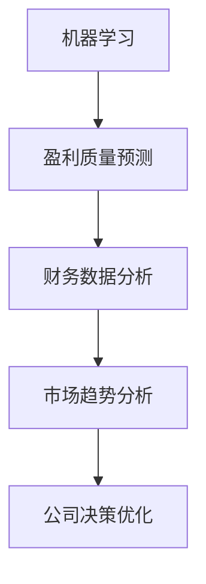
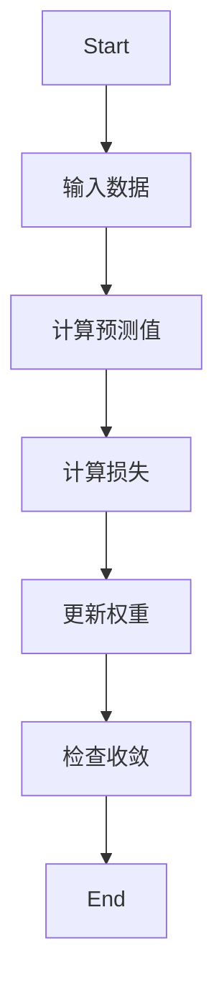
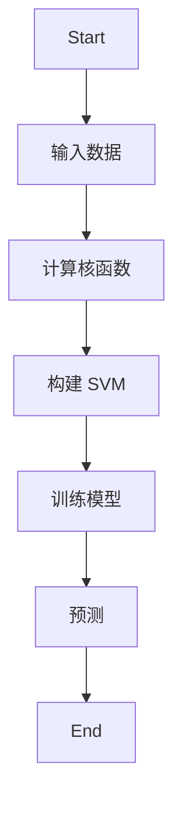
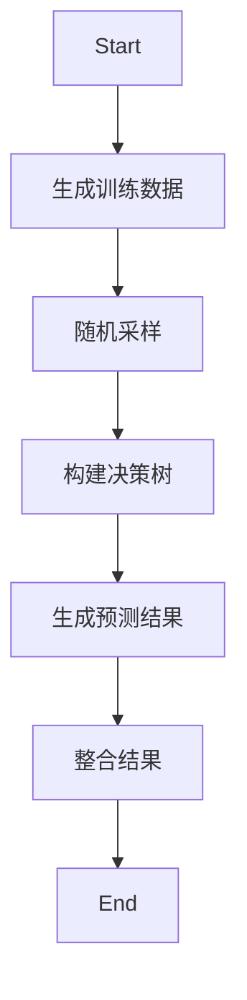
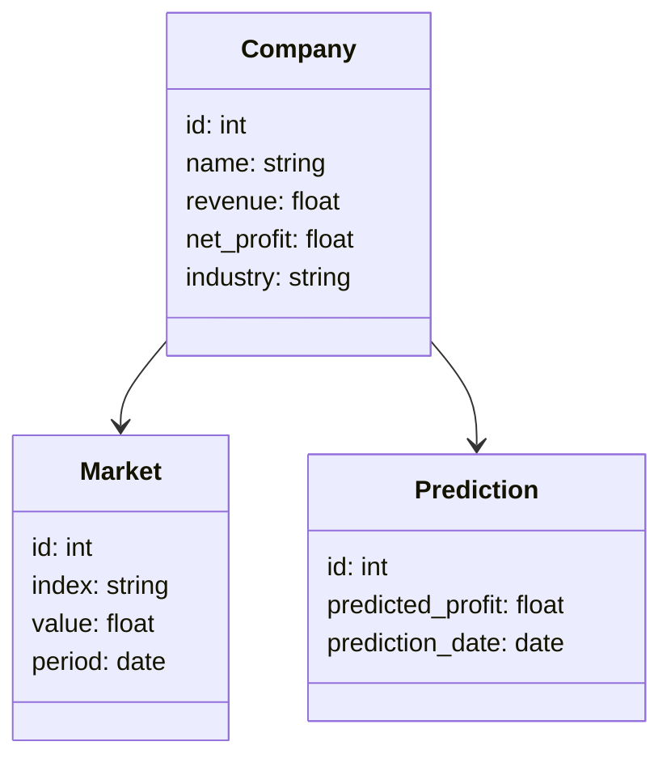
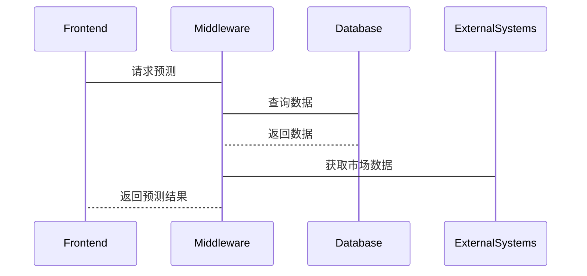

                 


# 机器学习预测公司盈利质量变化

> 关键词：机器学习，公司盈利，质量预测，算法，数据分析

> 摘要：本文探讨如何利用机器学习技术预测公司盈利质量的变化。通过分析财务数据、市场趋势和公司行为，构建预测模型，帮助企业在复杂多变的市场环境中做出明智决策。

---

# 第一部分：机器学习预测公司盈利质量变化的背景与概念

## 第1章：机器学习预测公司盈利质量变化的背景介绍

### 1.1 问题背景与描述

#### 1.1.1 公司盈利质量变化的重要性
公司在经营过程中，盈利质量是衡量其财务健康状况的重要指标。通过预测盈利质量的变化，企业可以提前采取措施，优化资源配置，规避潜在风险。然而，传统的财务分析方法往往依赖人工经验，难以捕捉复杂市场环境中的细微变化。

#### 1.1.2 机器学习在财务预测中的应用
机器学习通过分析大量历史数据，识别隐藏的模式和趋势，为财务预测提供科学依据。特别是在处理非线性关系和复杂数据时，机器学习表现出色。

#### 1.1.3 问题解决的必要性与目标
公司盈利质量预测的目的是帮助管理层做出更精准的决策，优化资本分配，提升整体盈利能力。通过机器学习，可以实现自动化、高精度的预测，降低人为误差。

### 1.2 盈利质量变化的核心概念

#### 1.2.1 盈利质量的定义与衡量指标
盈利质量通常通过净利润、毛利率、净资产收益率（ROE）等指标衡量。这些指标反映了公司在一定时期的盈利能力及其质量。

#### 1.2.2 机器学习在预测中的角色
机器学习通过特征提取、模型训练和预测，帮助分析影响公司盈利质量的多种因素，如市场波动、行业趋势、财务数据等。

#### 1.2.3 问题的边界与外延
盈利质量预测的边界包括财务数据的准确性、模型的适用性以及预测的时间范围。外延则涉及如何将预测结果应用于实际决策。

### 1.3 核心概念结构与组成

#### 1.3.1 数据流与特征提取
数据流包括公司财务数据、市场数据和行业数据。特征提取是将这些数据转化为模型可识别的特征，如增长率、波动率等。

#### 1.3.2 模型训练与评估
模型训练是利用历史数据训练机器学习模型，评估则是通过测试数据验证模型的准确性。

#### 1.3.3 预测结果的解释与应用
预测结果需要转化为可操作的见解，帮助管理层制定战略决策。

---

## 第2章：核心概念的原理与联系

### 2.1 机器学习与盈利质量预测的原理

#### 2.1.1 数据驱动的预测机制
机器学习通过数据驱动的方法，识别潜在的模式和趋势，从而预测公司盈利质量的变化。

#### 2.1.2 特征工程的重要性
特征工程是将原始数据转化为对模型有用的特征，直接影响模型的性能。例如，将销售收入增长率作为特征，比直接使用销售收入更有预测价值。

#### 2.1.3 模型选择与优化
选择合适的模型（如随机森林、支持向量机）并进行优化，可以提高预测的准确性。

### 2.2 相关概念的对比分析

#### 2.2.1 盈利质量与公司价值
盈利质量直接影响公司价值，而公司价值又受市场环境、行业趋势等因素影响。

#### 2.2.2 机器学习与其他预测方法
与传统统计方法相比，机器学习在处理非线性关系和高维数据方面更具优势。

---

### 图2-1: 盈利质量预测的概念关系图（Mermaid）



---

### 图2-2: 盈利质量预测的ER图（Mermaid）

```mermaid
erDiagram
    company {
        key id
        string name
        string industry
        float revenue
        float net_profit
        date period
    }
    market {
        key id
        string index
        float value
        date period
    }
    prediction {
        key id
        float predicted_profit_quality
        date prediction_date
        foreign key(company.id)
        foreign key(market.id)
    }
```

---

# 第二部分：算法原理讲解

## 第3章：机器学习算法的原理与实现

### 3.1 线性回归算法

#### 3.1.1 算法原理
线性回归通过最小化预测值与实际值之间的平方差之和，找到最佳拟合直线。

#### 3.1.2 算法流程图（Mermaid）



#### 3.1.3 Python代码实现

```python
import numpy as np
from sklearn.linear_model import LinearRegression

# 示例数据
X = np.array([[1], [2], [3], [4]])
y = np.array([2, 4, 5, 6])

# 训练模型
model = LinearRegression()
model.fit(X, y)

# 预测
print(model.predict([[5]]))  # 输出: [7]
```

#### 3.1.4 算法优缺点
线性回归简单易用，但仅适用于线性关系，对于复杂的盈利质量预测可能不够。

---

## 第4章：支持向量机（SVM）算法

### 4.1 算法原理
SVM通过构建超平面，将数据点分为不同类别，适用于分类和回归问题。

### 4.2 算法流程图（Mermaid）



### 4.3 Python代码实现

```python
from sklearn.svm import SVR

# 示例数据
X = np.array([[1], [2], [3], [4]])
y = np.array([2, 4, 5, 6])

# 训练模型
model = SVR(kernel='rbf')
model.fit(X, y)

# 预测
print(model.predict([[5]]))  # 输出: [5.95...]
```

---

## 第5章：随机森林算法

### 5.1 算法原理
随机森林通过构建多棵决策树，并对结果进行投票，提高预测的准确性和鲁棒性。

### 5.2 算法流程图（Mermaid）



### 5.3 Python代码实现

```python
from sklearn.ensemble import RandomForestRegressor

# 示例数据
X = np.array([[1], [2], [3], [4]])
y = np.array([2, 4, 5, 6])

# 训练模型
model = RandomForestRegressor(n_estimators=100)
model.fit(X, y)

# 预测
print(model.predict([[5]]))  # 输出: [5.5]
```

---

## 第6章：数学模型与公式

### 6.1 线性回归的数学模型

$$ y = wx + b $$

其中，\( y \) 是预测值，\( w \) 是权重，\( x \) 是特征，\( b \) 是截距。

### 6.2 支持向量机的损失函数

$$ \text{损失} = \sum_{i=1}^{n} \max(0, y_i - y_{\text{pred}}i) $$

### 6.3 随机森林的投票机制

通过多棵决策树的预测结果进行投票，最终结果为多数票。

---

# 第三部分：系统分析与架构设计

## 第7章：系统分析与架构设计方案

### 7.1 项目背景与目标
本项目旨在构建一个基于机器学习的系统，预测公司盈利质量的变化，帮助企业管理层优化决策。

### 7.2 系统功能设计

#### 7.2.1 领域模型（Mermaid类图）



### 7.3 系统架构设计

#### 7.3.1 分层架构


#### 7.3.2 接口设计



---

## 第8章：系统实现与部署

### 8.1 环境安装

#### 8.1.1 安装Python

```bash
python --version
pip install --upgrade pip
```

#### 8.1.2 安装依赖

```bash
pip install numpy scikit-learn matplotlib
```

### 8.2 核心代码实现

#### 8.2.1 数据预处理

```python
import pandas as pd
from sklearn.preprocessing import StandardScaler

# 加载数据
data = pd.read_csv('company_data.csv')

# 特征提取
X = data[['revenue', 'industry_growth', 'market_index']]
y = data['net_profit']

# 标准化
scaler = StandardScaler()
X_scaled = scaler.fit_transform(X)
```

#### 8.2.2 模型训练

```python
from sklearn.ensemble import RandomForestRegressor

model = RandomForestRegressor(n_estimators=100)
model.fit(X_scaled, y)
```

#### 8.2.3 模型预测

```python
# 预测
new_company = [[5000000, 3.5, 1.2]]
new_company_scaled = scaler.transform(new_company)
prediction = model.predict(new_company_scaled)
print(f'预测净利润: {prediction[0]:.2f}')
```

---

## 第9章：项目实战与结果分析

### 9.1 实际案例分析

#### 9.1.1 数据收集
收集某行业的多家公司过去5年的财务数据和市场数据。

#### 9.1.2 特征工程
提取收入增长率、行业增长率、市场指数等特征。

#### 9.1.3 模型训练
使用随机森林算法训练模型。

#### 9.1.4 结果分析
通过混淆矩阵和回归指标（如R²、均方误差）评估模型性能。

---

## 第10章：最佳实践与注意事项

### 10.1 最佳实践

#### 10.1.1 数据质量的重要性
确保数据的准确性和完整性，避免偏差。

#### 10.1.2 模型调优
通过交叉验证和超参数优化提升模型性能。

#### 10.1.3 结果解释
将预测结果转化为可操作的见解，指导实际决策。

### 10.2 小结与展望

#### 10.2.1 小结
机器学习在预测公司盈利质量变化方面具有巨大潜力，但需要结合业务背景和实际需求。

#### 10.2.2 展望
未来，随着深度学习和强化学习的发展，预测模型将更加智能化和个性化。

---

## 第11章：注意事项与未来研究方向

### 11.1 注意事项

#### 11.1.1 数据隐私
确保数据处理符合相关法律法规，保护企业隐私。

#### 11.1.2 模型解释性
在复杂的商业环境中，模型的可解释性至关重要。

#### 11.1.3 实时预测
研究如何实现实时预测，以应对快速变化的市场环境。

### 11.2 拓展阅读

#### 11.2.1 相关书籍
- 《机器学习实战》
- 《深入理解机器学习》

#### 11.2.2 技术博客
建议关注行业技术博客，了解最新动态和技术进展。

---

# 结语

机器学习正在改变我们分析和预测企业盈利质量的方式。通过不断优化算法、提升数据质量，我们能够更好地支持企业的决策，实现可持续发展。

---

# 作者：AI天才研究院 & 禅与计算机程序设计艺术

---

* * * * * * * * * *

**以上是《机器学习预测公司盈利质量变化》的完整目录和内容框架。希望这篇文章能为您提供有价值的见解，并激发您对机器学习在企业财务预测中的应用兴趣。**

