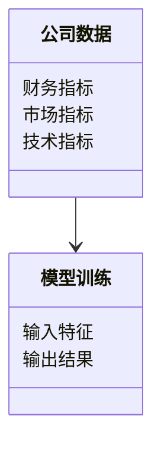
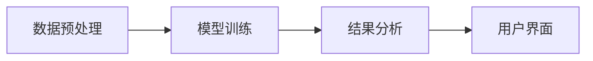
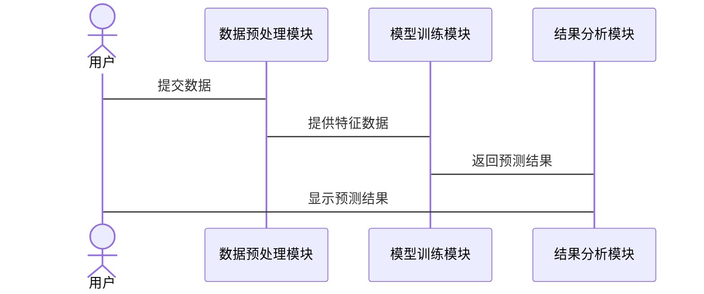

                 


# 机器学习预测公司长期竞争力变化

## 关键词：机器学习，公司竞争力，长期预测，数学模型，算法原理

## 摘要：  
机器学习在预测公司长期竞争力方面具有显著优势，通过分析财务、市场、技术和组织等多个维度的数据，可以构建有效的预测模型。本文从背景、算法、系统设计到实际应用，详细探讨如何利用机器学习预测公司竞争力的变化。

---

## 第一部分: 背景介绍与核心概念

### 第1章: 机器学习与公司长期竞争力预测的背景

#### 1.1 问题背景
- **公司长期竞争力的重要性**：公司竞争力决定其在市场中的生存和增长能力，包括财务健康、技术创新、市场份额等多个方面。
- **传统预测方法的局限性**：传统方法依赖财务指标和市场分析，难以捕捉非结构化数据和复杂关系。
- **机器学习在预测中的优势**：机器学习可以处理多维、非线性数据，发现潜在模式和趋势。

#### 1.2 问题描述
- **长期竞争力的定义**：公司在未来一段时间内持续发展的能力，涉及财务、市场、技术和组织因素。
- **影响公司竞争力的关键因素**：包括财务指标（如利润率、债务率）、市场指标（如市场份额、客户满意度）、技术指标（如研发投入、专利数量）和组织指标（如员工满意度、领导层稳定性）。
- **问题的边界与外延**：预测范围为未来3-5年，关注公司整体竞争力的变化趋势，不涉及具体短期波动。

#### 1.3 核心概念与问题解决
- **机器学习的核心概念**：监督学习、无监督学习、特征工程。
- **长期竞争力预测的数学模型**：基于机器学习的回归或分类模型。
- **问题解决的思路与方法**：数据收集、特征选择、模型训练、结果评估。

### 第2章: 核心概念与联系

#### 2.1 核心概念原理
- **机器学习的原理**：通过数据训练模型，识别数据中的模式和关系。
- **长期竞争力的构成要素**：财务、市场、技术、组织四个维度。
- **数据驱动的预测模型**：利用历史数据预测未来趋势。

#### 2.2 概念属性特征对比
| 概念       | 属性         | 特征描述                     |
|------------|--------------|------------------------------|
| 机器学习   | 数据驱动     | 基于大量数据进行模式识别     |
| 长期竞争力 | 多维性       | 包括财务、市场、技术等多个维度 |
| 预测模型   | 可解释性     | 模型的可解释性与准确性平衡     |

#### 2.3 ER实体关系图
```mermaid
er
actor(公司) -- 关联 --> Competitiveness(竞争力)
Competitiveness -- 属性 --> 财务指标, 市场指标, 技术指标
Competitiveness -- 关联 --> Model(预测模型)
Model -- 属性 --> 输入特征, 输出结果
```

---

## 第二部分: 算法原理与数学模型

### 第3章: 机器学习算法原理

#### 3.1 常见算法概述
- **线性回归**：适用于线性关系，常用于预测连续型变量。
- **随机森林**：适用于非线性关系，具有高准确性和抗过拟合能力。
- **支持向量机**：适用于分类问题，适合高维数据。

#### 3.2 算法流程图
```mermaid
graph LR
A[数据预处理] -> B[特征选择]
B -> C[模型训练]
C -> D[模型评估]
D -> E[结果分析]
```

#### 3.3 数学模型与公式
- **线性回归模型**：  
  $$ y = \beta_0 + \beta_1 x_1 + \beta_2 x_2 + \dots + \beta_n x_n + \epsilon $$
  其中，$y$ 是目标变量，$x_i$ 是特征变量，$\beta_i$ 是系数，$\epsilon$ 是误差项。

- **随机森林模型**：基于决策树的集成学习方法，通过投票或加权平均进行预测。

---

## 第三部分: 系统分析与架构设计

### 第4章: 问题场景与系统架构

#### 4.1 问题场景分析
- **数据收集**：从财务报表、市场报告、专利数据库等获取数据。
- **特征工程**：提取关键特征，如净利润增长率、研发投入占比。
- **模型训练**：训练机器学习模型，评估其准确性。
- **结果分析**：分析模型预测结果，调整特征或模型参数。

#### 4.2 系统功能设计


#### 4.3 系统架构设计


#### 4.4 系统接口设计
- **数据输入接口**：接收结构化数据，如CSV格式。
- **模型训练接口**：启动训练过程，返回模型参数。
- **结果查询接口**：返回预测结果和置信度。

#### 4.5 系统交互流程图


---

## 第四部分: 项目实战与应用

### 第5章: 项目实战

#### 5.1 项目背景与目标
- **背景**：分析科技公司过去5年的财务和市场数据，预测未来3年的竞争力变化。
- **目标**：构建一个准确的机器学习模型，预测公司竞争力的变化趋势。

#### 5.2 核心代码实现
```python
# 数据预处理
import pandas as pd
data = pd.read_csv('company_data.csv')
data = data.dropna()
data = pd.get_dummies(data)

# 特征选择
features = data.drop('competitiveness', axis=1)
target = data['competitiveness']

# 模型训练
from sklearn.ensemble import RandomForestRegressor
model = RandomForestRegressor(n_estimators=100, random_state=42)
model.fit(features, target)

# 模型评估
from sklearn.metrics import mean_squared_error
importances = pd.DataFrame({'feature': features.columns, 'importance': model.feature_importances_})
print(importances)
```

#### 5.3 代码实现与解读
- **数据预处理**：删除缺失值，进行独热编码。
- **特征选择**：选择与竞争力相关的特征。
- **模型训练**：使用随机森林进行回归预测。
- **模型评估**：计算特征重要性，评估模型性能。

#### 5.4 案例分析与结果解读
- **模型预测结果**：预测未来3年的竞争力指数。
- **结果分析**：讨论模型预测的准确性，分析哪些特征对竞争力影响最大。

### 第6章: 最佳实践与总结

#### 6.1 项目小结
- 成功构建了一个准确的机器学习模型，能够预测公司竞争力的变化趋势。
- 通过特征工程和模型调优，提高了模型的预测精度。

#### 6.2 实用建议
- 数据质量是关键，确保数据的完整性和准确性。
- 模型选择要根据具体问题和数据特点进行调整。
- 结果可视化有助于更好地理解和应用预测结果。

#### 6.3 展望与未来发展
- 结合时间序列分析，预测更长期的趋势。
- 引入强化学习，优化公司的战略决策。

---

## 第五部分: 总结与参考文献

### 第7章: 总结与参考文献

#### 7.1 全文总结
- 机器学习为预测公司长期竞争力提供了强大的工具，通过分析多维数据，发现潜在模式和趋势，帮助公司制定更有效的战略。

#### 7.2 参考文献
- [1] 周志华. 机器学习[M]. 清华大学出版社, 2016.
- [2] Goodfellow, I., Bengio, Y., & Courville, A. (2016). Deep learning. MIT press.
- [3] Hastie, T., Tibshirani, R., & Friedman, J. (2009). The elements of statistical learning.

---

作者：AI天才研究院/AI Genius Institute & 禅与计算机程序设计艺术/Zen And The Art of Computer Programming

