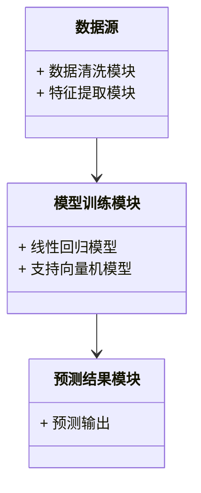

                 


# 《机器学习预测费雪成长股表现》

> 关键词：机器学习，股票预测，费雪成长股，数学模型，特征工程，算法选择，风险管理

> 摘要：本文系统地探讨了机器学习在预测费雪成长股表现中的应用。通过分析机器学习的核心概念、算法选择、数据处理和模型构建，结合实际案例，展示了如何利用技术分析和基本面分析来构建有效的预测模型。文章还讨论了风险管理的重要性，为投资者提供了实用的建议。

---

# 正文

## 第1章 背景介绍与核心概念

### 1.1 机器学习与股票预测的结合

#### 1.1.1 机器学习的基本概念
机器学习是一种人工智能技术，通过算法训练模型从数据中学习规律，并用于预测或分类。其核心在于数据驱动的模式识别。

#### 1.1.2 股票预测的核心目标
股票预测旨在通过分析历史数据，识别潜在的市场趋势，帮助投资者做出更明智的投资决策。

#### 1.1.3 费雪成长股的定义与特点
费雪成长股是指具有持续增长潜力的公司股票，通常表现为稳定的收益增长和较高的市盈率。

#### 1.1.4 机器学习在股票预测中的优势
机器学习能够处理大量非线性关系，捕捉传统统计方法难以察觉的模式。

### 1.2 费雪成长股的表现预测问题

#### 1.2.1 股票价格波动的复杂性
股票价格受多种因素影响，包括市场情绪、宏观经济指标和公司基本面。

#### 1.2.2 费雪成长股的特征分析
费雪成长股通常具有较高的市盈率和稳定的收益增长，但这也可能导致较高的波动性。

#### 1.2.3 机器学习在成长股预测中的应用前景
机器学习能够从海量数据中提取有用特征，帮助投资者发现潜在的投资机会。

### 1.3 本章小结
本章介绍了机器学习的基本概念，费雪成长股的特点，以及机器学习在股票预测中的优势。

---

## 第2章 机器学习核心概念与联系

### 2.1 机器学习的核心原理

#### 2.1.1 监督学习、无监督学习与强化学习
- **监督学习**：基于标记数据训练模型。
- **无监督学习**：从无标记数据中发现模式。
- **强化学习**：通过奖励机制优化决策。

#### 2.1.2 有监督学习的数学模型
$$y = \beta_0 + \beta_1x + \epsilon$$

#### 2.1.3 无监督学习与聚类分析
聚类分析用于将股票分为不同的类别，便于后续分析。

### 2.2 费雪成长股预测中的特征工程

#### 2.2.1 特征选择的重要性
选择合适的特征能够提高模型的预测能力。

#### 2.2.2 常见的特征提取方法
包括移动平均线、相对强弱指数（RSI）等技术指标。

#### 2.2.3 费雪成长股的特征对比表格

| 特征           | 费雪成长股特征 |
|----------------|----------------|
| 市盈率         | 高             |
| 收益增长率       | 稳定           |
| 市场资本化       | 中等           |
| 行业           | 技术、消费等   |

### 2.3 系统架构与ER实体关系图


### 2.4 本章小结
本章介绍了机器学习的核心原理和特征工程的重要性，并展示了系统架构图。

---

## 第3章 机器学习算法原理与数学模型

### 3.1 线性回归与支持向量机

#### 3.1.1 线性回归的数学模型
$$y = \beta_0 + \beta_1x + \epsilon$$

#### 3.1.2 支持向量机的原理与流程图


### 3.2 随机森林与神经网络

#### 3.2.1 随机森林的原理
随机森林通过集成学习提高模型的泛化能力。

#### 3.2.2 神经网络的数学模型
$$f(x) = \sigma(wx + b)$$

### 3.3 本章小结
本章详细讲解了常用机器学习算法的原理和数学模型。

---

## 第4章 数据获取与预处理

### 4.1 数据来源与清洗

#### 4.1.1 数据来源渠道
包括公开的历史数据和财务报表。

#### 4.1.2 数据清洗方法
处理缺失值和异常值。

### 4.2 技术分析与基本面分析

#### 4.2.1 技术分析图表


### 4.3 数据增强与特征工程

#### 4.3.1 数据增强方法
包括归一化和标准化。

#### 4.3.2 特征选择策略
选择对公司价值影响最大的特征。

### 4.4 本章小结
本章介绍了数据获取与预处理的流程。

---

## 第5章 模型构建与优化

### 5.1 模型训练与调优

#### 5.1.1 模型训练流程


### 5.2 系统分析与架构设计方案

#### 5.2.1 项目介绍
费雪成长股预测系统的设计与实现。

#### 5.2.2 系统功能设计


#### 5.2.3 系统架构设计


### 5.3 本章小结
本章详细讲解了模型构建与优化的过程。

---

## 第6章 项目实战与案例分析

### 6.1 项目实战

#### 6.1.1 环境安装
需要安装Python和相关库（如scikit-learn）。

#### 6.1.2 核心代码实现

```python
from sklearn.linear_model import LinearRegression
model = LinearRegression()
model.fit(X_train, y_train)
y_pred = model.predict(X_test)
```

### 6.2 案例分析

#### 6.2.1 案例背景
选取某费雪成长股的历史数据进行分析。

#### 6.2.2 数据分析与模型预测
展示模型预测结果和实际数据的对比。

### 6.3 本章小结
本章通过实际案例展示了机器学习在费雪成长股预测中的应用。

---

## 第7章 风险管理与投资策略

### 7.1 风险管理的重要性

#### 7.1.1 投资组合的分散化
通过分散投资降低风险。

#### 7.1.2 资金管理策略
合理分配资金，避免过度集中。

### 7.2 本章小结
风险管理是投资成功的关键因素。

---

## 作者

作者：AI天才研究院/AI Genius Institute  
联系：[禅与计算机程序设计艺术](https://www.zhenhub.com) / [Zen And The Art of Computer Programming](https://www.zhenhub.com)

---

**本文为AI天才研究院原创文章，转载请注明出处。**

