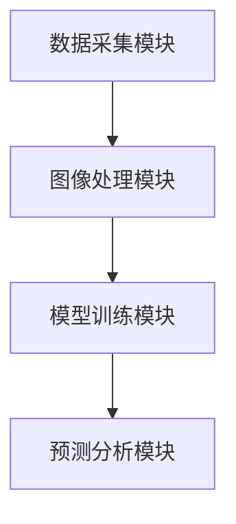

                 


# 机器视觉技术在市场技术分析中的运用

> 关键词：机器视觉，图像识别，市场分析，技术指标，深度学习，神经网络

> 摘要：本文详细探讨了机器视觉技术在市场技术分析中的应用，从基础概念到算法原理，再到实际应用案例，系统地分析了如何利用机器视觉技术提升市场分析的效率和准确性。文章内容包括机器视觉的核心原理、市场技术分析的基本方法、基于图像识别的市场预测模型，以及实际项目中的系统架构设计和代码实现。通过本文的讲解，读者可以全面了解机器视觉在市场分析中的潜力和实现方法。

---

# 引言

随着人工智能技术的快速发展，机器视觉技术在各个领域的应用日益广泛。在市场技术分析中，传统的数据分析方法逐渐被更具智能化的解决方案所取代。机器视觉技术能够通过图像识别、模式分析等手段，帮助分析师快速提取市场数据中的有用信息，从而做出更精准的判断。本文将从理论到实践，全面探讨机器视觉技术在市场技术分析中的运用。

---

## 第1章: 机器视觉技术的基本概念

### 1.1 机器视觉的定义与核心原理

#### 1.1.1 机器视觉的定义
机器视觉（Machine Vision）是指通过计算机模拟人类视觉系统的能力，利用图像处理技术对图像进行分析、理解和决策的过程。其核心目标是让计算机能够“看懂”图像，并基于图像信息做出相应的判断或操作。

#### 1.1.2 机器视觉的核心原理
机器视觉的核心原理包括图像获取、图像处理、特征提取和模式识别四个主要步骤。图像获取是通过摄像头或其他传感器获取图像数据；图像处理是对图像进行预处理，增强图像质量；特征提取是从图像中提取关键特征信息；模式识别则是基于特征信息进行分类或识别。

#### 1.1.3 机器视觉与计算机视觉的区别
虽然机器视觉和计算机视觉都涉及图像处理技术，但两者的目标有所不同。计算机视觉更注重从图像中提取高层次的信息，如三维结构或语义信息；而机器视觉则更关注于实际应用中的具体任务，如工业检测、图像识别等。

### 1.2 市场技术分析的基本概念

#### 1.2.1 市场技术分析的定义
市场技术分析（Market Technical Analysis）是通过分析历史价格数据和市场行为，预测未来市场价格走势的一种方法。其核心假设是市场价格走势具有一定的规律性，可以通过技术指标、图表形态等方法进行分析。

#### 1.2.2 市场技术分析的主要方法
市场技术分析的主要方法包括趋势分析、形态分析、指标分析等。趋势分析是通过分析价格走势的主趋势方向来判断市场走向；形态分析是通过识别价格走势中的特定形态来预测未来的价格变化；指标分析则是通过使用各种技术指标（如RSI、MACD等）来辅助判断市场走势。

#### 1.2.3 技术分析与机器视觉的结合
技术分析与机器视觉的结合主要体现在图像化技术指标和市场形态识别方面。通过将技术指标转化为图像，机器视觉技术可以更直观地识别市场趋势和形态变化。此外，机器视觉还可以用于实时监控市场数据，快速识别异常情况。

---

## 第2章: 机器视觉技术在市场分析中的应用背景

### 2.1 市场分析的复杂性与挑战

#### 2.1.1 数据量大与信息复杂性
市场分析涉及大量的数据，包括价格数据、成交量数据、市场情绪数据等。这些数据的复杂性使得传统的数据分析方法难以应对。

#### 2.1.2 传统技术分析的局限性
传统技术分析方法依赖于分析师的经验和主观判断，存在一定的局限性。例如，人工分析容易受到情绪影响，且效率较低。

#### 2.1.3 机器学习与深度学习的优势
机器学习和深度学习技术能够处理海量数据，并通过模型训练提取数据中的有用信息。相比于传统方法，机器学习具有更高的准确性和效率。

### 2.2 机器视觉技术的优势

#### 2.2.1 高效性与准确性
机器视觉技术能够快速处理大量图像数据，并通过自动化的方式提取有用信息，显著提高了市场分析的效率和准确性。

#### 2.2.2 大数据分析能力
机器视觉技术能够处理不同类型和规模的数据，适用于复杂的市场环境。

#### 2.2.3 实时性与动态性
机器视觉技术可以实时监控市场数据，及时识别市场变化，帮助分析师做出快速反应。

---

## 第3章: 机器视觉的核心算法

### 3.1 图像处理基础

#### 3.1.1 图像的获取与预处理
图像的获取是通过摄像头或传感器捕获图像数据。预处理包括去噪、增强对比度等操作，以提高图像的质量。

#### 3.1.2 常见图像变换方法
常见的图像变换方法包括傅里叶变换、小波变换等。这些变换方法可以将图像从空间域转换到频域，便于后续处理。

#### 3.1.3 图像特征提取
图像特征提取是通过提取图像中的关键特征，如边缘、角点等，为后续的模式识别提供基础。

### 3.2 目标检测与识别

#### 3.2.1 常见目标检测算法
常见的目标检测算法包括Haar级联、HOG+SVM、YOLO等。这些算法通过检测图像中的特定目标，实现对图像内容的理解。

#### 3.2.2 深度学习在目标检测中的应用
深度学习技术，如卷积神经网络（CNN），在目标检测中表现出色。通过训练模型，可以实现对图像中目标的高精度检测。

#### 3.2.3 图像分割技术
图像分割是将图像分割成多个区域，每个区域对应不同的目标或背景。图像分割技术在市场分析中的应用包括识别图像中的特定区域，如价格走势中的支撑位或阻力位。

---

## 第4章: 市场技术分析的机器视觉应用

### 4.1 股票市场分析中的图像特征提取

#### 4.1.1 K线图的形态分析
K线图是股票市场分析中的重要工具。通过图像处理技术，可以识别K线图中的形态，如头肩顶、双底等，帮助预测价格走势。

#### 4.1.2 趋势线与支撑位识别
趋势线和支撑位是技术分析中的重要概念。通过图像处理技术，可以自动识别这些线，并预测价格的变化趋势。

#### 4.1.3 市场情绪的图像化表示
市场情绪可以通过多种方式表示，如成交量、换手率等。通过将这些指标转化为图像，可以更直观地分析市场情绪的变化。

### 4.2 基于图像识别的市场预测

#### 4.2.1 基于K线图的模式识别
通过训练模型识别K线图中的模式，可以预测未来的市场走势。例如，识别出“双底”形态后，可以预测价格将会上涨。

#### 4.2.2 市场周期的图像化判断
市场周期包括上升趋势、下降趋势、震荡趋势等。通过图像处理技术，可以自动判断市场所处的周期，并采取相应的策略。

---

## 第5章: 项目实战 - 股票市场分析系统

### 5.1 系统架构设计

#### 5.1.1 系统功能模块
股票市场分析系统主要包括数据采集、图像处理、模型训练、预测分析等功能模块。

#### 5.1.2 系统架构图


### 5.2 系统核心实现

#### 5.2.1 数据预处理
```python
import numpy as np
import pandas as pd

# 读取数据
data = pd.read_csv('stock_data.csv')

# 数据标准化
data_norm = (data - data.mean()) / data.std()
```

#### 5.2.2 模型训练
```python
from tensorflow.keras import layers

# 构建卷积神经网络模型
model = tf.keras.Sequential([
    layers.Conv2D(32, (3,3), activation='relu', input_shape=(64,64,3)),
    layers.MaxPooling2D((2,2)),
    layers.Conv2D(64, (3,3), activation='relu'),
    layers.MaxPooling2D((2,2)),
    layers.Flatten(),
    layers.Dense(128, activation='relu'),
    layers.Dense(1, activation='sigmoid')
])

# 编译模型
model.compile(optimizer='adam', loss='binary_crossentropy', metrics=['accuracy'])
```

#### 5.2.3 模型预测与结果分析
```python
# 预测价格走势
predicted_prices = model.predict(test_data)
```

---

## 第6章: 总结与展望

### 6.1 总结
本文详细探讨了机器视觉技术在市场技术分析中的应用，从理论到实践，系统地分析了如何利用机器视觉技术提升市场分析的效率和准确性。通过实际案例的分析，展示了机器视觉技术在股票市场分析中的潜力。

### 6.2 展望
未来，随着人工智能技术的不断发展，机器视觉技术在市场技术分析中的应用将更加广泛。通过结合更多的数据源和更复杂的模型，可以进一步提高市场的预测精度和决策效率。

---

## 附录

### 附录A: 机器视觉技术的数学基础

#### A.1 傅里叶变换
傅里叶变换是一种将信号从时域转换到频域的数学工具，广泛应用于图像处理和信号分析中。

#### A.2 支持向量机（SVM）
支持向量机是一种监督学习算法，适用于分类和回归问题。其核心思想是通过找到一个超平面，将数据分成不同的类别。

### 附录B: 项目代码示例

```python
import cv2
import numpy as np
import matplotlib.pyplot as plt

# 读取图像
img = cv2.imread('stock_chart.jpg')

# 显示图像
plt.imshow(img)
plt.title('Stock Chart')
plt.show()
```

---

## 参考文献

1. Goodfellow, I., Bengio, Y., & Courville, A. (2016). Deep Learning. MIT Press.
2. Bishop, C. M. (2006). Pattern Recognition and Machine Learning. Springer.
3. 刘军, 等. (2019). 机器学习实战. 人民邮电出版社.

---

## 作者

作者：AI天才研究院/AI Genius Institute & 禅与计算机程序设计艺术/Zen And The Art of Computer Programming

---

通过本文的详细讲解，读者可以全面了解机器视觉技术在市场技术分析中的应用，从理论到实践，系统地掌握相关知识和技能。

