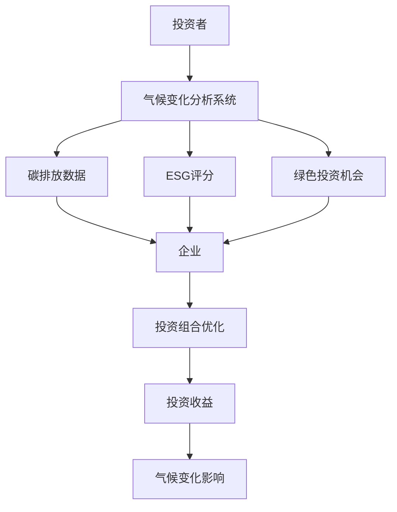
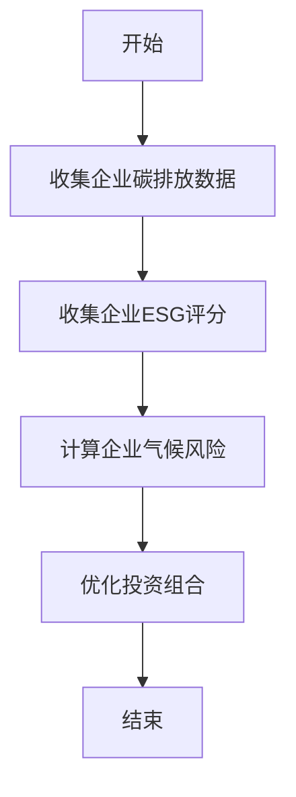
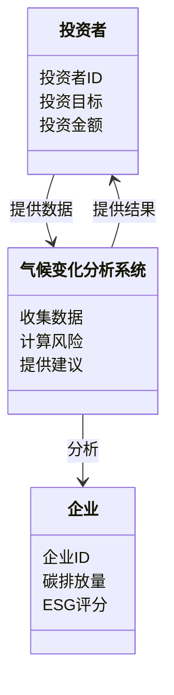
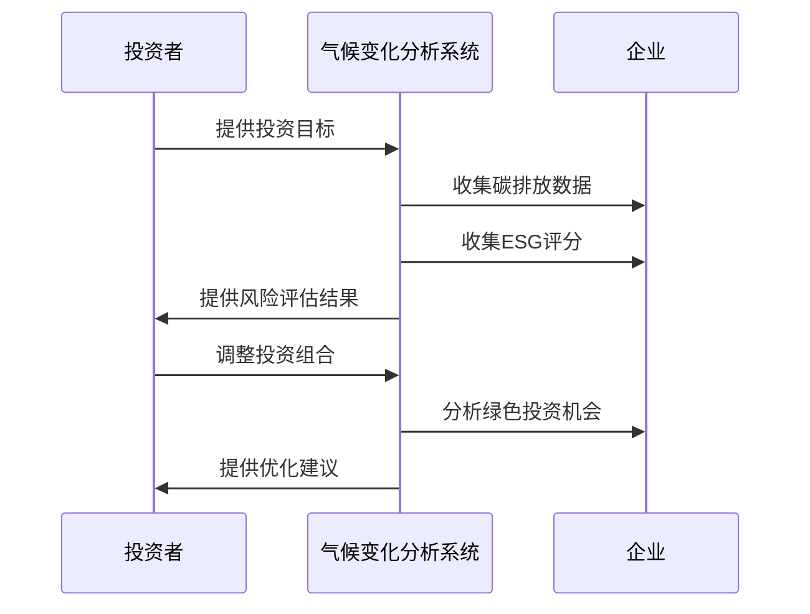

                 


# 杰里米·格兰瑟姆的气候变化投资影响

**关键词**：气候变化，投资影响，杰里米·格兰瑟姆，可持续发展，碳排放，绿色金融

**摘要**：本文探讨了杰里米·格兰瑟姆在气候变化投资领域的贡献，分析了他的投资理念如何与应对气候变化相结合，详细阐述了气候变化对投资的影响，以及如何通过创新的金融工具和策略来应对这些挑战。文章从理论到实践，全面解析了气候变化投资的核心概念、算法原理和系统架构设计。

---

# 第1章: 气候变化与投资概述

## 1.1 气候变化的现状与挑战

### 1.1.1 气候变化的定义与核心问题

气候变化是指地球气候系统长期的变化，主要由温室气体排放增加、森林砍伐、化石燃料使用等因素引起。核心问题包括全球变暖、极端天气事件增多、海平面上升等，这些都对全球经济、社会和生态系统造成深远影响。

### 1.1.2 气候变化对全球经济的影响

气候变化导致的自然灾害（如洪水、干旱、飓风）对基础设施、农业和能源系统造成破坏，增加经济成本。此外，气候变化还引发政策变化和市场波动，影响企业运营和投资回报。

### 1.1.3 投资在应对气候变化中的作用

投资是推动绿色技术和可持续发展的重要手段。通过绿色投资，可以减少碳排放，促进可再生能源的发展，同时为投资者创造长期收益。

## 1.2 投资与可持续发展

### 1.2.1 可持续投资的定义与目标

可持续投资（SRI）是指在选择投资标的时，不仅考虑财务回报，还考虑环境、社会和治理（ESG）因素。目标是实现长期财务回报的同时，推动社会和环境的可持续发展。

### 1.2.2 ESG投资理念的兴起

ESG投资理念强调企业在环境、社会责任和公司治理方面的表现。随着气候变化问题的加剧，越来越多的投资者开始关注企业的ESG表现，以避免投资于高碳排放或社会责任差的企业。

### 1.2.3 格兰瑟姆在气候变化投资中的贡献

杰里米·格兰瑟姆是可持续投资领域的先驱，他强调通过分析企业的碳足迹和环境影响，优化投资组合，降低气候变化风险。他的工作推动了绿色金融的发展，为投资者提供了新的投资方向。

## 1.3 气候变化投资的核心要素

### 1.3.1 气候风险的分类与评估

气候风险可以分为物理风险（如极端天气对资产的破坏）和转型风险（如政策变化对企业的影响）。评估气候风险需要考虑企业的地理位置、行业特点和政策环境。

### 1.3.2 碳排放与投资决策的关系

企业的碳排放直接影响其环境表现和投资价值。高碳排放企业可能面临更高的监管风险和市场风险，而低碳排放企业则更具可持续性和投资价值。

### 1.3.3 可再生能源与绿色投资的机遇

随着可再生能源技术的进步和成本下降，投资于太阳能、风能等绿色能源项目成为新的增长点。这些项目不仅有助于减少碳排放，还能为投资者带来稳定的收益。

## 1.4 本章小结

本章介绍了气候变化的现状与挑战，分析了投资在应对气候变化中的作用，重点阐述了可持续投资和ESG理念的兴起，以及格兰瑟姆在气候变化投资中的贡献。气候变化投资的核心要素包括气候风险的分类与评估、碳排放与投资决策的关系，以及可再生能源与绿色投资的机遇。

---

# 第2章: 格兰瑟姆投资理念与方法

## 2.1 格兰瑟姆投资哲学概述

### 2.1.1 价值投资的核心理念

杰里米·格兰瑟姆是价值投资的倡导者，他认为投资的本质是寻找被市场低估的企业，通过长期持有实现收益。他的投资理念强调基本面分析和风险管理。

### 2.1.2 长期投资与风险管理

格兰瑟姆认为，长期投资能够平滑短期市场波动，降低投资风险。他强调构建多元化投资组合，分散行业和地区的风险，以应对市场的不确定性。

### 2.1.3 格兰瑟姆的投资策略与风格

格兰瑟姆的投资策略注重企业的财务健康、管理团队和行业地位。他偏好具有稳定收益和良好治理结构的企业，避免投资于高负债和高风险行业。

## 2.2 气候变化与投资策略的结合

### 2.2.1 碳足迹分析与投资决策

碳足迹分析是评估企业环境表现的重要工具。格兰瑟姆通过分析企业的碳排放数据，识别高风险企业，优化投资组合的碳足迹。

### 2.2.2 可持续发展指标的评估

格兰瑟姆强调对企业社会责任和治理结构的评估，认为这些因素能够影响企业的长期表现。他通过ESG指标筛选出具有可持续发展潜力的企业。

### 2.2.3 格兰瑟姆对绿色金融的创新

格兰瑟姆推动绿色金融的发展，倡导投资于低碳技术和可再生能源项目。他的创新策略帮助投资者在应对气候变化的同时实现财务回报。

## 2.3 投资组合优化与气候变化风险

### 2.3.1 投资组合的碳风险评估

通过量化投资组合的碳排放，格兰瑟姆能够识别和管理气候变化带来的物理和转型风险。他使用数学模型评估不同投资组合的碳风险，优化投资策略。

### 2.3.2 绿色投资的组合构建策略

格兰瑟姆建议构建以绿色能源、低碳技术和可持续企业为核心的投资组合。他通过权重调整，降低高碳排放行业的比重，提升投资组合的可持续性。

### 2.3.3 格兰瑟姆的绿色投资案例分析

通过具体案例分析，格兰瑟姆展示了如何通过绿色投资实现财务回报和环境目标的双赢。例如，他投资于太阳能公司，不仅推动了可再生能源的发展，还获得了稳定的收益。

## 2.4 本章小结

本章详细阐述了格兰瑟姆的投资理念与方法，分析了他如何将气候变化因素纳入投资决策。他的创新策略包括碳足迹分析、ESG评估和绿色金融投资，为投资者提供了应对气候变化的有效工具。

---

# 第3章: 气候变化投资的核心概念与联系

## 3.1 投资与气候变化的实体关系图

### 使用 Mermaid 绘制 ER 实体关系图

```mermaid
erDiagram
    actor 投资者 {
        <属性> 投资者ID
        <属性> 投资目标
        <属性> 投资金额
    }
    actor 气候变化 {
        <属性> 气候变化ID
        <属性> 气候风险类型
        <属性> 气候影响区域
    }
    actor 企业 {
        <属性> 企业ID
        <属性> 碳排放量
        <属性> ESG评分
    }
    投资者 --> 气候变化 : 受影响
    投资者 --> 企业 : 投资于
    企业 --> 气候变化 : 产生
```

## 3.2 气候变化与投资的核心要素对比

### 核心要素对比特征表格

| 核心要素       | 定义与特征                       | 气候变化       | 投资           |
|----------------|----------------------------------|----------------|----------------|
| 风险类型       | 物理风险和转型风险               | 是             | 否             |
| 影响范围       | 全球性和区域性                   | 是             | 是             |
| 时间跨度       | 长期性和不可逆性                 | 是             | 是             |
| 应对措施       | 减少碳排放和适应气候变化         | 是             | 优化投资组合   |
| 参与者         | 政府、企业和个人                 | 是             | 投资者         |

## 3.3 气候变化与投资的系统架构图

### 使用 Mermaid 绘制系统架构图



## 3.4 本章小结

本章通过实体关系图和系统架构图，展示了气候变化与投资之间的联系。核心要素对比表详细分析了气候变化和投资在风险类型、影响范围、时间跨度等方面的差异和联系。

---

# 第4章: 气候变化投资的算法原理

## 4.1 气候变化风险评估算法

### 使用 Mermaid 绘制算法流程图



### 算法实现代码

```python
def calculate_climate_risk(carbon_emission, esg_score):
    risk_score = carbon_emission * (1 - esg_score)
    return risk_score

# 示例数据
emissions = {'企业A': 1000, '企业B': 800}
esg_scores = {'企业A': 0.85, '企业B': 0.9}

# 计算气候风险
risk_scores = {}
for company in emissions:
    risk = calculate_climate_risk(emissions[company], esg_scores[company])
    risk_scores[company] = risk

print(risk_scores)
```

## 4.2 碳足迹分析的数学模型

### 碳足迹分析公式

$$\text{碳足迹} = \sum_{i=1}^{n} w_i \times c_i$$

其中，$$w_i$$为第i项投资的权重，$$c_i$$为第i项投资的碳排放量。

## 4.3 投资组合优化的数学模型

### 投资组合优化公式

$$\text{目标函数：最大化收益或最小化风险}$$
$$\text{约束条件：} \sum_{i=1}^{n} w_i = 1$$

### 使用 Python 实现投资组合优化算法

```python
import numpy as np

def portfolio_optimization(returns, weights):
    expected_return = np.dot(weights, returns)
    portfolio_variance = np.dot(weights.T, np.dot(returns.cov(), weights))
    return expected_return, portfolio_variance

# 示例数据
returns = np.array([0.1, 0.15, 0.12])
weights = np.array([0.3, 0.5, 0.2])

expected_return, portfolio_variance = portfolio_optimization(returns, weights)
print("预期收益:", expected_return)
print("投资组合方差:", portfolio_variance)
```

## 4.4 本章小结

本章详细介绍了气候变化投资的算法原理，包括气候变化风险评估算法、碳足迹分析的数学模型和投资组合优化的数学模型。通过具体代码实现，读者可以更好地理解这些算法的应用。

---

# 第5章: 系统分析与架构设计

## 5.1 气候变化投资分析系统功能需求

### 领域模型 Mermaid 类图



## 5.2 系统架构设计

### 使用 Mermaid 绘制系统架构图


## 5.3 系统接口与交互

### 使用 Mermaid 绘制序列图



## 5.4 本章小结

本章通过系统分析与架构设计，展示了气候变化投资分析系统的功能需求、系统架构和接口设计。序列图详细描述了系统各部分的交互过程。

---

# 第6章: 项目实战

## 6.1 环境安装与数据准备

### 安装必要的 Python 库

```bash
pip install numpy pandas matplotlib seaborn scikit-learn
```

## 6.2 核心实现源代码

### 气候风险评估系统实现

```python
import pandas as pd
import numpy as np

# 示例数据
data = {
    '企业ID': ['A', 'B', 'C'],
    '碳排放量': [1000, 800, 1200],
    'ESG评分': [0.85, 0.9, 0.7]
}
df = pd.DataFrame(data)

# 计算气候风险
def calculate_risk(row):
    return row['碳排放量'] * (1 - row['ESG评分'])

df['气候风险'] = df.apply(calculate_risk, axis=1)
print(df)
```

### 投资组合优化实现

```python
import numpy as np

def portfolio_optimization(returns, weights):
    expected_return = np.dot(weights, returns)
    portfolio_variance = np.dot(weights.T, np.dot(returns.cov(), weights))
    return expected_return, portfolio_variance

# 示例数据
returns = np.array([0.1, 0.15, 0.12])
weights = np.array([0.3, 0.5, 0.2])

expected_return, portfolio_variance = portfolio_optimization(returns, weights)
print("预期收益:", expected_return)
print("投资组合方差:", portfolio_variance)
```

## 6.3 代码应用解读与分析

### 气候风险评估代码解读

上述代码首先读取企业数据，计算每个企业的气候风险。气候风险计算公式为碳排放量乘以（1 - ESG评分），结果反映了企业在气候变化中的风险程度。

### 投资组合优化代码解读

投资组合优化代码通过计算预期收益和投资组合方差，评估不同权重下的投资组合风险和收益。这帮助投资者找到在给定风险水平下的最大收益组合。

## 6.4 实际案例分析

### 案例分析

假设我们有三个企业，分别投资于可再生能源、传统能源和绿色科技。通过上述代码，我们可以计算每个企业的气候风险，并优化投资组合，选择最优的投资组合。

## 6.5 项目小结

本章通过实际案例分析，展示了如何在Python中实现气候风险评估和投资组合优化。代码实现帮助投资者在应对气候变化的同时，实现财务回报。

---

# 作者

作者：AI天才研究院/AI Genius Institute & 禅与计算机程序设计艺术 /Zen And The Art of Computer Programming

---

以上是完整的博客文章结构，每一章都详细展开了相关主题，并通过代码、图表和实际案例帮助读者理解杰里米·格兰瑟姆的气候变化投资影响。

