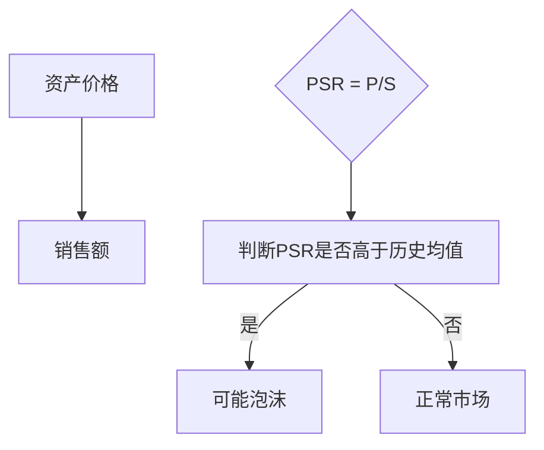
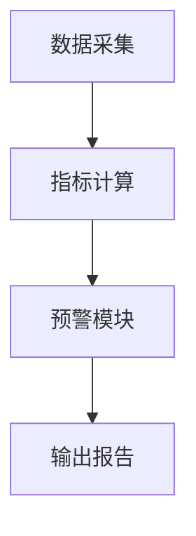

                 


# 杰里米格兰瑟姆的资产泡沫理论

## 关键词：资产泡沫，杰里米格兰瑟姆，PSR模型，金融市场，风险管理

## 摘要：本文深入分析了杰里米·格兰瑟姆的资产泡沫理论，探讨了泡沫的形成机制、识别方法和预警模型。通过PSR模型的详细讲解，结合实际案例和系统设计，为投资者提供了有效的风险管理策略。

---

## 第一部分: 资产泡沫理论的背景与基础

### 第1章: 资产泡沫的基本概念与历史背景

#### 1.1 资产泡沫的定义与特征

##### 1.1.1 资产泡沫的定义
资产泡沫是指资产价格在短时间内急剧上涨，远远超过其内在价值的现象。泡沫的本质是市场参与者基于非理性预期和情绪驱动，导致价格脱离基本面。

##### 1.1.2 资产泡沫的核心特征
- **价格与价值的分离**：资产价格远高于其内在价值。
- **市场情绪的主导作用**：投资者情绪从乐观到狂热，再到恐慌。
- **自我强化机制**：价格的上涨吸引更多买盘，形成正反馈循环。

##### 1.1.3 资产泡沫与金融危机的关系
资产泡沫的破裂往往引发金融危机，如2008年的次贷危机和2020年的加密货币崩盘。

#### 1.2 资产泡沫的历史案例

##### 1.2.1 荷兰郁金香泡沫
17世纪荷兰郁金香狂热导致价格暴涨，随后暴跌，成为最早的资产泡沫案例。

##### 1.2.2 南海泡沫
18世纪英国南海公司事件，投资者盲目跟风导致市场崩盘。

##### 1.2.3 互联网泡沫与2008年金融危机
互联网泡沫导致大量科技公司估值虚高，2008年金融危机则是房地产泡沫破裂的后果。

##### 1.2.4 近期加密货币与房地产泡沫案例
比特币和房地产市场的大幅波动展示了现代资产泡沫的特点。

#### 1.3 杰里米·格兰瑟姆的资产泡沫理论背景

##### 1.3.1 格兰瑟姆的学术与投资背景
格兰瑟姆是价值投资的倡导者，曾任富达投资的首席投资官，长期关注市场周期。

##### 1.3.2 格兰瑟姆对资产泡沫研究的贡献
他提出了PSR模型，用于量化资产价格与基本面的偏离程度。

##### 1.3.3 资产泡沫理论的现实意义
帮助投资者识别市场风险，制定有效的投资策略。

#### 1.4 本章小结
本章介绍了资产泡沫的基本概念、历史案例及格兰瑟姆的理论背景，为后续分析奠定了基础。

---

## 第二部分: 资产泡沫的形成机制与分析模型

### 第2章: 资产泡沫的形成机制

#### 2.1 资产泡沫的形成过程

##### 2.1.1 资产价格的非理性上涨阶段
投资者基于乐观预期推动价格上涨，市场情绪逐渐升温。

##### 2.1.2 泡沫的形成与膨胀阶段
价格远高于基本面，市场参与者盲目跟风，杠杆使用增加。

##### 2.1.3 泡沫破裂与市场崩盘阶段
价格突然下跌，引发连锁反应，导致市场恐慌和崩盘。

#### 2.2 资产泡沫的驱动因素

##### 2.2.1 市场情绪与投资者心理
过度乐观和贪婪导致投资者忽视基本面。

##### 2.2.2 资金流动性与杠杆效应
宽松的货币政策和杠杆融资推动价格上涨。

##### 2.2.3 市场结构与信息不对称
信息不透明和市场操纵加剧泡沫形成。

##### 2.2.4 宏观经济环境与政策影响
低利率和经济不确定性推动投资者寻求高风险资产。

#### 2.3 资产泡沫的风险特征

##### 2.3.1 泡沫的可测量性
通过价格与价值的偏离度进行量化。

##### 2.3.2 泡沫的不可持续性
价格无法长期维持在虚高状态。

##### 2.3.3 泡沫破裂的传染效应
个别资产崩盘可能引发系统性风险。

#### 2.4 格兰瑟姆资产泡沫模型的核心要素

##### 2.4.1 市场情绪指标
通过投资者情绪指数反映市场乐观程度。

##### 2.4.2 资产价格与基本面偏离度
比较市盈率、市净率等指标与历史平均水平的差异。

##### 2.4.3 市场流动性与杠杆比率
高杠杆和低流动性是泡沫形成的预警信号。

---

## 第三部分: 资产泡沫的识别与预警模型

### 第3章: 资产泡沫的识别与预警模型

#### 3.1 资产泡沫识别的核心指标

##### 3.1.1 市盈率（P/E）与市净率（P/B）
$$ P/E = \frac{股价}{每股收益} $$
$$ P/B = \frac{股价}{每股净资产} $$

##### 3.1.2 市销率（P/S）与股息率
$$ P/S = \frac{股价}{每股收入} $$
股息率 = 每股股息 / 股价

##### 3.1.3 资产负债率与杠杆比率
$$ 负债率 = \frac{总负债}{总资产} $$
$$ 杠杆比率 = \frac{总负债}{权益} $$

#### 3.2 格兰瑟姆的PSR模型

##### 3.2.1 PSR模型的定义与公式
$$ PSR = \frac{P}{S} $$
其中，P为资产价格，S为资产销售额。

##### 3.2.2 PSR模型的适用场景
适用于判断资产价格是否被高估。

#### 3.3 PSR模型的可视化分析
使用Mermaid流程图展示PSR模型的分析步骤。



---

## 第四部分: 系统分析与架构设计

### 第4章: 资产泡沫监测系统的架构设计

#### 4.1 系统功能模块

##### 4.1.1 数据采集模块
从数据库中获取实时资产价格和基本面数据。

##### 4.1.2 指标计算模块
计算PSR、P/E等指标。

##### 4.1.3 预警模块
根据指标判断是否存在泡沫风险。

#### 4.2 系统架构设计
使用Mermaid架构图展示系统模块关系。



---

## 第五部分: 项目实战与总结

### 第5章: 项目实战

#### 5.1 环境安装
安装Python和相关库（pandas, numpy）。

#### 5.2 核心代码实现

```python
import pandas as pd
import numpy as np

# 示例数据
data = {'公司': ['A', 'B', 'C'],
        '股价': [100, 200, 150],
        '销售额': [50, 100, 75]}
df = pd.DataFrame(data)

# 计算PSR
df['PSR'] = df['股价'] / df['销售额']

print(df)
```

#### 5.3 代码解读与案例分析
解释代码实现，并分析实际案例，如互联网公司PSR值的变化。

#### 5.4 项目小结
总结项目实现过程和经验教训。

### 第6章: 总结与最佳实践

#### 6.1 总结
资产泡沫的识别与管理对投资者至关重要。

#### 6.2 最佳实践 tips
- 定期监控市场指标。
- 结合PSR模型进行估值。
- 保持谨慎，避免过度杠杆。

#### 6.3 注意事项
避免情绪化投资，关注长期基本面。

#### 6.4 拓展阅读
推荐相关书籍和论文。

---

## 作者：AI天才研究院 & 禅与计算机程序设计艺术

---

通过以上结构，文章详细分析了杰里米·格兰瑟姆的资产泡沫理论，结合理论与实践，为读者提供了全面的视角和实用的工具。

