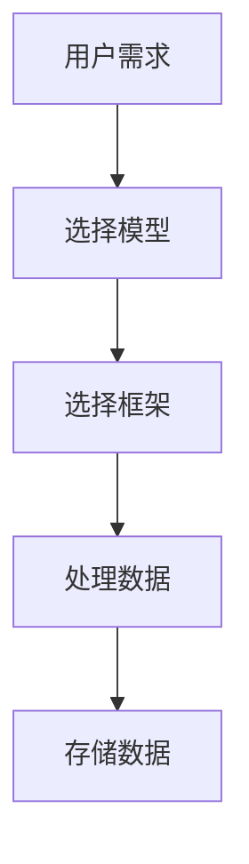

                 


# 构建AI Agent的技术栈选择：权衡与决策

## 关键词：AI Agent，技术栈，权衡，决策，人工智能，机器学习

## 摘要：在构建AI Agent的过程中，技术栈的选择至关重要。本文从AI Agent的核心概念出发，分析了技术栈的各个组件，包括模型选择、框架选择、数据处理与存储等，并通过对比和实际案例，详细探讨了技术栈选择的关键因素和权衡策略。文章还结合了算法原理和数学模型，为读者提供了一套系统化的技术栈选择方法，帮助在不同场景下做出最优决策。

---

# 第一部分：AI Agent技术栈选择的背景与核心概念

## 第1章：AI Agent的基本概念与技术栈选择背景

### 1.1 AI Agent的定义与特点

#### 1.1.1 AI Agent的基本定义

AI Agent（人工智能代理）是指能够感知环境并采取行动以实现目标的智能体。它可以是一个软件程序、机器人或其他智能系统，通过接收输入数据，进行分析和决策，然后输出操作或结果。

AI Agent的核心特点包括：

- **自主性**：能够在没有外部干预的情况下独立运行。
- **反应性**：能够实时感知环境并做出响应。
- **目标导向**：所有行为都围绕实现特定目标展开。
- **学习能力**：通过数据和经验不断优化性能。

#### 1.1.2 AI Agent与传统AI的区别

传统AI（如专家系统）依赖于预定义的规则和知识库，而AI Agent更加动态和自适应，能够在复杂环境中自主决策。AI Agent还具备更强的交互性和实时性，能够与人类或其他系统进行实时通信和协作。

#### 1.1.3 AI Agent的分类与应用场景

AI Agent可以根据智能水平和功能类型进行分类：

- **按智能水平**：
  - **反应式AI Agent**：基于当前感知做出反应，适用于实时任务。
  - **认知式AI Agent**：具备复杂推理和规划能力，适用于复杂场景。
  
- **按功能类型**：
  - **任务型AI Agent**：专注于完成特定任务，如自动交易、智能客服。
  - **服务型AI Agent**：提供持续的服务，如智能家居、自动驾驶。

应用场景包括智能助手、智能客服、自动驾驶、智能监控等。

---

## 第2章：AI Agent技术栈选择的背景与重要性

### 2.1 AI Agent技术栈选择的背景

随着AI技术的快速发展，AI Agent的应用场景越来越广泛。然而，选择合适的技术栈对项目的成功至关重要。技术栈的选择需要考虑性能、可扩展性、开发效率和成本等多个因素。

### 2.2 技术栈选择对企业的影响

技术栈的选择直接影响开发效率、系统性能和维护成本。合理的技术栈能够提高开发效率，降低维护成本，同时提升系统的稳定性和可扩展性。

### 2.3 技术栈选择的关键因素

选择AI Agent技术栈时需要考虑以下关键因素：

- **模型选择**：根据任务需求选择合适的AI模型。
- **框架选择**：选择适合模型开发和部署的框架。
- **数据处理**：确保数据的高效处理和存储。
- **计算资源**：根据模型复杂度选择合适的硬件和云计算资源。

---

# 第二部分：AI Agent技术栈的核心概念与联系

## 第3章：AI Agent技术栈的核心组件

### 3.1 AI Agent的模型选择

#### 3.1.1 模型选择的关键因素

模型选择需要考虑任务需求、数据量、计算资源和模型复杂度。例如，对于图像识别任务，卷积神经网络（CNN）是更合适的选择。

#### 3.1.2 常见AI模型类型对比

以下是一些常见AI模型的对比：

| 模型类型 | 优点 | 缺点 | 适用场景 |
|----------|------|------|----------|
| CNN      | 高精度 | 高计算资源需求 | 图像识别、计算机视觉 |
| RNN      | 处理序列数据 | 易发梯度消失 | 时间序列分析、自然语言处理 |
| Transformer | 高效处理长序列 | 易发注意力稀疏 | 机器翻译、文本生成 |

### 3.2 AI Agent的框架选择

#### 3.2.1 常用AI框架的特点与适用场景

以下是一些常用AI框架的对比：

| 框架 | 特点 | 适用场景 |
|------|------|----------|
| TensorFlow | 支持多平台，模块化设计 | 通用AI开发 |
| PyTorch | 动态计算，适合研究 | 快速原型开发 |
| MXNet | 轻量级，适合移动端 | 移动端部署 |

#### 3.2.2 框架选择的影响因素

- **开发效率**：选择易于调试和维护的框架。
- **计算性能**：选择支持高效计算的框架。
- **社区支持**：选择有活跃社区支持的框架。

### 3.3 AI Agent的数据处理与存储

#### 3.3.1 数据预处理的关键步骤

数据预处理包括数据清洗、特征提取和数据增强。例如，在图像数据中，可以通过随机裁剪和旋转进行数据增强。

#### 3.3.2 数据存储方案的选择

根据数据量和访问频率选择合适的数据存储方案：

- **关系型数据库**：适用于结构化数据。
- **非关系型数据库**：适用于非结构化数据。
- **分布式存储**：适用于大规模数据存储。

---

## 第4章：AI Agent技术栈的核心概念联系

### 4.1 技术栈核心组件的对比分析

以下是一个技术栈核心组件的对比表格：

| 组件 | 优缺点 | 影响因素 |
|------|--------|----------|
| 模型 | 高精度，但计算资源需求高 | 任务需求，计算能力 |
| 框架 | 开发效率高，但可能限制扩展性 | 开发效率，计算性能 |
| 数据存储 | 可靠性高，但存储成本高 | 数据量，访问频率 |

### 4.2 技术栈的ER实体关系图

```mermaid
er
    actor: 用户
    model: AI模型
    framework: AI框架
    data: 数据存储
    relation: 关系
    actor -[选择]-> model
    actor -[依赖]-> framework
    model -[处理]-> data
    framework -[支持]-> data
```

### 4.3 技术栈的流程图



---

# 第三部分：AI Agent技术栈的算法原理与数学模型

## 第5章：AI Agent算法原理

### 5.1 AI Agent算法的选择与实现

#### 5.1.1 基于强化学习的AI Agent

强化学习是一种通过试错机制来优化决策的算法。其核心思想是通过与环境交互，不断调整策略以最大化累积奖励。

#### 5.1.2 强化学习的数学模型

强化学习的数学模型包括状态空间、动作空间、奖励函数和策略函数。以下是一个简单的Q-learning算法公式：

$$ Q(s, a) = Q(s, a) + \alpha (r + \max Q(s', a') - Q(s, a)) $$

其中：
- \( Q(s, a) \)：状态s和动作a对应的Q值。
- \( \alpha \)：学习率。
- \( r \)：奖励值。
- \( \max Q(s', a') \)：下一个状态的最大Q值。

---

## 第6章：AI Agent系统的实现与优化

### 6.1 AI Agent系统的实现流程

#### 6.1.1 环境搭建

需要安装Python、TensorFlow或PyTorch框架，以及必要的数据处理库。

#### 6.1.2 模型训练

以下是一个简单的强化学习训练代码示例：

```python
import numpy as np
import gym

env = gym.make('CartPole-v0')
env.seed(42)

num_episodes = 1000
gamma = 0.99
epsilon = 1.0
epsilon_min = 0.01
epsilon_decay = 0.995

Q = np.zeros([env.observation_space.shape[0], env.action_space.n])

for episode in range(num_episodes):
    state = env.reset()
    done = False
    while not done:
        if np.random.random() < epsilon:
            action = env.action_space.sample()
        else:
            action = np.argmax(Q[state])
        
        next_state, reward, done, _ = env.step(action)
        
        if done:
            target = reward
        else:
            target = reward + gamma * np.max(Q[next_state])
        
        Q[state][action] = Q[state][action] + 0.1 * (target - Q[state][action])
        
        state = next_state
        epsilon = max(epsilon_min, epsilon * epsilon_decay)

env.close()
```

---

## 第7章：AI Agent技术栈的最佳实践与小结

### 7.1 最佳实践

- **明确需求**：根据具体任务选择合适的技术栈。
- **评估资源**：根据计算能力和预算选择合适的模型和框架。
- **持续优化**：定期监控和优化系统性能。

### 7.2 小结

AI Agent技术栈的选择是一个复杂而重要的决策过程。本文从核心概念、组件选择、算法原理等多个方面进行了详细分析，并通过实际案例和代码示例帮助读者更好地理解技术栈选择的关键因素。

---

# 结语

构建AI Agent需要综合考虑模型、框架、数据处理等多个因素。通过本文的分析，读者可以更好地理解技术栈选择的重要性，并在实际项目中做出最优决策。

---

作者：AI天才研究院

