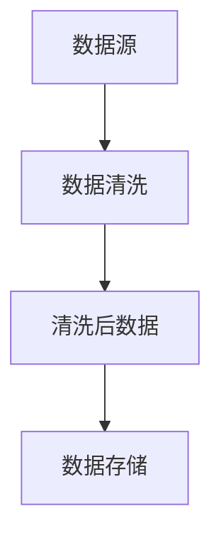
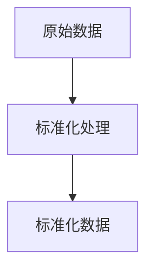
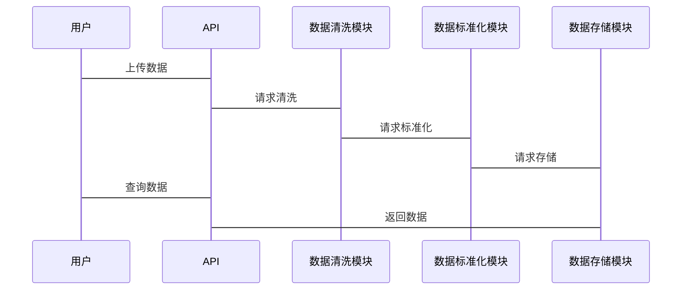

                 


# 构建AI数据治理助手：确保数据质量与一致性

> 关键词：数据治理, AI, 数据质量管理, 数据一致性, 数据标准化, 数据清洗, 数据增强

> 摘要：在人工智能和大数据时代，数据治理是确保数据质量和一致性的关键。本文详细探讨了AI数据治理的核心概念、算法原理、系统架构设计以及项目实战，帮助读者理解如何构建高效的AI数据治理助手。

---

## 第一部分: AI数据治理助手的背景与核心概念

### 第1章: 数据治理的背景与问题背景

#### 1.1 数据治理的背景
数据在AI系统中扮演着关键角色，但数据质量问题直接影响模型的性能和决策的准确性。随着AI技术的快速发展，数据治理的重要性日益凸显。

#### 1.1.1 数据治理的定义与重要性
数据治理是指对数据的全生命周期进行管理，确保数据的准确性、完整性和一致性。它是AI系统可靠运行的基础。

#### 1.1.2 数据治理的核心目标
数据治理的目标是通过标准化和规范化，提升数据质量，降低数据风险，确保数据的可用性和可追溯性。

#### 1.1.3 数据治理与AI技术的结合
AI模型依赖高质量的数据，数据治理在数据预处理、清洗和标注等环节中起着关键作用。

#### 1.2 数据治理的问题描述
数据治理面临数据冗余、数据不一致、数据缺失等问题，这些问题会影响AI模型的训练和推理效果。

#### 1.3 数据治理的解决方案
通过数据清洗、标准化和增强等技术手段，解决数据质量问题，提升数据一致性。

#### 1.4 数据治理的边界与外延
数据治理的范围包括数据采集、存储、处理和应用，但不涉及具体的业务逻辑。

#### 1.5 数据治理的概念结构
数据治理涉及数据源、处理流程、存储管理等关键要素，形成一个完整的生命周期管理框架。

---

### 第2章: 数据治理的核心概念与联系

#### 2.1 数据治理的核心概念
数据治理涉及多个核心概念，包括数据质量管理、数据一致性和数据标准化。

#### 2.2 数据质量管理
数据质量是指数据的准确性、完整性、一致性和及时性。数据质量管理的目标是确保数据符合业务需求。

#### 2.3 数据一致性
数据一致性指在不同数据源或系统中，数据保持一致。确保一致性是数据治理的重要目标。

#### 2.4 数据标准化
数据标准化是将数据转换为统一格式的过程，包括数据清洗、转换和编码。

---

## 第二部分: 数据治理的核心概念与联系

### 第5章: 数据治理的核心概念原理

#### 5.1 数据质量管理
数据质量管理包括数据清洗、数据验证和数据修复等步骤，确保数据的准确性。

#### 5.2 数据一致性
数据一致性需要通过数据同步和校验机制来实现，确保数据在不同系统中的统一性。

#### 5.3 数据标准化
数据标准化包括数据格式统一、缺失值处理和异常值剔除等步骤，提升数据的规范性。

### 第6章: 数据治理的核心概念对比

#### 6.1 核心概念对比表格
| 概念     | 定义与目标                  | 实现方法                 |
|----------|----------------------------|--------------------------|
| 数据质量管理 | 确保数据准确性与完整性      | 数据清洗、验证和修复     |
| 数据一致性 | 确保数据在不同系统中的统一性 | 数据同步、校验           |
| 数据标准化 | 确保数据格式统一与规范性    | 数据转换、编码           |

#### 6.2 ER实体关系图
```mermaid
erd
  顾客 --[购买]-{> 产品:订单号}
  产品 --[属于]-{> 类别:类别ID}
  订单 --[属于]-{> 顾客:顾客ID}
```

---

## 第三部分: 数据治理的算法原理讲解

### 第7章: 数据清洗算法

#### 7.1 数据清洗流程


#### 7.2 数据清洗代码
```python
def data_cleaning(data):
    # 删除缺失值
    data = data.dropna()
    # 去重
    data = data.drop_duplicates()
    # 处理异常值
    data = data[~(data['age'] > 100)]
    return data
```

### 第8章: 数据标准化算法

#### 8.1 数据标准化流程


#### 8.2 数据标准化公式
$$
z = \frac{x - \mu}{\sigma}
$$

其中，$$x$$ 是原始数据，$$\mu$$ 是均值，$$\sigma$$ 是标准差。

---

## 第四部分: 数据治理的系统架构设计

### 第9章: 问题场景与系统分析

#### 9.1 问题场景
企业数据分散在多个系统中，数据格式不统一，存在冗余和不一致问题。

#### 9.2 系统功能设计
系统需要具备数据采集、清洗、标准化和存储功能。

#### 9.3 系统架构设计


### 第10章: 系统接口与交互流程

#### 10.1 系统接口设计
API接口包括数据上传、数据处理和数据查询功能。

#### 10.2 系统交互流程


---

## 第五部分: 项目实战

### 第11章: 项目环境与核心代码

#### 11.1 环境安装
安装Python和相关库，如Pandas和Scikit-learn。

#### 11.2 核心代码实现
```python
import pandas as pd

def data_cleaning(data):
    data = data.dropna()
    data = data.drop_duplicates()
    return data

def data_standardization(data):
    from sklearn.preprocessing import StandardScaler
    scaler = StandardScaler()
    data_scaled = scaler.fit_transform(data)
    return data_scaled

# 示例数据
data = pd.DataFrame({
    'age': [25, 30, 35, 40, 55],
    'salary': [50000, 60000, 70000, 80000, 90000]
})

# 数据清洗
cleaned_data = data_cleaning(data)

# 数据标准化
standardized_data = data_standardization(cleaned_data)
```

### 第12章: 项目分析与小结

#### 12.1 实际案例分析
分析一个企业数据治理案例，展示如何通过数据清洗和标准化提升数据质量。

#### 12.2 项目小结
数据治理是AI系统成功的关键，通过标准化和清洗提升数据质量，确保模型的准确性。

---

## 第六部分: 最佳实践与拓展

### 第13章: 数据治理的最佳实践

#### 13.1 数据治理的注意事项
确保数据治理的工具和方法与业务需求相结合，避免过度复杂化。

#### 13.2 数据治理的拓展阅读
推荐相关书籍和论文，深入理解数据治理的理论与实践。

---

## 作者信息

作者：AI天才研究院/AI Genius Institute & 禅与计算机程序设计艺术 /Zen And The Art of Computer Programming

---

通过以上步骤，文章详细探讨了AI数据治理的核心概念、算法原理和系统设计，帮助读者构建高效的数据治理助手，确保数据质量和一致性。

