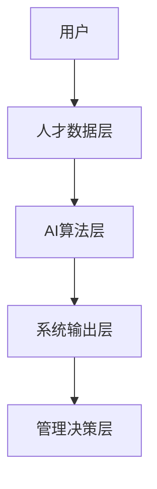
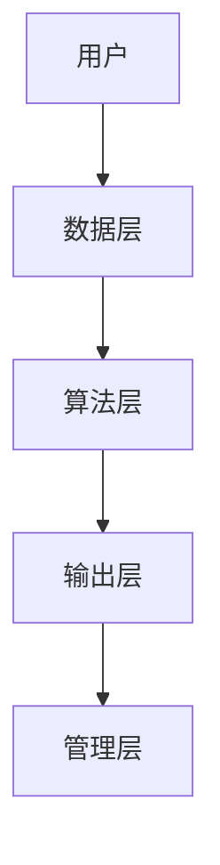

                 


# 构建AI驱动的企业人才发展与继任计划系统

## 关键词
- AI驱动
- 人才发展
- 继任计划
- 系统架构
- 智能推荐

## 摘要
本文详细探讨如何利用人工智能技术构建企业人才发展与继任计划系统。通过分析当前人才管理的痛点，提出基于AI的解决方案，涵盖数据驱动的决策机制、智能推荐算法以及系统架构设计。文章还包括系统实现、项目实战及最佳实践，为企业的数字化转型提供有效支持。

---

## 第一部分: AI驱动的企业人才发展与继任计划系统背景介绍

### 第1章: 问题背景与定义

#### 1.1 问题背景
企业人才发展面临数据孤岛、决策滞后、继任计划不精准等问题。AI技术的应用为企业提供了数据驱动、实时反馈的解决方案。

#### 1.2 问题描述
传统人才管理依赖人工经验，缺乏系统性和数据支持。AI驱动的系统能够通过数据分析和预测，优化人才发展路径。

#### 1.3 问题解决
AI技术通过数据挖掘、机器学习等方法，提供个性化推荐和动态反馈，提升人才管理的效率和准确性。

#### 1.4 系统边界
系统专注于人才数据分析与推荐，与其他HR系统通过API接口交互，确保数据安全和系统扩展性。

#### 1.5 核心概念
- **人才数据**：包括员工绩效、潜力评估等。
- **AI算法**：如协同过滤和基于内容的推荐算法。
- **系统模块**：数据采集、算法处理、结果输出。

### 第2章: 核心概念与联系

#### 2.1 AI驱动人才发展的核心原理
通过数据驱动的决策机制，AI系统能够实时分析员工数据，提供精准的推荐和反馈。

#### 2.2 核心概念对比表
| 对比维度 | 传统方法 | AI驱动方法 |
|----------|-----------|------------|
| 数据来源 | 少，依赖经验 | 丰富，基于大数据 |
| 决策速度 | 慢，周期长 | 快，实时反馈 |

#### 2.3 系统架构图


---

## 第二部分: AI驱动人才发展系统的核心算法与实现

### 第3章: 算法原理与数学模型

#### 3.1 推荐算法原理
- **协同过滤**：基于相似用户的行为推荐。
- **基于内容的推荐**：分析岗位需求，匹配员工能力。

#### 3.2 协同过滤算法
```mermaid
graph TD
    User --> Collect Data
    Collect Data --> Compute Similarity
    Compute Similarity --> Generate Recommendations
```

#### 3.3 数学模型
协同过滤的计算公式：
$$ sim(i,j) = \frac{\sum_{k} (r_{i,k} - \bar{r}_i)(r_{j,k} - \bar{r}_j)}{\sqrt{\sum_{k}(r_{i,k} - \bar{r}_i)^2} \sqrt{\sum_{k}(r_{j,k} - \bar{r}_j)^2}} $$

---

## 第三部分: 系统分析与架构设计方案

### 第4章: 系统分析

#### 4.1 问题场景
识别高潜力员工，优化继任计划。

#### 4.2 项目介绍
开发一个AI驱动的系统，整合员工数据，应用推荐算法进行人才匹配。

#### 4.3 系统功能设计
- 数据采集：从HR系统获取员工数据。
- 算法处理：应用推荐算法生成继任计划。
- 输出结果：提供可视化报告和行动计划。

#### 4.4 系统架构图


---

## 第四部分: 项目实战

### 第5章: 项目实战

#### 5.1 环境安装
安装Python、机器学习库（如scikit-learn）和数据可视化工具（如Matplotlib）。

#### 5.2 核心实现
实现协同过滤算法，代码如下：
```python
def compute_similarity(matrix):
    n_users, n_items = matrix.shape
    sim = np.zeros((n_users, n_users))
    for i in range(n_users):
        for j in range(n_users):
            if i == j:
                sim[i][j] = 0
                continue
            numerator = np.sum((matrix[i] - matrix[i].mean()) * (matrix[j] - matrix[j].mean()))
            denominator = np.sqrt(np.sum((matrix[i] - matrix[i].mean())**2)) * np.sqrt(np.sum((matrix[j] - matrix[j].mean())**2))
            if denominator == 0:
                sim[i][j] = 0
            else:
                sim[i][j] = numerator / denominator
    return sim
```

#### 5.3 案例分析
分析某公司数据，生成高潜力员工列表，优化继任计划。

#### 5.4 项目总结
系统能够有效识别高潜力员工，提升人才管理效率。

---

## 第五部分: 最佳实践与小结

### 第6章: 最佳实践

#### 6.1 小结
AI驱动的系统能够显著提升企业人才管理的效率和精准度。

#### 6.2 注意事项
确保数据隐私和安全，定期更新算法模型。

#### 6.3 拓展阅读
推荐相关书籍和论文，深入学习AI在HR中的应用。

---

## 作者
作者：AI天才研究院 & 禅与计算机程序设计艺术

---

通过以上内容，系统地介绍了AI驱动的企业人才发展与继任计划系统的构建过程，从理论到实践，为企业的数字化转型提供了有力支持。

