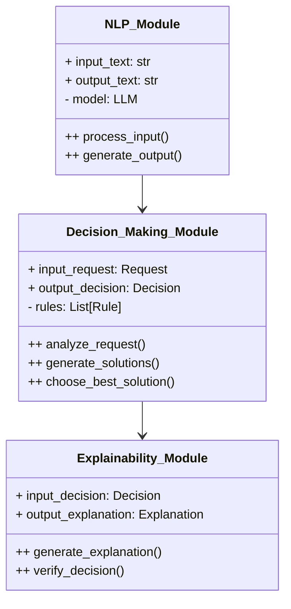
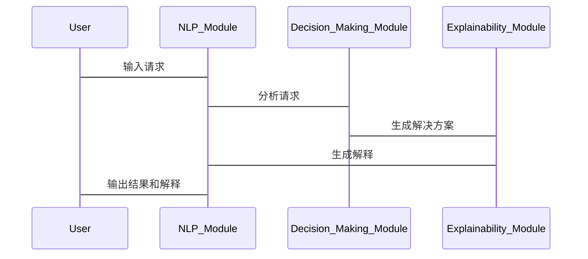

                 


# 构建LLM驱动的AI Agent可解释决策系统

> 关键词：LLM, AI Agent, 可解释决策系统, 大语言模型, 智能体, 可解释性

> 摘要：本文将详细探讨如何构建一个基于大语言模型（LLM）的AI Agent可解释决策系统。文章从背景和概念出发，逐步深入到算法原理、系统架构设计、项目实战和最佳实践，全面解析LLM驱动的AI Agent在实现可解释决策过程中的关键技术和方法。

---

# 第一部分: 背景与核心概念

# 第1章: LLM与AI Agent概述

## 1.1 什么是LLM

### 1.1.1 大语言模型的定义

大语言模型（LLM, Large Language Model）是指基于深度学习技术训练的、具有大规模参数的自然语言处理模型。LLM能够理解和生成人类语言，具备强大的文本理解和生成能力。

### 1.1.2 LLM的核心特点

- **大规模训练数据**：LLM通常基于海量的文本数据进行训练，能够捕捉语言的复杂性和多样性。
- **深度神经网络结构**：常用Transformer架构，具有自注意力机制，能够处理长距离依赖关系。
- **多任务能力**：LLM可以通过微调适应多种NLP任务，如文本生成、问答、翻译等。

### 1.1.3 LLM与传统NLP模型的区别

| 特性 | LLM | 传统NLP模型 |
|------|------|------------|
| 参数量 | 大规模（百万级及以上） | 小规模（十万级以下） |
| 任务通用性 | 高 | 低 |
| 需求适应性 | 强 | 弱 |

## 1.2 什么是AI Agent

### 1.2.1 AI Agent的基本概念

AI Agent（智能体）是指能够感知环境、自主决策并执行任务的智能系统。AI Agent可以是软件程序、机器人或其他智能设备。

### 1.2.2 AI Agent的分类与应用场景

| 类型 | 描述 | 应用场景 |
|------|------|----------|
| 软件Agent | 通过算法和数据进行决策 | 电商推荐系统、聊天机器人 |
| 物理Agent | 具有物理形态，能与环境交互 | 自动驾驶汽车、工业机器人 |
| 服务Agent | 提供特定服务 | 客服机器人、智能家居助手 |

### 1.2.3 AI Agent与传统自动化的区别

| 特性 | AI Agent | 传统自动化 |
|------|------|------------|
| 决策能力 | 自主决策 | 固定规则 |
| 学习能力 | 可学习和适应 | 不可学习 |
| 环境交互 | 能主动与环境交互 | 被动执行 |

## 1.3 可解释决策系统的重要性

### 1.3.1 可解释性在AI系统中的意义

可解释性是指AI系统在做出决策时，能够清晰地解释其决策过程和结果。这对于信任建立、责任追究和系统优化至关重要。

### 1.3.2 决策系统的可解释性要求

- **透明性**：用户能够理解系统决策的依据。
- **可追溯性**：能够追踪决策过程中的每一步。
- **可验证性**：决策结果可以通过明确的证据进行验证。

### 1.3.3 可解释性与系统透明度的关系

可解释性是系统透明度的核心组成部分。只有通过可解释的决策过程，用户才能真正信任AI系统。

## 1.4 LLM驱动AI Agent的背景与趋势

### 1.4.1 LLM技术的快速发展

- 近年来，LLM技术取得了显著进展，如GPT-3、GPT-4等模型的出现。
- LLM的通用性和灵活性使其成为AI Agent的理想驱动引擎。

### 1.4.2 AI Agent在企业级应用中的潜力

- AI Agent可以应用于客服、医疗、金融等领域，提供智能化服务。
- 通过LLM的驱动，AI Agent能够实现更复杂的决策和交互。

### 1.4.3 可解释性决策系统的市场需求

- 随着AI技术的广泛应用，用户对系统决策的可解释性需求日益增长。
- 可解释性决策系统是合规性和伦理性的基本要求。

## 1.5 本章小结

本章介绍了LLM和AI Agent的基本概念，分析了可解释决策系统的重要性，并探讨了LLM驱动AI Agent的背景和趋势。

---

# 第二部分: LLM驱动AI Agent的核心概念与原理

# 第2章: LLM与AI Agent的结合原理

## 2.1 LLM作为AI Agent的核心驱动力

### 2.1.1 LLM在自然语言处理中的优势

- LLM能够理解复杂的人类语言，支持多种语言和方言。
- LLM可以通过上下文理解语境，生成连贯的对话。

### 2.1.2 LLM如何赋能AI Agent的决策能力

- LLM可以分析用户需求，生成多种可能的解决方案。
- LLM可以通过上下文推理，做出更合理的决策。

### 2.1.3 LLM与AI Agent的协同工作模式

1. 用户与AI Agent交互，输入需求或问题。
2. AI Agent通过LLM解析用户需求，生成可能的解决方案。
3. AI Agent根据决策规则，选择最优解决方案。
4. AI Agent输出结果并执行任务。

## 2.2 AI Agent的决策过程

### 2.2.1 决策过程的定义与阶段划分

- **输入感知**：接收用户输入或环境反馈。
- **需求分析**：理解用户需求并提取关键信息。
- **方案生成**：生成多个可能的解决方案。
- **决策选择**：基于规则或模型选择最优方案。
- **结果输出**：输出决策结果并执行任务。

### 2.2.2 LLM在决策过程中的角色

- LLM用于需求分析和方案生成阶段。
- LLM提供语言理解和生成能力，支持AI Agent的决策过程。

### 2.2.3 决策过程的可解释性要求

- 每个决策步骤需要可追溯。
- 决策结果需要可验证。
- 决策依据需要透明。

## 2.3 可解释性决策系统的构建要素

### 2.3.1 决策规则的透明化

- 决策规则需要明确且可解释。
- 规则之间的关系需要清晰。

### 2.3.2 决策过程的可追溯性

- 每个决策步骤需要记录。
- 决策结果需要与输入关联。

### 2.3.3 决策结果的可验证性

- 决策结果需要通过验证。
- 验证过程需要透明。

## 2.4 本章小结

本章探讨了LLM与AI Agent的结合原理，分析了AI Agent的决策过程，并提出了构建可解释决策系统的关键要素。

---

# 第三部分: LLM驱动AI Agent的算法原理与数学模型

# 第3章: LLM的算法原理

## 3.1 LLM的训练过程

### 3.1.1 Transformer模型的结构与特点

- **编码器**：负责将输入序列编码为高维向量。
- **解码器**：负责根据编码向量生成输出序列。
- **自注意力机制**：捕捉序列中词语之间的依赖关系。

### 3.1.2 自注意力机制的数学公式

$$
\text{Attention}(Q, K, V) = \text{softmax}\left(\frac{QK^T}{\sqrt{d_k}}\right)V
$$

其中：
- \( Q \)：查询向量
- \( K \)：键向量
- \( V \)：值向量
- \( d_k \)：向量维度

### 3.1.3 梯度下降与优化算法

- **损失函数**：交叉熵损失
- **优化算法**：Adam优化器
- **学习率调整**：学习率衰减

## 3.2 LLM的推理过程

### 3.2.1 解码过程中的贪心搜索与随机采样

- **贪心搜索**：每一步选择概率最高的词。
- **随机采样**：基于概率分布随机选择词。

### 3.2.2 解码过程的数学模型

$$
P(\text{next token} | \text{previous tokens}) = \text{softmax}(QK^T/\sqrt{d_k})V
$$

### 3.2.3 解码过程的可视化

使用Mermaid流程图展示解码过程：


## 3.3 LLM的可解释性增强方法

### 3.3.1 Attention权重的可视化

通过热力图展示注意力权重，帮助理解模型的决策过程。

### 3.3.2 决策过程的可解释性改进算法

- **可解释性增强训练**：在训练过程中引入可解释性相关的损失函数。
- **可解释性后处理**：在生成结果后，添加解释性信息。

### 3.3.3 可解释性增强的代码实现

```python
import torch
import torch.nn as nn

# 定义可解释性增强的损失函数
class ExplainabilityLoss(nn.Module):
    def __init__(self):
        super(ExplainabilityLoss, self).__init__()
    
    def forward(self, attention_weights, input_sequence):
        # 计算注意力权重的平均值
        avg_attention = torch.mean(attention_weights, dim=-1)
        # 计算与输入序列长度的匹配程度
        loss = torch.mean(torch.abs(avg_attention - torch.ones_like(avg_attention)))
        return loss

# 在训练过程中添加可解释性损失
loss = ce_loss + 0.1 * explainability_loss(attention_weights, input_sequence)
```

## 3.4 本章小结

本章详细讲解了LLM的训练和推理过程，并提出了可解释性增强的方法。

---

# 第四部分: 系统架构与交互设计

# 第4章: AI Agent的系统架构设计

## 4.1 系统功能设计

### 4.1.1 系统功能模块划分

- **自然语言处理模块**：负责处理用户输入和生成输出。
- **决策推理模块**：负责根据输入生成决策方案。
- **可解释性模块**：负责记录和解释决策过程。

### 4.1.2 功能模块之间的关系

使用Mermaid类图展示系统架构：



### 4.1.3 功能模块的交互流程

1. 用户输入请求，传递给NLP模块。
2. NLP模块解析请求，传递给决策推理模块。
3. 决策推理模块生成解决方案，传递给可解释性模块。
4. 可解释性模块生成解释，返回给用户。

## 4.2 系统接口设计

### 4.2.1 系统输入接口

- **文本输入接口**：接收用户输入的文本。
- **事件输入接口**：接收系统事件触发的请求。

### 4.2.2 系统输出接口

- **文本输出接口**：输出生成的文本。
- **决策输出接口**：输出决策结果。
- **解释输出接口**：输出决策解释。

## 4.3 系统交互设计

### 4.3.1 系统交互流程

1. 用户输入请求，触发NLP模块。
2. NLP模块解析请求，生成内部表示。
3. 决策推理模块根据内部表示生成解决方案。
4. 可解释性模块对解决方案进行解释和验证。
5. 系统输出结果和解释。

### 4.3.2 系统交互的Mermaid序列图



## 4.4 本章小结

本章详细设计了AI Agent的系统架构，并展示了模块之间的交互流程。

---

# 第五部分: 项目实战与案例分析

# 第5章: 项目实战

## 5.1 项目背景与目标

### 5.1.1 项目背景

- **目标**：构建一个基于LLM的AI Agent，实现可解释的决策系统。
- **应用场景**：电商客服、智能助手等领域。

### 5.1.2 项目目标

- 实现LLM驱动的AI Agent。
- 确保决策过程的可解释性。
- 提供友好的人机交互界面。

## 5.2 项目环境配置

### 5.2.1 环境要求

- **操作系统**：Linux/Windows/MacOS
- **Python版本**：3.8及以上
- **依赖库**：TensorFlow、PyTorch、Hugging Face Transformers

### 5.2.2 安装依赖

```bash
pip install torch transformers
```

## 5.3 项目核心实现

### 5.3.1 NLP模块的实现

```python
from transformers import GPT2LMHeadModel, GPT2Tokenizer

class NLP_Module:
    def __init__(self, model_name='gpt2'):
        self.model = GPT2LMHeadModel.from_pretrained(model_name)
        self.tokenizer = GPT2Tokenizer.from_pretrained(model_name)
    
    def process_input(self, input_text):
        inputs = self.tokenizer(input_text, return_tensors='np')
        return inputs
    
    def generate_output(self, inputs):
        outputs = self.model.generate(**inputs, max_length=50)
        return self.tokenizer.decode(outputs[0])
```

### 5.3.2 决策推理模块的实现

```python
class Decision_Making_Module:
    def __init__(self, rules):
        self.rules = rules
    
    def analyze_request(self, request):
        # 分析请求并提取关键信息
        pass
    
    def generate_solutions(self):
        # 根据规则生成解决方案
        pass
    
    def choose_best_solution(self, solutions):
        # 根据优先级选择最优解决方案
        return solutions[0]
```

### 5.3.3 可解释性模块的实现

```python
class Explainability_Module:
    def __init__(self):
        pass
    
    def generate_explanation(self, decision):
        # 根据决策生成解释
        return "该决策是基于规则1和规则2生成的。"
    
    def verify_decision(self, decision):
        # 验证决策的正确性
        return True
```

## 5.4 项目运行与测试

### 5.4.1 环境启动

```bash
python run.py
```

### 5.4.2 功能测试

1. 输入测试请求，验证NLP模块是否正常工作。
2. 检查决策推理模块是否生成合理解决方案。
3. 验证可解释性模块是否生成清晰的解释。

## 5.5 项目小结

本章通过实际案例展示了如何构建一个基于LLM的AI Agent，并详细讲解了项目的实现过程。

---

# 第六部分: 最佳实践与总结

# 第6章: 最佳实践

## 6.1 小结

- 本文详细讲解了构建LLM驱动的AI Agent可解释决策系统的关键技术和方法。
- 从算法原理到系统架构，再到项目实战，全面覆盖了实现过程。

## 6.2 注意事项

- **数据隐私**：在处理用户数据时，必须遵守相关隐私保护法规。
- **模型可解释性**：确保决策过程透明，避免“黑箱”操作。
- **系统稳定性**：确保系统在高负载下的稳定性。

## 6.3 拓展阅读

- **相关书籍**：《Deep Learning》、《Pattern Recognition and Machine Learning》
- **技术博客**：Hugging Face官方博客、Medium上的AI技术文章
- **开源项目**：GitHub上的LLM和AI Agent相关项目

## 6.4 本章小结

本章总结了构建LLM驱动的AI Agent可解释决策系统的关键点，并提出了实际应用中的注意事项和拓展学习的方向。

---

# 作者

作者：AI天才研究院/AI Genius Institute & 禅与计算机程序设计艺术/Zen And The Art of Computer Programming

---

以上是《构建LLM驱动的AI Agent可解释决策系统》的技术博客文章的完整目录和内容框架。文章从背景、核心概念、算法原理、系统架构、项目实战到最佳实践，全面解析了如何构建一个基于LLM的AI Agent可解释决策系统。

