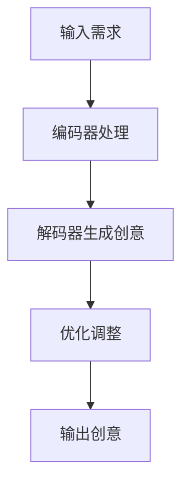
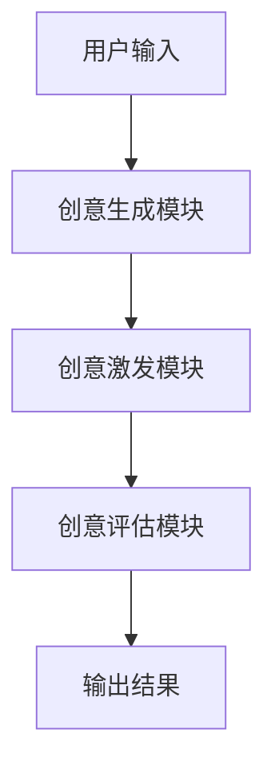
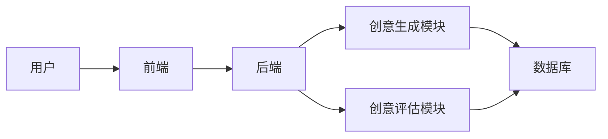

                 


# 构建企业AI创意助手：促进创新与产品开发

> 关键词：企业AI创意助手，人工智能，创新，产品开发，深度学习，创意生成，系统架构

> 摘要：本文详细探讨了构建企业AI创意助手的背景、核心概念、算法原理、系统架构及项目实战。通过分析创意助手在企业创新与产品开发中的作用，结合深度学习算法和系统设计，为读者提供了从理论到实践的全面指导。

---

# 第1章：企业创新与产品开发的挑战与机遇

## 1.1 创新对企业的重要性

企业要在激烈的市场竞争中脱颖而出，创新是核心驱动力。然而，传统创新过程面临以下挑战：

1. **资源有限性**：企业往往受限于资金、时间和人力资源。
2. **创意枯竭**：市场饱和导致创意难度增加。
3. **不确定性**：创新过程中的失败率高，难以预测。

## 1.2 AI在企业创新中的潜力

AI技术的快速发展为企业创新提供了新的可能性。通过AI创意助手，企业可以：

1. **提高效率**：快速生成创意并进行评估。
2. **降低成本**：减少人力投入，优化资源配置。
3. **提升质量**：通过算法优化，提高创意的可行性和创新性。

---

# 第2章：企业AI创意助手的核心概念与定义

## 2.1 创意助手的定义与属性

创意助手是一种AI工具，通过自然语言处理和深度学习技术，辅助用户生成、评估和优化创意。其核心属性包括：

- **输入**：用户需求、市场趋势、目标受众等。
- **输出**：创意内容、优化建议、可行性分析。

## 2.2 创意助手与传统工具的区别

| 特性               | 传统工具                          | AI创意助手                     |
|--------------------|------------------------------------|-------------------------------|
| 创意生成方式       | 依赖人工经验                      | 自动生成并优化                 |
| 决策依据           | 主观经验                          | 数据驱动                        |
| 可扩展性           | 有限                             | 强大                            |

---

# 第3章：AI创意助手的核心原理与技术架构

## 3.1 创意生成的算法原理

创意生成是AI创意助手的核心功能之一，常用的技术包括：

### 3.1.1 Transformer模型

Transformer模型通过自注意力机制捕捉文本中的长距离依赖关系，适用于创意内容生成。其基本公式如下：

$$
\text{Attention}(Q, K, V) = \text{softmax}\left(\frac{QK^T}{\sqrt{d_k}}\right)V
$$

其中，$Q$、$K$、$V$分别为查询、键、值向量，$d_k$为键的维度。

### 3.1.2 创意生成流程

创意生成的流程如下：

1. **输入处理**：将用户输入转化为模型可处理的向量。
2. **生成创意**：通过解码器生成创意内容。
3. **优化调整**：基于反馈优化创意。

流程图如下：



---

# 第4章：企业AI创意助手的系统架构设计

## 4.1 系统功能设计

### 4.1.1 功能模块

1. **创意生成模块**：生成创意内容。
2. **创意激发模块**：激发用户的灵感。
3. **创意评估模块**：评估创意的可行性。

### 4.1.2 功能流程图



## 4.2 系统架构设计

### 4.2.1 架构图



---

# 第5章：企业AI创意助手的项目实战

## 5.1 环境安装与配置

### 5.1.1 开发环境

- **操作系统**：Linux/MacOS/Windows
- **编程语言**：Python 3.8+
- **深度学习框架**：TensorFlow/PyTorch

### 5.1.2 依赖库安装

```bash
pip install numpy tensorflow keras
```

## 5.2 核心算法实现

### 5.2.1 创意生成算法实现

```python
import numpy as np
import tensorflow as tf

def transformer_encoder(inputs, num_heads, d_model, dropout_rate=0.1):
    # 前向传播
    with tf.keras.backend as K:
        attention_output = MultiHeadAttention(num_heads, d_model)(inputs, inputs)
        outputs = Add()([inputs, attention_output])
        outputs = Dropout(dropout_rate)(outputs)
        return outputs
```

### 5.2.2 创意激发算法实现

```python
def generate_creative_ideas(seed, max_length=50):
    model = load_model('creative_assistant.h5')
    generated_text = ""
    for i in range(max_length):
        predictions = model.predict(seed)
        next_token = sample(predictions, temperature=1.0)
        generated_text += next_token
        seed = shift(seed, next_token)
    return generated_text
```

---

# 第6章：总结与展望

## 6.1 总结

本文详细探讨了构建企业AI创意助手的背景、核心概念、算法原理、系统架构及项目实战。通过理论与实践相结合，为读者提供了从概念到实现的全面指导。

## 6.2 展望

随着AI技术的不断进步，企业AI创意助手将变得更加智能和高效，为企业创新和产品开发提供更强大的支持。

---

# 最佳实践 Tips

1. **数据准备**：确保输入数据的多样性和高质量。
2. **模型调优**：根据实际需求调整模型参数。
3. **用户反馈**：定期收集用户反馈以优化系统。

---

# 作者

**作者：AI天才研究院/AI Genius Institute & 禅与计算机程序设计艺术 /Zen And The Art of Computer Programming**

---

以上是完整的文章结构和内容，涵盖了从理论到实践的各个方面，适合技术读者深入理解和应用。

