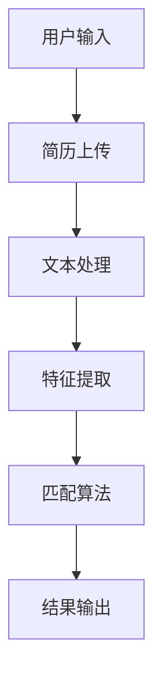
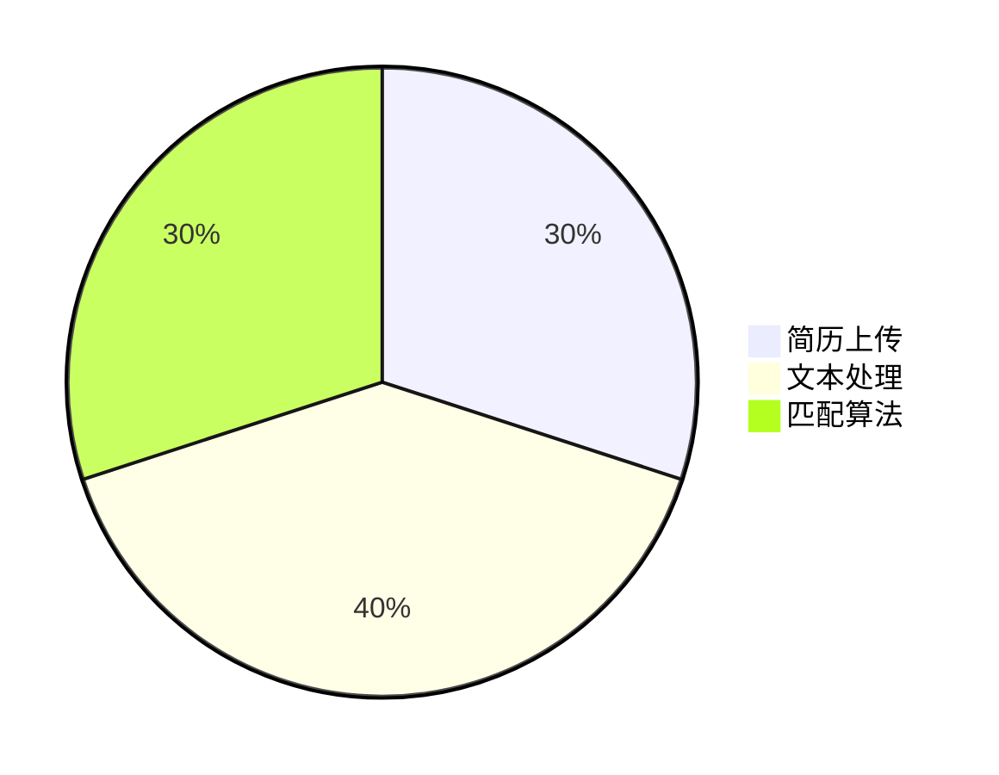

                 


# 构建企业级AI招聘助手：简历筛选与人才匹配

## 关键词：AI招聘助手，简历筛选，人才匹配，自然语言处理，深度学习，推荐系统

## 摘要：本文详细探讨了如何构建企业级AI招聘助手，重点分析了简历筛选与人才匹配的核心技术与实现方法。文章从背景介绍、核心概念、算法原理、系统架构到项目实战，全面解析了构建AI招聘助手的全过程，涵盖文本处理、推荐算法、系统设计等关键环节，为读者提供了深入的技术洞察和实践指导。

---

# 引言

## 1. AI招聘助手的背景与目标

### 1.1 招聘行业的痛点与挑战

招聘行业面临着简历数量庞大、筛选效率低下、人才匹配精准度不足等痛点。传统招聘流程依赖人工筛选，耗时且容易出错。随着AI技术的快速发展，企业级AI招聘助手成为解决这些痛点的关键工具。

### 1.2 AI技术在招聘中的应用

自然语言处理（NLP）、深度学习和推荐系统等技术为简历筛选和人才匹配提供了新的可能性。AI招聘助手能够自动化处理大量简历，快速提取关键信息，并基于岗位需求实现精准匹配。

### 1.3 企业级AI招聘助手的目标

通过AI技术实现简历的智能筛选和人才的精准匹配，提高招聘效率，降低招聘成本，同时提升候选人的体验。

---

# 第二章: 简历筛选的核心技术

## 2.1 文本处理与特征提取

### 2.1.1 分词与词向量表示

使用分词工具对简历文本进行分词处理，并通过词向量模型（如Word2Vec）将文本转换为向量表示。

**示例代码：**
```python
import jieba
from gensim.models import Word2Vec

text = "具备三年以上Python开发经验，熟悉深度学习算法"
words = jieba.lcut(text)
model = Word2Vec([words], vector_size=100, window=5, min_count=1, workers=4)
```

### 2.1.2 语义理解与文本相似度计算

通过余弦相似度计算简历与岗位需求之间的相似度。

**公式：**
$$\text{余弦相似度} = \frac{\vec{A} \cdot \vec{B}}{|\vec{A}| |\vec{B}|}$$

**代码示例：**
```python
def cosine_similarity(vec_A, vec_B):
    return np.dot(vec_A, vec_B) / (np.linalg.norm(vec_A) * np.linalg.norm(vec_B))
```

---

# 第三章: 人才匹配的算法实现

## 3.1 基于深度学习的推荐系统

### 3.1.1 神经网络模型

使用神经网络模型对简历和岗位需求进行特征学习，并生成推荐结果。

**代码示例：**
```python
import tensorflow as tf
from tensorflow.keras import layers

model = tf.keras.Sequential([
    layers.Dense(64, activation='relu'),
    layers.Dense(1, activation='sigmoid')
])
model.compile(optimizer='adam', loss='binary_crossentropy', metrics=['accuracy'])
```

---

# 第四章: 系统架构与设计

## 4.1 系统架构设计

### 4.1.1 业务流程图



### 4.1.2 系统架构图



---

# 第五章: 项目实战

## 5.1 环境搭建

### 5.1.1 安装依赖

```bash
pip install jieba gensim tensorflow
```

## 5.2 核心代码实现

### 5.2.1 文本处理模块

```python
import jieba

def process_resume(text):
    words = jieba.lcut(text)
    return ' '.join(words)
```

### 5.2.2 匹配算法实现

```python
def match_candidates(candidates, job_description):
    # 计算相似度
    similarities = [compute_similarity(candidate, job_description) for candidate in candidates]
    # 排序并返回结果
    return sorted(zip(candidates, similarities), key=lambda x: x[1], reverse=True)
```

## 5.3 案例分析

### 5.3.1 案例1

**输入：** 简历文本1、简历文本2、岗位描述  
**输出：** 排序后的匹配结果

---

# 第六章: 优化与维护

## 6.1 模型优化

### 6.1.1 参数调优

通过网格搜索（Grid Search）优化模型参数。

**代码示例：**
```python
from sklearn.model_selection import GridSearchCV

param_grid = {'n_estimators': [100, 200], 'learning_rate': [0.1, 0.2]}
grid_search = GridSearchCV(estimator=model, param_grid=param_grid, cv=5)
grid_search.fit(X_train, y_train)
```

### 6.1.2 数据增强

通过数据增强技术（如同义词替换）提升模型的泛化能力。

---

# 第七章: 总结与展望

## 7.1 本章小结

企业级AI招聘助手通过文本处理、推荐算法和系统架构设计，实现了简历筛选与人才匹配的智能化。

## 7.2 未来展望

未来，随着NLP和深度学习技术的进一步发展，AI招聘助手将更加智能化和个性化。

---

# 作者：AI天才研究院 & 禅与计算机程序设计艺术

