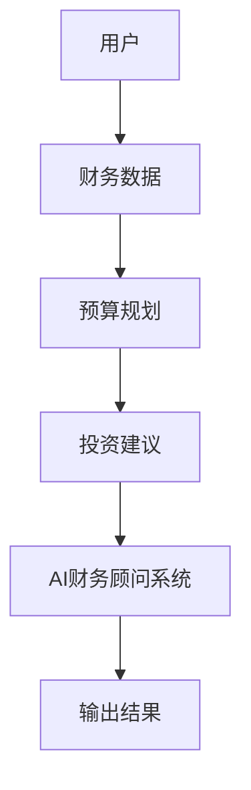

                 


# 构建企业级AI财务顾问：预算规划与投资建议

## 关键词：企业级AI、财务顾问、预算规划、投资建议、机器学习、自然语言处理、系统架构

## 摘要：
随着人工智能技术的迅速发展，企业级AI财务顾问在预算规划和投资建议领域展现出巨大潜力。本文将详细探讨构建这样一个系统的背景、核心概念、算法原理、系统架构以及实际项目实现，旨在为企业提供高效、智能的财务解决方案。

---

## 第一部分：背景介绍与核心概念

### 第1章：AI财务顾问的背景与挑战

#### 1.1 问题背景
- **传统财务顾问的局限性**：
  - 数据处理效率低下，难以应对海量数据。
  - 人工分析主观性强，缺乏客观性和精确性。
  - 缺乏实时性，无法及时给出反馈。
  
- **AI技术在财务领域的应用现状**：
  - 自然语言处理用于财务文本分析。
  - 机器学习用于财务预测和投资建议。
  - 深度学习在复杂模型中的应用。

#### 1.2 问题描述
- **企业财务规划的痛点**：
  - 数据分散，难以整合和分析。
  - 预算制定过程复杂，涉及多部门协作。
  
- **投资建议的传统方法与不足**：
  - 依赖人工经验，难以覆盖所有可能性。
  - 缺乏实时市场数据支持。

#### 1.3 问题解决
- **AI技术如何解决这些问题**：
  - 利用机器学习模型进行数据挖掘和预测。
  - 通过自然语言处理分析财务文本，提供实时建议。

#### 1.4 边界与外延
- **企业级AI财务顾问的边界**：
  - 系统仅处理财务数据，不涉及其他业务领域。
  - 专注于预算和投资建议，不涵盖所有财务功能。

- **与其他AI应用的对比**：
  - 与销售预测系统相比，数据类型和处理方法不同。
  - 与客户服务AI助手相比，功能单一但专业性强。

#### 1.5 核心概念结构与组成
- **核心要素组成**：
  - 数据处理模块、模型构建模块、预算规划模块、投资建议模块。
  
- **系统架构初步设想**：
  - 分层架构：数据层、模型层、应用层。

---

## 第二部分：核心概念与联系

### 第2章：AI财务顾问的核心概念与原理

#### 2.1 核心概念原理
- **数据驱动的财务分析**：
  - 利用大数据技术整合和分析财务数据。
  
- **自然语言处理在财务文本分析中的应用**：
  - 使用NLP技术从财务报告中提取关键信息。

- **机器学习在财务预测中的应用**：
  - 利用回归模型和时间序列分析预测财务指标。

#### 2.2 核心概念属性特征对比
- **AI财务顾问与传统财务工具对比**：

| 特性               | 传统财务工具               | AI财务顾问               |
|--------------------|---------------------------|--------------------------|
| 数据处理能力       | 有限，依赖人工输入         | 强大，支持海量数据处理   |
| 分析速度           | 较慢，依赖人工分析         | 实时分析，快速响应       |
| 模型复杂度         | 简单，基于经验规则         | 复杂，基于机器学习模型   |

- **不同AI模型在财务应用中的表现**：
  - 线性回归模型适合简单预测，如销售预测。
  - 随机森林模型适合处理非线性关系，如投资回报预测。

#### 2.3 ER实体关系图架构


---

## 第三部分：算法原理

### 第3章：AI财务顾问的算法实现

#### 3.1 机器学习算法实现
- **线性回归模型**：
  - 用于预测连续变量，如预算金额。
  - 公式：$$y = \beta_0 + \beta_1x + \epsilon$$

#### 3.2 自然语言处理算法实现
- **文本分类任务**：
  - 使用TF-IDF提取关键词，判断财务文本类别。
  - 示例：分类财务报告为“盈利”或“亏损”。

#### 3.3 时间序列分析
- **ARIMA模型**：
  - 用于预测未来财务数据。
  - 步骤：
    1. 数据预处理：检查平稳性。
    2. 确定模型参数。
    3. 模型训练与验证。
    4. 预测与误差分析。

---

## 第四部分：系统分析与架构设计

### 第4章：系统架构设计

#### 4.1 系统功能设计
- **领域模型**：
  ```mermaid
  classDiagram
      class 用户 {
          用户ID
          用户权限
      }
      class 财务数据 {
          数据ID
          数据类型
      }
      class 预算规划 {
          预算ID
          预算金额
      }
      class 投资建议 {
          建议ID
          建议内容
      }
      用户 --> 财务数据
      财务数据 --> 预算规划
      预算规划 --> 投资建议
  ```

#### 4.2 系统架构设计
- **分层架构**：
  ```mermaid
  architecture
      前端层 --> 中间层
      中间层 --> 数据层
      数据层 --> AI模型层
  ```

#### 4.3 系统接口设计
- **REST API接口**：
  - POST /api/budget?data=...：提交预算数据。
  - GET /api/advice：获取投资建议。

#### 4.4 系统交互流程
- **用户发起请求**：
  ```mermaid
  sequenceDiagram
      用户 ->> 前端层: 提交预算数据
      前端层 ->> 中间层: 调用预算规划服务
      中间层 ->> 数据层: 查询历史数据
      数据层 ->> AI模型层: 进行预测
      AI模型层 ->> 中间层: 返回预测结果
      中间层 ->> 前端层: 返回结果
      前端层 ->> 用户: 显示预算建议
  ```

---

## 第五部分：项目实战

### 第5章：AI财务顾问系统实现

#### 5.1 环境配置
- **Python 3.8+**
- **安装库**：
  ```bash
  pip install numpy pandas scikit-learn transformers
  ```

#### 5.2 数据预处理
- **数据清洗**：
  ```python
  import pandas as pd

  df = pd.read_csv('financial_data.csv')
  df.dropna(inplace=True)
  df['date'] = pd.to_datetime(df['date'])
  ```

#### 5.3 模型实现
- **线性回归模型**：
  ```python
  from sklearn.linear_model import LinearRegression

  model = LinearRegression()
  model.fit(X_train, y_train)
  ```

- **自然语言处理模型**：
  ```python
  from transformers import pipeline

  nlp = pipeline("text-classification", model="bert-base-uncased")
  ```

#### 5.4 系统部署
- **Docker容器化**：
  ```dockerfile
  FROM python:3.8
  WORKDIR /app
  COPY requirements.txt .
  RUN pip install -r requirements.txt
  COPY app.py .
  CMD ["python", "app.py"]
  ```

---

## 第六部分：总结与展望

### 6.1 最佳实践
- **数据质量**：确保数据准确性和完整性。
- **模型优化**：定期更新模型，适应市场变化。
- **安全性**：加强数据保护，防止泄露。

### 6.2 总结
本文详细探讨了构建企业级AI财务顾问的各个方面，从背景分析到系统实现，为企业提供了智能化的财务解决方案。

### 6.3 展望
未来，随着AI技术的进步，企业级财务顾问将更加智能化和个性化，为企业创造更大的价值。

---

## 作者：AI天才研究院 & 禅与计算机程序设计艺术

---

**感谢您的阅读！**

