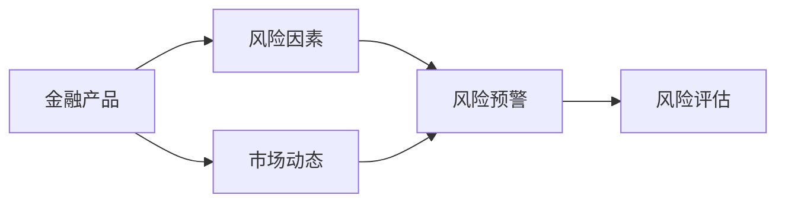
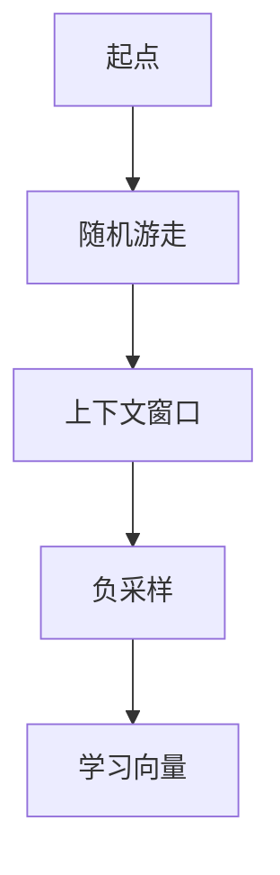
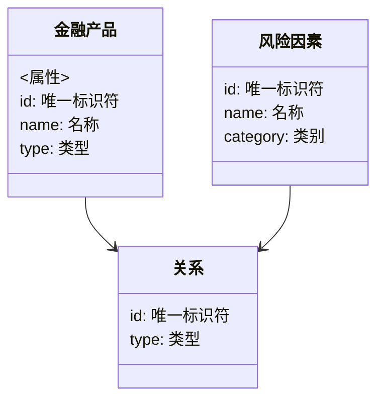

                 


# 构建基于知识图谱的金融产品全生命周期风险动态评估系统

> 关键词：知识图谱，金融产品，风险评估，动态评估，全生命周期管理

> 摘要：本文系统阐述了构建基于知识图谱的金融产品全生命周期风险动态评估系统的理论基础、技术实现和应用案例。通过分析金融产品风险管理的痛点，提出了利用知识图谱技术构建动态风险评估系统的方法，详细讲解了知识图谱的构建、图嵌入算法、系统架构设计、接口交互设计及项目实战等内容。文章最后总结了系统的最佳实践和未来发展方向，为金融领域的风险管理提供了新的思路和解决方案。

---

## 第一章：背景介绍

### 1.1 问题背景

金融产品的全生命周期风险管理是金融行业的重要任务，涉及从产品设计、发行、销售到终止的各个阶段。传统的风险管理方法依赖于静态的数据分析和规则引擎，难以捕捉产品之间的隐含关联和动态风险变化。

#### 1.1.1 金融风险管理的重要性

金融产品的风险评估直接关系到金融机构的稳健运营和投资者的资产安全。传统的基于孤立数据点的评估方法难以应对复杂多变的市场环境，容易导致风险遗漏或误判。

#### 1.1.2 传统金融风险管理的局限性

- 数据孤岛问题：各业务系统数据分散，缺乏统一的关联分析能力。
- 静态评估问题：传统方法难以捕捉动态风险变化，无法实时反馈风险信号。
- 高维度数据处理困难：金融产品涉及多维度信息，传统方法难以建模。

#### 1.1.3 知识图谱在金融领域的应用潜力

知识图谱作为一种语义网络，能够将分散的金融数据关联起来，挖掘隐含关系，为风险评估提供更全面的视角。知识图谱的动态更新能力使其非常适合应对金融市场的变化。

---

### 1.2 问题描述

金融产品全生命周期风险管理需要一个能够实时捕捉和分析风险的系统，传统方法在数据整合、关联分析和动态评估方面存在明显不足。

#### 1.2.1 金融产品全生命周期的定义

金融产品的全生命周期包括产品设计、发行、销售、监控、终止等多个阶段，每个阶段都伴随着不同的风险。

#### 1.2.2 风险动态评估的核心问题

- 如何实时捕捉产品风险的变化。
- 如何建立产品间的风险关联。
- 如何动态调整风险评估模型。

#### 1.2.3 知识图谱在风险评估中的应用需求

通过构建金融领域的知识图谱，可以实现对金融产品全生命周期的动态风险评估。

---

### 1.3 问题解决

利用知识图谱技术，可以构建一个覆盖金融产品全生命周期的动态风险评估系统，实时捕捉和分析风险。

#### 1.3.1 知识图谱技术的优势

- 强大的关联分析能力。
- 支持动态更新。
- 语义理解能力强。

#### 1.3.2 动态风险评估的实现路径

- 数据整合：将分散的金融数据整合到知识图谱中。
- 关系挖掘：挖掘产品间的隐含关联。
- 动态评估：基于知识图谱进行实时风险评估。

#### 1.3.3 知识图谱与动态评估的结合

通过知识图谱的语义关联和动态更新能力，实现对金融产品全生命周期的风险动态评估。

---

### 1.4 边界与外延

#### 1.4.1 系统的边界定义

- 仅关注金融产品相关的风险。
- 不包括其他领域的风险评估。
- 系统功能仅限于风险评估和预警。

#### 1.4.2 相关领域的外延

- 包括金融产品设计、发行、销售、终止等全生命周期。
- 涉及的产品类型包括股票、债券、基金、保险等。

#### 1.4.3 知识图谱的适用范围

- 适用于需要关联分析的金融场景。
- 适用于需要动态更新的金融数据。

---

### 1.5 核心要素与概念结构

#### 1.5.1 核心要素分析

- 金融产品：包括股票、债券、基金等。
- 风险因素：包括市场风险、信用风险等。
- 关系：包括产品间的关联、市场动态等。

#### 1.5.2 概念结构图



#### 1.5.3 核心要素的关联关系

- 金融产品与风险因素之间存在直接关联。
- 市场动态影响风险因素的变化。
- 风险预警和风险评估是动态风险评估的核心环节。

---

### 1.6 本章小结

本章介绍了金融产品全生命周期风险管理的背景和挑战，提出了利用知识图谱技术构建动态风险评估系统的方法，并明确了系统的边界和核心要素。

---

## 第二章：知识图谱的基本原理

### 2.1 知识图谱的定义与特点

知识图谱是一种语义网络，由实体和关系组成，具有语义理解能力强、动态更新方便等特点。

#### 2.1.1 知识图谱的定义

知识图谱是一个网络化的数据结构，由节点（实体）和边（关系）组成，用于表示实体之间的语义关联。

#### 2.1.2 知识图谱的核心特点

- 语义关联：能够表示实体之间的复杂关系。
- 动态更新：能够实时更新以反映数据变化。
- 可扩展性：能够方便地扩展新的实体和关系。

#### 2.1.3 知识图谱与传统数据库的区别

- 知识图谱注重语义关联，传统数据库注重数据结构。
- 知识图谱支持复杂查询，传统数据库支持简单查询。

---

### 2.2 知识图谱的构建方法

构建知识图谱需要经过数据采集、实体识别、关系抽取等步骤。

#### 2.2.1 数据采集与预处理

- 数据源包括结构化数据、非结构化数据。
- 数据清洗包括去重、标准化等。

#### 2.2.2 实体识别与关系抽取

- 实体识别：利用NLP技术识别文本中的实体。
- 关系抽取：利用模式匹配或机器学习方法抽取实体间的关系。

#### 2.2.3 知识图谱的存储与管理

- 使用图数据库（如Neo4j）存储知识图谱。
- 使用图索引优化查询性能。

---

### 2.3 知识图谱在金融领域的应用特点

#### 2.3.1 金融领域的知识图谱构建难点

- 数据分散：金融数据分散在不同的系统中。
- 关系复杂：金融产品涉及多方面的关联。
- 更新频繁：金融市场动态变化快。

#### 2.3.2 知识图谱在风险评估中的优势

- 能够捕捉产品间的隐含关联。
- 能够进行语义理解。
- 能够动态更新。

#### 2.3.3 知识图谱的动态更新机制

- 定期更新数据以反映市场变化。
- 实时更新以捕捉突发事件的影响。

---

### 2.4 本章小结

本章详细介绍了知识图谱的基本原理和构建方法，分析了其在金融领域的应用特点。

---

## 第三章：知识图谱的表示与学习

### 3.1 知识图谱的表示方法

知识图谱可以通过向量、符号等方式进行表示。

#### 3.1.1 基于向量的表示方法

- 使用词嵌入技术（如Word2Vec）对实体和关系进行向量化表示。
- 优点是计算效率高，适合大规模数据。

#### 3.1.2 基于符号的表示方法

- 使用符号逻辑表示实体和关系。
- 优点是语义表达能力强，但计算效率较低。

#### 3.1.3 混合表示方法

- 结合向量和符号表示，兼顾计算效率和语义表达能力。

---

### 3.2 知识图谱的嵌入算法

嵌入算法是将知识图谱中的实体和关系映射到低维空间的关键技术。

#### 3.2.1 Node2Vec算法原理

Node2Vec是一种基于随机游走的图嵌入算法，通过生成节点的上下文表示来学习节点的向量表示。

#### 3.2.2 算法流程



#### 3.2.3 算法实现

以下是一个Node2Vec算法的Python实现示例：

```python
import numpy as np
from sklearn.linear_model import LogisticRegression

def node2vec(adj_matrix, window_size=2, num_neg=5):
    # 随机游走生成训练样本
    # adj_matrix是邻接矩阵
    # window_size是上下文窗口大小
    # num_neg是负采样数量
    pass
```

---

### 3.3 本章小结

本章介绍了知识图谱的表示方法和嵌入算法，重点讲解了Node2Vec算法的原理和实现。

---

## 第四章：系统分析与架构设计

### 4.1 问题场景介绍

金融产品全生命周期风险动态评估系统的应用场景包括产品设计、发行、销售、监控、终止等阶段。

#### 4.1.1 系统功能需求

- 数据采集与处理：整合金融产品的相关数据。
- 知识图谱构建：构建金融领域的知识图谱。
- 风险评估与预警：基于知识图谱进行风险评估和预警。

#### 4.1.2 系统性能需求

- 实时性：能够实时更新和评估风险。
- 可扩展性：能够支持大规模数据处理。

---

### 4.2 系统功能设计

#### 4.2.1 领域模型设计



#### 4.2.2 系统架构设计


#### 4.2.3 系统接口设计

- 数据接口：用于数据的导入和导出。
- 查询接口：用于基于知识图谱的复杂查询。
- 预警接口：用于风险预警的触发和通知。

---

### 4.3 本章小结

本章从系统分析的角度出发，设计了金融产品全生命周期风险动态评估系统的功能需求、领域模型和系统架构。

---

## 第五章：项目实战

### 5.1 环境安装

#### 5.1.1 安装依赖

```bash
pip install neo4j sklearn numpy
```

#### 5.1.2 安装知识图谱构建工具

```bash
pip install networkx
```

---

### 5.2 系统核心实现

#### 5.2.1 数据采集与预处理

```python
import pandas as pd

def preprocess_data(data):
    # 数据清洗和预处理
    return processed_data
```

#### 5.2.2 知识图谱构建

```python
from networkx import DiGraph

def build_knowledge_graph(data):
    graph = DiGraph()
    # 添加节点和边
    return graph
```

---

### 5.3 代码解读与分析

#### 5.3.1 数据采集代码

```python
import requests

def fetch_data(api_url):
    response = requests.get(api_url)
    return response.json()
```

#### 5.3.2 知识图谱构建代码

```python
from neo4j import GraphDatabase

def create_knowledge_graph(driver, data):
    # 创建节点和关系
    pass
```

---

### 5.4 案例分析与详细讲解

#### 5.4.1 案例分析

- 选取一个具体的金融产品，如股票，分析其全生命周期的风险。

#### 5.4.2 详细讲解

- 数据采集：从多个数据源采集股票的相关数据。
- 知识图谱构建：将股票与其相关的市场动态、风险因素等关联起来。
- 风险评估：基于知识图谱进行实时风险评估。

---

### 5.5 本章小结

本章通过项目实战，详细讲解了如何构建基于知识图谱的金融产品全生命周期风险动态评估系统，提供了代码实现和案例分析。

---

## 第六章：总结与展望

### 6.1 最佳实践 Tips

- 数据质量是关键，确保数据的准确性和完整性。
- 知识图谱的动态更新需要实时监控市场变化。
- 系统的可扩展性设计能够适应业务发展需求。

---

### 6.2 小结

本文详细阐述了构建基于知识图谱的金融产品全生命周期风险动态评估系统的理论基础、技术实现和应用案例，为金融领域的风险管理提供了新的思路和解决方案。

---

### 6.3 注意事项

- 确保系统的安全性和稳定性。
- 定期更新知识图谱以反映市场变化。
- 系统的设计需要考虑可维护性和可扩展性。

---

### 6.4 拓展阅读

- 《图神经网络：理论与实践》
- 《知识图谱应用开发实战》

---

## 作者：AI天才研究院/AI Genius Institute & 禅与计算机程序设计艺术 /Zen And The Art of Computer Programming

---

**文章总结**：本文通过系统性的分析和实践，详细讲解了如何利用知识图谱技术构建金融产品全生命周期风险动态评估系统，为金融风险管理提供了新的解决方案。

