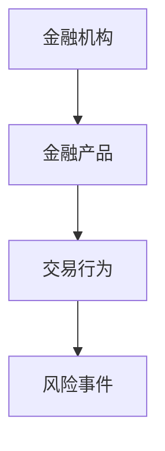
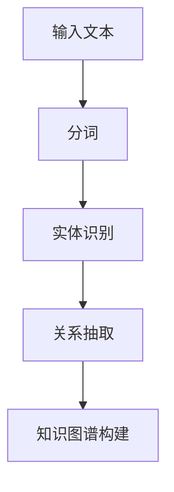
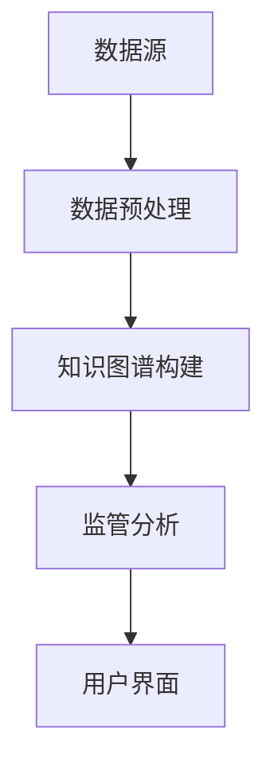
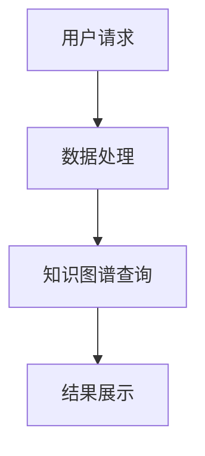

                 


# 构建基于知识图谱的金融监管合规系统

> 关键词：知识图谱，金融监管，合规系统，人工智能，风险防控，实体识别

> 摘要：本文详细探讨了如何利用知识图谱构建金融监管合规系统，从背景介绍、核心概念、算法原理、系统架构设计到项目实战，全面解析了该系统的设计与实现。文章通过丰富的案例分析和详细的代码实现，展示了知识图谱在金融监管中的实际应用价值，为读者提供了从理论到实践的完整指南。

---

# 第1章: 知识图谱与金融监管概述

## 1.1 知识图谱的定义与特点
### 1.1.1 知识图谱的定义
知识图谱是一种以图结构表示知识的语义网络，节点表示实体或概念，边表示实体之间的关系。

### 1.1.2 知识图谱的核心特点
- **结构化**：基于图的结构，支持复杂的语义关系表达。
- **语义化**：通过属性和关系描述实体的语义特征。
- **动态性**：支持实时更新和扩展。

### 1.1.3 知识图谱与传统数据库的区别
| 特性 | 知识图谱 | 传统数据库 |
|------|----------|-------------|
| 数据模型 | 图结构 | 行列结构 |
| 查询能力 | 支持复杂语义查询 | 支持简单条件查询 |
| 应用场景 | 语义搜索、推荐系统 | 事务处理、简单查询 |

## 1.2 金融监管的背景与挑战
### 1.2.1 金融监管的定义与目标
金融监管是指对金融机构和金融市场的监管，旨在维护金融稳定、保护投资者利益和促进公平竞争。

### 1.2.2 传统金融监管的痛点
- **信息孤岛**：数据分散，难以整合。
- **效率低下**：人工审核耗时长，易出错。
- **风险滞后**：风险识别和预警能力不足。

### 1.2.3 金融监管的数字化转型需求
- 提升监管效率。
- 增强风险预警能力。
- 优化资源配置。

## 1.3 知识图谱在金融监管中的应用前景
### 1.3.1 知识图谱在金融监管中的潜在价值
- 提供语义化的知识表示。
- 支持复杂关系的分析。
- 实现动态风险评估。

### 1.3.2 知识图谱与金融合规的结合
- 通过知识图谱实现合规规则的自动化执行。
- 支持跨机构、跨市场的监管协调。

### 1.3.3 知识图谱在风险防控中的作用
- 实现实体间关系的可视化。
- 提供风险传播路径的分析能力。
- 支持实时风险预警。

---

# 第2章: 金融监管合规系统的核心要素

## 2.1 系统的核心概念
### 2.1.1 知识图谱构建的核心要素
- 实体：金融机构、金融产品、交易行为等。
- 关系：实体之间的关联，如“拥有”、“交易”等。
- 属性：实体的特征，如“注册资本”、“成立时间”等。

### 2.1.2 金融监管合规的核心要素
- 合规规则：法律法规、监管政策。
- 风险评估：风险类型、风险程度。
- 监管主体：监管机构、金融机构。

### 2.1.3 系统的整体架构
- 数据采集层：收集金融机构、市场数据。
- 知识图谱构建层：实体识别、关系抽取。
- 监管分析层：风险评估、合规检查。

## 2.2 知识图谱与金融监管的实体关系
### 2.2.1 实体关系图谱的构建
- 实体识别：从文本中提取金融机构名称、产品名称等。
- 关系抽取：识别实体之间的关系，如“银行A拥有公司B”。

### 2.2.2 实体关系的属性特征对比表
| 关系类型 | 示例 | 属性 |
|----------|------|------|
| 拥有 | 银行A拥有公司B | 拥有比例、时间 |
| 交易 | 公司B向银行A贷款 | 贷款金额、期限 |

### 2.2.3 ER实体关系图架构（Mermaid流程图）


---

# 第3章: 知识图谱构建的算法原理

## 3.1 知识图谱构建的关键算法
### 3.1.1 实体识别算法
- 基于规则的实体识别。
- 基于深度学习的实体识别（如BERT）。

### 3.1.2 关系抽取算法
- 基于规则的关系抽取。
- 基于图嵌入的关系抽取（如TransE）。

### 3.1.3 实体链接算法
- 基于字符串匹配的实体链接。
- 基于嵌入的实体链接。

## 3.2 算法原理的数学模型
### 3.2.1 实体识别的数学模型
$$ P(word | class) $$

### 3.2.2 关系抽取的数学模型
$$ P(edge | context) $$

### 3.2.3 实体链接的数学模型
$$ P(target | source) $$

## 3.3 算法流程图（Mermaid）


---

# 第4章: 系统架构与设计

## 4.1 系统功能设计
### 4.1.1 数据采集模块
- 从多种数据源（如新闻、公告）采集数据。

### 4.1.2 知识图谱构建模块
- 实体识别、关系抽取、实体链接。

### 4.1.3 监管分析模块
- 风险评估、合规检查、预警提醒。

### 4.1.4 用户交互模块
- 提供可视化界面，支持用户查询和分析。

## 4.2 系统架构设计（Mermaid）


## 4.3 系统接口设计
### 4.3.1 数据接口
- 数据导入接口。
- 数据导出接口。

### 4.3.2 API接口
- 实体识别API。
- 关系抽取API。

### 4.3.3 用户接口
- 图形化界面。

## 4.4 系统交互流程图（Mermaid）


---

# 第5章: 项目实战与系统实现

## 5.1 环境安装
- Python 3.8+
- TensorFlow、Keras、NLTK等库。

## 5.2 核心代码实现
### 5.2.1 实体识别代码
```python
import spacy
nlp = spacy.load("en_core_web_sm")
doc = nlp("Bank A owns Company B")
for token in doc:
    print(token.text, token.pos_)
```

### 5.2.2 关系抽取代码
```python
from spacy import displacy
doc = nlp("Bank A owns Company B")
displacy.render(doc, style="ent")
```

## 5.3 案例分析
### 5.3.1 案例背景
- 某银行涉及多起违规交易。

### 5.3.2 数据分析
- 实体识别：银行名称、公司名称。
- 关系抽取：拥有关系、交易关系。

## 5.4 项目小结
- 知识图谱在金融监管中的应用价值。
- 系统实现的关键点。

---

# 第6章: 最佳实践与拓展阅读

## 6.1 最佳实践 tips
- 数据清洗的重要性。
- 算法选择的依据。

## 6.2 小结
- 知识图谱在金融监管中的应用前景。
- 系统设计的关键点。

## 6.3 注意事项
- 数据隐私保护。
- 系统性能优化。

## 6.4 拓展阅读
- 《知识图谱实战：方法、工具与案例》。
- 《金融监管的数字化转型》。

---

# 作者：AI天才研究院/AI Genius Institute & 禅与计算机程序设计艺术 /Zen And The Art of Computer Programming

---

本文通过系统化的分析和实践，全面介绍了如何构建基于知识图谱的金融监管合规系统，从理论到实践，为读者提供了详细的指导和参考。

